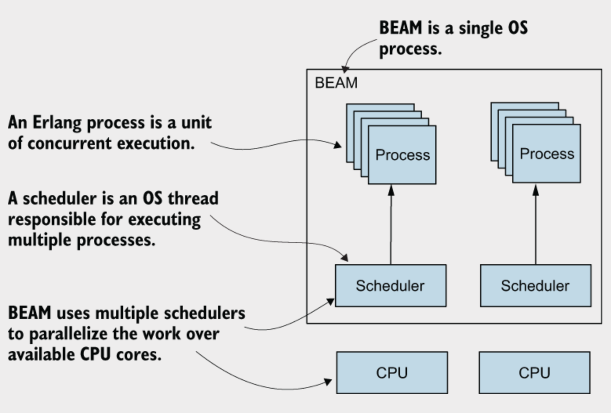
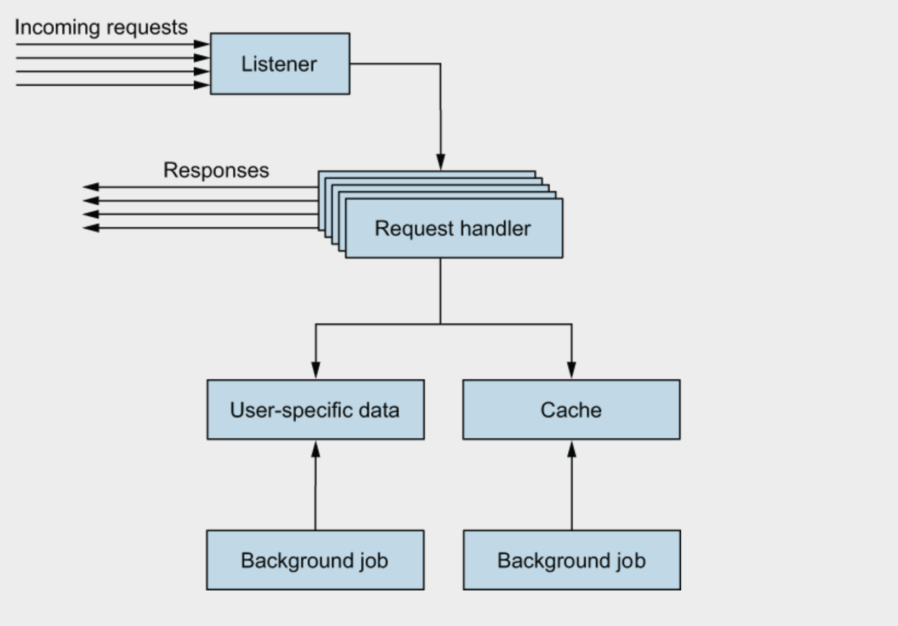
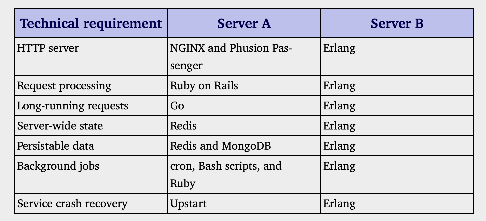

# 第一步

**本章涵盖**
- Erlang概述
- Elixir的优势

这标志着你开始了进入 `Elixir` 和 `Erlang` 世界的旅程，这两种高效且有用的技术可以显著简化大型、可扩展系统的开发。你很可能是为了学习 `Elixir` 而阅读这本书。但是由于 `Elixir` 是建立在 `Erlang` 之上的，并且在很大程度上依赖它，因此你应该首先了解一些 `Erlang` 的基本概念及其带来的好处。接下来，我们来简要、高层次地了解一下 `Erlang`。


## 1.1 关于`Erlang`

`Erlang` 是一个开发平台，用于构建可扩展和可靠的系统，这些系统能够持续提供服务，几乎没有停机时间。这是一个大胆的说法，但这正是 `Erlang` 的设计初衷。`Erlang` 的概念始于 1980 年代中期，由瑞典电信巨头爱立信（Ericsson）开发，旨在满足公司自有电信系统的需求，这些系统要求具有可靠性、响应性、可扩展性和持续可用性。电话网络应该始终运作，无论是同时通话的数量、意外的错误，还是硬件和软件升级的发生。

尽管 `Erlang` 最初是为电信系统构建的，但它并不是专门针对这个领域的。它没有包含对编程电话、交换机或其他电信设备的明确支持。相反，`Erlang` 是一个通用开发平台，提供对技术性非功能性挑战的特殊支持，如并发性、可扩展性、容错性、分布式和高可用性。

在 1980 年代后期和 90 年代初，大多数软件都是基于桌面的，高可用性的需求仅限于专业系统，如电信系统。如今，我们面临的情况截然不同：焦点转向互联网和网页，大多数应用程序由服务器系统驱动和支持，这些系统处理请求、处理数据，并将相关信息推送给许多连接的客户端。今天的流行系统更多地关注沟通与协作；例如社交网络、内容管理系统、按需多媒体和多人游戏。

这些系统有一些共同的非功能性要求。系统必须具备响应能力，无论连接的客户端数量是多少。意外错误的影响必须最小化，而不是影响整个系统。如果偶尔由于bug导致请求失败是可以接受的，但如果整个系统完全不可用，那就是一个大问题。理想情况下，系统不应该崩溃或停机，甚至在软件升级期间也不例外。它应该始终保持运行，为客户提供服务。

这些目标看起来可能很难实现，但在构建人们依赖的系统时，它们是必要的。

除非一个系统是响应快速和可靠的，否则它最终会无法实现其目标。 因此，在构建服务器端系统时，确保系统始终可用是至关重要的。

这就是 `Erlang` 的预期目的。高可用性通过可扩展性、容错性和分布等技术概念得到明确支持。与大多数现代开发平台不同，这些概念是 `Erlang` 开发背后的主要动力和推动力。由乔·阿姆斯特朗领导的爱立信团队花了几年时间进行设计、原型开发和实验，才创建了这一开发平台。虽然在90年代早期，`Erlang` 的应用可能有限，但今天几乎任何系统都能从中受益。

`Erlang`最近受到了更多关注。它为各种大型系统提供支持，例如WhatsApp消息应用程序、Discord即时通讯平台、RabbitMQ消息队列、金融系统和多人游戏后端，已经持续了三十年。这是真正经过时间和规模考验的技术。但是`Erlang`背后的魔力是什么呢？让我们看看`Erlang`如何帮助您构建高可用性和可靠的系统。

### 1.1.1 高可用

`Erlang` 专门创建用于支持高度可用系统的开发——这些系统始终在线，并在面对意外情况时仍然能够向客户提供服务。表面上，这看起来很简单，但正如你可能知道的，生产环境中可能会出现许多问题。要使系统 24/7 全天候运行而不会停机，必须首先解决一些技术挑战：

  - **容灾性**—一个系统必须在出现不可预见的问题时继续运行。意外错误会发生，漏洞会出现，组件偶尔会失败，网络连接会断开，或者整个运行系统的机器可能会崩溃。无论发生什么情况，你都希望尽可能限制错误的影响，恢复错误，并保持系统运行并提供服务。

  - **可扩展性**——一个系统应该能够处理任何可能的负载。当然，你不需要购买大量硬件，以防整个星球的人口在某天开始使用你的系统，但你应该能够通过添加更多硬件资源来应对负载增加，而无需任何软件干预。理想情况下，这应在不重启系统的情况下实现。——一个系统应该能够处理任何可能的负载。当然，你不需要购买大量硬件，以防整个星球的人口在某天开始使用你的系统，但你应该能够通过添加更多硬件资源来应对负载增加，而无需任何软件干预。理想情况下，这应在不重启系统的情况下实现。

 - **分布式**—为了构建一个永不停机的系统，你需要在多台机器上运行它。这增强了系统的整体稳定性：如果一台机器出现故障，另一台可以接管。此外，这还为你提供了横向扩展的手段——你可以通过增加更多的机器来应对负载增加，从而增加工作单元以支持更高的需求。

 - **响应性**—不言而喻，系统应该始终保持合理的快速和响应能力。即使负载增加或发生意外错误，请求处理不应被大幅延长。特别是，偶尔耗时较长的任务不应阻塞系统的其余部分或对性能产生显著影响。

- **实时更新**—在某些情况下，您可能希望在不重启任何服务器的情况下推送软件的新版本。例如，在电话系统中，您不希望在升级软件时断开已建立的通话。

如果您能够应对这些挑战，系统将真正变得高度可用，能够在任何情况下持续为用户提供服务，无论是风雨还是晴天。

`Erlang` 提供了应对这些挑战的工具——这正是它的设计初衷。一个系统可以通过 `Erlang` 的并发模型获得所有这些特性，并最终实现高可用性。让我们来看看在 `Erlang` 中并发是如何工作的。

### 1.1.2 Erlang并发

并发是 `Erlang` 系统的核心和灵魂。几乎每个复杂的基于 `Erlang` 的生产系统都是高度并发的。甚至这个编程语言有时被称为并发导向语言。与其依赖于重型线程和操作系统进程，`Erlang` 将并发掌握在自己手中，如图 1.1 所示。



基本的并发原语称为`Erlang进程`（不要与操作系统进程或线程混淆），典型的`Erlang`系统可以运行成千上万，甚至数百万个这样的进程。`Erlang`虚拟机称为`Bogdan/Björn的Erlang VM（BEAM）`，它使用自己的调度器将进程的执行分配到可用的CPU核心上，从而尽可能地实现并行执行。进程的实现方式带来了许多好处。

**容灾性**

`Erlang`进程彼
此完全隔离。它们不共享内存，一个进程的崩溃不会导致其他进程崩溃。这有助于你隔离意外错误的影响。如果发生不好的事情，影响仅限于局部。此外，`Erlang`还为你提供了检测进程崩溃并采取措施的手段；通常，你会在崩溃的进程的位置启动一个新的进程。

**可扩展性**

进程之间没有共享内存，它们通过异步消息通信。这意味着不存在复杂的同步机制，例如锁、互斥量或信号量。因此，并发实体之间的交互更容易开发和理解。

典型的`Erlang`系统被划分为大量并发进程，这些进程协同工作以提供完整的服务。虚拟机可以尽可能高效地并行执行这些进程。由于它们可以利用所有可用的CPU核心，这使得`Erlang`系统具备很好的可扩展性。

**分布式**

进程之间的通信工作方式相同，无论这些进程是在同一个 BEAM 实例上还是在两个不同的远程计算机上的两个不同实例上。因此，一个典型的、高度并发的基于 `Erlang` 的系统自动准备好在多台机器上进行分布式处理。这反过来使您能够扩展——运行一个共享总系统负载的机器集群。此外，在多台机器上运行使系统真正具备韧性；如果一台机器崩溃，其他机器可以接管。

**响应性**

运行时系统专门调优，以提高系统的整体响应能力。我提到过，`Erlang`通过使用专用调度程序来管理多个进程的执行，这些调度程序交替执行许多`Erlang`进程。调度程序是抢占式的——它为每个进程分配一个小的执行时间，然后暂停该进程并运行另一个进程。由于执行时间很短，单个长时间运行的进程无法阻塞系统的其余部分。此外，`I/O`操作会被内部委托给独立线程，或者使用底层操作系统的内核轮询服务（如果可用）。这意味着任何等待`I/O`操作完成的进程不会阻塞其他进程的执行。

即使是垃圾回收也特别调校以提升系统响应能力。请记住，进程是完全隔离的，并且不共享内存。这允许针对每个进程进行垃圾回收；而不是停止整个系统，而是根据需要对每个进程进行单独的回收。这种回收速度更快，并且不会长时间阻塞整个系统。事实上，在多核心系统中，一个CPU核心可以在其他核心进行标准处理的同时，运行短暂的垃圾回收。

如你所见，并发是`Erlang`中的一个关键元素，它不仅仅与并行性有关。由于底层实现的原因，并发促进了故障容忍、分布式和系统响应能力。典型的`Erlang`系统运行许多并发任务，使用数千甚至数百万个进程。这在开发服务器端系统时特别有用，这些系统通常可以完全用`Erlang`实现。

### 1.1.3 服务端系统

`Erlang`可以用于各种应用和系统。有基于`Erlang`的桌面应用程序的例子，并且它常常用于嵌入式环境。在我看来，它的优势在于服务器端系统——那些在一个或多个服务器上运行并且必须同时为多个客户端提供服务的系统。服务器端系统的术语表明，它不仅仅是一个处理请求的简单服务器。它是一个完整的系统，除了处理请求外，还必须运行各种后台作业，并管理某种服务器范围内的内存状态，如图1.2所示。



一个服务器端系统通常分布在多个机器上，这些机器协作以产生业务价值。您可以将不同的组件放在不同的机器上，并且也可以将一些组件部署在多个服务器上，以实现负载均衡或支持故障转移场景。

这就是`Erlang`可以大大简化您生活的地方。通过提供原语使您的代码具备并发、可扩展和分布式的特性，它使您能够完全用`Erlang`来实现整个系统。图1.2中的每个组件都可以作为一个`Erlang`进程来实现，这使得系统具备可扩展性、容错性，且易于分发。依赖`Erlang`的错误检测和恢复原语，您可以进一步提高可靠性，并从意外错误中恢复。

让我们来看一个现实生活中的例子。我曾在两个网络服务器的开发工作中专业参与，这两个服务器有着类似的技术需求：为大量客户提供服务，处理长时间运行的请求，管理整个服务器的内存状态，持久化必须在操作系统进程和机器重启后依然存在的数据，以及运行后台任务。表1.1列出了每个服务器使用的技术。



服务器 A 采用了多种技术，其中大多数在社区中是众所周知的。选择这些技术有其特定原因：每种技术都是为了弥补系统中现有技术的不足。例如，`Ruby on Rails` 通过独立的操作系统进程处理并发请求。我们需要一种方法在这些不同的进程之间共享数据，因此引入了 `Redis`。类似地，`MongoDB` 用于管理持久的前端数据，通常是与用户相关的信息。因此，服务器 A 中使用的每种技术背后都有其合理性，但整个解决方案似乎很复杂。它并不只包含在一个项目中；各个组件是分开部署的，在开发机器上启动整个系统并不简单。我们不得不开发一个工具来帮助我们在本地启动系统。

相比之下，服务器 B 通过依赖一种单一技术来满足相同的技术要求，该技术使用专为这些目的设计的平台功能，并已在大型系统中得到验证。此外，整个服务器作为一个单一项目在生产环境中的一个 `BEAM` 实例内运行。它运行在一个操作系统进程内，使用少量的操作系统线程。并发完全由 Erlang 调度器管理，从而使系统具有可扩展性、响应性和容错性。由于它被实现为一个单一项目，系统更易于管理、部署和在开发机器上本地运行。

需要注意的是，`Erlang` 工具并不总是主流解决方案的完全替代品，例如 Web 服务器 `NGINX`、数据库服务器 `MongoDB` 和内存键值存储 `Redis`。但 `Erlang` 为您提供了选择，使您能够首次完全使用 `Erlang` 实现解决方案，并在 `Erlang` 解决方案不足时诉诸替代技术。这使得整个系统更加统一，因此更易于开发和维护。

值得注意的是，`Erlang`并不是一个孤立的岛屿。它可以运行用`C`、`C++`或`Rust`等语言编写的进程内代码，并能够与外部组件进行通信，例如消息队列、内存中的键值存储和外部数据库。因此，在选择`Erlang`时，你并不会被剥夺使用现有的第三方技术的机会。相反，当需要时，你可以选择使用它们，而不是因为你的主要开发平台没有提供解决问题的工具。现在你已经了解了`Erlang`的优势和擅长的领域，让我们更仔细地看看`Erlang`是什么。

### 1.1.4 开发平台

`Erlang`不仅仅是一种编程语言。它是一个完善的开发平台，由四个不同的部分组成：语言、虚拟机、框架和工具。

`Erlang`语言是编写在`Erlang`虚拟机上运行的代码的主要方式。它是一种简单的函数式语言，具有基本的并发原语。

`Erlang`编写的源代码被编译成字节码，然后在`BEAM`中执行。这就是魔法发生的地方。虚拟机并行化您的并发`Erlang`程序，并负责进程隔离、分布和系统的整体响应性。

发布的标准部分是一个名为开放通信平台（`OTP`）的框架。尽管这个名字有些误导，但该框架与电信系统无关。它是一个通用框架，抽象化了许多典型的 `Erlang` 任务，包括以下内容：

  - 并发和分布模式
	-	并发系统中的错误检测和恢复
	-	将代码打包成库
	-	系统部署
	-	实时代码更新

 ` OTP` 在许多生产系统中经过了严格的测试，是 `Erlang` 的一个重要组成部分，以至于很难在两者之间划出明确的界线。甚至官方版本也叫做 `Erlang/OTP`。

这些工具用于几种典型任务，比如编译`Erlang`代码、启动`BEAM`实例、创建可部署的发布版本、运行交互式Shell、连接到正在运行的`BEAM`实例等等。`BEAM`及其附带的工具都是跨平台的。你可以在大多数主流操作系统上运行它们，比如`Unix`、`Linux`和`Windows`。整个`Erlang`发行版是开源的，你可以在官方网站（https://www.erlang.org/）或`Erlang` GitHub库（https://github.com/erlang/otp）上找到源代码。爱立信仍然负责开发过程，并每年发布一个新版本。

### 1.1.5 与微服务的关系

由于其并发模型及其在提高系统可用性方面的应用，`Erlang` 有时被与微服务进行比较。因此，让我们花一些时间分析两者之间的相似性和差异。为了本节的目的，服务是指在单独操作系统进程中运行的系统一部分。这种定义过于简化且非常机械，但对我们的需求来说是足够的。

将系统分成多个服务可以提高系统的容错能力和可扩展性。因为系统由多个操作系统进程支持，如果其中一个进程崩溃，对整个系统的影响会更小。此外，服务可以分布在多台机器上，这使系统在硬件故障面前更加有韧性。最后，运行多个服务实例使得系统具有横向可扩展性。

乍一看，通过将系统拆分为服务，似乎可以获得 Erlang 的所有好处，特别是如果我们保持服务的规模和范围较小（即微服务）。

虽然微服务和`Erlang`并发之间确实存在一些重叠，但值得指出的是，后者带来了更细粒度的并发。例如，在一款在线多人游戏中，你会为每个参与玩家以及每个游戏会话运行至少一个进程。这将提高系统的响应速度，提供垂直扩展的潜力，并增加容错能力。

单靠微服务无法真实模拟这一点，因为这需要过多的操作系统进程。相反，通常会让一个服务实例管理多个活动。为了提高响应性和垂直扩展性，您需要结合使用非阻塞 `I/O` 和操作系统级并发（例如，在每台机器上运行几个服务实例）。为了增强容错能力，您应该实施防御性编码，在代码中手动放置 `try…catch` 或类似的结构。最终结果是更复杂的代码，且保障性较差

另一方面，微服务提供了一些在使用 `BEAM` 时不容易实现的重要好处。特别是围绕这一实践发展的生态系统，包括 `Docker` 和 `Kubernetes` 等工具，显著简化了操作任务，例如部署、水平扩展和粗粒度容错。理论上，您可以仅通过使用 `BEAM` 来获得这些好处，但这将需要大量低级手动工作。

因此，`BEAM` 的并发性和微服务相互补充，实际上它们通常一起使用。将一个基于 `BEAM` 的服务包装到 `Docker` 容器中是可行且简单的。一旦服务被容器化，您可以轻松地将其部署到某个托管环境中，例如 `Kubernetes` 集群。

由于其并发模型，`Erlang` 在选择架构时给你提供了很大的灵活性，而不会使系统的可用性受到妥协。你可以选择较粗粒度的拆分，仅使用与组织结构对齐的少数服务。在许多情况下，简单的单体应用部署到 `PaaS`（如 `Heroku`、`Fly.io` 或 `Gigalixir`）就足够了。如果情况不再如此，可能是因为系统的规模和复杂性增长，你可以逐步转向（微）服务架构。

这就是`Erlang`的故事。但是，如果`Erlang`如此出色，为什么还需要`Elixir`呢？下一部分旨在回答这个问题。

## 1.2 关于`Elixir`

`Elixir` 是一种为 `Erlang` 虚拟机设计的替代语言，它允许你编写更简洁、更紧凑的代码，更好地表达你的意图。你可以用 `Elixir `编写程序，并在 `BEAM` 上正常运行它们。

`Elixir`是一个开源项目，最初由José Valim发起。与`Erlang`不同，`Elixir`更像是一个协作努力，目前大约有1200名贡献者。新特性经常在邮件列表、GitHub问题追踪器和Libera.Chat上的#elixir-lang IRC频道中讨论。José拥有最终决定权，但整个项目是真正的开源协作，吸引了经验丰富的`Erlang`老手和有才华的年轻开发者的有趣组合。源代码可以在GitHub仓库中找到，地址是https://github.com/elixir-lang/elixir。

`Elixir` 目标是 `Erlang` 运行时。编译 `Elixir` 源代码的结果是符合 `BEAM` 的字节码文件，这些文件可以在 `BEAM` 实例中运行，并且通常可以与纯 `Erlang` 代码协作—你可以在 `Elixir` 中使用 `Erlang` 库，反之亦然。在 `Erlang` 中能够实现的功能在 `Elixir` 中也能够实现，并且通常，`Elixir` 代码的性能与对应的 `Erlang` 代码相当。

`Elixir` 的语义与 `Erlang` 非常接近：许多语言结构直接对应于 `Erlang` 的对应结构。但 `Elixir` 提供了一些额外的结构，使得可以显著减少样板代码和重复。此外，它整理了一些标准库的重要部分，并提供了一些优雅的语法糖和统一的创建与打包系统的工具。你可以在 `Erlang` 中做的所有事情在 `Elixir` 中都可以实现，反之亦然，但根据我的经验，`Elixir` 的解决方案通常更易于开发和维护。”

让我们更仔细地看看 `Elixir` 是如何改进一些 `Erlang` 特性的。我们将从减少样板代码和噪音开始。

### 1.2.1 代码简化

`Elixir` 最重要的优点之一是它能够大幅减少样板代码，并消除代码中的噪音，从而使代码更简单，更容易编写和维护。让我们通过对比 `Erlang` 和 `Elixir` 的代码来看看这意味着什么。

在`Erlang`并发系统中，一个常用的构建块是服务器进程。你可以把服务器进程看作是并发对象，它们包含私有状态，并且可以通过消息与其他进程进行交互。由于是并发的，不同的进程可以并行运行。典型的`Erlang`系统在很大程度上依赖于进程，通常会运行成千上万，甚至数百万个进程。

以下示例的 `Erlang` 代码实现了一个简单的服务器进程，它可以计算两个数字的和。


```erlang
% 清单1.1 基于Erlang的服务器进程，用于相加两个数
-module(sum_server).
-behaviour(gen_server).
 
-export([
  start/0, sum/3,
  init/1, handle_call/3, handle_cast/2, handle_info/2, terminate/2,
  code_change/3
]).
 
start() -> gen_server:start(?MODULE, [], []).
sum(Server, A, B) -> gen_server:call(Server, {sum, A, B}).
 
init(_) -> {ok, undefined}.
handle_call({sum, A, B}, _From, State) -> {reply, A + B, State}.
handle_cast(_Msg, State) -> {noreply, State}.
handle_info(_Info, State) -> {noreply, State}.
terminate(_Reason, _State) -> ok.
code_change(_OldVsn, State, _Extra) -> {ok, State}.
```

即使对 `Erlang` 没有任何了解，这看起来对于仅仅是加两个数字来说代码量也太多了。公平地说，虽然加法是并发的，但无论如何，由于代码量庞大，很难看清大局。代码的具体作用并不明显。此外，编写这样的代码是困难的。即使经过多年生产级 `Erlang` 开发，我仍然无法在不查阅文档或复制粘贴以前写过的代码的情况下编写这些代码。

`Erlang` 的问题在于，这种样板代码几乎不可能去除，即使在大多数地方它们是相同的（根据我的经验，确实是这样的）。该语言几乎不提供消除这种噪音的支持。公平地说，有一种方法可以使用一种叫做解析转换的构造来减少样板代码，但它的使用既笨拙又复杂。在实际操作中，`Erlang` 开发者通常按照之前的模式编写他们的服务器进程。

让我们看看同一个服务器进程的 Elixir 版本。

```elixir
# 清单 1.2 基于 Elixir 的服务器进程，该进程实现两个数字相加
defmodule SumServer do
  use GenServer

  def start do
    GenServer.start(__MODULE__, nil)
  end
 
  def sum(server, a, b) do
    GenServer.call(server, {:sum, a, b})
  end
 
  def handle_call({:sum, a, b}, _from, state) do
    {:reply, a + b, state}
  end
end
```

`Elixir` 版本需要的代码显著更少，因此更易于阅读和维护。它的意图更加清晰，噪声也更少。然而，它在能力和灵活性上与 `Erlang` 版本一样。它在运行时表现完全相同，并保持完整的语义。在 `Erlang`版本中可以做的事情，在 `Elixir` 版本中也没有不可能的。

尽管尺寸明显更小，`Elixir` 版本的求和服务器进程仍然感觉有些嘈杂，因为它所做的仅仅是将两个数字相加。这种多余的嘈杂是因为 `Elixir` 与用于创建服务器进程的底层 `Erlang` 库之间保留了 `1:1` 的语义关系。

但是 `Elixir` 为你提供了工具，以进一步消除你可能认为的噪音和重复。例如，我开发了自己的 `Elixir `库，叫做 `ExActor`，它使服务器进程的定义变得更加简洁，如下所示。

```elixir
# Listing 1.3 基于 Elixir 的服务器进程
defmodule SumServer do
  use ExActor.GenServer
 
  defstart start
 
  defcall sum(a, b) do
    reply(a + b)
  end
end
```

这段代码的意图对于没有 `Elixir` 经验的开发者应该是显而易见的。在运行时，这段代码的工作方式几乎与之前的两个版本完全相同。使这段代码表现得像之前例子的转换发生在编译时。在字节码方面，这三个版本是相似的。

请注意，我提到 `ExActor` 库只是为了说明在 `Elixir `中您可以抽象出多少内容。在本书中，您不会使用该库，因为它是一种隐藏服务器进程重要细节的第三方抽象。要充分利用服务器进程，了解其工作原理是很重要的，这就是为什么在本书中，您将学习更低级的抽象。一旦您了解了服务器进程的工作方式，您可以自己决定是否想使用 `ExActor` 来实现服务器进程。

这个最终实现的求和服务器进程是由 `Elixir` 宏功能驱动的。宏是在编译时运行的 `Elixir` 代码。宏以源代码的内部表示作为输入，并可以创建替代输出。`Elixir` 的宏受 `Lisp` 启发，不应与 `C` 风格的宏混淆。与 `C`/`C++` 宏不同，后者仅处理纯文本，`Elixir` 的宏则作用于抽象语法树（`AST`）结构，这使得对输入代码进行非平凡操作以获得替代输出变得更加容易。当然，`Elixir `提供了辅助构造来简化这一转换。

我们再来看一下列表 1.3 中如何定义求和操作：

```elixir
defcall sum(a, b) do
  reply(a + b)
end
```

注意开头的 `defcall`，`Elixir` 中没有这样的关键字。这是一个自定义宏，它将给定的定义转换为如下内容：

```elixir
def sum(server, a, b) do
  GenServer.call(server, {:sum, a, b})
end
 
def handle_call({:sum, a, b}, _from, state) do
  {:reply, a + b, state}
end
```

因为宏是用 `Elixir` 编写的，所以它们灵活而强大，使得扩展语言和引入看似语言固有部分的新构造成为可能。例如，开源项目 `Ecto` 旨在将 `LINQ` 风格的查询引入 `Elixir`，它也得益于 `Elixir` 的宏支持，并提供了一种看起来似乎是语言一部分的表达性查询语法。

```elixir
from w in Weather,
  where: w.prcp > 0 or w.prcp == nil,
  select: w
```

由于其宏支持和智能编译器架构，`Elixir` 大部分是用 `Elixir` 编写的。类似 `if` 和 `unless` 的语言结构是通过 `Elixir` 宏实现的。只有最小的核心是用 `Erlang` 编写的——其他一切都在此基础上用 `Elixir` 构建！

`Elixir`的宏有点像黑暗艺术，但它们使得在编译时排除复杂的样板代码变得可能，并且可以用你自己的`类似DSL`的构造来扩展语言

但是`Elixir`并不仅仅是关于宏。另一个值得改进的地方是一些看似简单的语法糖，使函数式编程变得更加容易。

### 1.2.2 编写函数

`Erlang` 和 `Elixir` 都是函数式语言。它们依赖于不可变的数据和转换数据的函数。这种方法的一个预期好处是代码被分割成许多小的、可重用的、可组合的函数。

不幸的是，组合性特性在 `Erlang` 中工作得很笨拙。让我们来看一个我自己工作中的示例。我负责的一段代码维护一个内存中的模型，并接收修改该模型的 `XML` 消息。当一个 `XML` 消息到达时，必须完成以下操作：

  - 将 XML 应用到内存模型中。
  - 处理结果变化。
  - 持久化模型。

以下是对应函数的`Erlang`示例：

```erlang
process_xml(Model, Xml) ->
  Model1 = update(Model, Xml),
  Model2 = process_changes(Model1),
  persist(Model2).
```

我不知道你怎么看，但在我看来，这并不可组合。相反，它显得相当杂乱且容易出错。临时变量`Model1`和`Model2`的引入仅仅是为了将一个函数的结果传递给下一个函数。

当然，你可以消除临时变量并将函数调用内联:

```erlang
process_xml(Model, Xml) ->
  persist(
    process_changes(
      update(Model, Xml)
    )
  ).
```

这种风格，被称为阶梯式，确实没有临时变量，但它显得笨拙且难以阅读。要理解这里发生了什么，你必须手动解析它。

尽管`Erlang`程序员在某种程度上受到这些笨拙方法的限制，但`Elixir`提供了一种优雅的方式来将多个函数调用连接在一起：

```elixir
def process_xml(model, xml) do
  model 
  |> update(xmll)
  |> process_changes()
  |> persist()
end
```

管道操作符 `|>` 将前一个表达式的结果作为第一个参数传递给下一个表达式。最终的代码干净，没有临时变量，且阅读起来像散文——从上到下，从左到右。在底层，这段代码在编译时被转换成阶梯式版本。这又是因为 `Elixir`的宏系统使得这一切成为可能。

管道操作符展示了函数式编程的强大之处。你可以将函数视为数据转换，然后以不同的方式组合它们，以获得所需的效果。

### 1.2.3 大局

`Elixir` 在许多方面改进了原始的 `Erlang` 方法。标准库的 API 做了清理，并遵循了一些定义的约定。引入了语法糖，以简化典型的习惯用法。提供了一种简洁的语法来处理结构化数据。字符串操作得到了改善，语言对` Unicode` 操作有明确的支持。在工具方面，`Elixir` 提供了一个名为 `Mix` 的工具，以简化常见任务，例如创建应用和库、管理依赖项以及编译和测试代码。另外，名为 `Hex` 的包管理器（https://hex.pm/）可用于简化依赖项的打包、分发和重用。

这个列表可以继续，但我想基于我自己的生产经验表达一个个人感受，而不是逐一列出每个特性。就我个人而言，我发现用 `Elixir` 编码要愉快得多。生成的代码似乎更简单，更易读，并且不那么繁琐，噪音和重复也较少。同时，你仍然保留了纯 `Erlang` 代码的完整运行时特性。你还可以使用 `Erlang` 生态系统中所有可用的库，无论是标准库还是第三方库。

## 1.3 缺点

技术无银弹，`Erlang` 和 `Elixir` 也不例外。因此，提及它们的一些不足之处是值得的。

### 1.3.1 速度

`Erlang` 绝对不是最快的平台。如果你查看互联网上各种合成基准测试，通常不会看到 `Erlang` 排名很高。`Erlang` 程序在 `BEAM` 中运行，因此无法达到 `C` 和 `C++` 等机器编译语言的速度。但这并不是 `Erlang/OTP` 团队设计不当或工程失败的结果。

平台的目标不是尽可能地挤压出每秒钟的请求数量，而是尽量保持性能的可预测性和在限制之内。你的`Erlang`系统在特定机器上所达到的性能水平不应该显著下降，也就是说，系统不应该因例如垃圾回收器启动而出现意外的系统卡顿。此外，如前所述，长时间运行的BEAM进程不会阻塞或显著影响系统的其余部分。最后，随着负载的增加，BEAM可以使用尽可能多的硬件资源。如果硬件容量不足，你可以预期系统会优雅地降级——请求的处理时间会变长，但系统不会瘫痪。这要归功于BEAM调度程序的抢占特性，它执行频繁的上下文切换，保持系统的运行，并优先考虑短期运行的进程。当然，你也可以通过增加更多的硬件来应对更高的系统需求。

尽管如此，密集的 CPU 计算性能不如 C/C++ 等语言，因此您可以考虑使用其他语言实现这些任务，然后将相应的组件集成到您的 `Erlang` 系统中。如果您的系统逻辑大部分受到 CPU 限制，您可能应该考虑其他技术。

# 1.3.2 生态

围绕`Erlang`构建的生态系统并不小，但肯定没有一些其他语言的生态系统那么庞大。写这篇文章时，在GitHub上快速搜索显示大约有20,000个基于`Erlang`的仓库和大约45,000个`Elixir`仓库。相比之下，基于`Ruby`的仓库超过1,500,000个，基于`JavaScript`的仓库几乎达到了7,000,000个。

您应该意识到，您选择的库可能没有您习惯的那么丰富，因此，您可能会花费额外时间在一些在其他语言中只需几分钟就能完成的事情上。如果发生这种情况，请记住您从`Erlang`获得的所有好处。正如我所解释的，`Erlang`在编写可以长时间运行而几乎没有停机时间的容错系统方面大有裨益。这是一个重大挑战，也是`Erlang`平台的一个具体重点。虽然生态系统不如理想中那样强大确实令人遗憾，但根据我的经验，`Erlang`在解决困难问题方面的显著帮助使其成为一个有用的工具。当然，这些困难的问题可能并不是总是重要的。也许您并不期望有高负载，或者某个系统并不需要持续运行并具备极高的容错性。在这种情况下，您可能想考虑其他技术栈，其中有更加完善的生态系统。

## 总结

- `Erlang`是一种用于开发高度可用系统的技术，这些系统能够持续提供服务，几乎没有或极少的停机时间。它在多样化的大型系统中经过了三十年的战斗测试。

- Elixir是一种现代编程语言，使得在Erlang平台上的开发更加愉快。它帮助更高效地组织代码，并抽象掉样板代码、杂音和重复内容。