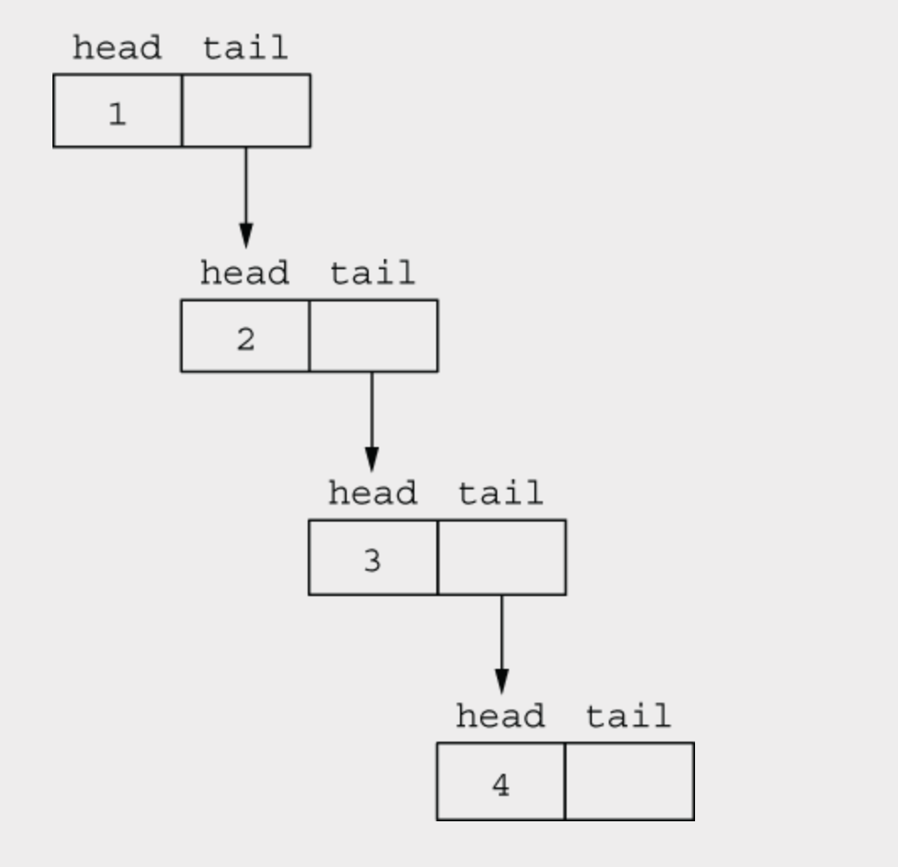
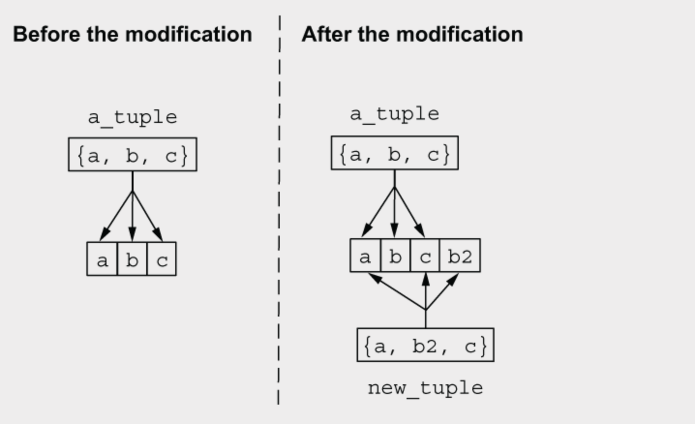
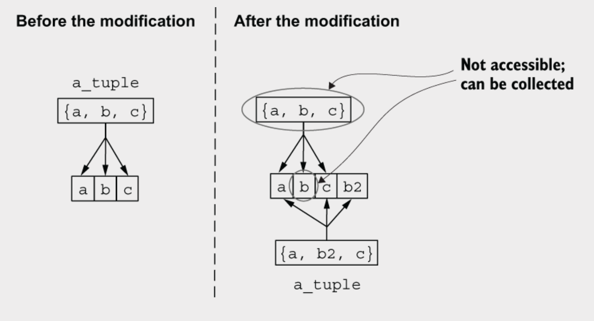
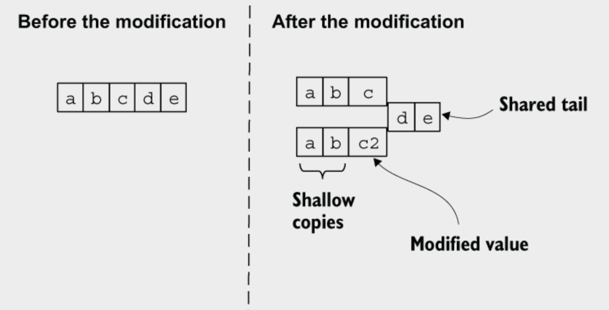
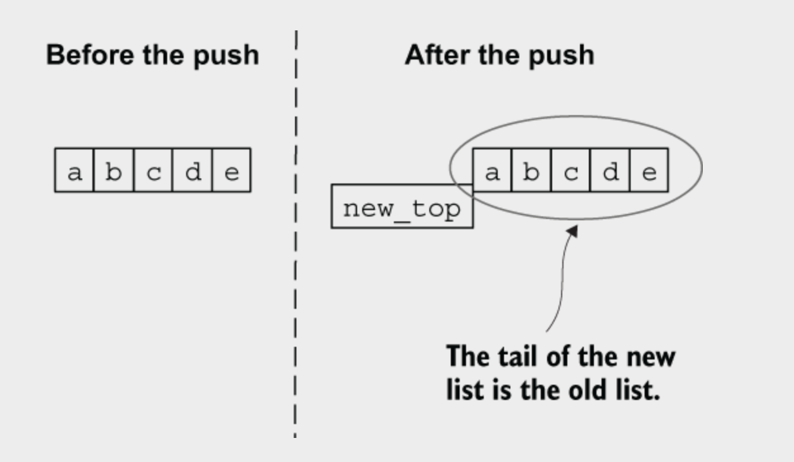

# 构建块

本章涵盖：

- 使用交互式 shell
- 处理变量
- 组织代码
- 理解类型系统
- 使用操作符和理解运行时

是时候开始学习 `Elixir` 了。本章介绍了语言的基本构建块，如模块、函数和类型系统。这将是一个相对漫长且不太令人兴奋的语言特性之旅，但这里呈现的内容很重要，因为它为探索更有趣、更高级的主题打下基础。

在开始之前，请确保您已安装 `Elixir` 版本 1.15 和 `Erlang` 版本 26。安装 `Elixir` 有多种方式，最好遵循官方 `Elixir` 网站上的说明，网址是 https://elixir-lang.org/install.xhtml。

既然这件事已经处理完毕，让我们开始探索 `Elixir`。你应该首先了解的是交互式 shell。

> **详细信息**
> 这本书没有提供关于任何语言或平台特性的详细参考。这会占用太多空间，而且材料很快就会过时。以下是一些您可以查阅的其他参考资料：
>  - 要快速了解替代语法，您可以查看 Elixir 官方网站上的入门指南：https://mng.bz/NVRn。
>  - 可以在在线文档中找到更详细的参考资料：https://hexdocs.pm/elixir。
>  - 针对具体问题，您可以访问 Elixir 论坛（https://elixirforum.com/）或 Slack 频道（https://elixir-lang.slack.com/）。
>  -  最后，对于许多事情，你需要查看 Erlang 的文档：https://www.erlang.org/doc。如果你不熟悉 Erlang 语法，你可能还需要阅读 Elixir 关于 Erlang 的快速入门（https://elixir-lang.org/crash-course.xhtml）。


## 2.1 交互shell

实验和学习一种语言特性的最简单方法是通过交互式命令行。您可以通过在命令行中运行 `iex` 命令启动 Elixir 的交互式命令行。

```shell
› iex    
Erlang/OTP 27 [erts-15.0.1] [source] [64-bit] [smp:10:10] [ds:10:10:10] [async-threads:1] [jit]

Interactive Elixir (1.17.2) - press Ctrl+C to exit (type h() ENTER for help)
iex(1)> 
```

运行 `iex` 会启动一个 BEAM 实例，然后在其中启动一个交互式的 Elixir shell。打印出运行时信息，比如 Erlang 和 Elixir 的版本号，然后提供提示符，这样你就可以输入 Elixir 表达式：

```shell
iex(1)> 1 + 2   # ① Elixir 表达式
3               # ② 表达式的结果
```

在你输入一个表达式后，它会被解释和执行。然后它的返回值会被打印到屏幕上。

注意：在 Elixir 中，所有内容都是有返回值的表达式。这不仅包括函数调用，还有像 `if` 和 `case` 这样的结构。

Tip: 本书中你将广泛使用 `iex`，特别是在前面的章节中。表达式的结果通常不会特别相关，因此会被省略以减少干扰。尽管如此，请记住，每个表达式都会返回一个结果，当你在 shell 中输入一个表达式时，它的结果将会被呈现。

您可以输入几乎任何有效的 Elixir 代码，包括相对复杂的多行表达式：

```shell
iex(2)>  2 * (   # 表达式还未结束 
...(2)> 3 + 1    # 表达式还未结束
...(2)> )/4      # 表达式已完成，因此会被评估
2.0
```

请注意，Shell 在您完成最后一行之前不会评估表达式。在 Elixir 中，您不需要使用诸如分号等特殊字符来指示表达式的结束。相反，当表达式完整时，换行表示表达式的结束。否则，解析器将等待进一步的输入，直到表达式变得完整。如果您遇到问题（例如，错过了一个右括号），可以在单独的一行中写上 `#iex:break` 来中止整个表达式。

```shell
iex(3)> 1+(2
...(3)> #iex:break
** (TokenMissingError) token missing on iex:3:
error: incomplete expression
└─ iex:3
    (iex 1.17.2) lib/iex/evaluator.ex:295: IEx.Evaluator.parse_eval_inspect/4
    (iex 1.17.2) lib/iex/evaluator.ex:187: IEx.Evaluator.loop/1
    (iex 1.17.2) lib/iex/evaluator.ex:32: IEx.Evaluator.init/5
    (stdlib 6.0.1) proc_lib.erl:329: :proc_lib.init_p_do_apply/3
iex(3)> 
```

退出shell的最快方法是按`Ctrl-C`两次。这会强制终止操作系统进程和所有正在运行的后台任务。由于shell主要用于实验，而不应用于运行生产系统，因此以这种方式关闭它通常是可以接受的。然而，如果你更喜欢一种更加优雅的方法来停止系统，可以使用`System.stop`。

注意，有几种方法可以启动Elixir和Erlang运行时，以及运行你的Elixir程序。到本章结束时，你将了解到所有这些方法。在本书的第一部分，你将主要使用iex shell，因为它是一个简单高效的实验语言的方式。

你可以用命令行做很多事情，但大多数情况下，你会用它来输入表达式并检查其结果。你可以自己研究命令行还能做些什么。基本的帮助可以通过输入 `h` 命令获得。

```shell
iex(1)> h
```

在 shell 中输入这个将输出一整屏与 `iex` 相关的指令。您还可以查找 `IEx `模块的文档，该模块负责 shell 的工作原理。

```shell
iex(4)> h IEx
```

您可以在在线文档中找到相同的帮助，网址是 https://hexdocs.pm/iex。

现在您已经有了一个基本的工具来进行实验，您准备好研究语言的特性了。您将从变量开始。

## 2.2 处理变量

Elixir是一种动态编程语言，这意味着你不需要显式声明变量或它的类型。相反，变量的类型是由它当前包含的数据决定的。在Elixir中，赋值被称为绑定。当你用一个值初始化变量时，变量被绑定到那个值：

```elixir
iex(1)> monthly_salary = 1_000 # 绑定变量
1000                           # 表达式的返回值
```

在 Elixir 中，每个表达式都有一个结果。在`=` 操作符的情况下，结果是操作符右侧的内容。表达式求值后，终端会将这个结果打印到屏幕上。

现在，你可以引用变量：

```elixir
iex(2)> monthly_salary  # 该表达式返回变量的值
1000                    # 变量的值
```

变量当然可以在复杂的表达式中使用：

```elixir
iex(3)> monthly_salary * 12
12000
```

在 Elixir 中，变量名总是以小写字母或下划线开头。在此之后，可以使用字母数字字符和下划线的任意组合。普遍的约定是只使用小写 ASCII 字母、数字和下划线：

```elixir
valid_variable_name
also_valid_1
validButNotRecommended
NotValid
```

变量名也可以以问号 (?) 或感叹号 (!) 结尾。

```elixir
valid_name?
also_ok!
```

变量可以被重新绑定为不同的值:

```elixir
iex(4)> monthly_salary = 1_000 # 设定初始值
1000
iex(5)> monthly_salary         # 验证值
1000
iex(6)> monthly_salary = 2_000 # 重新绑定值
2000
iex(7)> monthly_salary         # 验证重绑定的值
2000
```

重新绑定不会改变现有的内存位置。它会保留新的内存并将符号名称重新分配到新的位置。

请注意，你应该时刻记住数据是不可变的。一旦内存位置被数据占用，就无法修改，直到释放。但是变量可以重新绑定，这使得它们指向不同的内存位置。因此，变量是可变的，但它们指向的数据是不可变的。

Elixir是一种自动管理内存的语言，这意味着您不必手动释放内存。当一个变量超出作用域时，相应的内存就可以被垃圾收集器收回，并将在未来的某个时刻被释放，当垃圾收集器清理内存时。

## 2.3 组织代码

作为一种函数式语言，Elixir非常依赖函数。由于数据是不可变的，典型的Elixir程序由许多小函数组成。在第3章和第4章中，你将看到这种情况，因为你将开始使用一些典型的函数式习惯用法。多个函数还可以进一步组织成模块。

### 2.3.1 模块

模块是函数的集合，有点像命名空间。每个 Elixir 函数必须在模块内部定义。

Elixir 附带一个标准库，提供许多有用的模块。例如，`IO` 模块可以用于完成各种 `I/O` 操作。`IO` 模块中的 `puts` 函数可以用来在屏幕上打印消息。

```elixir
iex(1)> IO.puts("Hello World") # 调用IO模块的puts函数
Hello World                    # IO.puts函数打印到屏幕
:ok                            # 返回IO.puts的结果
```

正如您在示例中所看到的，要调用模块的函数，您需要使用语法 `ModuleName.function_name(args)`。

要定义您自己的模块，您使用 `defmodule` 表达式。在模块内部，您使用 `def` 表达式来定义函数。列表 2.1 演示了如何定义一个模块。

```elixir
# 列表 2.1：定义一个模块（geometry.ex）
defmodule Geometry do            # 开始一个模块定义
  def rectangle_area(a, b) do    # 函数定义
    a * b
  end
end                              # 结束模块定义    
```

您可以使用此模块的两种方式。首先，您可以将该定义直接复制并粘贴到 `iex` 中——如前所述，几乎可以在 shell 中输入任何内容。第二种方法是在启动时告诉 `iex` 解释该文件。

```shell
iex geometry.ex
```

使用任一方法都会产生相同的效果。代码被编译，生成的模块被加载到运行时，可以在 shell 会话中使用。我们来试试：

```shell
› iex geometry.ex                      

iex(1)> Geometry.rectangle_area(6, 7)  # 调用函数
42                                     # 函数结果
```

简单！你创建了一个几何模块，将其加载到 shell 会话中，并用它计算了矩形的面积。

模块名称必须遵循一些规则。它以大写字母开头，通常采用驼峰命名法。模块名称可以由字母数字字符、下划线和点（.）字符组成。点通常用于按层次组织模块

```elixir
defmodule Geometry.Rectangle do
  ...
end

defmodule Geometry.Cirle do
  ...
end
```

您还可以嵌套模块定义:

```elixir
defmodule Geometry do
  defmodule Rectangle do
    ...
  end
  ...
end
```

内部模块可以通过 `Geometry.Rectangle` 进行引用。请注意，点字符没有什么特别之处。它只是模块名称中允许的字符之一。编译版本不记录模块之间的任何层次关系。

这通常用于以某种有意义的层次结构组织模块，这样在阅读代码时更容易导航。此外，这种非正式的作用域可以消除可能的名称冲突。例如，考虑两个库，一个实现了 `JSON` 编码器，另一个实现了 `XML` 编码器。如果这两个库都定义了名为 `Encoder` 的模块，你就无法在同一个项目中同时使用它们。然而，如果模块被命名为 `Json.Encoder` 和 `Xml.Encoder`，就可以避免名称冲突。因此，通常会在项目中的所有模块名称前添加一些公共前缀。通常情况下，这个前缀使用应用程序或库的名称。

### 2.3.2函数

函数必须始终是模块的一部分。函数名称遵循与变量相同的约定：它们以小写字母或下划线字符开头，后面跟着字母数字字符和下划线的组合。

函数名可以像变量一样以 `?` 和 `!` 字符结尾。`?` 字符通常用来表示返回`true`或`false`的函数。函数名以 `!` 字符结尾表示可能会引发运行时错误的函数。这两种用法是约定而非规章，但最好遵循这些约定，尊重社区风格。

可以使用 `def` 宏来定义函数:

```elixir
defmodule Geometry do
  def rectangle_area(a, b) do # 函数声明
  ...                         # 函数体
  end
end
```

定义以 `def` 表达式开始，接着是函数名称、参数列表，以及包含在` do...end` 块中的主体。因为你使用的是动态语言，所以参数没有类型声明。

注意，`defmodule` 和 `def` 并不是被称为关键字。这是因为它们实际上不是！相反，这些是 Elixir 宏的示例。你目前不需要担心这个是如何工作的；这一点在本章稍后的地方会有解释。如果这样有帮助，你可以把 `def` 和 `defmodule` 当作关键字，但要知道这并不是完全正确的。

如果一个函数没有参数，你可以省略括号。

```elixir
defmodule Program do
  def run do
    ...
  end
end
```

关于返回值呢？请记住，在 Elixir 中，所有具有返回值的东西都是一个表达式。一个函数的返回值是其最后一个表达式的返回值。在 Elixir 中没有显式的返回。

注意：考虑到没有明确的返回值，你可能会想知道复杂函数是如何工作的。这个内容将在第三章详细讲解，在那里你将学习分支与条件逻辑。一般规则是保持函数简短和简单，这样能方便计算结果并从最后一个表达式中返回它。

你在列表 2.1 中看到了返回值的例子，但让我们在这里重复一下：

```elixir
defmodule Geometry do
  def rectangle_area(a, b) do
  a * b                       # 计算面积并返回结果
  end
end
```

你现在可以验证这一点。重新启动终端，然后尝试 `rectangle_area` 函数：

```elixir
› iex geometry.ex 

iex(1)> Geometry.rectangle_area(3, 2) # 调用函数
6                                     # 函数返回值
```

如果一个函数的主体由单个表达式组成，你可以使用简洁的形式并在一行中定义它。

```elixir
defmodule Geometry do
  def rectangle_area(a, b), do: a * b
end
```

要调用在另一个模块中定义的函数，请使用模块名后跟函数名：

```elixir
Geometry.rectangle_area(3, 2)
```

当然，你总是可以将函数的结果存储到一个变量中：

```elixir
iex(2)> area = Geometry.rectangle_area(3,2) # 调用函数并保存结果
6                         
iex(3)> area                                # 验证函数内容
6
```

括号在Elixir中是可选的，你可以省略他们：

```elixir
iex(4)> Geometry.rectangle_area 3, 2
6
```

就我个人而言，我认为省略括号会使代码变得模糊，因此我的建议是在调用函数时始终包含括号。

**使用函数格式化工具**

从1.6版本开始，Elixir附带了一个代码格式化工具，您可以使用它以一致的风格格式化代码，从而避免担心底层样式决策，例如布局或括号的使用。

例如，在格式化以下代码片段之后：

```elixir
defmodule Client
do
def run do
Geometry.rectangle_are 3,2
end
end
```

您将得到这样的漂亮代码:

```elixir
defmodule Client do
  def run do
    Geometry.rectangle_area(3, 2)
  end
end
```

您可以使用 `mix format` 任务（https://hexdocs.pm/mix/Mix.Tasks.Format.xhtml）来格式化代码，或者在您喜欢的编辑器中安装一个格式化扩展。

如果被调用的函数在同一模块中，则可以省略模块前缀。

```elixir
defmodule Geometry do
  def rectangle_area(a, b) do
    a * b
  end

  def square_area(a) do
    rectangle_area(a,a)  # 调用同一个模块中的函数
  end
end
```

考虑到 Elixir 是一种函数式语言，你通常需要组合函数，将一个函数的结果作为下一个函数的参数传递。Elixir 配备了一种内置操作符 `|>`, 称为管道操作符，它正是用来实现这一点的。

```elixir
iex(5)> -5 |> abs() |> Integer.to_string() |> IO.puts
5
:ok
```

这段代码在编译时被转换为以下内容：

```elixir
iex(6)> IO.puts(Integer.to_string(abs(-5)))
5
```

更一般地说，管道操作符将前一个调用的结果作为下一个调用的第一个参数。因此，以下代码:

```elixir
prev(arg1, arg2) |> next(arg3, arg4)
```

在编译时被转换为：

```elixir
next(prev(arg1, arg2), arg3, arg4)
```

可以说，管道版本更易读，因为执行顺序是从左到右阅读的。管道操作符在源文件中看起来特别优雅，在那里你可以将管道分布在多行上：

```elixir
 -5                      # 以-5开始
 |> abs()                # 计算绝对值
 |> Integer.to_string()  # 转化成string
 |> IO.puts              # 打印到控制台
```

**在 shell 中的多行管道**

如果你将之前的管道链粘贴到 iex 会话中，你会注意到每个中间结果都会打印到控制台：

```elixir
iex(6)> -5 
-5                             # 打印出了每一步的结果
iex(7)>  |> abs() 
5
iex(8)>  |> Integer.to_string()
"5"
iex(9)>  |> IO.puts 
5
:ok
```

请记住，`iex`会在Elixir表达式完整且有效时立即评估它。在这个例子中，每一行都完成一个有效的Elixir表达式，例如 `-5` 或 `-5 |> abs()`，因此，每个中间结果都会被打印出来。

### 函数的元数

函数的参数个数称为其“元数”（arity）。一个函数由其所在模块、名称和元数唯一标识。请看下面的函数：

```elixir
defmoduel Rectangle do
  def area(a, b) do    # 带有2个参数的函数
    ...
  end
end
```

函数 `Rectangle.area` 接受两个参数，因此说它是一个幂为 2 的函数。

在Elixir 世界中，这个函数通常被称为` Rectangle.area/2`，其中 `/2` 表示函数的元数。

为什么这很重要？因为两个同名但不同参数数量的函数实际上是两个不同的函数，以下示例对此进行了说明。

```elixir
# 清单 2.2 同名但参数数量不同的函数（arity_demo.ex）
defmodule Rectangle do
  def area(a), do: area(a, a)  # Rectangle.area/1

  def area(a,b), do: a *b      # Rectangle.area/2
end
```

将模块加载到shell，尝试一下：

```elixir
iex(1)> Rectangle.area(5)
25
 
iex(2)> Rectangle.area(5,6)
30
```

正如你所看到的，这两个函数的行为完全不同。虽然名称可能重载，但参数数量不同，因此我们将它们视为两个不同的函数，每个函数都有自己的实现。

通常来说，具有相同名称但实现完全不同的不同函数是没有意义的。更常见的情况是，较低参数的函数委托给较高参数的函数，提供一些默认参数。在清单 2.2 中就是这种情况，`Rectangle.area/1` 委托给 `Rectangle.area/2`。

让我们来看另一个例子。

```elixir
# 列表 2.3 同名函数、不同的参数数量和默认参数 (arity_calc.ex)
defmodule Caculator do
  def add(a), do: add(a,0) # `Caculator.add/1` 委托给了 `Caculator.add/2`
  def add(a,b), do: a + b  # `Caculator.add/2`包含了实现
end
```

再次，低元函数是通过高元函数实现的。这种模式非常常见，因此 Elixir 允许你通过使用 `\\` 运算符后面跟上参数的默认值来指定参数的默认值。

```elixir
defmodule Calculator do
  def add(a, b \\ 0), do: a + b # 给参数b定义一个默认值
end
```
这一定义生成两个函数，正如在列表2.3中所示。

你可以为任何参数组合设置默认值：

```elixir
defmodule MyModule do
  def fun(a, b \\ 1, c, d \\ 2) do     # 为多个参数设置默认值
    a + b + c + d
  end
end
```

始终记住，默认值会生成多个同名但参数数量不同的函数。之前的代码生成了三个函数：`MyModule.fun/2`、`MyModule.fun/3` 和 `MyModule.fun/4`，具体实现如下：

```elixir
def fun(a,c), do: fun(a, 1, c, 2)
def fun(a, b, c), do: fun(a, b, c, 2)
def fun(a, b, c, d), do: fun(a, b, c, d)
```

因为参数数量区分了同名的多个函数，所以不可能有一个函数接受可变数量的参数。`C`语言的 `...` 或 `JavaScript` 的 `arguments` 在这里没有对应的概念。

### 2.3.4 函数可见性

当你使用 `def` 宏定义一个函数时，该函数是公开的——可以被其他任何人调用。在 Elixir 术语中，这称为函数被导出。你也可以使用 `defp` 宏将函数设置为私有。私有函数只能在其定义所在的模块内部使用。下面的示例演示了这一点。

```elixir
# 列表 2.4 一个包含公有函数和私有函数的模块 (private_fun.ex)
defmodule TestPrivate do
  def double(a)  do      # 公共函数
    sum(a, a)            # 调用私有函数
  end

  defp sum(a, b) do      # 私有函数
    a + b
  end
end
```

模块 `TestPrivate` 定义了两个函数。函数 `double` 是导出的，可以在外部调用。它内部依赖于私有函数 `sum` 来完成工作。

让我们在命令行中试试。加载模块，然后执行以下操作：

```elixir
iex(1)> TestPrivate.double(3)
6
 
iex(2)> TestPrivate.sum(3, 4)
** (UndefinedFunctionError) function TestPrivate.sum/2
...
```

正如您所见，私有函数不能在模块外被调用。

### 2.3.5 导包和别名

从另一个模块调用函数有时可能很麻烦，因为您需要引用模块名称。如果您的模块经常调用另一个模块的函数，您可以将那个模块导入到自己的模块中。导入模块后，您可以调用其公共函数，而无需在前面加上模块名称：

```elixir
defmodule MyModule do
  import IO                          # 导入模块

  def my_function do
    puts "Calling imported function." # 可以使用puts代替 IO.puts
  end
end
```

当然，你可以导入多个模块。实际上，标准库的 `Kernel` 模块会自动导入到每个模块中。`Kernel` 包含常用的函数，因此自动导入使它们更容易访问。

注意，你可以通过查看在线文档 https://hexdocs.pm/elixir/Kernel.xhtml 来查看 `Kernel` 模块中可用的函数。

另一个表达式，别名（`alias`），使得可以用不同的名称来引用一个模块。

```elixir
defmodule MyModule do
  alias IO, as: MyIO        # 创建一个IO的别名

  def my_function do 
    MyIO.puts("Calling ..")  # 使用别名调用函数
  end
end
```

别名在模块名称较长时非常有用。例如，如果你的应用程序被深度划分为多个模块层次，以完全限定名引用模块可能会很繁琐。别名可以帮助解决这个问题。例如，假设你有一个 `Geometry.Rectangle `模块。你可以在客户端模块中为它设置别名，并使用一个更短的名称：

```elixir
defmodule MyModule do
  alias Geometry.Rectangle, as: Rectangle # 设置模块别名

  def my_function do
    Rectangle.area()                      # 使用别名调用函数
  end
end
```

在前面的例子中，`Geometry.Rectangle` 的别名是它名称的最后一部分。这是别名最常见的用法，因此 Elixir 允许你在这种情况下省略 `as `选项。

```elixir
defmodule MyModule do
  alias Geometry.Rectangle,    # 设置模块别名

  def my_function do
    Rectangle.area()            # 使用别名调用函数
  end
end
```

### 2.3.6 模块属性

模块属性的目的有两个：它们可以用作编译时常量，您可以注册任何属性，然后在运行时查询。我们来看一个例子。

以下模块提供了处理圆形的基本功能：

```elixir
defmodule Circle do
  @pi 3.14159                       # 定义模块属性
  def area(r), do: r*r*@pi          # 使用模块属性
  def circumference(r), do: 2*r*@pi
end
```

注意你如何直接在 shell 中定义模块。这是允许的，能够让你在不需将任何文件存储到磁盘上的情况下进行实验。关于 `@pi` 常量的重要之处在于，它仅存在于模块编译期间，此时对它的引用是内联的。

此外，可以注册一个属性，这意味着它将被存储在生成的二进制文件中，并且可以在运行时访问。Elixir 默认注册了一些模块属性。例如，属性 `@moduledoc` 和 `@doc` 可以用来为模块和函数提供文档。

```elixir
defmodule Circle do
  @moduledoc "Implements basic circle functions"
  @pi 3.14159
 
  @doc "Computes the area of a circle"
  def area(r), do: r*r*@pi
 
  @doc "Computes the circumference of a circle"
  def circumference(r), do: 2*r*@pi
end
```

要尝试这个，您需要生成一个编译文件。这里有一个快速的方法来做到这一点。将此代码保存到某个地方的 `circle.ex` 文件中，然后运行 `elixirc circle.ex`。这将生成文件 `Elixir.Circle.beam`。接下来，从同一文件夹启动 `iex shell`。现在，您可以在运行时检索属性：

```elixir
iex(1)> Code.fetch_docs(Circle)
{:docs_v1, 2, :elixir, "text/markdown",
 %{"en" => "Implements basic circle functions"}, %{},
 [
   {{:function, :area, 1}, 5, ["area(r)"],
    %{"en" => "Computes the area of a circle"}, %{}},
   {{:function, :circumference, 1}, 8, ["circumference(r)"],
    %{"en" => "Computes the circumference of a circle"}, %{}}
 ]}
```

值得注意的是，Elixir生态系统中的其他工具知道如何处理这些属性。例如，您可以使用iex的帮助功能查看模块的文档：

```elixir
iex(2)> h Circle        # 模块文档
    Circle
Implements basic circle functions

iex(3)> h Circle.area   # 函数文档
def area(r)
Computes the area of a circle
```

而且，您可以使用 `ex_doc` 工具（请参见 https://hexdocs.pm/ex_doc）为您的项目生成 HTML 文档。这是生成 Elixir 文档的方法，如果您打算构建更复杂的项目，尤其是那种将被许多不同客户端使用的项目，您应该考虑使用 `@moduledoc `和 `@doc`。

基本的观点是，注册属性可以用于向模块附加元信息，而这些信息可以被其他 Elixir（甚至 Erlang）工具使用。还有许多其他预注册属性，您也可以注册自己的自定义属性。有关更多详细信息，请查看 `Module` 模块的文档（https://hexdocs.pm/elixir/Module.xhtml）。

**类型规格**

类型规格（通常称为 typespecs）是基于属性的另一个重要特性。这些允许您为函数提供类型信息，可以通过静态分析工具 `dialyzer`（https://www.erlang.org/doc/man/dialyzer.xhtml）进行分析。

下面是我们如何扩展 `Circle` 模块以包含类型规格的方法：

```elixir
defmodule Circle do
  @pi 3.1415

  @spec area(number) :: number         # area/1的类型规格
  def area(r), do: r*r*@pi

  @spec circumference(number) :: number # circumference/1的类型规格
  def circumference(r), do: 2*r*@pi
end
```

在这里，你使用 `@spec` 属性来表明这两个函数都接受并返回一个数字。

类型规范提供了一种弥补缺乏静态类型系统的方法。这与 `Dialyzer` 工具结合使用，可以对你的程序进行静态分析。此外，类型规范允许你更好地记录你的函数。请记住，Elixir 是一种动态语言，因此根据函数的签名无法轻易推断输入和输出。类型规范在这方面能够显著帮助，并且我可以证明，当提供类型规范时，理解他人的代码要容易得多。

例如，看看 Elixir 函数 `List.insert_at/3` 的类型规范

```elixir
@spec insert_at(list, integer, any) :: list
```

即使不查看代码或阅读文档，你也可以合理地猜测这个函数将任何类型的项（第三个参数）插入到列表（第一个参数）中的指定位置（第二个参数），并返回一个新的列表。

在这本书中，你将不会使用类型规范，主要是为了保持代码尽可能简短。但如果你打算构建更复杂的系统，我建议你认真考虑使用类型规范。你可以在官方文档中找到详细的参考，网址是 https://hexdocs.pm/elixir/typespecs.xhtml。

### 2.3.7 注释

在 Elixir 中，注释以 `#` 字符开始，这表示该行的其余部分是注释。

```elixir
# 这是个注释
a = 3.14 # 这个也是注释
```

当前不支持块注释。如果你需要注释多行，请在每行前面加上 `#` 字符。到此为止，我们已经完成了函数和模块的基础知识。你现在已经了解了主要的代码组织技巧。完成这些之后，是时候看看 Elixir 的类型系统了。

## 2.4 理解类型系统

从本质上讲，Elixir 使用 Erlang 的类型系统。因此，与 Erlang 库的集成通常是简单的。类型系统本身相对简单，但如果你来自于经典的面向对象语言，你会发现这与你习惯的有很大不同。本节将介绍基础的 Elixir 类型，并讨论不变性的一些含义。首先，让我们来看看数字。

### 2.4.1 Numbers

数字可以是整数或浮点数，它们的工作方式大致符合你的预期：

```elixir
iex(1)> 3        # 整数
3
iex(2)> 0xFF     # 十六进制整数
255
iex(3)> 3.14     # 浮点数
3.14
iex(4)> 1.0e-2   # 科学计数法浮点数
0.01
```

支持标准的算术运算符：

```elixir
iex(5)> 1 + 2 + 3
6
```

除法运算符 `/` 的表现可能与你预期的不同。它总是返回一个浮点值:

```shell
iex(7)> 3/2
1.5
iex(8)> 4/2
2.0
```

要进行整数除法或计算余数，可以使用自动导入的 `Kernel` 函数：

```elixir
iex(9)> div(5, 2)
2
iex(10)> rem(5, 2)
1
```

为了添加语法糖，你可以使用下划线字符作为视觉分隔符:

```elixir
iex(11)> 1_000_000
1000000
iex(12)> 1_1_1
111
```

整数的大小没有上限，您可以使用任意大的数字。

如果您担心内存大小，最好查看官方的Erlang内存指南，网址为 http://mng.bz/QREv。一个整数占用的空间仅足以容纳该数字，而浮点数则根据虚拟机的构建架构占用32位或64位。浮点数在内部按IEEE 754-1985（双精度）格式表示。

### 2.4.2 Atom

原子实际上是命名常量。它们类似于`Ruby`中的`symbols`或`C`/`C++`中的枚举。原子常量以冒号字符开头，后面跟着字母数字组合 和/或 下划线字符。

```elixir
:an_atom
:another_atom
```

可以使用以下语法在原子名称中包含空格：

```elixir
:"an atom with spaces"
```

一个原子由两部分组成：文本和值。原子文本是您在冒号字符后面放置的内容。在运行时，这个文本保存在原子表中。值是存储在变量中的数据，它仅仅是对原子表的引用。

这正是原子最适合用作命名常量的原因。它们在内存和性能方面都非常高效。当你说

```elixir
variable = :some_atom
```

变量并不包含整个文本——仅包含对原子表的引用。因此，内存消耗低，比较速度快，代码仍然可读。


**别名**

原子常量还有另一种语法。你可以省略开头的冒号，直接以大写字母开头。

```elixir
AnAtom
```

这是一个别名，在编译时，它会被转换为`:"Elixir.AnAtom"`。我们可以在终端中轻松检查这一点：

当你使用别名时，编译器会隐式地在其文本前添加 `Elixir.` 前缀并生成该原子。但如果别名已经包含 `Elixir.` 前缀，则不会再添加。因此，以下内容也有效：

```elixir
iex(14)> AnAtom == Elixir.AnAtom
true
```

你可能还记得，在之前的内容中，你可以使用别名为模块提供替代名称。

```elixir
iex(15)> alias IO, as: MyIO
IO

iex(16)> MyIO.puts :hello
hello
:ok
```

‘别名’这个术语用于这两种概念并不是偶然的。当你写 `⁠alias IO, as: MyIO` 时，你在指示编译器将 `⁠MyIO` 转换为 `⁠IO`。进一步解析，生成的二进制文件中发出的最终结果是 `⁠:Elixir.IO`。因此，在设置了别名后，以下内容也适用：

```elixir
iex(17)> MyIO == IO
true
```

所有这些可能看起来很奇怪，但它有一个重要的潜在目的。别名支持模块的正确解析。我们将在本章末尾讨论这一点，当时我们将重新审视模块并查看它们在运行时是如何加载的。

**Atoms as Booleans**

你可能会惊讶于 Elixir 没有专门的布尔类型。相反，它使用原子 `:true` 和 `:false`。作为语法糖，Elixir 允许你在不使用前导冒号的情况下引用这些原子。

```elixir
iex(18)> :true == true
true
iex(19)> :false ==false
true
```

布尔 (Boolean) 这个术语在 Elixir 中仍然用于表示一个值为` :true` 或 `:false` 的原子。标准逻辑运算符适用于布尔原子：

```elixir
iex(18)> :true == true
true
iex(19)> :false ==false
true
iex(20)> true and false
false
iex(21)> false or true
true
iex(22)> not false
true
```

请始终铭记，布尔 (Boolean) 只是一个值为 `true`或 `false` 的原子。

**nil 和真值**

另一个特殊的原子是 `:nil`，它的工作方式与其他语言中的 `null` 有些相似。你可以不使用冒号来引用 `nil`：

```elixir
iex(23)> nil == :nil
true
```

原子 `nil `在 Elixir 中额外支持真值的作用，与主流语言（如 `C`/`C++` 和 `Ruby`）中的使用方式类似。原子 `nil` 和 `false` 被视为虚值，而其他所有值都被视为真值。

这个属性可以与 Elixir 的短路运算符 `||`、`&&` 和` !` 一起使用。运算符 `||` 返回第一个不为虚值的表达式：


```elixir
iex(25)> nil || false || 5 || true
5
```

因为 `nil` 和 `false` 都是虚值表达式，所以返回数字 `5`。请注意，后续的表达式根本不会被评估。如果所有表达式的结果都是虚值，则返回最后一个表达式的结果。

运算符 `&&` 仅在第一个表达式为真值时返回第二个表达式。否则，它会返回第一个表达式，而不评估第二个表达式：

```elixir
iex(1)> true && 6
6
iex(2)> false && 1
false
iex(3)> nil && 1
nil
```

短路运算可以用于优雅的操作链。例如，如果你需要从缓存、本地磁盘或远程数据库获取一个值，可以这样做：

```elixir
read_cached() || read_from_disk() || read_from_database()
```

同样，你可以使用操作符 `&&` 来确保某些条件被满足。

```elixir
database_value = connection && read_data(connection)
```

在这两个例子中，短路操作符使得编写简洁的代码成为可能，而无需诉诸于复杂的嵌套条件表达式。

### 2.4.3 Tuples

元组类似于无类型的结构或记录，通常用于将固定数量的元素组合在一起。以下代码片段定义了一个包含一个人姓名和年龄的元组。

```elixir
iex(1)> person = {"Bob", 25}
{"Bob", 25}
```

要从元组中提取元素，可以使用 `⁠Kernel.elem/2` 函数，该函数接受一个元组和元素的零基索引。请记住，`Kernel` 模块是自动导入的，因此你可以直接调用 ⁠elem 而不是 `⁠Kernel.elem`:

```elixir
iex(2)> age = elem(person,1)
25
```

要修改元组的元素，可以使用 `Kernel.put_elem/3` 函数，该函数接受一个元组、一个从零开始的索引，以及在给定位置的新值。

```elixir
iex(3)> put_elem(person,1,11)
{"Bob", 11}
```

那么你如何使用 `put_elem` 函数呢？你需要将它的结果存储到另一个变量中。

```elixir
iex(4)> old_person= put_elem(person, 1,111)
{"Bob", 111}
iex(5)> old_person
{"Bob", 111}
```

请记住，变量可以被重新绑定，因此您还可以做以下事情：

```elixir
iex(6)> person = put_elem(person, 1, 26)
{"Bob", 26}
```

通过这样做，您已将人变量有效地重新绑定到新的内存位置。旧的位置没有被其他变量引用，因此它可以进行垃圾回收。

注意，您可能会想知道这种方法是否具有内存效率。在大多数情况下，数据复制会很少，两个变量将尽可能共享内存。我们将在本节后面讨论不可变性时对此进行详细解释。

元组最适合用于将少量固定数量的元素组合在一起。当你需要一个动态大小的集合时，可以使用列表。

### 2.4.4 Lists

在Erlang中，列表用于管理动态的、可变大小的数据集合。语法看起来像其他语言的数组，但实际上有些不同。

```elixir
iex(1)> prime_numbers = [2, 3, 1, 1]
[2, 3, 1, 1]
```

列表看起来像数组，但它们的工作方式像单向链表。要对列表执行操作，您必须遍历它。因此，列表上的大多数操作具有 O(n) 的复杂度，包括 `Kernel.length/1` 函数，它会遍历整个列表以计算其长度。

```elixir
iex(3)> length(prime_numbers)
4
```

**List utility functions**

你可以对列表执行许多操作，但本节只提到了一些最基本的操作。要查看详细参考，请查阅列表模块的文档（https://hexdocs.pm/elixir/List.xhtml）。`Enum`模块（https://hexdocs.pm/elixir/Enum.xhtml）中还有许多有用的服务。

`Enum`模块处理多种不同的可枚举结构，而不仅限于列表。可枚举的概念将在第四章详细解释，当时我们将讨论协议。

要获取列表中的一个元素，可以使用 `Enum.at/2`:

```elixir
iex(4)>  Enum.at(prime_numbers, 3)
1
```
`Enum.at` 再次是一个 O(n) 操作：它从列表的开头迭代到所需的元素。当需要直接访问时，列表通常不是一个好的选择。对于这些目的，元组、映射或更高级的数据结构是合适的。

你可以使用`in` 运算符检查列表是否包含特定元素。

```elixir
iex(5)> 2  in prime_numbers
true
```

要操作列表，你可以使用 `List` 模块中的函数。例如`，List.replace_at/3` 修改特定位置的元素。

```elixir
iex(6)> List.replace_at(prime_numbers, 0, 11)
[11, 3, 1, 1]
```

与元组的情况一样，这个修改器并不会改变变量，而是返回修改后的版本，你需要将其存储到另一个变量中。

```elixir
iex(7)> new_primes = List.replace_at(prime_numbers, 0, 113)
[113, 3, 1, 1]
```

或者你可以重新绑定：

```elixir
iex(8)> prime_numbers = List.replace_at(prime_numbers, 2, 11)
[2, 3, 11, 1]
```

您可以使用 `List.insert_at/3` 函数在指定位置插入新元素：

```elixir
iex(9)> List.insert_at(prime_numbers, 3,1123)
[2, 3, 11, 1123, 1]
```

要追加到末尾，可以对插入位置使用负值：

```elixir
iex(10)> List.insert_at(prime_numbers, -1, 99)
[2, 3, 11, 1, 99]
```

与大多数列表操作一样，修改任意元素的复杂度为 O(n)。特别地，追加到末尾是昂贵的，因为它总是需要 n 步，其中 n 是列表的长度。

此外，还提供了专用操作符 `++`。它用于连接两个列表：

```elixir
iex(11)> [1,2,3] ++ [3,3]
[1, 2, 3, 3, 3]
```

再说一次，复杂度是 O(n)，其中 n 是左侧列表的长度（即你要追加到的列表）。一般来说，你应该避免在列表的末尾添加元素。当新元素被推到顶部或从顶部弹出时，列表是最有效的。要理解原因，让我们看看列表的递归特性。

**递归列表定义**

看待列表的另一种方式是将它们视为递归结构。一个列表可以用一对（头，尾）表示，其中头是列表的第一个元素，尾则“指向”剩余元素的（头，尾）对，如图2.1所示。



如果你熟悉Lisp，那么你就会知道这个概念称为 cons cells。在 Elixir 中，有一种特殊的语法来支持递归列表的定义：

```elixir
a_list = [head | tail]
```

头部可以是任何类型的数据，而尾部本身是一个列表。如果尾部是一个空列表，则表示整个列表的结束。

我们来些例子：

```elixir
iex(1)> [1 | []]
[1]
iex(2)> [1 | [2 | []]]
[1, 2]
iex(3)> [1 | [2]]
[1, 2]
iex(4)> [1 | [2, 3, 5]]
[1, 2, 3, 5]
```

这只是定义列表的另一种语法方式，但它说明了列表的概念：一个包含两个值的对——头和尾，其中尾部本身也是一个列表。

以下代码片段提供了列表的标准递归定义：

```elixir
iex(1)> [1 | [2 | [3 | [4 |[] ]]]]
[1, 2, 3, 4]
```

当然，没人想写成这样的表达式。但重要的是，你要始终意识到，列表在内部是由（头，尾）对构成的递归结构

要获取列表的头部，可以使用 `hd` 函数。尾部可以通过调用 `tl` 函数获得：

```elixir
iex(1)> list= [1,2,3,4,5]
[1, 2, 3, 4, 5]
iex(2)> tl(list)
[2, 3, 4, 5]
iex(3)> hd(list)
1
```

这两个操作都是 O(1)，因为它们只涉及从（头，尾）对中读取一个或另一个值。

注意：为了完整性，应该提到尾部不需要是列表。它可以是任何类型。当尾部不是列表时，称该列表为不当列表，并且大多数标准列表操作将无法工作。不当列表有一些特殊用途，但在本书中我们不会涉及它们。

一旦你了解列表的递归特性，将一个新元素推送到列表顶部就变得简单而高效。

```elixir
iex(5)> list=[1, 2, 3, 4, 5]
[1, 2, 3, 4, 5]
iex(6)> new_list=[:new_elem | list]
[:new_elem, 1, 2, 3, 4, 5]
```

构建 new_list 是一个 O(1) 操作，并且没有内存复制发生——new_list 的尾部是 list。为了理解这一点，让我们稍微讨论一下不可变性的内部细节。

### 2.4.5 不可变性

如前所述，Elixir 数据是不可变的。每个函数返回的是输入数据的新修改版本。您必须将新版本存储到另一个变量中，或者重新绑定到相同的符号名称。无论如何，结果都存在另一个内存位置。输入数据的修改将导致一些数据复制，但通常，旧版本和新版本之间的大部分内存是共享的。让我们更仔细地看看这一过程是如何运作的。

**修改元组**

我们先从元组开始。修改后的元组始终是旧版本的完整、浅拷贝。请考虑以下代码（见图2.2）。

```elixir
a_tuple = {a, b, c}
new_tuple = put_elem(a_tuple, 1, b2)
```



变量 `new_tuple` 将包含` a_tuple` 的浅拷贝，唯一不同的是第二个元素。

两个元组引用了变量 `a` 和 `c`，并且这些变量中的内容在两个元组之间是共享的（而不是重复的）。`new_tuple` 是原始 `a_tuple` 的浅拷贝。

如果你重新绑定一个变量会发生什么？在这种情况下，重新绑定后，变量 `a_tuple` 引用一个不同的内存位置。`a_tuple` 的旧位置不再可访问并且可以进行垃圾回收。对于旧版本元组引用的变量 `b` 也是如此，如图 2.3 所示。



请记住，元组总是被复制，但复制是浅拷贝。然而，列表具有不同的属性。

**修改列表**

当你修改列表的第 n 个元素时，新的版本将包含前 n - 1 个元素的浅拷贝，后跟修改后的元素。在此之后，剩下的部分将完全共享，如图 2.4 所示。



这正是为什么将元素添加到列表末尾会很昂贵的原因。要在尾部附加一个新元素，您必须遍历并（浅拷贝）整个列表。相比之下，将元素推入列表顶部并不需要复制任何东西，这使其成为最便宜的操作，如图 2.5 所示。



在这种情况下，新列表的尾部是之前的列表。这在Elixir程序中通常用于迭代构建列表。在这种情况下，最好把连续元素推到列表的顶部，然后在构建完列表后，进行一次遍历来反转整个列表。

**好处**

不可变性可能看起来很奇怪，你可能会对它的目的感到疑惑。不变性有两个重要的好处：无副作用的函数和数据一致性。

由于数据不能被修改，你可以将大多数函数视为无副作用的转换。它们接受一个输入并返回一个结果。更复杂的程序通过组合更简单的转换而写成：

```elixir
def complex_transformation(data) do
  data
  |> transformation_1(...)
  |> transformation_2(...)
  ...
  |> transformation_3(...)
end
```

这段代码依赖于前面提到的管道操作符，它将两个函数连接在一起，将上一个调用的结果作为下一个调用的第一个参数。 

无副作用的函数更容易分析、理解和测试。它们有明确定义的输入和输出。当你调用一个函数时，可以确保没有变量会被隐式改变。无论这个函数做什么，你都必须获取它的结果并对其进行处理。

请注意，Elixir 不是一种纯粹的函数式语言，因此函数仍然可能有副作用。例如，一个函数可能会向文件写入内容并发出数据库或网络调用，这会导致它产生副作用。但你可以确定，一个函数不会修改任何变量的值。

不可变数据的隐含结果是能够在程序中保留数据结构的所有版本。这反过来又使得在内存中执行原子操作成为可能。假设你有一个执行一系列变换的函数：

```elixir
def complex_transformation(original_data) do
  original_data
  |> transformation_1(...)
  |> transformation_2(...)
  ...
end
```

这段代码从原始数据开始，并将其通过一系列变换，每一个变换都返回输入的新版本。如果发生错误，`complex_transformation` 函数可以返回` original_data`，这将有效地回滚函数中执行的所有变换。这是可能的，因为这些变换都不会修改原始数据所占用的内存。

这结束了我们对基本不可变性理论的讨论。如何在更复杂的程序中正确使用不可变数据可能仍然不太明确。我们将在第四章中重新探讨这个主题，那时我们将处理更高层次的数据结构。

### 2.4.6 Maps

映射是一种键值存储，其中键和值可以是任何术语。映射在 Elixir 中有双重用途。它们用于支持动态大小的键值结构，但也用于管理简单记录——将几个定义良好的命名字段捆绑在一起。让我们分别来看一下这两个情况。

**动态长度的Maps**

可以使用`%{}`表达式创建一个空map

```elixir
iex(1)> empty_map =%{}
%{}
```

可以使用以下语法创建一个带有一些值的映射：

```elixir
iex(2)> squares = %{1 => 1, 2 => 4, 3 => 9}
%{1 => 1, 2 => 4, 3 => 9}
```

你也可以使用 `Map.new/1` 函数预先填充一个映射。该函数接受一个可枚举的集合，其中每个元素都是一个大小为 2 的元组（一个对）：

```elixir
iex(3)> squares = Map.new([{1, 1}, {2, 4}])
%{1 => 1, 2 => 4}
```

可以使用下面的方式访问给定键定值：

```elixir
iex(4)> squares[2]
4
iex(5)> squares[100]
nil
```

在第二个表达式中，您得到的是 `nil`，因为没有值与给定的键相关联。

可以使用 `Map.get/3` 获得类似的结果。在表面上，这个函数的行为类似于 `[]`。然而，`Map.get/3` 允许您指定默认值，如果没有找到该键，则返回此默认值。如果未提供默认值，则会返回 `nil`。

```elixir
iex(7)> Map.get(squares,2)
4
iex(8)> Map.get(squares,100,:not_found)
:not_found
iex(9)> Map.get(squares,100)
nil
```

请注意，在最后一个表达式中，你并不确切知道在给定的键下是否没有值，或者值是` :not_found`。如果你想准确地区分这两种情况，可以使用 `Map.fetch/2`

```elixir
iex(10)> Map.fetch(squares,2)
{:ok, 4}
iex(11)> Map.fetch(squares,100)
:error
```

可以看到，在成功的情况下，你会得到一个形状为` {:ok, value}` 的值。这个格式使我们能够准确检测键不存在的情况。

有时候你只想在键存在于映射中时继续操作，否则抛出异常。这可以通过 `Map.fetch!/2` 函数来实现：

```elixir
iex(12)> Map.fetch!(squares,2)
4
iex(13)> Map.fetch!(squares,100)
** (KeyError) key 100 not found in: %{1 => 1, 2 => 4}
    (stdlib 6.0.1) :maps.get(100, %{1 => 1, 2 => 4})
    iex:13: (file)
```

要将新元素存储到映射中，可以使用`Map.put/3`:

```elixir
iex(13)> squares = Map.put(squares,4,16)
%{1 => 1, 2 => 4, 4 => 16}

iex(14)> squares[4]
16
```

`Map`模块中还有许多其他有用的函数，例如`Map.update/4`或`Map.delete/2`。您可以查看官方模块文档，地址是https://hexdocs.pm/elixir/Map.xhtml。此外，映射也是可枚举的，这意味着`Enum`模块中的所有函数都可以与映射一起使用。

**结构化数据**

映射是管理任意大小的键值数据结构的首选类型。然而，它们在Elixir中也经常用于将几个字段组合成一个单一的结构。这个用例在某种程度上与元组重叠，但它的优势在于允许你通过名称访问字段。让我们来看一个例子。在以下代码片段中，你将创建一个表示单个人的映射：

```elixir
iex(1)> bob = %{:name => "Bob", :age => 25, :works_at => "Initech"}
%{name: "Bob", age: 25, works_at: "Initech"}
```

如果键是原子，你可以这样写，使其稍微短一些：

```elixir
iex(2)> bob = %{name: "Bob", age: 25, works_at: "Initech"}
```

可以使用`[]`操作符查询某个属性

```elixir
iex(3)> bob[:age]
25

iex(4)> bob[:non_existent_field]
nil
```

原子键再次获得特殊的语法处理。以下代码片段获取存储在 `:age` 键下的值：

```elixir
iex(5)> bob.age
25
```

使用这种语法，如果尝试获取一个不存在的字段，你会遇到错误：

```elixir
iex(6)> bob.non_existent_field
** (KeyError) key :non_existent_field not found in: %{name: "Bob", age: 25, works_at: "Initech"}
    iex:6: (file)
```

可以使用下面的语法修改属性：

```elixir
iex(6)> next_year_bob = %{bob | age: 26}
%{name: "Bob", age: 26, works_at: "Initech"}
```

这个语法也可以用于改变多个属性：

```elixir
iex(7)> %{bob | age: 111 ,works_at: "vs"}
%{name: "Bob", age: 111, works_at: "vs"}
```
然而，你只能修改在映射中已经存在的值。这使得更新语法成为表示结构的映射的完美选择。如果你输入错误的字段名称，你将立即遇到运行时错误：

```elixir
iex(8)> %{bob | home: "la"}
** (KeyError) key :home not found in: %{name: "Bob", age: 25, works_at: "Initech"}
```

在Elixir中，使用映射来保存结构化数据是一种常见模式。常见的方式是在创建映射时提供所有字段，并使用原子作为键。如果某个字段的值不可用，可以将其设置为`nil`。这样，映射总是包含所有字段。你可以使用更新表达式修改映射，并通过`a_map.some_field`表达式获取所需字段。

当然，这些数据仍然是一个映射，因此您也可以使用 Map 模块中的函数，例如 `Map.put/3 `或 `Map.fetch/2`。然而，这些函数通常适用于将映射用于管理动态键值结构的情况。

### 2.4.7 Binaries and bitstrings
