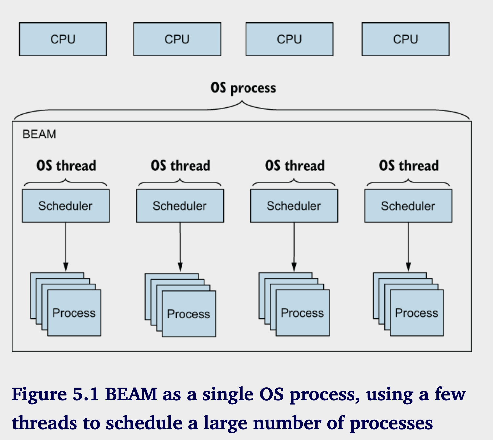
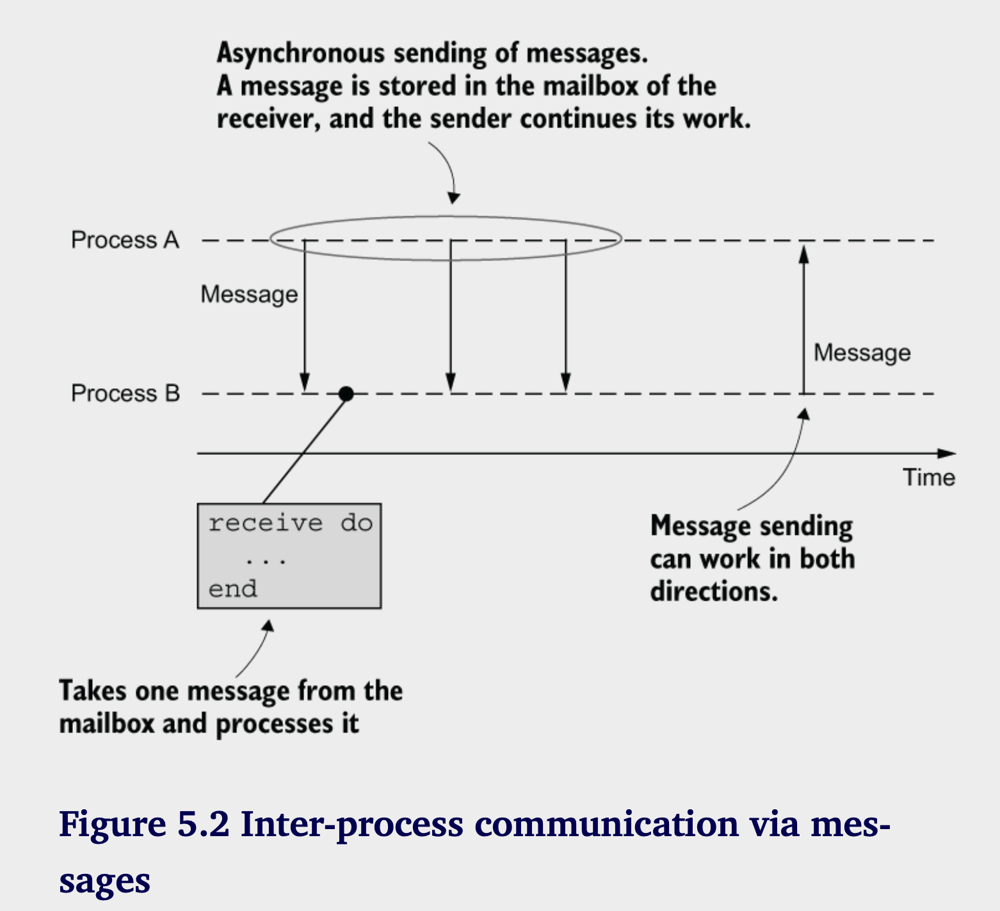
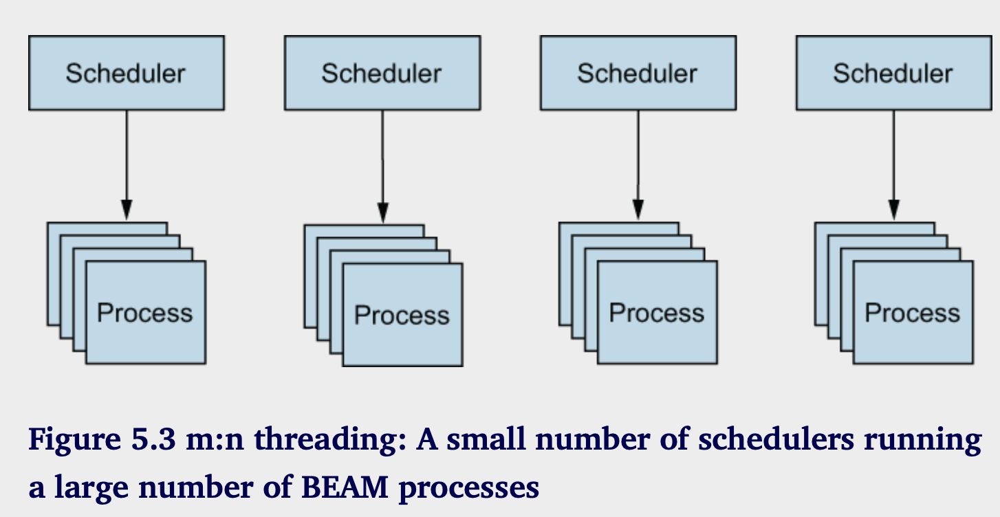

# 并发

**本章涵盖**

- 理解 BEAM 并发原理
- 处理进程
- 处理有状态的服务器进程
- 运行时考虑因素

现在您已经掌握了足够的Elixir和函数式编程的知识，我们将把注意力转向BEAM并发，这是Elixir和Erlang支持可扩展性、容错性和分布式的重要特性。在本章中，我们将通过介绍基本的技术和工具来开始对BEAM并发的探索。在深入低层次的细节之前，我们将先看看高层次的原则。

## 5.1 BEAM的并发

Erlang 的核心是编写高可用的系统——能够永远运行并始终能够有效响应客户端请求的系统。为了使您的系统具备高可用性，您必须解决以下挑战：

- 容错——最小化、隔离并从运行时错误的影响中恢复。
- 可扩展性——通过添加更多硬件资源来处理负载增加，而无需更改或重新部署代码。
- 分布式——在多台机器上运行系统，以便在一台机器故障时其他机器可以接管。

并发在实现高可用性方面发挥着重要作用。在 BEAM 中，并发的单位是进程——这是构建可扩展、容错和分布式系统的基本构建块。注意，BEAM 进程与操作系统进程不是同一回事。

如你将要了解的那样，BEAM 进程比操作系统进程轻得多且更便宜。由于本书主要讨论 BEAM，后续文本中的“进程”一词指的是 BEAM 进程。

在生产环境中，典型的服务器系统必须处理来自不同客户端的许多同时请求，维护共享状态（例如缓存、用户会话数据和服务器范围内数据），并运行一些额外的后台处理任务。为了使服务器正常工作，所有这些任务都应该运行得相当迅速并且可靠。

因为许多任务同时待处理，尽可能并行执行它们是至关重要的，这样可以充分利用所有可用的 CPU 资源。例如，如果一个请求的长时间处理阻塞了所有其他待处理请求和后台任务，那是极其糟糕的。这种情况会导致请求队列不断增长，系统可能变得无响应。

此外，任务之间应该尽可能独立。你不希望一个请求处理程序中的未处理异常导致另一个无关请求处理程序、后台任务，尤其是整个服务器崩溃。你也不希望崩溃的任务留下不一致的内存状态，这可能会在以后影响其他任务。

这正是 BEAM 并发模型为我们做的。进程帮助我们并行运行任务，使我们能够实现可扩展性——通过增加更多的硬件能力来应对负载的增加，系统会自动利用这些资源。

进程还确保了隔离，这反过来又给予我们故障容忍能力——限制和局部化不可避免的运行时错误的影响。如果你能局部化异常并从中恢复，你就可以实现一个真正永不停息的系统，即使在发生意外错误时也能继续运行。

在 BEAM 中，进程是一个并发执行的线程。两个进程可以同时运行，因此可以并行运行，前提是至少有两个 CPU 核心可用。与操作系统中的进程或线程不同，BEAM 进程是轻量级的并发实体，由虚拟机处理，虚拟机使用自己的调度器来管理它们的并发执行。

默认情况下，BEAM 使用的调度器数量与可用的 CPU 核心数量相同。例如，在一个四核机器上，会使用四个调度器，如图 5.1 所示。



每个调度器都在其自己的线程中运行，而整个虚拟机则在一个单独的操作系统进程中运行。在图5.1中，有一个操作系统进程和四个操作系统线程，这就是运行一个高度并发服务器系统所需的一切。

调度器负责进程的可互换执行。每个进程都有一个执行时间片；时间到后，正在运行的进程会被抢占，然后下一个进程接管。

进程是轻量级的，创建一个进程只需几微秒，并且其初始内存占用仅为几千字节。相比之下，操作系统线程通常仅用于堆栈就会使用几兆字节。因此，您可以创建大量进程；虚拟机施加的理论限制大约是1.34亿个！

这个特性可以在服务器端系统中利用，以管理应该同时运行的各种任务。通过为每个任务使用专用进程，您可以充分利用所有可用的 CPU 核心，并尽可能并行化工作。

此外，在不同的进程中运行任务提高了服务器的可靠性和容错性。BEAM进程是完全隔离的；它们不共享内存，一个进程的崩溃不会影响其他进程。此外，BEAM提供了检测进程崩溃并采取措施的方式，比如重启崩溃的进程。这一切使得创建更稳定、能优雅地从不可预见的错误中恢复的系统变得更加容易，这些错误在生产过程中是不可避免的。

最后，每个进程可以管理某些状态，并接收来自其他进程的消息，以操控或检索该状态。正如你在本书第一部分中看到的，Elixir中的数据是不可变的。为了保持数据的存活，你需要保持对它的引用，持续将一个函数的结果传递给另一个函数。一个进程可以被视为这个数据的容器—一个存储不可变结构并让其长时间（可能是永久）存活的地方。

如你所见，Concurrency不仅仅是工作的并行化。在了解了BEAM进程的高层次视图后，让我们来看看你如何创建进程并与它们进行工作。

## 5.2 处理进程

进程的好处在于，当您想要并发运行某些任务并尽可能并行化工作时最为明显。例如，假设您需要运行一系列可能需要较长时间的数据库查询。您可以按顺序一个接一个地运行这些查询，或者可以尝试并发运行它们，希望能缩短总执行时间。

**并发与并行**

重要的是要意识到，并发并不一定意味着并行。两个并发程序有独立的执行上下文，但这并不意味着它们会并行运行。如果您运行了两个以CPU为中心的并发任务，而仅有一个CPU核心，那么就无法实现并行执行。通过添加更多的CPU核心并依赖高效的并发框架，您可以实现并行。但您应该意识到，并发本身并不一定能加快速度。

为了简化问题，我们将使用一个长时间运行的数据库查询的模拟，如下片段所示：

```elixir
iex(1)> run_query =
...(1)>   fn query_def ->
...(1)>     Process.sleep(2000)
...(1)>     "#{query_def} result"
...(1)>    end
```

在这里，代码暂停两秒以模拟一个长时间运行的操作。当你调用 `run_query` 这个 lambda 时，shell 会被阻塞，直到这个 lambda 完成。

```elixir
iex(2)> run_query.("query 1")
"query 1 result"
```

因此，如果你运行五个查询，得到所有结果将需要10秒钟:

```elixir
iex(3)> Enum.map(
...(3)>  1..5,
...(3)>   fn index ->
...(3)>     query_def = "query #{index}"
...(3)>    run_query.(query_def)
...(3)> end)
["query 1 result", "query 2 result", "query 3 result", "query 4 result",
 "query 5 result"]
```

这显然既不高效也不具可扩展性。假设查询已经过优化，唯一可以加快速度的方法就是并发运行查询。这不会加快单个查询的速度，但运行所有查询所需的总时间应该会减少。在 BEAM 环境中，要并发执行某个任务，必须创建一个单独的进程。

### 5.2.1 创建进程

创建进程使用自动导入的`spawn/1`函数：

```elixir
spawn(fn ->
  expression_1
  ...
  expression_2
end)
```

函数 `⁠spawn/1` 创建（或生成）一个新进程。提供的零参数 lambda 将在生成的进程中并发运行。lambda 完成后，生成的进程会被终止。一旦新进程创建，`⁠spawn/1` 会返回，允许调用进程继续执行。

尝试并行query：

```elixir
iex(4)> spawn(fn ->
...(4)>   query_result = run_query.("query 1")
...(4)>   IO.puts(query_result)
...(4)> end)
#PID<0.105.0>

query 1 result # 2秒后输出结果
```

正如您所看到的，调用 `spawn/1` 立即返回，让您可以在查询并发运行时在 shell 中执行其他操作。然后，在两秒钟后，结果会打印到屏幕上。

由 `spawn/1` 返回的奇怪的 `#PID<0.105.0`> 是创建过程的标识符，通常称为 `PID`。您可以使用它与该过程进行通信，正如您将在本章稍后看到的那样。

与此同时，让我们进行更多关于并发执行的实验。首先，您将创建一个辅助 lambda，它并发地运行查询并打印结果。

```elixir
iex(5)> async_query =
...(5)>   fn query_def ->
...(5)>     spawn(fn ->
...(5)>       query_result = run_query.(query_def)
...(5)>       IO.puts(query_def)
...(5)>       end)
...(5)>    end

#Function<42.39164016/1 in :erl_eval.expr/6>
iex(6)> async_query.("query 1")
#PID<0.107.0>
query 1
```

这段代码演示了一种重要的技术：将数据传递给创建的进程。请注意，`async_query` 接受一个参数，并将其绑定到 `query_def `变量。然后，这个数据通过闭包机制传递给新创建的进程。内部的 lambda —— 那个在单独进程中运行的 —— 引用外部作用域中的 `query_def` 变量。这导致了跨进程的数据传递；`query_def` 的内容从主进程传递到新创建的进程。当数据传递给另一个进程时，数据会进行深拷贝，因为两个进程无法共享任何内存。


请注意，在BEAM中，一切都在一个进程中运行。这同样适用于交互式 shell。你在iex中输入的所有表达式都是在一个特定于 shell 的单一进程中执行的。在这个例子中，主进程是 shell 进程。

现在你已经有了 async_query lambda，你可以尝试并发运行五个查询:

```elixir
iex(9)> Enum.each(1..5, &async_query.("query #{&1}"))
:ok
query 1
query 2
query 3
query 4
query 5
```

正如预期，`Enum.each/2` 的调用现在立即返回（在第一个顺序版本中，您必须等待 10 秒才能完成）。此外，所有结果几乎在同一时间打印出来，2 秒后，这比顺序版本提高了五倍。这是因为您并行运行每个计算。出于同样的原因，执行顺序并不是确定性的。输出结果可以以任何顺序打印。”


与顺序版本不同，调用进程无法获得派生进程的结果。这些进程是并发运行的，每个进程将结果打印到屏幕上。同时，调用进程独立运行，并且无法访问任何来自派生进程的数据。请记住，进程是完全独立和隔离的。

通常，一个简单的“触发后忘记”并发执行就足够了，在这种情况下，调用进程不会从派生进程收到任何通知。然而，有时你可能希望将并发操作的结果返回给调用进程。为此，你可以使用消息传递机制。

### 5.2.2 消息传递

在复杂系统中，你通常需要并发任务以某种方式协作。例如，你可能有一个主进程，它派生多个并发计算，然后你可能希望在主进程中处理所有结果。

由于进程是完全隔离的，进程无法使用共享数据结构进行知识交换。相反，进程通过消息进行通信，如图5.2所示。



当进程 A 希望进程 B 执行某个操作时，它会向 B 发送一个异步消息。消息的内容是一个 Elixir 术语——任何可以存储在变量中的内容。发送消息相当于将其存储到接收者的邮箱中。调用者随后继续执行自己的操作，接收者可以在任何时候取出消息并进行处理。由于进程之间不能共享内存，因此发送消息时会进行深拷贝。

进程的邮箱是一个仅受可用内存限制的先进先出（FIFO）队列。接收者按照接收到的顺序处理消息，只有在消息被处理后才能从队列中移除。

要向一个进程发送消息，您需要访问其进程标识符（PID）。请回想上一节，新创建的进程的PID是`spawn/1`函数的结果。此外，您可以通过调用自动导入的`self/0`函数来获取当前进程的PID。一旦您获得接收者的PID，就可以使用`Kernel.send/2`函数向其发送消息。

```elixir
send(pid, {:an, :arbitrary, :term})
```

发送的结果是消息被放入接收者的邮箱。调用者进程随后继续执行后续表达式。

接受端需要使用`receive`表达式从邮箱中获取消息：

```elixir
receive do
  pattern_1 -> do_something
  pattern_2 -> do_something_else
end
```

`receive` 表达式的工作原理与您在第三章看到的 `case` 表达式类似。它会试图从进程邮箱中提取一条消息，将其与提供的模式进行匹配，并运行相应的代码。您可以通过强制 shell 进程向自己发送消息来简单测试这一点。

```elixir
iex(1)> send(self(), "a message")

iex(2)> receive do
...(2)> msg -> IO.inspect(msg)
...(2)> end
"a message"
```

可以依赖模式匹配处理特定消息：

```elixir
iex(3)> send(self(), {:message, 1})

iex(4)> receive do
...(4)> {:message, id} -> IO.inspect("received message #{id}" )
...(4)> end
"received message 1"
```

如果邮箱中没有消息，接收将无限期等待新消息到达。以下调用会阻塞命令行，您需要手动终止它，如果邮箱中没有邮件与提供的模式匹配，情况也是一样的：

```elixir
iex(5)> receive do 
...(5)>   message -> IO.inspect(message)
...(5)> end
# 阻塞中
```

如果您不想接收阻塞，可以指定 `after` 子句，该子句将在给定时间范围内（以毫秒为单位）未收到消息时执行：

```elixir
iex(5)> receive do 
...(5)>   message -> IO.inspect(message)
...(5)> after
...(5)>   5000 -> IO.puts("message not received") # 5秒超时
...(5)> end
```

**RECEIVE BEHAVIOR**

请回忆第三章中提到的，当无法对给定术语进行模式匹配时，会引发错误。接收表达式是此规则的一个例外。如果消息与任何提供的条款不匹配，则该消息会被放回进程邮箱，并处理下一个消息。

`receive`表达式工作如下：

1. 从信箱中提取第一个消息
2. 从上至下尝试模式匹配
3. 如果消息匹配到了模式，执行相应代码
4. 如果没有匹配到模式，获取下一条消息，从2.开始
5. 如果队列中没有消息，等待消息。一旦新消息，从2.开始
6. 如果有`after`子句且超时未匹配到，则执行`after`代码块

正如你已经知道的，每个 Elixir 表达式都会返回一个值，而 receive 也不例外。receive 的结果是相应子句中最后一个表达式的结果。

```elixir
iex(1)> send(self(), {:message, 1})
 
iex(2)> receive_result =
          receive do
            {:message, x} ->
              x + 2            
          end
 
iex(3)> IO.inspect(receive_result)

3
```

总结一下，`receive` 试图寻找进程邮箱中第一个（最旧的）可以与任何提供的模式匹配的消息。如果找到这样的消息，就会执行相应的代码。否则，`receive` 会在指定的时间内等待这样的消息，如果没有提供 `after` 子句，则会无限期等待。

**SYNCHRONOUS SENDING**

基本的消息传递机制是异步的‘发送即忘’类型。一个进程发送消息后继续运行，完全不关心接收方发生了什么。有时，调用者需要接收方的某种响应。但是，这种情况没有特别的支持。相反，你必须编写程序让双方通过基本的异步消息传递功能进行协作。

调用者必须在消息内容中包含其自己的PID，然后等待接收者的响应。

```elixir
send(pid, {self(), some_message})   
 
receive do
  {:response, response} -> ...      
end
```

接收方使用附带的PID将响应发送给调用方：

```elixir
receive do 
  {caller_pid, message} ->
    response = ...
    send(caller_pid, {:response, response})
end
```

稍后我们讨论服务器进程时，你会看到这一点的实际应用。

**Collecting query results**

让我们尝试使用前一部分开发的并发查询进行消息传递。在之前的尝试中，您在独立进程中运行查询，并从那些进程中将结果打印到屏幕上。让我们回顾一下这个过程是如何工作的：

```elixir
iex(1)> run_query =
          fn query_def ->
            Process.sleep(2000)
            "#{query_def} result"
          end
 
iex(2)> async_query =
          fn query_def ->
            spawn(fn ->
              query_result = run_query.(query_def)
              IO.puts(query_result)
            end)
          end
```

现在，让我们收集所有结果到主进程，而不是打印到屏幕上。首先，你需要让 lambda 将查询结果发送给调用进程：

```elixir
iex(3)> async_query =
          fn query_def ->
            caller = self()                                  
 
            spawn(fn ->
              query_result = run_query.(query_def)
              send(caller, {:query_result, query_result})    
            end)
          end
```

在这段代码中，您首先将调用进程的PID存储到一个独立的调用者变量中。这是必要的，以便工作进程（即进行计算的进程）能够知道应该接收响应的进程的PID。

请记住，`self/0` 的结果取决于调用过程。如果你没有将结果存储到调用者变量中，并且试图从内部 lambda 发送 `(self(), ...)`，那么这不会产生任何效果。被生成的进程会将消息发送给自己，因为调用 `self/0` 会返回调用该函数的进程的 PID。

工作进程现在可以使用调用者变量来返回计算结果。消息采用自定义格式 {:query_result, result}。这使得能够区分您的消息与可能发送给调用者进程的其他消息。


现在，你可以开始查询了：

```elixir
iex(4)> Enum.each(1..5, &async_query.("query #{&1}"))
```

这会并行运行所有查询，结果存储在调用者进程的邮箱中。在这个例子中，调用者进程是 shell (iex) 进程。

请注意，在接收消息时，调用者进程既不会被阻塞也不会被中断。发送消息不会以任何方式干扰接收进程。如果该进程正在进行计算，它将继续进行。唯一受到影响的是接收进程邮箱的内容。消息会保留在邮箱中，直到被消费或进程终止。现在让我们获取结果。

你需要创建一个 lambda，从邮箱中提取一条消息并从中提取查询结果:

```elixir
iex(1)> get_result =
...(1)>   fn -> 
...(1)>     receive do
...(1)>       {:query_result, result} -> result
...(1)>   end
...(1)> end
#Function<43.39164016/0 in :erl_eval.expr/6>
```

现在，您可以将邮箱中的所有消息提取到一个列表中:

```elixir
iex(6)> results = Enum.map(1..5, fn _ -> get_result.() end)
["query 3 result", "query 2 result", "query 1 result",
 "query 5 result", "query 4 result"]
```

注意使用 `Enum.map/2`，它将任何可枚举的内容映射到相同长度的列表中。在这个例子中，你创建了一个大小为 5 的范围，然后将每个元素映射到 get_result lambda 的结果。这是可行的，因为你知道有五条消息在等待你。否则，循环将会卡住，等待新消息到达。

值得一提的是，结果以非确定性的顺序到达。由于所有计算是并发进行的，因此不确定它们会以什么顺序完成。这是一个简单的并行映射技术实现，可以用来并行处理大量工作，然后将结果收集到一个列表中。这个想法可以用管道表达：

```elixir
iex(7)> 1..5
        |> Enum.map(&async_query.("query #{&1}"))   
        |> Enum.map(fn _ -> get_result.() end)      
```

## 5.3 有状态的服务进程

生成进程以执行一次性任务并不是并发的唯一用例。在 Elixir 中，创建可以处理以消息形式发送的各种请求的长时间运行的进程是很常见的。此外，这些进程可能维护某些内部状态——一个可能随着时间变化的任意数据。我们称这些进程为有状态服务器进程，它们是 Elixir 和 Erlang 系统中的一个重要概念，因此我们将花一些时间来探索它们。

### 5.3.1 服务器进程

服务器进程是一个非正式的名称，指的是一个长时间运行（或永远运行）并可以处理各种请求（消息）的进程。为了使一个进程永远运行，您必须使用无尽的尾递归。您可能还记得在第三章中提到，尾调用会受到特殊处理。如果一个函数做的最后一件事是调用另一个函数（或它自己），则会发生简单跳转，而不是堆栈推送。因此，一个总是调用自己的函数将永远运行，而不会导致堆栈溢出或消耗额外的内存。

这可以用来实现一个服务器进程。您需要在每一步循环中运行无限循环并等待消息。当接收到消息时，您处理它，然后继续循环。让我们尝试创建一个可以按需执行查询的服务器进程。下面的代码提供了一个长时间运行的服务器进程的基本框架。

```elixir
defmodule DatabaseServer do
  def start do
    spawn(&loop/0)
  end

  defp loop do
    receive do
      ...
      end 
      loop()
    end
    ...
end
```

`start/0` 是客户端用来启动服务器进程的所谓接口函数。当调用 `start/0` 时，它会生成一个执行 `loop/0` 函数的进程。这个函数驱动了进程的无限循环。该函数等待消息、处理消息，然后自行调用，确保进程永不停歇。

这种实现使得这个过程成为一个服务器。它并不是主动执行某些计算，而是大部分时间处于闲置状态，等待消息（请求）的到来。值得注意的是，这个循环并不消耗 CPU。等待消息使得进程处于挂起状态，并没有浪费 CPU 周期。

请注意，此模块中的函数在不同的进程中运行。函数 start/0 由客户端调用，并在客户端进程中运行。私有函数 loop/0 在服务器进程中运行。同一个模块中的不同函数在不同进程中运行是非常正常的——模块与进程之间没有特别的关系。模块只是函数的集合，这些函数可以在任何进程中被调用。

当实现一个服务器进程时，通常将其所有代码放在一个模块中是有意义的。这个模块的函数通常分为两类：接口和实现。接口函数是公共的，并在调用者进程中执行。它们隐藏了进程创建和通信协议的细节。实现函数通常是私有的，并在服务器进程中运行。

注意：与经典循环一样，通常您不需要自己编写递归循环。提供了一种名为 `GenServer`（通用服务器进程）的标准抽象，它简化了有状态服务器进程的开发。该抽象仍然依赖于递归，但这个递归是在 `GenServer` 中实现的。您将在第六章中学习有关该抽象的内容。

我们来看一下 loop/0 函数的完整实现:

```elixir
# Listing 5.2 Database server loop (database_server.ex)
defmodule DatabaseServer do
  ...
 
  defp loop do
    receive do 
      {:run_query, caller,query_def} ->
        query_result = run_query(query_def)
        send(caller, {:query_result, query_result})
    end
    loop()
  end
  ...
end

```

这段代码揭示了调用进程与数据库服务器之间的通信协议。调用者以` {:run_query, caller, query_def}` 的格式发送消息。服务器进程通过执行查询并将查询结果发送回调用进程来处理这样的消息。

通常，您希望将这些通信细节隐藏起来，以免客户端依赖于知道必须发送或接收的消息的确切结构。为了隐藏这些细节，最好提供一个专门的接口函数。我们将引入一个名为 `run_async/2` 的函数，客户端将通过这个函数请求服务器进行操作——在这个例子中，是查询执行。这个函数使客户端对消息传递的细节一无所知；它们只需调用 `run_async/2` 并获取结果。以下是该实现的代码清单。

```elixir
# Listing 5.3 Implementation of `run_async/2 (database_server.ex)`
defmodule DatabaseServer do
  ...
  def run_async(server_pid, query_def) do
    send(server_pid, {:run_query, self(), query_def})
  end 
  ...
end
```

`run_async/2` 函数接收数据库服务器的 `PID` 和一个你想要执行的查询。它向服务器发送合适的消息，然后不做其他任何事情。从客户端调用 `run_async/2` 会请求服务器进程执行查询，同时调用者可以继续进行其他操作。

一旦查询执行完毕，服务器会向调用进程发送消息。要获取这个结果，您需要添加另一个接口函数：`get_result/0`:

```elixir
# Listing 5.4 Implementation of get_result/0 (database_server.ex)
defmodule DatabaseServer do
  ...
  def get_result do
    receive do 
      {:query_result, result} -> result
    after
      5000 -> {:error, :timeout}
    end
  end

  ...
end
```

`get_result/0` 在客户端想要获取查询结果时被调用。在这里，你使用 `receive` 来获取消息。`after` 子句确保在一段时间后你放弃（例如，如果在查询执行过程中出现问题且响应从未返回）。

数据库服务已经完成，让我用一下试试：

```elixir
iex(1)> server_pid = DatabaseServer.start()
 
iex(2)> DatabaseServer.run_async(server_pid, "query 1")
iex(3)> DatabaseServer.get_result()
"query 1 result"
 
iex(4)> DatabaseServer.run_async(server_pid, "query 2")
iex(5)> DatabaseServer.get_result()
"query 2 result"
```

注意你如何在同一个进程中执行多个查询。首先，你运行查询1，然后运行查询2。这证明服务器进程在接收到消息后仍然继续运行。

由于通信细节被封装在函数中，客户端对此并不知情。相反，它通过普通函数与进程进行通信。在这里，服务器的PID扮演了重要角色。你可以通过调用`DatabaseServer.start/0`来获取PID，然后用它向服务器发出请求。当然，请求是在服务器进程中异步处理的。在调用`DatabaseServer.run_async/2`后，你可以在客户端（iex）进程中做任何你想做的事情，并在需要时收集结果。

**SERVER PROCESS ARE SEQUENTIAL**

重要的是要意识到，服务器进程在内部是顺序执行的。它运行一个循环，一次处理一条消息。因此，如果你向单一的服务器进程发出五个异步查询请求，它们将被逐个处理，最后一个查询的结果将在10秒后返回。

这是件好事，因为这有助于你理解系统。服务器进程可以被视为一个同步点。如果有多个操作需要同步发生以串行方式执行，你可以引入一个单独的进程，将所有请求转发到该进程，由它按顺序处理请求。

当然，在这种情况下，顺序特性就成了一个问题。你希望并发运行多个查询，以尽快获得结果。对此你能做些什么？

假设这些查询可以独立运行，你可以启动一组服务器进程，然后对于每个查询，选择一个来自这组进程的进程来执行查询。如果进程池足够大，并且你能够在每个工作进程之间均匀分配任务，那么你就能尽可能地并行处理总工作量。

这是实现这一目标的基本步骤。首先，创建一个数据库服务器进程池：

```elixir
iex(1)> pool = Enum.map(1..100, fn _ -> DatabaseServer.start() end)
```

在这里，你创建 100 个数据库服务器进程，并将它们的 PID 存储在一个列表中。你可能会觉得 100 个进程很多，但请记住，进程是轻量级的。它们占用的内存很少（大约 2 KB），而且创建得非常快（只需几微秒）。此外，由于所有这些进程都在等待消息，它们实际上是空闲的，并没有浪费 CPU 时间。

接下来，当你运行一个查询时，你需要决定哪个进程将执行该查询。最简单的方法是使用 `:rand.uniform/1` 函数，它接受一个正整数 n，并返回一个范围在 1 到 n 之间的随机数。利用这一点，以下表达式将五个查询分配到一组进程中：

```elixir
ex(2)> Enum.each(
          1..5,
          fn query_def ->
            server_pid = Enum.at(pool, :rand.uniform(100) - 1)    
            DatabaseServer.run_async(server_pid, query_def)       
          end
        )
```

请注意，这并不是高效的；你使用 `Enum.at/2` 来选择一个随机的 PID。因为你使用一个列表来存储进程，而随机查找是一个 `O(n)` 操作，选择一个随机工作进程的性能并不是很好。如果使用一个以进程索引作为键，PID 作为值的映射，你可以做得更好。还有其他几种替代方法，比如使用轮询方法。不过现在，让我们先坚持使用这个简单的实现。

一旦你将查询排队给worker，就需要收集响应。这现在很简单，如以下代码片段所示：

```elixir
iex(3)> Enum.map(1..5, fn _ -> DatabaseServer.get_result() end)
["5 result", "3 result", "1 result", "4 result", "2 result"]
```

感谢这种方式，你可以更快地获得所有结果，因为查询是并行执行的。

### 5.3.2 保持进程状态

服务器进程开启了保持某种进程特定状态的可能性。例如，当您与数据库交互时，需要维持一个连接句柄。

要在进程中保持状态，可以通过添加参数扩展循环函数。这里是一个基本的示例：

```elixir
def start do
  spawn(fn -> 
    initial_state = ...
    loop(initial_state)
    end)
end

defp loop(state) do
  ...
  loop(state)
end
```

让我们使用这种技术为数据库服务器扩展一个连接。在这个例子中，您将使用随机数作为连接句柄的模拟。首先，您需要在进程启动时初始化连接，如以下列表所示。

```elixir
# Listing 5.5 Initializing the process state (stateful_database_server.ex)
defmodule DatabaseServer do
  ...
  def start do
    spawn(fn ->
      connection = :rand.uniform(1000)
      loop(connection)
    end)
  end
  ...
end
```


在这里，您打开连接，然后将相应的句柄传递给循环函数。在实际应用中，您会使用数据库客户端库（例如 ODBC）来打开连接，而不是生成随机数。接下来，您需要修改循环函数。

```elixir
# Listing 5.6 Using the connection while querying (stateful_database_server.ex)
defmodule DatabaseServer do 
  ...
  
  defp loop(connection) do
    receive do
      {:run_query, from_pid, query_def} ->
        query_result = run_query(connection, query_def)
        send(from_pid {:query_result, query_result})
    end

    loop(connection)
  end

  defp run_query(connection, query_def) do
   Process.sleep(2000)
   "Connection #{connection}: #{query_def} result"
   end

   ...
end
```

循环函数将状态（连接）作为第一个参数。每次恢复循环时，该函数将状态传递给自身，因此在下一步中可以使用。

此外，您必须扩展 `run_query` 函数，以在查询数据库时使用连接。连接句柄（在这种情况下是一个数字）包含在查询结果中。这样，您的有状态数据库服务器就完成了。请注意，您没有更改其公共函数的接口，因此用法与之前相同。让我们看看它是如何工作的：

```elixir
iex(1)> server_pid = DatabaseServer.start()
 
iex(2)> DatabaseServer.run_async(server_pid, "query 1")
iex(3)> DatabaseServer.get_result()
"Connection 753: query 1 result"
 
iex(4)> DatabaseServer.run_async(server_pid, "query 2")
iex(5)> DatabaseServer.get_result()
"Connection 753: query 2 result"
```

不同查询的结果是使用相同的连接句柄执行的，该句柄在进程循环中内部保持，对其他进程完全不可见。

### 5.3.3 可变状态

到目前为止，你已经看到了如何保持特定于进程的常量状态。要使这个状态可变并不需要太多的工作。这里是基本思路：

```elixir
defp loop(state) do
  new_state =            
    receive do
      msg1 ->
        ...
 
      msg2 ->
        ...
    end
 
  loop(new_state)        
end
```

这是Elixir中一种标准的有状态服务器技术。该进程在处理消息时确定新的状态。然后，循环函数使用新的状态调用自身，这样实质上就改变了状态。接下来接收到的消息将在新的状态上操作。

从外部来看，有状态的进程是可变的。通过向进程发送消息，调用者可以影响其状态以及该服务器处理的后续请求的结果。从这个意义上说，发送消息是一种可能具有副作用的操作。尽管如此，服务器仍然依赖于不可变数据结构。状态可以是任何有效的Elixir变量，范围从简单的数字到复杂的数据抽象，例如（您在第4章中构建的）待办事项列表。

让我们看看这一过程是如何工作的。您将从一个简单的例子开始：一个有状态的计算器进程，它将一个数字作为其状态。初始时，进程的状态为0，您可以通过发出请求来操纵它，比如add（加）、sub（减）、mul（乘）和div（除）。您还可以通过value请求来检索进程的状态。

下面是您如何使用该服务器的说明：

```elixir
iex(1)> calculator_pid = Calculator.start()      
 
iex(2)> Calculator.value(calculator_pid)         
0                                                
 
iex(3)> Calculator.add(calculator_pid, 10)       
iex(4)> Calculator.sub(calculator_pid, 5)        
iex(5)> Calculator.mul(calculator_pid, 3)        
iex(6)> Calculator.div(calculator_pid, 5)        
 
iex(7)> Calculator.value(calculator_pid)         
3.0
```

在这段代码中，你启动了进程并检查其初始状态。然后，你发出一些修改请求并验证操作的结果 (((0 + 10) - 5) * 3) / 5，这个结果是 3.0。现在，是时候实现这一点了。首先，让我们看看服务器的内部循环。

```elixir
# Listing 5.7 Concurrent stateful calculatro (calculator.ex)

defmodule Caculator do
  ...

  def loop(current_value) do
    new_value =
     receive do
       {:value, caller} ->
         send(caller, {:response, current_value})
         current_value
         
       {:add, value} -> current_value + value
       {:sub, value} -> current_value - value
       {:mul, value} -> current_value * value
       {:div, value} -> current_value / value
 
       invalid_request ->
         IO.puts("invalid requet #{inspect invalid_request}")
         current_value
       end

       loop(new_value)
    end

    ...
end
```

这个循环处理各种消息。`:value` 消息用于检索服务器的状态。因为需要将响应发送回去，调用者必须在消息中包含其 PID。请注意，这个代码块的最后一个表达式返回 `current_value`。这是必要的，因为 `receive` 的结果存储在 `new_value` 中，而 `new_value` 之后用作服务器的新状态。通过返回 `current_value`，你指定了 `:value` 请求不会改变进程状态。

算术操作根据当前值和在消息中接收到的参数计算新状态。与 `:value` 消息处理程序不同，算术操作处理程序不会将响应发送回调用者。这使得可以异步运行这些操作，正如你很快在实现接口函数时看到的那样。

最终的接收子句匹配所有其他消息。这些是您不支持的消息，因此您将它们记录到屏幕上并返回当前值，从而保持状态不变。

接下来，您需要实现客户端将使用的接口函数

```elixir
# Listing 5.8 Calculator interface functions (calculator.ex)
defmodule Calculator do
  def start do
    spawn(fn -> loop(0))
  end

  def value(server_pid) do
    send(server_pid, {:value, self()})

    receive do
      {:response, value} ->
        value
    end
  end

  def add(server_pid, value), do: send(server_pid, {:add, value})
  def sub(server_pid, value), do: send(server_pid, {:sub, value})
  def mul(server_pid, value), do: send(server_pid, {:mul, value})
  def div(server_pid, value), do: send(server_pid, {:div, value})

  ...
end
```


接口函数遵循 ⁠`loop/1` 函数中指定的协议。`⁠:value` 请求是第 5.2.2 节中提到的同步消息传递的一个例子。调用者发送一条消息，然后等待响应。调用者在响应返回之前会被阻塞，这使得请求处理是同步的。算术操作是异步进行的。没有响应消息，因此调用者无需等待任何东西。因此，调用者可以发出多个这样的请求，并在操作在服务器进程中并发运行的同时继续自己的工作。

请记住，服务器按接收的顺序处理消息，因此请求会按照正确的顺序进行处理。为什么要将算术操作设置为异步？因为你并不在乎它们何时执行。在你请求服务器的状态（通过 ⁠value/1 函数）之前，你不希望客户端被阻塞。这使得客户端更高效，因为它在服务器进行计算时不会阻塞。

**REFACTORING THE LOOP**

当你向服务器引入多个请求时，⁠loop 函数会变得更加复杂。如果你需要处理很多请求，它可能会变得臃肿，演变成一个巨大的 ⁠switch/case 类表达式。你可以通过使用模式匹配并将消息处理移到一个单独的多子句函数中来重构它。这使得 ⁠loop 函数中的代码保持非常简单：

```elixir
defp loop(current_value) do
  new_value =
    receive do
      message -> process_message(current_value, message)
    end
 
  loop(new_value)
end
```

从这段代码来看，你可以看到服务器的一般工作流程。首先接收一条消息，然后进行处理。消息处理通常涉及根据当前状态和接收到的消息计算新状态。最后，你用这个新状态进行循环，有效地替代掉旧状态。`⁠process_message/2` 是一个简单的多子句函数，它接收当前状态和消息。它的任务是执行特定于消息的代码并返回新状态：

```elixir
defp process_message(current_value, {:value, caller}) do
  send(caller, {:response, current_value})
  current_value

defp process_message(current_value, {:add, value}) do
  current_value + value
end

...
```

这段代码是服务器进程循环的简单重组。它允许您保持循环代码的紧凑，并将消息处理细节移动到一个单独的多子句函数中，每个子句处理特定的消息。

### 5.3.4 复杂状态

状态通常比一个简单的数字复杂得多。然而，这个技术始终保持不变：你通过私有循环函数保持可变状态。随着状态变得越来越复杂，服务器进程的代码可能会变得愈加复杂。值得将状态操作提取到单独的模块中，并将服务器进程专注于仅传递消息和保持状态。

让我们看看使用第4章中开发的TodoList抽象来应用这个技术。首先，让我们回顾一下结构的基本用法：

```elixir
iex(1)> todo_list =
          TodoList.new() |>
          TodoList.add_entry(%{date: ~D[2023-12-19], title: "Dentist"}) |>
          TodoList.add_entry(%{date: ~D[2023-12-20], title: "Shopping"}) |>
          TodoList.add_entry(%{date: ~D[2023-12-19], title: "Movies"})
 
iex(2)> TodoList.entries(todo_list, ~D[2023-12-19])
[
  %{date: ~D[2023-12-19], id: 1, title: "Dentist"},
  %{date: ~D[2023-12-19], id: 3, title: "Movies"}
]
```

正如你可能记得的，TodoList 是一种纯功能抽象。为了保持结构的完整性，你必须持续保留对最近一次对结构执行的操作的结果。

在这个例子中，你将构建一个 TodoServer 模块，它在私有状态中保持这一抽象。让我们看看服务器是怎么使用的:

```elixir
iex(1)> todo_server = TodoServer.start()
 
iex(2)> TodoServer.add_entry(
          todo_server,
          %{date: ~D[2023-12-19], title: "Dentist"}
        )
 
iex(3)> TodoServer.add_entry(
          todo_server,
          %{date: ~D[2023-12-20], title: "Shopping"}
        )
 
iex(4)> TodoServer.add_entry(
          todo_server,
          %{date: ~D[2023-12-19], title: "Movies"}
        )
 
iex(5)> TodoServer.entries(todo_server, ~D[2023-12-19])
[
  %{date: ~D[2023-12-19], id: 3, title: "Movies"},
  %{date: ~D[2023-12-19], id: 1, title: "Dentist"}
]
```

你启动服务器，然后通过 TodoServer API 与它进行交互。与纯函数式方法不同，你不需要将修改的结果作为参数传递给下一个操作。相反，你可以不断地使用相同的 todo_server 变量来操作待办事项列表。

让我们开始实现这个服务器。首先，你需要将所有模块放在一个文件中。

```elixir
# Listing 5.9 TodoServer modules (todo_server.ex)
defmodule TodoServer do
  ...
  end

defmodule TodoList do
  ...
end
```

将两个模块放在同一个文件中，确保在启动iex shell时加载文件时可以获得所有内容。在更复杂的系统中，您将使用一个适当的Mix项目，如第七章将要解释的那样，但目前，这样做就足够了。

TodoList 的实现与第 4 章相同。它具有您在服务器进程中所需的所有功能。现在，设置待办事项服务器进程的基本结构。

```elixir
# Listing 5.10 TodoServer basic structure (todo_server.ex)
defmodule  TodoList do
  def start do
     spawn(fn -> loop(TodoList.new()) end)
  end

  defp loop(todo_list) do
    new_todo_list =
      receive do
        message -> process_message(todo_list, message)
          # code
      end

      loop(new_todo_list)
  end
end
```

这里没有什么新鲜的。你使用 TodoList 抽象的新实例作为初始状态来开始循环。在循环中，你接收消息，并通过调用 `process_message/2` 函数将它们应用于状态，该函数返回新的状态。最后，你用新的状态继续循环。对于你想要支持的每个请求，你必须在 `process_message/2` 函数中添加一个专门的子句。此外，必须引入一个相应的接口函数。你将从支持 `add_entry` 请求开始。

```elixir
# Listing 5.11 The add_entry request (todo_server.ex)
defmodule TodoServer do
  def add_entry(todo_server, new_entry) do
    send(todo_server, {:add_entry, new_entry})
  end

  defp process_message(todo_list, {:add_entry, new_entry}) do
    TodoList.add_entry(todo_list, new_entry)
  end
end
```

接口函数将新的条目数据发送到服务器。此消息将在 `process_message/2` 的相应部分处理中。在这里，您调用 `TodoList.add_entry/2` 函数，并返回修改后的 TodoList 实例。这个返回的实例将作为新的服务器状态。

使用类似的方法，您可以实现条目请求，但要记住，您需要等待响应消息。代码显示在下一个列表中。

```elixir
# Listing 5.12 The entries request (todo_server.ex)
defmodule TodoServer do
  def entries(todo_server, date) do
    send(todo_server, {:entries, self, date})

    receive do
      {:todo_entries, entries} -> entries
    after
      5000 -> {:error, :timeout}
    end
  end

  defp process_message(todo_list,{:entries, caller, date}) do
    send(caller, {:todo_entries, TodoList.entries(todo_list, date)})
    todo_list
  end
end
```

这是对你之前见过的技术的综合。你发送一条消息并等待响应。在相应的 `process_message/2 `子句中，你把任务委托给 TodoList，然后发送响应并返回未改变的待办事项列表。这是必要的，因为 `loop/2` 会将 `process_message/2` 的结果作为新状态。

以类似的方式，您可以添加对其他待办事项请求的支持，例如 `update_entry` 和 `delete_entry`。这些请求的实现留给您作为练习。

**CONCURRENT VS. FUNCTIONAL APPROACH**

一个维护可变状态的进程可以看作是一种可变数据结构。但是，你不应该滥用进程来避免使用变换不可变数据的函数式方法。

数据应该使用纯函数抽象进行建模，就像你对待 TodoList 一样。纯函数数据结构提供了许多好处，如完整性、原子性、可重用性和可测试性。

有状态的进程作为这样的数据结构的容器。该进程保持状态的生存，并允许系统中的其他进程通过公开的 API 与这些数据进行交互。

通过这种职责分离，构建一个高度并发的系统变得简单。例如，如果你正在实现一个管理多个待办事项列表的网络服务器，你可以为每个待办事项列表运行一个服务器进程。在处理 HTTP 请求时，你可以找到相应的待办事项服务器，并让它执行请求的操作。每个待办事项的操作并发运行，从而使你的服务器可扩展且性能更好。此外，没有同步问题，因为每个待办事项列表在一个专用进程中管理。请记住，一个进程总是顺序执行，因此多个竞争请求对同一待办事项列表的操作会被序列化，并在相应的进程中顺序处理。如果这看起来模糊，不用担心——你将在第七章看到它的实际应用。

### 5.3.5 注册进程

为了让一个进程与其他进程协作，它必须知道其他进程的去向。在 BEAM 中，进程由其对应的 PID（进程标识符）来识别。为了让进程 A 向进程 B 发送消息，您必须将进程 B 的 PID 传递给进程 A。 

有时候，保持和传递 PID 可能会很麻烦。如果您知道某种类型的服务器只有一个实例，您可以给该进程一个本地名称，并使用该名称向进程发送消息。这个名称被称为本地名称，因为它仅在当前运行的 BEAM 实例中有意义。当您开始将多个 BEAM 实例连接到分布式系统时，这种区别变得很重要，正如您将在第 12 章中看到的那样。 

注册进程可以使用 `Process.register(pid, name)` 来完成，其中名称必须是一个原子（atom）。以下是一个简单的示例：

```elixir
iex(1)> Process.register(self(), :some_name)
true

iex(2)> send(:some_name, :msg)
:msg

iex(3)> receive do
...(3)>   msg -> IO.puts("received #{msg}")
...(3)> end
received msg
:ok
```

以下约束适用于注册名称：  

- 名称只能是一个原子。  
- 单个进程只能有一个名称。  
- 两个进程不能具有相同的名称。  

如果不满足这些约束，将会引发错误。

为了练习，尝试将待办事项服务器更改为以注册进程的方式运行。服务器的接口将因此简化，因为您无需保留和传递服务器的进程 ID(PID)。

这是一个如何使用这种服务器的示例:

```elixir
iex(1)> TodoServer.start()
 
iex(2)> TodoServer.add_entry(%{date: ~D[2023-12-19], title: "Dentist"})
iex(3)> TodoServer.add_entry(%{date: ~D[2023-12-20], title: "Shopping"})
iex(4)> TodoServer.add_entry(%{date: ~D[2023-12-19], title: "Movies"})
 
iex(5)> TodoServer.entries(~D[2023-12-19])
[%{date: ~D[2023-12-19], id: 3, title: "Movies"},
 %{date: ~D[2023-12-19], id: 1, title: "Dentist"}]
```

为了使这个工作正常进行，您必须根据名称注册一个服务器进程（例如，`:todo_server`）。然后，您需要更改所有接口函数，以便在向进程发送消息时使用注册的名称。如果您遇到困难，解决方案可以在 `registered_todo_server.ex` 文件中找到。

使用注册服务器要简单得多，因为您不必存储服务器的 PID 并将其传递给接口函数。相反，接口函数在内部使用注册的名称向进程发送消息。
本地注册在进程发现中起着重要作用。注册名称提供了一种与进程通信的方式，而不需要知道其 PID。当您开始处理重启进程（如第 8 和第 9 章所示）和分布式系统（如第 12 章讨论）时，这一点变得越来越重要。

这结束了我们对有状态进程的初步探索。它们在基于 Elixir 的系统中扮演着重要角色，您将在整本书中继续使用它们。接下来，我们将看看 BEAM 进程的一些重要运行时属性。

## 5.4 运行时考虑事项

你已经学到了很多关于如何处理进程的知识。现在是时候讨论BEAM并发的一些重要运行时特性了。

### 5.4.1 进程是顺序的

已经提到过了，但这很重要，所以我要再强调一次：单个进程是一个顺序程序——它按顺序逐个运行表达式。多个进程同时运行，因此它们可能相互并行运行。但是如果多个进程向一个单个进程发送消息，该单一进程可能会成为瓶颈，这会显著影响系统的整体吞吐量。

让我们看一个例子。下面的代码实现了一个慢速回显服务器

```elixir
# Listing 5.13 Demonstration of a process bottleneck (process_bottleneck.ex)
defmodule Server do
  def start do
    spawn(fn -> loop() end)
  end

  def send_msg(server, message) do
    send(server, {self(), message})

    receive do
      {:response, response} -> response
    end
  end

  defp loop do
    receive do
      {caller, msg} ->
        Process.sleep(1000)
        send(caller, {:response, msg})
    end
    loop()
  end

end
```

接收到消息后，服务器将消息发送回调用者。在此之前，它会暂停一秒钟以模拟一个长时间运行的请求。为了在并发环境中测试其行为，启动服务器并启动五个并发客户端。

```elixir
iex(1)> server = Server.start()

iex(2)> Enum.each(1..5,
...(2)> fn i ->
...(2)>   spawn( fn ->
...(2)>     IO.puts("[#{Time.utc_now}] Sending msg ##{i}")
...(2)>     response = Server.send_msg(server, i)
...(2)>     IO.puts("[#{Time.utc_now}] Response: #{response}")
...(2)> end)
...(2)> end
...(2)> )
```

一起动，将会看到以下输出：

```elixir
[11:31:23.431342] Sending msg #5
[11:31:23.431340] Sending msg #4
[11:31:23.431337] Sending msg #3
[11:31:23.431334] Sending msg #2
[11:31:23.431324] Sending msg #1
```

到目前为止，一切顺利。五个进程已经启动并且正在并发运行。但现在，问题开始了——响应缓慢地逐个返回，间隔一秒。

```elixir
[11:31:24.438642] Response: 5
[11:31:25.439728] Response: 4
[11:31:26.440644] Response: 3
[11:31:27.441613] Response: 2
[11:31:28.442655] Response: 1
```

发生了什么？回声服务器每秒只能处理一条消息。因为所有其他进程都依赖于回声服务器，所以它们受到其吞吐量的限制。

你能对此做些什么？一旦你识别出瓶颈，应该尝试在内部优化流程。通常，服务器进程的流程很简单。它按顺序接收和处理消息。因此，目标是让服务器以至少与消息到达的速度相同的速度处理消息。在这个例子中，服务器优化等同于移除 Process.sleep/1 调用。

如果你无法使消息处理足够快速，可以尝试将服务器拆分成多个进程，从而有效地并行化原始工作，并希望这样能在多核系统上提升性能。不过，这应该是你的最后手段。并行化并不是解决结构不良算法的良方。

### 5.4.2 无限制进程邮箱

理论上，进程邮箱的大小是无限的。然而，在实践中，邮箱的大小受到可用内存的限制。因此，如果一个进程不断落后，意味着消息到达的速度快于该进程处理的速度，邮箱将不断增长，并日益消耗内存。最终，单个缓慢的进程可能会通过消耗所有可用内存导致整个系统崩溃。

如果一个进程根本不处理某些消息，则会出现更微妙的版本同样的问题。考虑以下服务器循环:

```elixir
defp loop do
  receive do
    {:message, msg} -> do_something(msg)
  end

  loop()
end
```

服务器仅处理以下形式的消息：`{:message, something}`。所有其他消息将永远停留在进程邮件箱中，无故占用内存空间。过大的邮件箱内容会显著影响性能。它给垃圾收集器带来了额外的压力，并可能导致接收模式匹配变慢。

为避免这种情况，您应该引入一个匹配所有消息的接收子句，以处理意外类型的消息。通常，您会发出警告，说明进程收到了未知消息，并不再做其他操作。

```elixir
defp loop do
  receive do
    {:message, msg} -> do_something(msg)
    other -> warn_about_unknown_message(other)
    end

    loop()
end
```

因为这个进程处理每种类型的消息，所以它的邮箱不太可能出现无控制的增长。

值得注意的是，BEAM 提供了在运行时分析进程的工具。特别是，你可以查询每个进程的邮箱大小，从而检测出那些邮箱队列持续增加的进程。我们将在第十三章讨论这个功能。

### 5.4.3 共享无状态并发

进程间不共享内存，因此，发送消息给另一个进程会深拷贝消息内容：

```elixir
send(target_pid, data)
```

不太明显的是，在一个生成的元素中，变量闭包也会导致闭合变量的深拷贝。

```elixir
data = ...

spawn(fn ->
  ...
  some_fun(data)
  ...
  end)
```

当将代码移入单独的进程时，您应该注意这一点。深拷贝是一个内存操作，因此应该相对快速，偶尔发送一个大消息应该不会造成问题。但是，许多进程频繁发送大消息可能会影响系统性能。“小”和“大”的概念是主观的。简单数据，如数字、原子或少量元素的元组，显然是小的。另一方面，一百万个复杂结构的列表则是大的。界限在两者之间，具体取决于您的情况。

有几种特殊情况，其中数据是通过引用复制的。这发生在大于64字节的二进制数据（包括字符串）、硬编码常量（也称为字面量）以及通过:persistent_term API创建的术语中。

无共享并发确保进程之间的完全隔离：一个进程不能影响另一个进程的内部状态。这有助于提升系统的完整性和容错能力。

此外，由于进程不共享内存，垃圾回收可以在进程级别进行。每个进程会获得一小块初始堆内存（在64位BEAM上大约为2 KB）。当需要更多内存时，就会进行该进程的垃圾回收。因此，垃圾回收是并发和分布式的。与其进行一次大型的‘停止整个系统’的回收，不如进行许多较小的、通常更快的回收。这可以防止不必要的长时间完全阻塞，并使整个系统保持更高的响应性。

### 5.4.4 调度器内部工作

通常，你可以假设有 n 个调度程序运行 m 个进程，其中 m 通常比 n 大得多。这被称为 m:n 线程模型，它反映了使用较少的操作系统线程运行大量逻辑微线程的事实，如图 5.3 所示。



每个 BEAM 调度器都是一个操作系统线程，负责管理 BEAM 进程的执行。默认情况下，BEAM 只使用与可用的逻辑处理器数量相等的调度器。您可以通过各种 Erlang 模拟器标志更改这些设置。要提供 Erlang 标志，可以使用以下语法：

```shell
iex --erl "put Erlang emulator flags here"
```

有关所有Erlang标志的列表可以在以下网址找到：https://erlang.org/doc/man/erl.xhtml。

例如，要只使用一个调度线程，您可以提供 +S 1 Erlang 标志：

```shell
$ iex --erl "+S 1"
Erlang/OTP 26 [erts-14.0] [source] [64-bit] [smp:1:1] [ds:1:1:10]
```

请注意输出中的smp:1:1部分。这告诉我们只使用了一个调度线程。您还可以通过编程方式检查调度器的数量：

```elixir
iex(5)> System.schedulers
1
```

如果你在系统上运行其他外部服务，可以考虑减少 BEAM 调度器线程的数量。这样可以为非 BEAM 服务留下更多的计算资源。

在内部，每个调度器会选择一个进程，运行一段时间，然后再选择另一个进程。在调度器中，进程可以获得大约 2000 次函数调用的小执行窗口，之后它会被抢占。值得一提的是，在某些情况下，长时间运行的 CPU 密集型任务或较大的垃圾回收可能会在另一个线程上执行（称为脏调度器）。

如果一个进程正在进行网络 I/O 或等待消息，它会将执行权让给调度器。当调用 `Process.sleep` 时也会发生相同的情况。因此，你不必关心进程中执行的工作的性质。如果你想将一个函数的执行与其余代码分开，只需在一个单独的进程中运行该函数，无论该工作是 CPU 还是 I/O 密集型。

因此，上下文切换会频繁发生。通常，一个进程在调度器中的时间少于一毫秒。这提高了基于 BEAM 系统的响应能力。如果一个进程执行长时间的 CPU 密集型操作，例如计算 π 的亿位小数，它不会阻塞整个调度器，其他进程也不会受到影响。

这很容易证明。启动一个只有一个调度器线程的 iex 会话：

```elixir
iex --erl "+S 1"
```

生成一个运行无限CPU绑定循环的进程：

```elixir
iex(1)> spawn(fn ->
          Stream.repeatedly(fn -> :rand.uniform() end)
          |> Stream.run()
        end)
```

这段代码使用 `Stream.repeatedly/1` 创建一个懒惰的无限随机数流。这个流通过 `Stream.run/1` 函数执行，这将有效地运行一个无限的 CPU 密集型循环。为了避免阻塞 iex shell 会话，工作是在一个单独的进程中完成的。 一旦你开始这个计算，你应该会注意到 CPU 使用率飙升到 100%，这证明你现在正在运行一个密集的、长期的 CPU 密集型工作。 尽管 BEAM 只使用一个调度线程，iex 会话仍然是响应的，你可以评估其他表达式。 例如，让我们计算前 1,000,000,000 个整数的总和：

```elixir
iex(2)> Enum.sum(1..1_000_000_000)
500000000500000000
```

我们能够在一个已经忙碌的调度线程上运行另一个任务，并且该任务几乎立即完成。这是频繁上下文切换的结果，它确保偶尔的长时间运行的任务不会显著影响整个系统的响应能力。

**总结**

- BEAM 进程是一个轻量级的并发执行单元。进程是完全隔离的，并且不共享内存。

- 进程可以通过异步消息进行通信。同步发送和响应是在这个基本机制之上手动构建的。

- 服务器进程是一个长期运行（可能是永远）并处理各种消息的进程。服务器进程是通过无尽递归驱动的。

- 服务器进程可以使用无尽递归的参数来维护它们自己的私有状态。