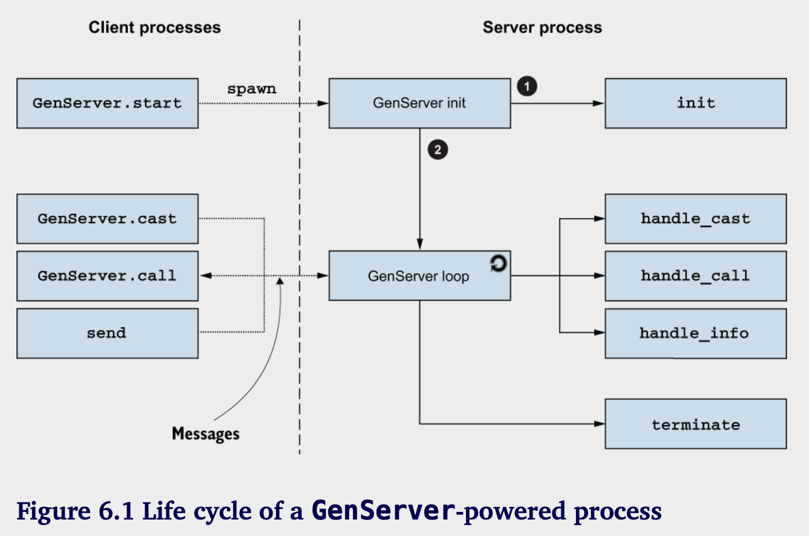

# Generic server processes

**本章涵盖**

- 创建一个通用服务器进程
- 使用`GenServer`

在第五章中，你了解了基本的并发技术：你学会了如何创建进程并与它们进行通信。我还解释了有状态服务器进程的概念——这些是长时间运行的进程，可以对消息作出反应并维护状态。

服务器进程在构建高度并发的 Elixir 和 Erlang 系统时起着重要作用，因此我们将花一些时间详细探讨它们。在本章中，你将学习如何减少与服务器进程相关的一些样板代码，比如无限递归、状态管理和消息传递。

Erlang 提供了一个帮助模块来实现服务器进程——这是开放电信平台（OTP）框架的一部分。尽管名称令人误解，这个框架与电信无关；相反，它为创建组件、构建发布、开发服务器进程、处理和恢复运行时错误、日志记录、事件处理和代码升级等任务提供模式和抽象。

你将在本书的多个部分学习 OTP 的各个部分，但在这一章，我们将重点关注它最重要的部分之一：GenServer，这是一个简化服务器进程实现的模块。不过在查看 `GenServer` 之前，你将实现一个基于第五章中看到的消息传递原语的简化版本。

## 6.1 构建一个通用服务器进程

你在第五章看到了一些服务器进程的例子。尽管这些进程服务于不同的目的，但它们的实现之间有一些共同点。特别是，所有实现服务器进程的代码需要完成以下任务：

- 生成一个独立的经常
- 经常中执行一个无限循环
- 管理进程状态
- 对消息作出反应
- 给调用者发送回复

无论您运行什么类型的服务器进程，您总是需要执行这些任务，因此将这些代码移动到一个位置是值得的。具体的实现可以重用这些代码，并专注于它们特定的需求。让我们看看您如何实现这样的通用代码。

### 6.1.1 使用模块进行插入

通用代码将执行服务器进程中常见的各种任务，将具体的决策留给具体的实现。例如，通用代码将生成一个进程，但具体实现必须确定初始状态。同样，通用代码将运行循环；接收消息；并选择性地发送响应，但具体实现必须决定如何处理每条消息以及响应是什么。

换句话说，通用代码驱动整个过程，而具体实现则必须填补缺失的部分。因此，您需要一个插件机制，让通用代码在需要做出具体决策时能够调用具体实现。

实现此功能的最简单方法是使用模块。请记住，模块名是一个原子（atom）。您可以将该原子存储在一个变量中，然后稍后使用该变量调用模块中的函数。

```elixir
iex(1)> some_module = IO  

iex(2)> some_module.puts("Hello")  
Hello
```

你可以使用这个功能从通用代码提供回调钩子。特别是，你可以采取以下方法：

1. 使通用代码接受一个插件模块作为参数。该模块称为回调模块。

2. 将模块原子作为过程状态的一部分进行维护。

3. 在需要时调用回调模块的函数。

显然，为了使这一切正常工作，回调模块必须实现并导出一组明确定义的函数，我将在实现通用代码时逐步介绍这些函数。

### 6.1.2 实现通用代码

让我们来构建一个通用服务器进程，首先你需要启动进程并初始化其状态：

```elixir
# Listing 6.1 Starting the server process (server_process.ex)
defmodule ServerProcess do
  def start(callback_module) do
    spawn(fn ->
    initial_state = callback_module.init()
    loop(callback_module, initial_state)
    end)
  end
  ...
end
```

`ServerProcess.start/1 `以一个模块原子作为参数，然后生成进程。在生成的进程中，回调函数 `init/0` 被调用以创建初始状态。显然，为了使这个有效，回调模块必须导出 `init/0` 函数。

最后，您进入了一个循环，该循环将驱动服务器进程并维持这种状态。`ServerProcess.start/1` 的返回值是一个进程 ID (pid)，可以用来向请求进程发送消息。

接下来，您需要实现驱动进程的循环代码，等待消息并处理它们。在这个例子中，您将实现一种同步发送和响应的通信模式。服务器进程必须接收一条消息，处理它，将响应消息发送回调用者，并更改进程状态。

通用代码负责接收和发送消息，而具体实现必须处理消息并返回响应和新的状态。这个思想在下面的代码清单中得以展现。

```elixir
# Listing 6.2 Handling messages in the server process (server_process.ex)
defmodule ServerProcess do
  ...
  defp loop(callback_module, current_state) do
    receive do
      {request, caller} ->
        {response, new_state} =
          callback_module.handle_call(
            request,
            current_state
          )
          
          send(caller, {:response, response})

          loop(callback_module, new_state)
        end
    end
    ...
end
```

在这里，你需要期待一个以 `{request, caller}` 元组形式的消息。请求是一个数据，用来标识请求，并对特定实现有意义。回调函数 `handle_call/2` 需要接收请求有效载荷和当前状态，并且必须返回一个 `{response, new_state}` 元组。通用代码随后可以将响应发送回调用者，并继续使用新状态循环。唯一需要做的事情是提供一个函数向服务器进程发出请求。

```elixir
# Listing 6.3 Helper for issuing requests (server_process.ex)
defmodule ServerProcess do
  ...
  def call(server_pid, requst) do
    send(server_pid, {request, self()})

    receive do
      {:response, response} ->
        response
    end
  end
end
```

在这一点上，您已经为通用服务器进程建立了抽象。让我们看看它如何被使用。

### 6.1.3 使用通用抽象

为了测试服务器进程，您将实现一个简单的键值存储。这将是一个可以用来存储任意条目之间映射的进程。请记住，回调模块必须实现两个函数：`init/0`，用于创建初始状态，以及`handle_call/2`，用于处理特定请求。

```elixir
# Listing 6.4 Key-value store implementation (server_process.ex)
defmodule KyeValueStore do
  def init do
    %{}
  end

  def handle_call({:put, key, value},state) do
    {:ok, Map.put(state, key, value)}
  end

  def handle_call({:get, key}, state) do
    {Map.get(state, key), state}
  end
end
```

这就是创建一个特定服务器进程所需的全部内容。由于无限循环和消息传递的样板代码被推送到了通用代码中，特定实现变得更加简洁，并专注于其主要任务。

特别注意你如何在 `handle_call/2` 中使用多重子句来处理不同类型的请求。这是具体实现决定如何处理每个请求的地方。ServerProcess 模块是通用代码，它盲目地将请求从客户端进程转发到回调模块。

让我们测试一下这个进程:

```elixir
iex(2)> ServerProcess.call(pid, {:put, :some_key, :some_value})
:ok

iex(3)> ServerProcess.call(pid, {:get, :some_key})
:some_value
```

注意你是如何用 `ServerProcess.start(KeyValueStore)` 启动这个过程的。在这里，你将特定的 KeyValueStore 插入到 ServerProcess 的通用代码中。后续对 `ServerProcess.call/2` 的所有调用将会向那个进程发送消息，该进程将反过来调用 `KeyValueStore.handle_call/2` 来执行处理。

让客户完全不知道使用了 ServerProcess 抽象是有益的。这可以通过引入辅助函数来实现。

```elixir
# Listing 6.5 Wrapping ServerProcess function calls (server_process.ex)
defmodule KeyValueStore do
  def start do
    ServerProcess.start(KeyValueStore)
  end

  def put(pid, key, value) do
    ServerProcess.call(pid, {:put, key, value})
  end

  def get(pid, key) do
    ServerProcess.call(pid, {:get, key})
  end
  ...
end
```

客户端现在可以使用 `start/0`、`put/3` 和 `get/2` 来操作键值存储。这些函数被非正式地称为接口函数。客户使用 `KeyValueStore` 的接口函数来启动和与进程交互。相比之下，`init/0` 和 `handle_call/2` 是由通用代码内部使用的回调函数。请注意，接口函数在客户端进程中运行，而回调函数始终在服务器进程中调用。

# 6.1.4 支持异步请求

当前的 ServerProcess 实现仅支持同步请求。让我们对这一点进行扩展，加入对异步“fire-and-forget”请求的支持，在这种请求中，客户端发送一条消息而不等待响应。

在当前的代码中，我们使用“调用”一词来表示同步请求。对于异步请求，我们将使用“发送”这个术语。这是 OTP 中使用的命名约定，因此采用它是好的选择。

因为您要引入第二种请求类型，所以需要更改在客户端进程和服务器之间传递的消息格式。这将使您能够在服务器进程中确定请求类型，并以不同的方式处理不同类型的请求。

这可以通过在从客户端进程传递到服务器的元组中包含请求类型信息来实现。

```elixir
# Listing 6.6 Including the request type in the message (server_process_cast.ex)
defmodule ServerProcess do
  ...
  def call(server_pid, request) do
    send(server_pid, {:call, request, self()})
    ...
  end

  defp loop(callback_module, current_state) do
    receive do
      {:call, request, caller} ->
      ...
    end
  end
  ...
end
```

现在，您可以引入对cast请求的支持。在这种情况下，当消息到达时，具体的实现会处理它并返回新的状态。没有响应被发送回调用者，因此回调函数必须只返回新的状态。

```elixir
# Lisitng 6.7 Supporting casts in the server process (server_process_cast.ex)
defmodule ServerProcess do
  def call(server_pid, request) do
    send(server_pid,{:call, request, self()})
  end

  def cast(server_pid, request) do
    send(server_pid, {:cast, request})
  end

  defp loop(callback_module, current_state) do
    receive do
      {:call, resquest, caller} ->
        {response,new_state} = callback_module.handle_call(
          request,
          current_state
        )
        send(caller, {:response, response})
        loop(callback_module,new_state)

      {:cast, reuqest} ->
        new_state = callback_module.handle_cast(
          request,
          current_state
        )
        loop(callback_module,new_state)
    end
  end
end
```

要处理 cast 请求，您需要回调函数 handle_cast/2。这个函数必须处理消息并返回新的状态。在服务器循环中，您接着调用这个函数并使用新状态进行循环。支持 cast 请求只需做到这些。最后，您将更改键值存储的实现以使用 casts。请记住，cast 是一种“发送后不再等待”的请求类型，因此并不适合所有请求。在这个例子中，get 请求必须是 call，因为服务器进程需要用与给定键关联的值进行响应。相比之下，put 请求可以实现为 cast，因为客户端不需要等待响应。

```elixir
# Listing 6.8 Implementing put as a cast (server_process_cast.ex)
defmodule KeyValueStore do
  ...
  def put(pid, key, value) do
    ServerProcess.cast(pid, {:put, key, value})
  end

  def handle_cast({:put, key, value}, state) do
    Map.put(state, key, value)
  end
end
``` 

现在可以尝试一下：

```elixir
iex(1)> pid = KeyValueStore.start()
 
iex(2)> KeyValueStore.put(pid, :some_key, :some_value)
 
iex(3)> KeyValueStore.get(pid, :some_key)
:some_value
```

通过对通用实现进行简单修改，您为服务过程添加了另一个功能。具体实现现在可以决定每个具体请求是作为调用还是转换来实现。

## 6.2 使用GenServer

当谈到生产就绪的代码时，构建和使用手动制作的 ServerProcess 抽象没有太大意义。这是因为 Elixir 提供了更好的通用服务器进程支持，称为 GenServer。除了功能比 ServerProcess 更丰富外，GenServer 还处理了多个边界情况，并在复杂的并发系统中经过生产环境的考验。

GenServer 提供的一些引人注目的特性包括：

- 支持call和cast
- 可自定义的调用请求超时时间
- 服务器进程崩溃时，将崩溃情况传播给等待响应的客户端进程

- 支持分布式系统

请注意，GenServer 并没有特别的魔法。它的代码依赖于第 5 章中解释的并发原语和第 9 章中解释的容错特性。毕竟，GenServer 是用普通的 Erlang 和 Elixir 实现的。主要工作是在 :gen_server 模块中完成的，该模块包含在 Erlang 标准库中。在 Elixir 标准库中的 GenServer 模块中还进行了额外的封装。

在本节中，您将学习如何使用 GenServer 构建服务器进程。但首先，让我们来看看 OTP 行为的概念。请注意单词“behaviour”的英国拼写：这是 OTP 代码和官方文档中首选的拼写。此书使用英国拼写来特指 OTP 行为，而在其他情况下则保留美国拼写（behavior）。

### 6.2.1 OTP行为

在 Erlang 的术语中，行为（behaviour）是实现通用模式的通用代码。通用逻辑通过行为模块暴露出来，你可以通过实现相应的回调模块来接入它。回调模块必须满足行为定义的契约，这意味着它必须实现并导出一组函数。然后，行为模块会调用这些函数，允许你提供对通用代码的特定实现。

这正是 ServerProcess 的作用。它为一个通用的服务器进程提供支持，要求特定的实现提供实现了 init/0、handle_call/2 和 handle_cast/2 函数的回调模块。ServerProcess 是行为的一个简单示例。

甚至可以在编译期间指定行为契约并验证回调模块是否实现了所需的函数。有关详细信息，请参见官方文档（https://hexdocs.pm/elixir/Module.xhtml#module-behaviour）。

Erlang 标准库包含以下 OTP 行为：
- `gen_server` —— 有状态服务器进程的通用实现
- `supervisor` —— 在并发系统中提供错误处理和恢复
- `application` —— 组件和库的通用实现
- `gen_event` —— 提供事件处理支持
- `gen_statem` —— 在有状态服务器进程中运行有限状态机

Elixir 为最常用的行为提供了自己的封装，主要通过模块 GenServer、Supervisor 和 Application。本书重点讨论这些行为。GenServer 行为在本章和第七章中进行了详细的讲解，Supervisor 的内容在第八章和第九章中涉及，Application 的内容则在第十一章中介绍。  

其余的行为虽然有用，但使用频率较低，本书将不进行讨论。一旦你掌握了 GenServer 和 Supervisor，你应该能够自己研究其他行为，并在需要时加以使用。你可以在 Erlang 文档中找到关于 gen_event 和 
gen_statem 的更多信息（https://erlang.org/doc/design_principles/des_princ.xhtml）。

# 6.2.2 接入 GenServer

使用 GenServer 大致上与使用 ServerProcess 类似。返回值的格式有一些差异，但基本概念是相同的。GenServer 行为定义了八个回调函数，但通常你只需要其中的一部分。如果使用 GenServer 模块，你可以获得所有必需的回调函数的一些合理的默认实现。

```elixir
iex(1)> defmodule KeyValueStore do
...(1)>   use GenServer
...(1)> end
```

`use` 宏是我们之前没有讨论过的语言特性。在编译期间，当遇到这个指令时，将调用 GenServer 模块中的特定宏。这个宏会将多个函数注入到调用模块（在这种情况下是 KeyValueStore）中。你可以在终端中验证这一点：

```elixir
iex(2)> KeyValueStore.__info__(:functions)
[child_spec: 1, code_change: 3, handle_call: 3, handle_cast: 2,
 handle_info: 2, init: 1, terminate: 2]
```

在这里，你使用` __info__/1` 函数，该函数在编译期间会自动添加到每个 Elixir 模块中。它列出了模块的所有导出函数（除了 `__info__/1` 以外）。

正如你在输出中看到的，由于使用了 GenServer，许多函数会自动包含在模块中。这些都是必须实现的回调函数，以便你能够融入 GenServer 行为。当然，你可以根据需要覆盖每个函数的默认实现。如果你在自己的模块中定义了同名和相同参数个数的函数，它将覆盖通过使用得到的默认实现。此时，你可以将回调模块插入到行为中。要启动进程，请使用 `GenServer.start/2` 函数。

```elixir
iex(3)> GenServer.start(KeyValueStore, nil)
{:ok, #PID<0.51.0>}
```

这个工作大致上像 ServerProcess。服务器进程被启动，行为使用 KeyValueStore 作为回调模块。`GenServer.start/2` 的第二个参数是一个自定义参数，在进程初始化时传递给它。现在，你不需要这个，所以你发送 `nil` 值。最后，请注意 `GenServer.start/2` 的结果是一个形式为 `{:ok, pid}` 的元组。

### 6.2.3 处理请求

现在，您可以将 KeyValueStore 转换为与 GenServer 一起使用。为此，您需要实现三个回调：
`init/`,`handle_cast/2`和`handle_call/3`

```elixir
# Lisiting 6.9 Implementing GenServer callbacks(key_calue_gen_server.ex)
defmodule KeyValueStore do
  use GenServer

  def init(_) do
    {:ok, %{}}
  end

  def handle_cast({:put, key, value}, state) do
    {:noreply, Map.put(state, key, value)}
  end

  def handle_call({:get, key}, _, state) do
    {:reply, Map.get(state, key), state}
  end
end
```

这些回调函数与 ServerProcess 中的回调函数类似，但有几个不同之处：
- `init/1` 接受一个参数。这是传递给 `GenServer.start/2` 的第二个参数，您可以用它在启动时将数据传递给服务器进程。
- `init/1` 的结果必须格式为 `{:ok, initial_state}`。
- `handle_cast/2` 接受请求和状态，并应返回格式为 `{:noreply, new_state}` 的结果。
- `handle_call/3` 接受请求、调用者信息和状态。它应返回格式为 `{:reply, response, new_state}` 的结果。

`handle_call/3` 的第二个参数是一个元组，包含请求 ID（由 GenServer 行为内部使用）和调用者的 PID。在大多数情况下，这些信息并不是必需的，因此在此示例中，你可以忽略它。

将这些回调设置好后，唯一缺失的就是接口函数。要与 GenServer 进程进行交互，您可以使用 GenServer 模块中的函数。特别地，您可以使用 `GenServer.start/2` 来启动进程，使用 `GenServer.cast/2` 和 `GenServer.call/2`来发送请求。代码将在下一个列表中显示。

```elixir
# Listing 6.10 Adding interface functions (key_value_gen_server.ex)
defmodule KeyValueStore do
  use GenServer

  def start do
    GenServer.start(KeyValueStore, nil)
  end

  def put(pid, key, value) do
    GenServer.cast(pid, {:put, key, value})
  end

  def get(pid, key) do
    GenServer.call(pid, {:get, key})
  end
end
```

就这样！只需做几个改动，你就从一个基本的 ServerProcess 转变为一个完整的 GenServer。让我们测试一下服务器：

```elixir
iex(1)> {:ok, pid} = KeyValueStore.start()
 
iex(2)> KeyValueStore.put(pid, :some_key, :some_value)
 
iex(3)> KeyValueStore.get(pid, :some_key)
:some_value
```

ServerProcess 和 GenServer 之间有许多不同之处，但有几点特别值得提及。首先，`GenServer.start/2` 只有在服务器进程中的 `init/1` 回调完成后才会返回。因此，启动服务器的客户端进程会被阻塞，直到服务器进程初始化完成。第二，`GenServer.call/2` 不会无限期等待响应。默认情况下，如果响应消息在 5 秒内没有到达，客户端进程会抛出错误。您可以通过使用 `GenServer.call(pid, request, timeout)` 来更改这一点，其中 timeout 是以毫秒为单位的。此外，如果接收进程在您等待响应时突然终止，GenServer 会检测到这一点，并在调用者进程中抛出相应的错误。

# 6.2.4 处理普通消息

发送到服务器进程的消息通过 GenServer.call 和 GenServer.cast 不仅包含请求负载。这些函数在发送到服务器进程的消息中包含了额外的数据。这是您在第 6.1 节中的 ServerProcess 示例中所做的：

```elixir
defmodule ServerProcess do
  ...
 
  def call(server_pid, request) do
    send(server_pid, {:call, request, self()})   
    ...
  end
 
  def cast(server_pid, request) do
    send(server_pid, {:cast, request})           
  end
 
  ...
 
  defp loop(callback_module, current_state) do
    receive do
      {:call, request, caller} ->                
        ...
 
      {:cast, request} ->                        
        ...
    end
  end
  ...
end
```

请注意，您不会将普通的请求负载发送给服务器进程；而是包含额外的数据，例如请求类型和调用者，以便进行调用请求。GenServer使用类似的方法，使用:"$gen_cast"和:"$gen_call"原子来装饰cast和call消息。您不需要担心这些消息的确切格式，但理解GenServer内部使用特定消息格式并以特定方式处理这些消息是很重要的。偶尔，您可能需要处理不特定于GenServer的消息。例如，假设您需要定期清理服务器进程的状态。您可以使用Erlang函数:timer.send_interval/2，该函数会定期向调用者进程发送消息。因为此消息不是特定于GenServer的消息，所以它不被视为cast或call。而是对于这样的普通消息，GenServer调用handle_info/2回调，让您有机会对消息进行处理。

```elixir
defmodule KeyValueStore do
  use GenServer

  def init(_) do
    :timer.send_interval(5000, :cleanup)
    {:ok, %{}}
  end

  def handle_info(:cleanup, state) do
    IO.ptuts "performing cleanup..."
    {:noreply, state}
  end
end
```

```elixir
iex(2)> GenServer.start(KeyValueStore, nil)
 
performing cleanup...                              
performing cleanup...
performing cleanup...
```

在进程初始化过程中，你确保每5秒向进程发送一条 :cleanup 消息。该消息在 handle_info/2 回调中处理，其基本功能类似于 handle_cast/2，返回结果为 {:noreply, new_state}。

### 6.2.5 其他GenServer的特性

我在这本关于 GenServer 的基础介绍中没有提到几个其他特性和细微之处。你将在本书的其他部分了解到其中的一些内容，但你一定要花时间查看 GenServer 模块的文档（https://hexdocs.pm/elixir/GenServer.xhtml）及其 Erlang 基础（https://erlang.org/doc/man/gen_server.xhtml）。有几个点仍然值得特别提及。

**COMPILE-TIME CHECKING**

回调机制的一个问题是，在定义回调函数时很容易犯微妙的错误。考虑下面的例子：

```elixir
defmodule EchoServer do
  use GenServer

  def handle_call(some_request, server_state) do
   {:reply, some_request, server_state}
  end
end
```

这里有一个简单的回显服务器，它通过将请求发送回客户端来处理每个调用请求。试试看：

```elixir
iex(2)> {:ok, pid} = GenServer.start(EchoServer, nil)
{:ok, #PID<0.96.0>}
 
iex(3)> GenServer.call(pid, :some_call)
** (exit) exited in: GenServer.call(#PID<0.96.0>, :some_call, 5000)
   ** (EXIT) an exception was raised:
      ** (RuntimeError) attempted to call GenServer #PID<0.96.0> but
                        no handle_call/3 clause was provided
```

发出调用导致服务器崩溃，错误提示没有提供 handle_call/3 子句，尽管该子句在模块中列出。发生了什么？仔细查看 EchoServer 的定义，你会发现你定义的是 handle_call/2，而 GenServer 需要 handle_call/3。如果你告诉编译器正在定义的函数应该满足某个行为的约定，你可以在编译时得到一个警告。为此，你需要在回调函数的第一个子句之前提供 @impl 模块属性：

The `@impl GenServer`告诉编译器，接下来要定义的函数是GenServer行为的回调函数。只要在shell中执行这个表达式，您就会收到一个警告。

```elixir
warning: got "@impl GenServer" for function handle_call/2 but this
behaviour does not specify such callback.
```

编译器告诉你 GenServer 不处理 handle_call/2，因此你已经在编译过程中得到了一个提示，表明出现了错误。为你在模块中定义的每个回调函数始终指定 @impl 属性是一个好习惯。

**NAME REGISTRATION**

回忆一下第5章，一个进程可以在一个本地名称（原子）下注册，其中“本地”意味着该名称仅在当前运行的BEAM实例中注册。这使得您可以创建一个单例进程，您可以通过名称访问它，而无需知道它的PID。

本地注册是一个重要特性，因为它支持故障容错和分布式系统的模式。您将在后面的章节中详细了解这一点，但值得一提的是，您可以将进程名称作为选项提供给 GenServer.start：

```elixir
GenServer.start(
  CallbackModule,
  init_param,
  name: :some_name
)
```

接下来可以使用name发送call或者cast

```elixir
GenServer.call(:some_name, ...)
GenServer.cast(:some_name, ...)
```

最常见的方法是使用与模块名称相同的名称。如第2.4.2节所述，模块名称是原子，因此您可以安全地将它们作为:name选项传递。以下是这种方法的简要概述：

```elixir
defmodule KeyValueStore do
  def start() do
    GenServer.start(KeyValueStore, nil, name: KeyValueStore)
  end

  def put(key, value) do
    GenServer.cast(KeyValueStore, {:put, key, value})
  end
end
```

注意，KeyValueStore.put 现在不需要接收 PID。它将简单地向注册的进程发出请求。
你也可以将 KeyValueStore 替换为特殊形式 __MODULE__。在编译时，__MODULE__ 会被替换为代码所在模块的名称：

```elixir
defmodule KeyValueStore do
  def start() do
   GenServer.start(__MODULE__, nil, name: __MODULE__)
   end

   def put(key, value) do
     GenServer.cast(__MODULE__, {:put, key, value})
   end
end
```

编译后，这段代码与之前的版本等效，但未来的一些重构会变得更容易。例如，如果你将 KeyValueStore 重命名为 KeyValue.Store，你只需在模块中的一个地方进行更改。

**STOPPING THE SERVER**

不同的回调可以返回各种类型的响应。到目前为止，你已经看到了最常见的情况：

- {:ok, initial_state} from init/1
- {:reply, response, new_state} from handle_call/3
- {:noreply, new_state} from handle_cast/2  and handle_info/2

还有其他可能性，其中最重要的是停止服务器进程的选项。在 init/1 中，您可以选择不启动服务器。在这种情况下，您可以返回 {:stop, reason} 或 :ignore。在这两种情况下，服务器都不会继续循环，而是会终止。

如果 `init/1` 返回 `{:stop, reason}`，则 `start/2` 的结果将是 `{:error, reason}`。相反，如果 `init/1` 返回 `:ignore`，则 `start/2` 的结果也将是 `:ignore`。这两个返回值之间的区别在于它们的意图。当由于某个错误无法继续执行时，您应该选择 `{:stop, reason}`。相反，当停止服务器是正常的操作时，则应使用 `:ignore`。

从 `handle_*` 回调中返回 `{:stop, reason, new_state}` 会导致 GenServer 停止服务器进程。如果终止是标准工作流程的一部分，您应使用原子 `:normal` 作为停止原因。如果您在 `handle_call/3` 中，并且在终止之前还需要回应调用者，可以返回 `{:stop, reason, response, new_state}`。

您可能会想，既然要终止进程，为什么还需要返回一个新状态。这是因为在终止之前，GenServer 会调用回调函数 `terminate/2`，并将终止原因和进程的最终状态传递给它。这在您需要执行清理时可能会很有用。

最后，您还可以通过从客户端进程调用 `GenServer.stop/3` 来停止服务器进程。如果您需要执行清理，这可能会很有用。此调用将向服务器发出同步请求。该行为将通过停止服务器进程来处理停止请求。

### 6.2.6 进程的生命周期

务必了解 GenServer 驱动的进程是如何工作的，以及各种函数在何处（哪个进程）被执行，这一点非常重要。让我们通过查看图 6.1 进行快速回顾，该图展示了一个典型服务器进程的生命周期。



一个客户端进程通过调用 GenServer.start 并提供回调模块来启动服务器 (1)。这会创建一个新的服务器进程，该进程由 GenServer 行为驱动。

客户端进程可以使用各种 GenServer 函数或直接发送消息来发出请求。当接收到消息时，GenServer 会调用回调函数来处理它。因此，回调函数始终在服务器进程中执行。

进程状态在 GenServer 循环中维持，但由回调函数定义和操作。它从 init/1 开始，init/1 定义了初始状态，然后将其传递给后续的 handle_* 回调 (2)。每个回调接收当前状态，并必须返回其新版本，这个新版本用于替换 GenServer 循环中的旧版本。

**The actor model**

Erlang 是对演员模型的意外实现，该模型最初由卡尔·赫维特描述。演员是一个并发计算实体，封装了状态并可以与其他演员进行通信。在处理单个消息时，演员可以指定在处理下一个消息时将使用的新状态。这与基于 GenServer 的进程在 Erlang 中的工作方式大致相似。不过，请注意，正如 Erlang 的共同发明人之一罗伯特·维尔丁（Robert Virding）不断指出的，Erlang 开发者是独自想出了这个想法，而后来才了解到演员模型的存在。

关于 Erlang 是否是演员模型的恰当实现存在一些分歧，并且在 Erlang 社区中不太使用“演员”这个术语。这本书也没有使用这个术语。不过，值得记住的是，在 Erlang 的上下文中，演员对应于服务器进程——通常是 GenServer。

### 6.2.7 OTP合规进程

出于多种原因，一旦开始构建生产系统，您应该避免使用使用 spawn 启动的普通进程。相反，您所有的进程都应该是所谓的符合 OTP 规范的进程。这类进程遵循 OTP 约定，可以在监督树中使用（在第九章中描述），并且这些进程中的错误会记录更多细节。

所有由 OTP 行为驱动的进程，例如 GenServer 和 Supervisor，都是符合 OTP 规范的。Elixir 还包括其他模块，可以用来运行符合 OTP 规范的进程。例如，Task 模块 (https://hexdocs.pm/elixir/Task.xhtml) 非常适合运行一次性任务，处理一些输入后停止。Agent 模块 (https://hexdocs.pm/elixir/Agent.xhtml) 是一种更简单（但功能较弱）的替代方案，适用于进程的唯一目的是管理和暴露状态。Task 和 Agent 在第十章中进行了讨论。

此外，还有许多其他符合 OTP 规范的抽象通过第三方库可用。例如，GenStage (https://hexdocs.pm/gen_stage) 可用于处理背压和负载控制。Phoenix.Channel 模块 (https://hexdocs.pm/phoenix/Phoenix.Channel.xhtml) 是 Phoenix 网络框架的一部分 (https://phoenixframework.org)，用于通过 WebSocket 或 HTTP 等协议在客户端和 Web 服务器之间促进双向通信。

本书没有足够的篇幅处理每一种可能的符合 OTP 规范的抽象，所以您需要自己进行一些研究。但值得指出的是，大多数这样的抽象遵循 GenServer 的理念。除了 Task 模块外，本节提到的所有 OTP 抽象都是基于内部实现的 GenServer。因此，我个人认为，GenServer 很可能是 OTP 中最重要的部分。如果您能正确理解 GenServer 的原则，其他大多数抽象就应该容易得多。


**总结**

- 通用服务器进程是一种抽象，它实现了任何类型服务器进程的常见任务，例如基于递归的循环和消息传递。

- 通用服务器进程可以作为行为实现。行为驱动进程，而具体实现可以通过回调模块插入到行为中。

- 当具体实现需要做出决策时，行为会调用回调函数。

- GenServer 是一种实现通用服务器进程的行为。

- GenServer 的回调模块必须实现各种函数。其中最常用的函数是 init/1、handle_cast/2、handle_call/3 和 handle_info/2。

- 你可以通过 GenServer 模块与 GenServer 进程进行交互。

- 可以向服务器进程发出两种类型的请求：调用和消息传递。

- 消息传递是一种“发送后忘记”的请求——调用者发送一条消息后立即继续做其他事情。

- 调用是一种同步发送和响应的请求——调用者发送一条消息并等待响应到达、超时出现或服务器崩溃。