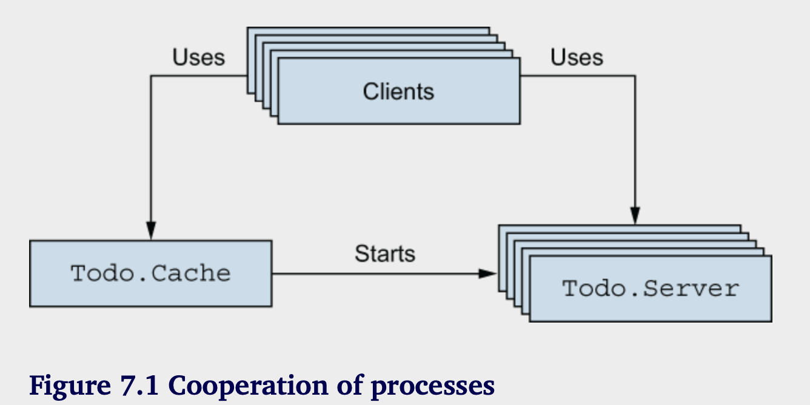
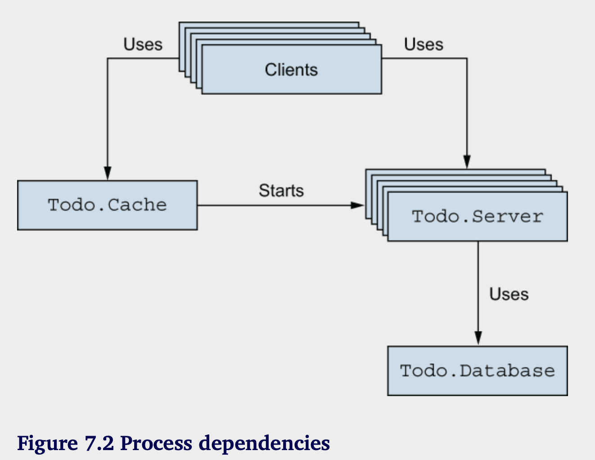
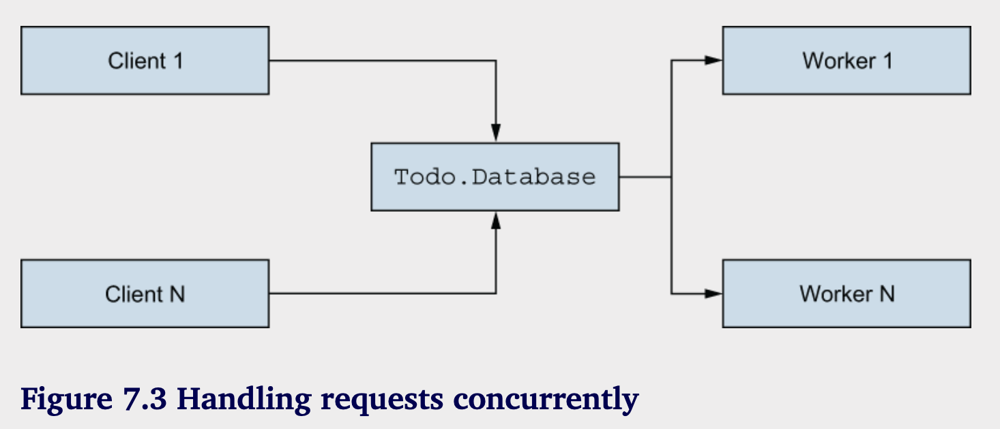
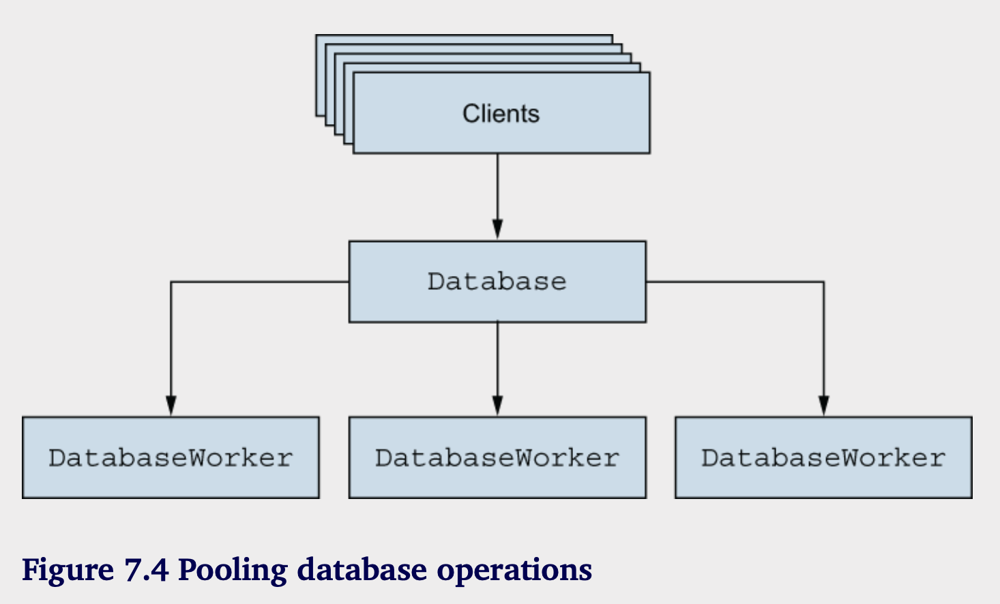

# 构建并发系统

**本章涵盖：**

-  Mix 项目 
-  管理多个待办事项列表 
-  持久化数据 
-  处理进程的推理
  
到目前为止，您看到的并发示例依赖于单个服务器进程实例。但典型的 Elixir 和 Erlang 系统由大量进程驱动，其中许多是有状态的服务器进程。对于一个适度复杂的系统，运行几千个进程并不罕见，而较大的系统可能由数十万甚至数百万个进程支持。请记住，进程的创建成本很低，因此您可以大量创建它们。由于消息传递的并发机制，推理关于高度并发的系统仍然相对容易。因此，在不同进程中运行不同任务是非常有用的。这种高度并发的方法通常可以提高系统的可扩展性和可靠性。
在本章中，您将看到一个更复杂的系统示例，该系统由许多进程协作来提供完整服务。您的最终目标是构建一个分布式 HTTP 服务器，能够处理许多同时操作多个代办事项的最终用户。您将在接下来的章节中完成此目标，并在第 12 章达到最终目标。在本章中，您将开发一个基础设施，以处理多个代办事项并将其持久化到磁盘。
但首先看下如何使用mix管理复杂项目。

## 7.1 mix项目

随着代码变得越来越复杂，将所有模块放在一个文件中变得越来越笨重。现在正是开始使用多文件项目的好时机。第二章简要提到，Elixir 自带 mix 工具，您可以使用它来创建、构建和运行项目，以及管理其依赖关系、运行测试和创建自定义项目任务。在这里，您将学习足够的 mix 知识来创建和运行项目。随着需求的变化，其他 mix 功能将会被引入。

您将使用 mix 为待办事项列表创建一个项目。请在命令行中输入以下内容:

```shell
mix new todo
```

这创建了 todo 文件夹及其下的项目结构。结果是一个文件夹，里面仅包含少量文件，包括 readme 文件、单元测试支持文件和 .gitignore 文件。Mix 项目非常简单，不会引入太多自动生成的文件。
提示：本书没有详细介绍 mix 工具。相反，必要时会介绍其中的主要功能。要了解更多关于 mix 的信息，请参阅《Mix 入门指南》（https://mng.bz/A8do）。此外，您可以从命令行运行 mix help 来获取可用命令的列表，并使用 mix help 命令来获取特定命令的详细帮助。最后，mix 的在线参考文档可在 https://hexdocs.pm/mix 上找到。
一旦项目就位，您可以进入其文件夹并在那里运行 mix 任务。例如，您可以使用 mix compile 命令编译项目，或者使用 mix test 命令运行测试。

您还可以使用一种特殊的方式启动 iex，这在您想要在 Elixir shell 中玩 Mix 项目时非常有用。当您运行 iex -S mix 时，会发生两件事。首先，项目会被编译（和 mix compile 一样）。如果编译成功，shell 就会启动，您可以引用和使用项目中的所有模块。

关于文件应该如何命名和组织，并没有硬性规定，但有一些优先采用的惯例：

- 你应该把你的模块放在一个公共的顶级别名下。例如，模块可以被命名为 Todo.List、Todo.Server 或类似的名称。这可以减少将多个项目合并为一个系统时模块名称冲突的可能性。

- 一般来说，一个文件应该包含一个模块。偶尔，如果一个辅助模块很小并且仅在内部使用，它可以放在与使用它的模块相同的文件中。如果你想为模块实现协议，你也可以在同一个文件中进行。

- 文件名应该是它所实现的主模块名称的下划线形式（也称为蛇形命名）。例如，TodoServer 模块应该位于 lib 文件夹中的 todo_server.ex 文件里。

- 文件夹结构应该对应于多部分模块名称。一个名为 Todo.Server 的模块应该位于 lib/todo/server.ex 文件中。

这些不是严格的规则，但它们是Elixir项目以及许多第三方库所使用的规则。搞定这些之后，你可以开始向项目中添加代码。在第4章中，你开发了TodoList模块。在第6章中，作为练习的一部分，你开发了TodoServer模块，它实现了一个维护单个待办事项列表状态的服务器进程。这两个模块的最终版本位于第6章的todo_server.ex文件中。

现在，您将把这些模块的代码添加到新生成的待办项目中。您需要做以下操作：
1. 删除文件 todo/lib/todo.ex。
2. 删除文件 todo/test/todo_test.exs。
3. 将 TodoList 代码放入 todo/lib/todo/list.ex 文件中，并将模块重命名为 Todo.List。
4. 将 TodoServer 代码放入 todo/lib/todo/server.ex 文件中，并将模块重命名为 Todo.Server。
5. 将所有对 TodoServer 的引用替换为 Todo.Server，并将所有对 TodoList 的引用替换为 Todo.List。

最终版本在 todo 文件夹中可用。现在，您可以使用 `⁠iex -S mix` 启动系统并验证它是否正常工作。

```elixir
$ iex -S mix
 
iex(1)> {:ok, todo_server} = Todo.Server.start()
 
iex(2)> Todo.Server.add_entry(
          todo_server,
          %{date: ~D[2023-12-19], title: "Dentist"}
        )
 
iex(3)> Todo.Server.entries(todo_server, ~D[2023-12-19])
[%{date: ~D[2023-12-19], id: 1, title: "Dentist"}]
```

此时，待办事项代码已在 Mix 项目中，您可以继续添加更多功能。

## 7.2 管理多个toto列表

这一部分介绍了支持管理多个待办事项列表。在开始之前，让我们回顾一下您到目前为止构建的内容： 

- 一个纯函数的待办事项列表抽象 
- 一个可以用于长时间管理一个待办事项列表的待办服务器进程

这个代码扩展到多个列表有两种方法：
- 实现一个纯函数抽象来处理多个待办事项列表。修改 Todo.Server 以使用新的抽象作为其内部状态。
- 为每个待办事项列表运行一个现有待办事项服务器实例。
  
第一种方法的问题在于你最终只会有一个进程来服务所有用户。这种方法的可扩展性不高。如果系统被许多不同的用户使用，它们会经常相互阻塞，竞争同一资源——一个执行所有任务的单服务器进程。

替代方案是使用与待办事项列表数量相等的多个进程。采用这种方法，每个列表是并发管理的，系统应该更具响应能力和可扩展性。

要运行多个待办服务器进程，您需要另一个实体——用来创建 Todo.Server 实例或获取现有实例的东西。这个“东西”必须管理一个状态——本质上是一个将待办列表名称与待办服务器 PID 映射的键值结构。这个状态当然是可变的（列表的数量会随着时间而变化），并且在系统的生命周期内必须是可用的。因此，您将引入另一个服务器进程：一个待办缓存。您只会运行一个该进程的实例，它将用于创建和返回与给定名称对应的待办服务器进程的 PID。该模块将仅导出两个函数：start/0，用于启动进程，以及 server_process/2，用于检索给定名称的待办服务器进程（其 PID），如果该进程尚未运行，则可选择启动该进程。

### 7.2.1 实现cache

让我们开始实现缓存过程。首先，将整个 Mix 项目（todo 文件夹）复制到 todo_cache 文件夹。然后，添加新的 todo_cache/lib/todo/cache.ex 文件，在这里将放置 Todo.Cache 的代码。现在，你需要决定进程状态是什么。记住，进程将提供待办事项服务器进程。你给它一个名称，它返回相应进程的 PID。在这种情况下，使用一个将待办事项列表名称与待办事项服务器 PID 相关联的映射似乎是合理的。这在以下列表中实现。

```elixir
# Listing 7.1 Cache initialization (todo_cache/lib/todo/cache.ex)
defmodule Todo.Cache do
  use GenServer

  def init(_) do
    {:ok, %{}}
  end
end
```

将这一切建立好后，您可以开始引入 server_process 请求。您需要决定这个请求是调用还是发送。因为这个请求必须返回一个结果给调用者（一个待办任务的服务器进程 ID），所以没有其他选择——它必须是一个调用。

```elixir
# Listing 7.2 Handling the server_process request(todo_cache/lib/todo/cache.ex)
defmodule Todo.Cache do
  use GenServer
  ...
  def handle_call({:server_process, todo_list_name}, _, todo_servers) do
    case Map.fetch(todo_servers, todo_list_name) do
      {:ok, todo_server} ->
        {:reply, todo_server, todo_servers}
      :error ->
        {:ok, new_server} = Todo.Server.start()
        {
          :reply,
          new_server,
          Map.put(todo_servers, todo_list_name, new_server)
        }
    end
  end
end
```

在这个例子中，你使用 Map.fetch/2 来查询映射。如果给定的键有相应的值，你会将该值返回给调用者，并保持状态不变。否则，你必须启动一个服务器，返回其进程ID，并在进程状态中插入合适的名称-值对。最后，你不能忘记包含接口函数。

```elixir
# Listing 7.3 Interface funcitons (todo_cache/lib/todo/cache.ex)
defmodule Todo.Cache do
  use GenServer
  ...
  def start do
    GenServer.start(__MODULE__, nil)
  end

  def server_process(cache_pid, todo_list_name) do
    GenServer.call(
      cache_pid,
      {:server_process, todo_list_name}
    )
  end
end
```

注意到 `__MODULE__` 被作为第一个参数传递给 `GenServer.start/2`。编译过程中，这个表达式会被当前模块的名称替换。这是一个简单的便利——你可以写 `Todo.Cache`，但这种方法消除了这种小的重复，并保护代码不受模块名称可能变更的影响。

在这一点上，待办事项缓存已完成，您可以尝试一下。使用 `iex -S mix` 启动 Shell，然后执行以下操作：

```elixir
iex(1)> {:ok, cache} = Todo.Cache.start()
{:ok, #PID<0.142.0>}

iex(2)> Todo.Cache.server_process(cache, "Bob's list")
#PID<0.143.0>

iex(3)> Todo.Cache.server_process(cache, "Bob's list")
#PID<0.143.0>

iex(4)> Todo.Cache.server_process(cache, "Alice's list")
#PID<0.144.0>
```

返回的 pid 代表一个管理单个待办事项列表的待办服务器进程。您可以像往常一样使用它来操作该列表：

```elixir
iex(7)> bobs_list = Todo.Cache.server_process(cache, "Bob's list")

iex(8)> Todo.Server.add_entry(
...(8)>   bobs_list,
...(8)> %{date: ~D[2023-12-19], title: "Dentist"}
...(8)> )

iex(9)> Todo.Server.entries(bobs_list, ~D[2023-12-19])
[%{id: 1, date: ~D[2023-12-19], title: "Dentist"}]
```

当然 Alice的todo李太白哦并不会受影响：

```elixir
iex(11)> Todo.Cache.server_process(cache,"Alice's list") |> Todo.Server.entries(~D[2023-12-19])
[]
```

缓存的存在使得你能够独立管理多个待办事项列表。接下来的会话创建了100,000个待办事项列表服务器，并验证你是否有这么多进程在运行。

```elixir
iex(1)> {:ok, cache} = Todo.Cache.start()
 
iex(2)> length(Process.list())
65
 
iex(4)> Enum.each(
...(4)>           1..100_000,
...(4)>           fn index ->
...(4)>             Todo.Cache.server_process(cache, "to-do list #{index}")
...(4)>           end
...(4)>         )
:ok
iex(5)> length(Process.list())
100065
```

在这里，您使用 Process.list/0 函数来获取当前运行的进程列表。您可能会困惑，为什么您最初有 65 个进程在运行，尽管您只启动了 1 个。其余进程是由 Elixir 和 Erlang 内部启动和使用的。

### 7.2.2 测试

现在代码已在 Mix 项目中组织好，您可以编写自动化测试。Elixir 的测试框架叫做 ex_unit，已包含在 Elixir 发行版中。运行测试就像调用 mix test 一样简单。您需要做的就是编写测试代码。让我们通过测试 Todo.Cache.server_process/2 的行为来看一个快速示例。首先，您需要创建测试文件。

```elixir
# Listing 7.4 Test file skeleton (todo_cache/test/todo/cache_test.exs)
defmodule CacheTest do
  use ExUnit.Case

end
```

请注意文件的位置和名称。测试文件必须位于测试文件夹中，并且其名称必须以 `_test.exs` 结尾，才能包含在测试执行中。如第2章所述，`.exs` 扩展名代表 Elixir 脚本，表示该文件不会编译到磁盘。相反，mix 每次执行测试时都会解释该文件。脚本文件必须定义包含测试的测试模块。表达式` use ExUnit.Case` 为测试模块准备测试环境。这个表达式注入了一些样板代码，使模块符合 ex_unit 的要求，并将一些辅助测试宏导入到模块中。

一个这样的宏是 test，它可以用来定义测试。你会用它来测试 `Todo.Cache.server_process/2` 的行为。

```elixir
defmodule CacheTest do
  use ExUnit.Case

  test "server_process" do
    {:ok, cache} = Todo.Cache.start()

    bob_pid = Todo.Cache.server_process(cache, "bob")
    assert bob_pid != Todo.Cache.server_process(cache,"alice")
    assert bob_pid == Todo.Cache.server_process(cache,"bob")
  end
end
```

要定义一个测试，您需要编写 `test test_description do ... end`。测试描述是一个字符串，如果测试失败，它将包括在输出中。测试代码本身包含在 `do` 块中。测试宏是 Elixir 中元编程功能的一个示例。这个宏会生成一个包含一些样板代码和 `do` 块中提供的代码的函数。这个函数将在您执行测试时由 `ex_unit` 调用。

在这个特定的测试中，您首先启动缓存进程，然后获取一个服务器进程。接着，您验证预期的行为。这是通过使用 `assert` 宏完成的，它接受一个表达式并验证其结果。如果表达式失败，`assert` 将抛出一个带有描述性输出的错误。这个错误将被 `ex_unit` 捕获并显示。

比如，看一下第一个assert：

```elixir
assert bob_pid! = Todo.Cache.server_process(cache, "alice")
```

在这个断言中，你正在验证爱丽丝和鲍勃的待办事项列表是由不同的进程驱动的。

就像测试一样，assert也是一个宏，因此在编译期间被调用。该宏会检查表达式并将其转换为不同的代码。生成代码的近似形式可能是这样的：

```elixir
left_value = bob_pid
right_value = Todo.Cache.server_process(cache, "alice")

if left_value == right_value do
  # raise an error
end
```

换句话说，`assert` 宏生成的代码将在表达式 `bob_pid != Todo.Cache.server_process(cache, "alice")` 返回 `false` 时失败。

`assert` 的一个大好处是，你不需要学习一整套新的函数，比如 `assert_equal`、`assert_not_equal` 或 `assert_gt`，来编写你的断言。相反，你可以使用与常规代码相同的表达式来验证期望的行为。你可以在标准比较上进行断言，例如 ==、!=、>、< 等等。你甚至可以断言一个模式匹配表达式成功。我们来看一个简单的例子。你将添加另一个测试，以验证待办事项服务器操作的行为。为了简单起见，你将把测试包含在同一个文件中。

```elixir
# Lisiting 7.6 Testing to-do server operations (todo_cache/test/todo/cache_test.exs)

defmodule CacheTest do
  use ExUnit.Case

   test "to-do operations" do
    {:ok, cache} = Todo.Cache.start()

    alice = Todo.Cache.server_process(cache, "alice")
    Todo.Server.add_entry(alice, %{date: ~D[2023-12-19], title: "Dentist"})

    entries = Todo.Server.entries(alice, ~D[2023-12-19])
    assert [%{date: ~D[2023-12-19], title: "Dentist"}] = entries
  end
end
```

在这里，您创建一个待办事项服务器，添加一个条目，然后获取给定日期的条目。最后，使用模式匹配来断言条目列表恰好有一个元素，其中日期和标题字段具有正确的值。依靠模式匹配可以让您只检查相关字段，并在单个表达式中验证结果的大小。

到目前为止，您已经创建了一个包含几个测试的单个测试文件。todo_cache 文件夹中的测试项目还包括另一个测试文件 test/todo/list_test.exs，用于验证 Todo.List 模块的行为。出于简洁考虑，此处不展示该代码。

注意 本书中的示例项目并不是以测试驱动或特别经过良好测试的方式编写的。本书的重点是提供极其简单的代码，以说明一个观点。这样的代码往往不太容易测试，并且使用了一些临时手段来确保基本的正确性。

现在，您可以使用 mix test 运行所有测试：

```shell
› mix test
Running ExUnit with seed: 318055, max_cases: 20

..
Finished in 0.01 seconds (0.00s async, 0.01s sync)
2 tests, 0 failures
```

ExUnit中还有许多其他功能，但我们在这里就停止。要了解更多关于Elixir中单元测试的信息，请查看官方的ExUnit参考文档，网址是 https://hexdocs.pm/ex_unit，以及Mix测试文档，网址是 https://hexdocs.pm/mix/Mix.Tasks.Test.xhtml。


### 7.2.3 分析进程依赖

我们来稍微反思一下当前的系统。您已经开发了支持管理多个待办事项列表实例的功能，最终目标是在HTTP服务器中使用这基础设施。在Elixir和Erlang的世界中，HTTP服务器通常为每个请求使用一个单独的进程。因此，如果您有许多同时的终端用户，您可以期待有许多BEAM进程访问您的待办事项缓存和待办事项服务器。进程之间的依赖关系在图7.1中进行了说明。



在这里，每个框代表一个单一的进程。客户端框是任意客户端，例如 HTTP 请求处理进程。通过查看这个图表，您可以立即发现系统并发行为的一些特征：

- 多个客户端（可能有很多个）向单个待办事项缓存进程发出请求。

- 多个客户端与多个待办事项服务器进程进行通信。

第一点识别了瓶颈的可能来源。由于你只有一个待办缓存进程，因此无论你的CPU资源有多少，你一次只能处理一个server_process请求。

在实际应用中，这个问题可能不是很明显。如果你的server_process只需要例如一微秒的时间，待办缓存就能处理每秒高达1,000,000个请求，这对于大多数需求来说是足够的。但如果请求处理需要100毫秒，你只能每秒处理10个请求，这样一来，你的系统将无法应对更高的负载。
对于单个进程来说，这个问题很容易理解。无论有多少个并发请求，单个进程一次只能处理一个请求。因此，如果进程的请求处理速率至少等于进入速率，那么这个进程也就足够了。否则，你就需要优化这个进程或进行其他干预。

在这种情况下，待办缓存执行一个非常简单的操作：映射查找，随后是可选的进程创建和映射更新。根据我机器上的快速测试，对于100万个待办事项，启动一个新的待办服务器并将其放入映射中大约需要5微秒，或者获取现有的则大约需要1.5微秒。这应该能支持至少每秒200,000个请求，这在这次初步尝试中看起来是合理的性能。如果你想在你的机器上重复这个测试，可以查看todo_cache/lib/load_test.ex中的说明。

我将简要介绍与客户端与待办服务器的交互相关的几个主题。一旦客户端获得了待办服务器的PID，列表操作将与系统中的其他活动并发运行。由于列表操作可能相对复杂，因此并发执行这些操作是有益的。这就是你系统的并发性和可扩展性——它可以操作多个列表，利用尽可能多的资源。

此外，请回想第5章，等待消息的进程会被挂起，不会浪费CPU资源。因此，无论进程的数量如何，只有实际进行计算的进程才会消耗CPU。在这种情况下，这意味着客户端进程在等待待办服务器完成时不会使用CPU。

最后，您可以确保一个列表不会被两个同时的客户端修改。请记住，列表是由一个单独的进程管理的。即使有一百万个客户端试图修改同一个列表，它们的请求也会在相应的待办事项服务器中按顺序排列，并逐一处理。由于一个进程一次只处理一个请求，因此它的内部状态是一致的。您知道，一个进程状态的更新不可能同时进行，这使得在单个进程中发生竞争条件成为不可能。

提示：如果您需要确保代码的某部分是同步的——也就是说，没有多个同时执行的关键代码——最好在专用进程中运行该代码。当多个客户端想要运行这段代码时，它们向该进程发出请求。然后，该进程作为一个同步点，确保关键代码在单个进程中运行。

现在，您拥有一个基本的系统，可以用来操作多个待办事项列表。是时候加入基本的持久性，以便您的数据能够在服务器重启后继续存在。

## 7.3 持久化数据

在本节中，你将扩展待办事项缓存并引入基本的数据持久化。这里的重点不是持久化本身，而是探索流程模型——如何将系统组织成各种服务器进程，分析依赖关系，以及识别和解决瓶颈。你将从 todo_cache 文件夹中的代码开始，并逐步扩展。对于数据持久化，你将使用基于磁盘的简单持久化，将数据编码为 Erlang 外部术语格式。完整的解决方案在 persistable_todo_cache 文件夹中。

### 7.3.1 Encoding && Persisting

为了编码任意的 Elixir 或 Erlang 术语，可以使用 `:erlang.term_to_binary/1` 函数，该函数接受一个 Erlang 术语并返回一个编码的字节序列作为二进制值。输入的术语可以是任意复杂度，包括深层嵌套列表和元组的层次结构。结果可以存储到磁盘上，稍后可以检索，并使用反向函数 `:erlang.binary_to_term/1` 解码为 Erlang 术语。

有了这些知识，你将引入另一个进程：一个由 Todo.Database 模块支持的数据库。这将是一个服务器进程，支持两个请求：存储和获取。在存储数据时，客户端将提供一个键和相应的数据。数据将存储在与键同名的文件中。这种方法远非完美，并且容易出错，但足够简单，让我们可以集中关注问题的并发方面。数据库进程的完整实现如下所示。

```elixir
# Listing 7.7 Database process (persistable_todo_cache/lib/todo/database.ex)
defmodule Todo.Database do
  use GenServer

  @db_folder "./persist"

  def start do
    GenServer.start(__MODULE__, nil, name: __MODULE__)
  end

  def store(key, data) do
    GenServer.cast(__MODULE__, {:store, key, data})
  end

  def get(key) do
    GenServer.call(__MODULE__, {:get, key})
  end

  def init(_) do
    File.mkdir_p!(@db_folder)
    {:ok, nil}
  end

  def handle_cast({:store, key, data}, state) do
    key
    |> file_name()
    |> File.write!(:erlang.term_to_binary(data))

    {:noreply, state}
  end

  def handle_call({:get, key}, _, state) do
    data =
      case File.read(file_name(key)) do
        {:ok, contents} -> :erlang.binary_to_term(contents)
        _ -> nil
      end
      {:reply, data, state}
  end

  defp file_name(key) do
    Path.join(@db_folder, to_string(key))
  end
end
```

这主要是对之前提到的技术的综合。首先，你将模块属性 `@db_folder` 设置为数据库文件夹的硬编码值。如第 2.3.6 节所述，这作为一个编译时常量工作，可以让你在代码中的一个地方编码关于数据库文件夹的信息。

数据库服务器以一个名称在本地注册；这使事情变得简单，并免去你传递 Todo.Database PID 的麻烦。当然，缺点是你只能运行一个数据库进程的实例。

值得注意的是，store 请求是一个类型转换，而 get 是一个调用。在这个实现中，我决定将 store 转换为类型转换，因为客户端对响应不感兴趣。使用类型转换促进了系统的可扩展性，因为调用者发出请求后就可以继续进行其他工作。

类型转换的一个巨大缺点是调用者无法知道请求是否成功处理。实际上，调用者甚至不确定请求是否到达目标进程。这是类型转换的一个特性。类型转换通过允许客户端进程在发出请求后立即继续工作来促进整体可用性。但这以一致性为代价，因为你无法确信请求是否成功。

在这个例子中，你将首先将存储请求视为一个转换。这使整个系统更加可扩展和响应迅速，缺点是你无法保证所有更改都已被持久化。在初始化过程中，您可以使用 File.mkdir_p!/1 来创建指定的文件夹（如果它不存在的话）。名称末尾的感叹号表示如果出于某种原因无法创建文件夹，该函数将引发错误。数据通过将给定的术语编码为二进制格式，然后持久化到磁盘上进行存储。数据提取是存储的反向操作。如果给定的文件在磁盘上不存在，则返回 nil。”

### 7.3.2 使用数据库

将数据库进程设置好后，就可以从现有系统中使用它。您需要做三件事：

- 确保数据库进程已启动。

- 在每次修改时保存列表。

- 在第一次检索时尝试从磁盘获取列表。

要启动服务器，您可以调用 Todo.Cache.init/1 函数。这个方法虽然简单，但目前来说足够用了。

```elixir
### 7.8 Starting the database (persistable_todo_cache/lib/todo/cache.ex)
defmodule Todo.Cache do
  ...

  def init(_) do
    Todo.Database.start()
    {:ok, %{}}
  end
```

**STORING THE DATASTORE REQUEST**

接下来，您需要在修改后持久化列表。显然，这必须从待办事项服务器完成。但请记住，数据库的存储请求需要一个键。为此，您将使用待办事项列表名称。正如您所记得的，这个名称目前仅保存在待办事项缓存中，因此您必须将其传播到待办事项服务器。这意味着要将待办事项服务器的状态扩展为格式 {list_name, todo_list}。代码在这里没有显示，但相应的更改包括：  

- Todo.Server.start 现在接受待办事项列表名称并将其传递给 GenServer.start/2。  
- Todo.Server.init/1 使用这个参数并将列表名称保存在进程状态中。  
- Todo.Server.handle 回调更新为与新的状态格式一起使用。  

在启动新的待办事项服务器时，缓存进程传递列表名称。在这些修改之后，待办事项服务器知道自己的名称。现在，持久化数据变得很简单。

```elixir
# Lisiting 7.9 Persisting the data(persistable_todo_cache/lib/todo/server.ex)

defmodule Todo.Server do
  ...
  @impl GenServer
  def handle_cast({:add_entry, new_entry}, {name, todo_list}) do
    new_list = Todo.List.add_entry(todo_list, new_entry)
    Todo.Database.store(name, new_list)
    {:noreply, {name, new_list}}
  end
  ...
end
```

您可以立即测试这是否有效。运行 `iex -S mix`，然后尝试以下内容：

```elixir
iex(1)> {:ok, cache} = Todo.Cache.start()
 
iex(2)> bobs_list = Todo.Cache.server_process(cache, "bobs_list")
 
iex(3)> Todo.Server.add_entry(
          bobs_list,
          %{date: ~D[2023-12-19], title: "Dentist"}
        )
```

如果顺利，将会在你的本地磁盘生成一个`bobs_list`文件

**READING THE DATA**

唯一剩下要做的就是在服务器启动时从磁盘读取数据。第一个想到的想法是在 init/1 回调中执行此操作

```elixir
def init(name) do
  todo_list = Todo.Database.get(name) || Todo.List.new()
  {:ok, {name, todo_list}}
end
```

这里，您尝试从数据库中获取数据，如果磁盘上没有数据，则 resort 到空列表。

虽然这种方法在一般情况下是可行的，但您应当注意可能会导致长时间运行的 init/1 回调。请记住，GenServer.start 仅在进程初始化完成后返回。因此，长时间运行的 init/1 函数将导致客户端（启动者）进程阻塞。在这种情况下，待办事项服务器的长时间初始化将阻塞缓存进程。而且，由于缓存进程被许多客户端使用，这可能会进一步阻塞系统的更大部分。


感谢地，GenServer 提供了解决这个问题的方案，它允许您将初始化分为两个阶段：一个阻塞客户端进程，另一个可以在客户端的 GenServer.start 调用完成后执行。为了实现这一点，`init/1` 必须返回形如 `{:ok, initial_state, {:continue, some_arg}}` 的结果。在这种情况下，会发生以下事情：

- 服务器进程的初始状态被设置。
- 调用进程中的 GenServer.start 调用被解除阻塞。
- 在服务器进程中调用 handle_continue 回调。该回调接收提供的参数（来自 {:continue, some_arg} 元组）和服务器状态。


`⁠handle_continue/2` 函数是在 `⁠init/1` 后立即被调用的第一个回调函数。因此，它可以被用作进程初始化的第二个阶段。在调用 ⁠`handle_continue/2` 时，客户端进程中的 ⁠`GenServer.start` 调用已经完成。因此，这个初始化阶段不再阻塞客户端，所以这是执行潜在的长时间初始化工作（例如从数据库读取数据）的合适时机。这个思路可以在下面的列表中看到

```elixir
# Listing 7.10 Two-phase initialization (persistable_todo_cache/lib/todo/server.ex)
  @impl GenServer
  def init(name) do
    {:ok, {name, nil}, {:continue, :init}}
  end

  @impl GenServer
  def handle_continue(:init, {name, nil}) do
    todo_list = Todo.Database.get(name) || Todo.List.new()
    {:noreply, {name, todo_list}}
  end

```

在 init/1 的执行中，尽量保持其简短，并将待办事项列表设置为 nil。没有必要将其设置为其他值，因为它将在 init/2 之后立即调用的第一个回调函数 handle_continue/2 中被覆盖。

无论如何，待办事项服务器现在在创建时从数据库读取数据。您可以立即测试这一点。如果您打开了之前的 shell 会话，请关闭它，然后开始一个新的会话。然后尝试以下操作：

```elixir
iex(1)> {:ok, cache} = Todo.Cache.start()
 
iex(2)> bobs_list = Todo.Cache.server_process(cache, "bobs_list")
 
iex(3)> Todo.Server.entries(bobs_list, ~D[2023-12-19])
[%{date: ~D[2023-12-19], id: 1, title: "Dentist"}]
```

正如您所看到的，您的待办事项列表包含证明反序列化正常工作的数据。

### 7.3.3 分析系统

让我们分析一下系统新版本的工作原理。进程交互如图 7.2 所示。



您只引入了一个进程，但这可能对整个系统产生负面影响。请记住，数据库执行术语编码/解码，更糟的是，进行磁盘 I/O 操作。根据负载和列表大小，这可能会对性能产生负面影响。让我们回顾一下发出数据库请求的所有地方：

```elixir
defmodule Todo.Server do
  ...
 
  def handle_continue(:init, {name, nil}) do
    todo_list = Todo.Database.get(name) || Todo.List.new()    
    ...
  end
 
  ...
 
  def handle_cast({:add_entry, new_entry}, {name, todo_list}) do
    ...
    Todo.Database.store(name, todo_list)                      
    ...
  end
 
  ...
end
```

`store`请求从客户端的角度来看可能似乎没有问题，因为这是一个异步调用。客户端发出存储请求后接着进行其他操作。但是，如果对数据库的请求速度超过了处理能力，进程邮箱就会增长并逐渐消耗内存。最终，整个系统可能会遇到严重问题，甚至导致 BEAM OS 进程的终止。

`get`请求可能会导致额外的问题。因为这是一个同步调用，所以待办事项服务器在数据库返回响应时会处于等待状态。在等待响应期间，该待办事项服务器无法处理新消息。值得重申的是，同步调用不会无限期阻塞。请记住，GenServer.call 的默认超时时间是 5 秒，您可以将其配置为更短，以便提高响应能力。

当请求超时时，它并不会从接收者的邮件箱中被移除。请求是放置在接收者邮件箱中的一个消息。超时意味着你放弃了等待响应，但消息仍然保留在接收者的邮件箱中，并将在某个时刻被处理。

### 7.3.4 解决进程瓶颈

有很多方法可以解决单例数据库进程引入的瓶颈。在这里，我们将讨论其中一些方法。

**BYPASSING THE PROCESS**

消除进程瓶颈的最简单方法是绕过该过程。你应该问自己——这个必须是一个过程吗，还是可以是一个普通模块？

有多种理由在专用服务器进程中运行一段代码：

- 这段代码需要管理一个常存的状态
- 它处理一种可以并且应该在多个调用之间重用的资源，例如 TCP 连接、数据库连接、文件句柄等。
- 代码的一个关键部分必须是同步的，任何时刻只能有一个该代码的实例在运行。

如果这些条件都不满足，那么你可能不需要一个进程，可以在客户端进程中运行代码，这将完全消除瓶颈，并促进并行性和可扩展性。在当前的代码中，确实可以直接从待办服务器进程写入文件。对同一列表的所有操作都是在同一个进程中序列化的，因此没有竞争条件。但这个方法的问题在于并发性是无限制的。如果你有100,000个同时的客户端，那么你将发出那么多的并发I/O操作，这可能会对整个系统产生负面影响。

**HANDLING REQUESTS CONCURRENTLY**

另一个选择是保留数据库进程，并使其同时处理数据库操作。当请求依赖于公共状态但可以独立处理时，这非常有用。这个想法在图7.3中得到了说明。



正如您所看到的，每个请求仍然通过中央服务器进程序列化，但该服务器进程会生成一次性工作进程来执行实际的请求处理。如果您保持数据库进程中的代码简短而快速，那么就可以保持高程度的可扩展性，多个工作进程可以并发运行。要实现这一点，您必须在生成的一次性进程中运行每个数据库操作。对于转换，这意味着要变换处理程序的主体。

```elixir
def handle_cast({:store, key, data}, state) do
  spawn(fn ->
    key
    |> file_name()
    |> File.write!(:erlang.term_to_binary(data))
    end)
    
    {:noreply, state}
end
```

处理程序函数生成新的工作进程并立即返回。当工作进程在运行时，数据库进程可以接受新的请求。对于同步调用，这种方法稍微复杂一些，因为您必须从生成的工作进程中返回响应。

```elixir
def handle_call({:get, key}, caller, state) do
  spawn(fn ->
    data = case File.read(file_name(key)) do
      {:ok, contents} -> :erlang.binary_to_term(contents)
      _ -> nil
    end

    GenServer.reply(caller, data)
  end)

  {:noreply, state}
end
```

服务器进程生成另一个工作进程，然后返回 {:noreply, state}，表示此时不会回复 GenServer。与此同时，生成的进程处理请求，并使用 GenServer.reply/2 将结果报告回调用方。这是您需要使用 handle_call/3 的第二个参数（调用方的 PID 和请求的唯一 ID）的一种情况。这些信息在生成的进程中用于向调用方发送响应消息。这种技术使数据库进程中的处理保持简短，同时允许数据库操作的并发执行。这种方法与之前的思路有相同的缺点。并发仍然是无界的，因此过多的同时客户端可能会使磁盘 I/O 过载，导致整个系统变得无响应。

**LIMITING CONCURRENCY WITH POOLING**

典型的解决此问题的方法是引入池化。例如，您的数据库进程可能会创建三个工作进程，并将它们的PID保存在内部状态中。当请求到达时，它会被分配给其中一个工作进程，可能是以循环分配的方式或其他负载分配策略。这个想法在图7.4中展示。



所有请求首先到达数据库进程，但它们很快就会被转发到其中一个worker。实际上，这种技术可以保持并发级别在可控范围内，并在处理无法承受无限制并发的资源时效果最佳。

在这个例子中，这种方法将正常工作，因此您将使用它。在不同的情况下，其他方法可能更有效。此分析的重点是阐明如何从进程的角度进行思考。请时刻记住，多条进程是同时运行的，而单个进程是顺序处理请求的。如果计算可以安全地并行运行，您应该考虑在相互分离的进程中运行它们。相反，如果某个操作必须同步，您将希望在单个进程中运行它。

**数据库连接池**

在这个例子中，增加并发磁盘操作的数量并不会带来显著的改进。从这个意义上说，优化更多地作为教学示例，而不是高效的解决方案。但在现实生活中，您可能会与能有效处理多个并发请求的数据库进行交互。在这种情况下，您通常需要限制同时进行的数据库操作数量。这就是进程池的目的。

您无需自己实现这样的进程池。在 Elixir 和 Erlang 生态系统中，有几个通用的池库，其中最受欢迎的之一是 Poolboy (https://github.com/devinus/poolboy)。根据您使用的数据库库，您要么需要将其与 Poolboy（或其他池解决方案）结合使用，要么由库自己处理（例如，Ecto 库就是这种情况：https://github.com/elixir-lang/ecto）。在第 11 章中，当您学习如何管理应用程序依赖关系时，您将用 Poolboy 替换自定义实现。


### 7.3.5 练习：池和同步

略

## 7.4  进程推理

你现在已经看到了各种服务器进程的实例。这些例子的目的是展示如何推理一个复杂的并发系统。

从内部来看，服务器进程是一个顺序程序，它接受和处理请求，同时可以管理内部状态。从外部来看，它是一个并发代理，提供了一个明确定义的通信接口。

另一种看待服务器进程的方式是将它们视为服务。每个进程就像一个负责单一任务的小服务。在待办事项的例子中，有一个待办服务器，它处理一个特定的待办清单。不同的清单由不同的待办服务器处理，这使得系统更加高效。但单一的清单总是由同一个进程处理，这消除了竞争条件并保持了一致性。待办缓存是一个将待办事项名称映射到相应待办服务器的服务。最后，数据库进程是一个处理数据库请求的服务。在内部，它将工作分配给有限的工作者池，确保同一项始终由同一个工作者处理。

这些服务（进程）大多数是独立的，但在某些情况下，它们需要合作。为此，你可以使用call和cast。显然，当客户端需要响应时，你应该使用call。但即使在不需要响应的时候，调用有时也是更合适的选择。cast的主要问题在于它是一种一次性请求，因此调用者无法获得任何保证。你无法确保请求已到达目标，也无法确定它的结果。

本质上，这两种类型各有优缺点。cast增强了系统的响应性（因为调用者不会被阻塞），但以降低一致性为代价（因为调用者不知道请求的结果）。另一方面，call增强了一致性（即调用者会得到响应），但降低了系统的响应性（即调用者在等待响应时被阻塞）。

最后，call也可以用来对客户端进程施加背压。因为调用会阻塞客户端，它阻止客户端产生过多的工作。客户端与服务器同步，永远不会产生比服务器能处理的更多的工作。相反，如果你使用cast，客户端可能会过载服务器，请求可能会在消息队列中堆积并消耗内存。最终，你可能会耗尽内存，整个系统可能会崩溃。

哪种方法更合适取决于具体情况。如果不确定，最好从call开始，因为它更一致。然后可以考虑在调用影响性能和系统响应性的地方切换到cast。

**总结**

- 当一个系统需要执行多种任务时，通常将不同的任务在独立的进程中运行是有益的。这样可以促进系统的可扩展性和容错性。
- 进程内部是顺序执行的，并且逐个处理请求。因此，单个进程可以维持其状态的一致性，但如果它服务于许多客户端，可能会导致性能瓶颈。
- 在调用和转换之间要谨慎考虑。调用是同步的，因此会阻塞调用者。如果不需要响应，转换可能会提高性能，但会降低保证，因为客户端进程不知道结果。
- 您可以使用 Mix 项目来管理由多个模块组成的项目。