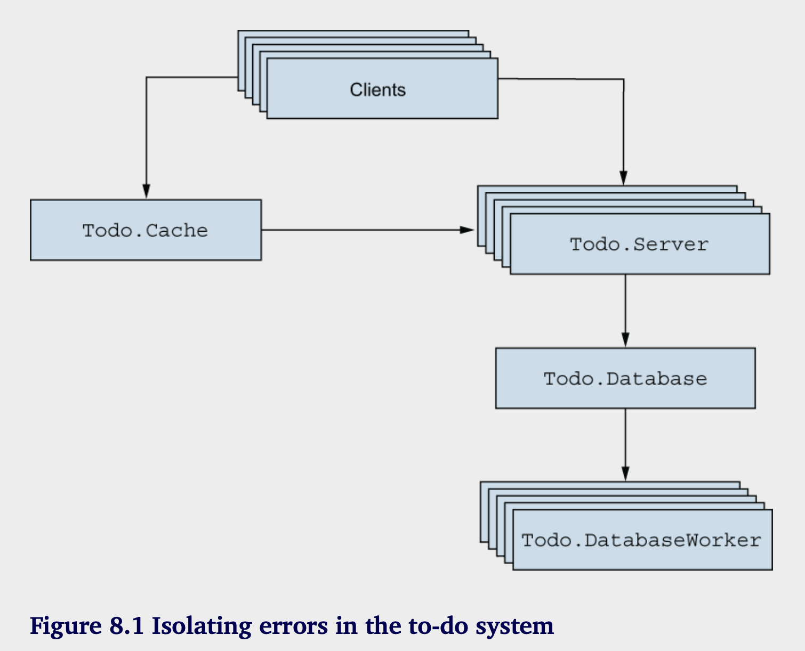
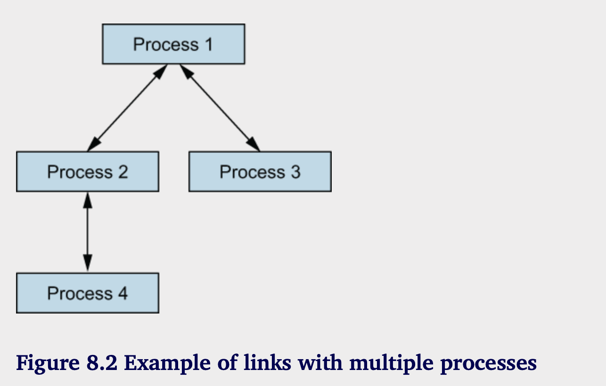
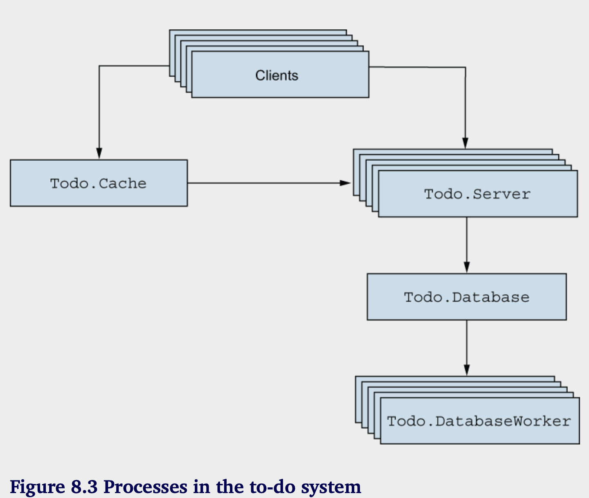
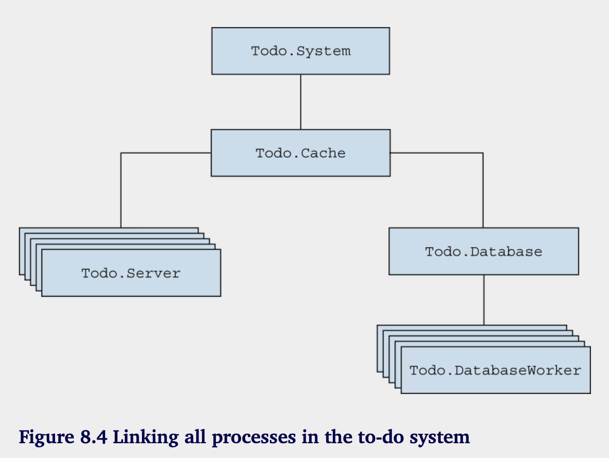

# 容灾基础

**本章涵盖：**

- 运行时错误
- 并发系统的错误
- 监督者

容错是 BEAM 中的一个一流概念。能够开发出即使在运行时遇到错误时仍能正常工作的可靠系统，正是让我们得到了 Erlang 的原因。

容错的目标是承认故障的存在，最小化其影响，并最终在没有人工干预的情况下恢复。在一个足够复杂的系统中，许多事情都可能出错。偶尔会出现bug，您依赖的组件可能会失败，您可能会遇到硬件故障。系统可能会过载，无法应对增加的请求率。最后，如果系统是分布式的，您可能会遇到额外的问题，例如远程机器变得不可用，可能是由于崩溃或网络链接断开。

很难预测所有可能出错的事情，因此面对任何事情都可能失败的严酷现实是更好的选择。无论系统的哪个部分发生故障，都不应该导致整个系统崩溃；您希望能够至少提供某种服务。例如，如果数据库服务器变得不可访问，您仍然可以从缓存中提供数据。您甚至可以将传入的存储请求排队，稍后再尝试解决这些请求，当数据库连接恢复时。

您还必须检测故障并尝试从中恢复。在之前的例子中，系统可能会尝试重新连接到数据库，直到成功为止，然后恢复提供全面服务。

这些是一个具有弹性和自愈能力系统的特性。无论发生什么问题（请记住，任何事情都有可能出错），系统应该尽可能地保持提供服务，并尽快完全恢复。

这种思维方式显著改变了对错误处理的看法。你的优先事项不再是强迫减少错误的数量，而是最小化错误的影响并自动恢复。在一个必须持续运行的系统中，遇到多个孤立的错误总比遇到一个会导致整个系统崩溃的错误要好。

令人有些惊讶的是，错误处理的核心工具是并发。在BEAM世界中，两个并发进程是完全分开的；它们没有共享内存，一个进程中的崩溃默认情况下不会影响另一个进程的执行流程。进程隔离使你能够将错误的负面影响限制在单个进程或一小组相关进程中，从而使大部分系统正常运行。

当然，当一个进程崩溃时，你通常希望能检测到这种状态并采取相应措施。在本章中，你将学习在并发系统中检测和处理错误的基本技术。然后，在第9章中，你将扩展这些知识，并实现细粒度的错误隔离。让我们先从运行时错误的理论开始。

## 8.1 运行时错误

在前面的章节中，我大致提到，在各种情况下会引发错误。一个最常见的例子是模式匹配失败。如果匹配失败，则会引发错误。另一个例子是同步的 GenServer.call。如果响应消息在给定的时间间隔内（默认5秒）没有到达，则会发生运行时错误。还有许多其他例子，如无效的算术操作（例如，除以零）、调用不存在的函数以及显式错误信号。

当发生运行时错误时，执行控制会向上转移到调用栈中的错误处理代码。如果你没有指定这样的代码，发生错误的进程将被终止。默认情况下，所有其他进程不受影响地继续运行。

### 8.1.1 错误类型

BEAM区分三种类型的运行时错误：`errors`,`exits`,`throws`，下面是一些例子：

```elixir
iex(1)> 1/0                                         
** (ArithmeticError) bad argument in arithmetic expression
 
iex(1)> Module.nonexistent_function()               
** (UndefinedFunctionError) function Module.nonexistent_function/0 is
   undefined or private
 
iex(1)> List.first({1,2,3})                         
** (FunctionClauseError) no function clause matching in List.first/2
```

您也可以使用`raise/1`来跑出错误，传递错误信息字符串：

```elixir
iex(1)> raise("something went wrong")
** (RuntimeError) something went wrong
```

如果你的函数显式地抛出错误，你应该在函数名后面添加 ! 字符。这是 Elixir 标准库中使用的一个约定。例如，File.open! 如果文件无法打开，则会抛出错误。

```elixir
iex(1)> File.open!("nonexistent_file")
** (File.Error) could not open non_existing_file: no such file or directory
```

相反，File.open（注意没有感叹号！）只是返回文件无法打开的信息：

```elixir
iex(1)> File.open("nonexistent_file")
{:error, :enoent}
```

请注意，这段代码没有运行时错误。File.open 返回一个结果，调用者可以以某种方式处理它。另一种运行时错误是退出，用于故意终止一个进程。要退出当前进程，可以调用 exit/1，并提供退出原因：

```elixir
iex(2)> spawn(fn ->
          exit("I'm done")   
          IO.puts("This doesn't happen")
        end)
```

退出原因是一个任意的术语，用来描述你为什么终止该进程。正如你稍后会看到的，其他一些进程能够检测到进程崩溃并获取这个退出原因。最后一种运行时错误类型是抛出。要抛出一个错误，你可以调用 throw/1:

```elixir
iex(3)> throw(:thrown_value)
** (throw) :thrown_value
```

throws的目的在于实现非本地返回。如你在第三和第四章中看到的，Elixir程序组织成多个嵌套的函数调用。特别地，循环是通过递归来实现的。其结果是，没有像break、continue和return这样的构造，这些构造在你可能见过的其他语言中是常见的。当你在一个深层循环中时，停止循环并返回一个值并不是一件简单的事情；throws可以帮助你实现这一点。你可以抛出一个值并在调用栈中捕获它。但是，使用throws进行控制流是一种hacky的做法，有点类似于goto，因此你应该尽量避免使用这种技术。

### 8.1.2 处理错误

当然，可以拦截任何类型的运行时错误（错误、退出或抛出）并对此做出处理。主要的工具是try表达式。以下是如何运行一些代码并捕获错误的示例：

```elixir
try do
  ...
catch error_type, error_value ->
  ...
end
```

这与您可能在其他语言中看到的工作方式非常相似。在 do 块中的代码被执行，如果发生错误，执行将转移到 catch 块。

请注意，catch 中指定了两件事。error_type 将包含一个原子值 :error、:exit 或 :throw，指示发生的错误类型。error_value 将包含特定于错误的信息，例如被抛出的值或被引发的错误。让我们通过编写一个辅助的 lambda 来稍作实践，以便更轻松地实验错误：

```elixir
iex(1)> try_helper = fn fun ->
          try do
            fun.()
            IO.puts("No error.")
 
          catch type, value ->
            IO.puts("""
              Error
                #{inspect(type)}
                #{inspect(value)}
              """)
          end
        end
```

这个辅助 lambda 将一个函数作为参数，尝试调用这个函数，并报告错误类型及相应的值。由于输出跨越多个行，因此使用了 heredoc 语法（”””），该语法在第二章中简要提到过。

我们来尝试一下：

```elixir
iex(2)> try_helper.(fn -> raise("Something went wrong") end)
Error
  :error                                            
  %RuntimeError{message: "Something went wrong"}    
```

注意字符串消息是如何被封装在 RuntimeError 结构中的。这是一个特定于 Elixir 的装饰，由 raise/1 宏内部完成。如果你想引发一个简单的、未装饰的错误，可以使用 Erlang 的 :erlang.error/1，并提供一个任意的术语。结果的错误值将是你提出的术语。如果你试图抛出一个值，你将得到一个不同的错误类型：

```elixir
iex(3)> try_helper.(fn -> throw("Thrown value") end)
Error
  :throw
  "Thrown value"
```

调用 exit/1 会产生不同类型的错误：

```elixir
iex(4)> try_helper.(fn -> exit("I'm done") end)
Error
  :exit
  "I'm done"
```

请记住，在 Elixir 中，一切都是有返回值的表达式。在 try 中，返回值是最后执行的表达式的结果——要么来自 do 块，要么（如果引发了错误）来自 catch 块：

```elixir
iex(5)> result =
          try do
            throw("Thrown value")
          catch type, value -> {type, value}
          end
 
iex(6)> result
{:throw, "Thrown value"}
```

还值得注意的是，catch 块中指定的类型和值是模式。如果你想处理特定类型的错误，可以通过提供相应的模式来实现。例如，假设你想从深度嵌套的循环中立即返回一个值。你可以调用以下代码：

```elixir
throw({:resutl, some_result})
```

然后，在调用栈的某个地方，你会处理这个抛出的值：

```elixir
try do
  ...
catch
  :throw, {:result, x} -> x
end
```

在这个例子中，你仅匹配特定的运行时错误：格式为 {:result, x} 的 throw。如果抛出了其他任何内容，你将无法捕获它，错误将进一步传播到调用栈上方。如果错误未被处理，进程将终止。由于 catch 是一个模式匹配，可以像在 case 和 receive 表达式中看到的那样指定多个条款：

```elixir
try do
  ...
 
catch
  type_pattern_1, error_value_1 ->
    ...
 
  type_pattern_2, error_value_2 ->
    ...
 
  ...
end
```

匹配到抛出错误的第一个模式下的代码块会被调用，并返回最后一个表达式的结果。如果你想捕获任何错误，可以使用类型、值的模式，或者如果你不关心值，可以使用 _，_。这些模式将处理所有可能发生的错误。

可以指定在 try 块之后始终执行的代码，无论是否发生错误。

```elixir
iex(7)> try do
          raise("Something went wrong")
        catch
          _,_ -> IO.puts("Error caught")
        after
          IO.puts("Cleanup code")    
        end
 
Error caught
Cleanup code
```

因为它总是被执行，after 块对于清理资源非常有用，比如关闭一个打开的文件。值得注意的是，after 子句不会影响整个 try 表达式的结果。try 的结果是最后一个表达式的结果，可能来自 do 块，也可能来自捕获到的异常对应的 catch 块。

---
**try and tail calls**

你可能还记得在第三章中提到的尾调用优化。如果一个函数的最后一件事是调用另一个函数（或它自身），那么会发生简单的跳转而不需要压栈。如果函数调用位于一个 try 表达式中，这种优化是不可能的。这是相当明显的，因为函数的最后一件事是一个 try 块，而它在 do 或 catch 块完成之前不会结束。因此，try 中调用的任何内容都不是函数的最后一件事，因此不适合进行尾调用优化。

---

这里有关于运行时错误的更多内容。Elixir在这个基本机制之上提供了一些抽象。你可以通过使用 defexception 宏定义自定义错误（请参见 https://hexdocs.pm/elixir/Kernel.xhtml#defexception/1），并以稍微优雅的方式处理它们。try 特殊形式还有一些我们未曾讨论的其他功能。你一定要研究一下官方的 try 文档（https://hexdocs.pm/elixir/Kernel.SpecialForms.xhtml#try/1），以及相应的“入门”部分（https://elixir-lang.org/getting-started/try-catch-and-rescue.xhtml）。

我在这里介绍的是运行时错误的核心概念。所有Elixir支持的其他扩展最终归结于这些概念，并具有相同的属性：

- 一个运行时错误具有一个类型，可以是 :error、:exit 或 :throw。

- 运行时错误还具有一个值，可以是任何任意术语。

- 如果未处理运行时错误，相应的进程将会终止。

与C++、C#、Java和JavaScript等语言相比，捕获运行时错误的需求要小得多。更常见的习惯是让进程崩溃，然后采取措施解决这个问题（通常是重启进程）。这种方法可能看起来有些hacky，但背后有其道理。在复杂系统中，大多数错误在测试阶段就会被发现。剩下的错误主要属于所谓的海森堡错误（Heisenbug）类别——在特殊情况下不规则地出现的不可预知的错误，并且难以重现。此类错误的原因通常在于状态的损坏。因此，合理的补救方法是让进程崩溃并启动另一个进程。

这可能会有所帮助，因为你正在摆脱进程状态（可能已损坏），并从一个干净的状态开始。在许多情况下，这样做可以解决即刻的问题。当然，这个错误应该被记录下来，以便你可以稍后进行分析并找出根本原因。但在此期间，你可以从意外故障中恢复并继续提供服务。如果这个讨论看起来有些模糊，也不用担心。这种错误处理的方法，也被称为让它崩溃，将在本章及下一章中详细解释。在接下来的部分中，我们将研究并发系统中的错误处理基础知识。

## 8.2 并发系统中的错误

并发在构建容错的 BEAM 系统中扮演着核心角色。这是因为各个进程之间完全隔离且独立。一个进程的崩溃不会影响其他进程（除非你明确希望如此）。

下面是一个快速演示：

```elixir
iex(1)> spawn(fn ->                       
          spawn(fn ->                     
            Process.sleep(1000)
            IO.puts("Process 2 finished")
          end)
 
          raise("Something went wrong") 
        end)
```
/*************  ✨ Smart Paste 📚  *************/
docker exec -it ollama ollama run llama3
/******  5dd04d67-8a27-497a-bcdc-7d252c86eed5  *******/****
运行这个会产生以下输出：

```elixir
17:36:20.546 [error] Process #PID<0.116.0> raised an exception   
...
Process 2 finished     
```

正如您所见，尽管进程1崩溃了，进程2的执行仍在进行。关于进程1崩溃的信息已经打印到屏幕上，但系统的其余部分——包括进程2和iex shell提示——都正常运行。

此外，由于进程之间不共享内存，一个进程的崩溃不会留下可能会损坏另一个进程的内存垃圾。因此，通过在不同进程中运行独立操作，您自动确保了隔离和保护。

您在本书的示例待办事项系统中已经受益于进程隔离。回想一下当前的架构，如图8.1所示。

所有图中的框都是BEAM进程。单个待办事项服务器的崩溃不会影响其他待办事项列表的操作。Todo.Database的崩溃不会阻止在待办事项服务器进程中进行的缓存读取。
当然，这种隔离本身并不足够。如图8.1所示，进程之间通常会相互通信。如果一个进程没有运行，它的客户端就无法使用它的服务。例如，如果数据库进程崩溃，待办事项服务器就无法查询它。更糟糕的是，对待办事项列表的修改将无法持久化。显然，这种行为是不可取的，你必须有一种方法来检测进程崩溃，并以某种方式恢复它。

### 8.2.1 关联进程

A basic primitive for detecting a process crash is the concept of links. If two processes are linked, and one of them terminates, the other process receives an exit signal—a notification that a process has crashed. 


一个退出信号包含崩溃进程的 PID 和退出原因——一个任意的 Elixir 术语，描述了进程终止的原因。在正常终止的情况下（即启动的函数已完成），退出原因是原子 :normal。默认情况下，当一个进程收到来自另一个进程的退出信号且该信号不是 :normal 时，链接的进程也会终止。换句话说，当一个进程异常终止时，链接的进程也会被关闭。

一个链接恰好连接两个进程，并且始终是双向的。要创建一个链接，可以使用 Process.link/1，将当前进程与另一个进程连接起来。更常见的是，当你启动一个进程时，会创建一个链接。你可以使用 spawn_link/1 来实现，这会生成一个进程并将其链接到当前进程。

让我们验证一下。在下面的示例中，你将再次生成两个进程，这次将它们链接在一起。然后你可以关闭一个进程：

```elixir
iex(1)> spawn(fn ->
          spawn_link(fn ->       
            Process.sleep(1000)
            IO.puts("Process 2 finished")
          end)
 
          raise("Something went wrong")
        end)
```

毫无意外，改例子的输入如下：

```elixir
17:36:20.546 [error] Process #PID<0.116.0> raised an exception
```

请注意，您看不到进程 2 的输出。这是因为进程 1 异常终止，导致向进程 2 发出了退出信号。一个进程可以链接到任意数量的其他进程，您可以在系统中创建任意多个链接，如图 8.2 所示。



这说明了过程链接的传递性质。在这个结构中，单个过程的崩溃会向所有与之链接的过程发出退出信号。如果默认行为没有被覆盖，这些过程也会崩溃。最终，整个链接过程的树形结构将被摧毁。

**TRAPPING EXITS**

你可能会对链接的后果感到困惑。之前，我解释了进程隔离如何使得隔离运行时错误的影响成为可能。链接打破了这种隔离，并在进程边界上传播错误。你可以把链接看作是用于提供进程终止通知的通信渠道。

通常，你不希望被链接的进程崩溃。相反，你希望能够检测到进程崩溃并采取一些措施。这可以通过捕获退出信号来实现。当一个进程捕获退出时，当被链接的进程崩溃时，它不会被终止。相反，一个退出信号会以标准消息的形式放入当前进程的消息队列中。捕获退出的进程可以接收这个消息并对崩溃做出反应。

要设置退出捕获，你可以调用 `Process.flag(:trap_exit, true)`，这会使当前进程捕获退出信号。让我们看看这如何工作：

```elixir
“iex(1)> spawn(fn ->
          Process.flag(:trap_exit, true)                        
 
          spawn_link(fn -> raise("Something went wrong") end)   
 
          receive do                                            
            msg -> IO.inspect(msg)                              
          end                                                   
        end)
```

这里，您使父进程捕获退出，然后生成一个将崩溃的链接进程。接着您收到一条消息并将其打印到屏幕上。Shell会话产生以下输出：

```elixir
{:EXIT, #PID<0.118.0>,
 {%RuntimeError{message: "Something went wrong"},
  [{:elixir_eval, :__FILE__, 1 [file: ~c”iex”, line: 4]}]}}
```

退出信号消息的一般格式是 `⁠{ :EXIT, from_pid, exit_reason }`，其中 ⁠from_pid 是崩溃进程的进程ID，而 ⁠exit_reason 是描述进程终止原因的任意术语。如果进程由于抛出或错误而终止，则退出原因是形式为 ⁠{ reason, where } 的元组，其中 ⁠where 包含堆栈跟踪信息。否则，如果进程由于退出而终止，原因是提供给 ⁠exit/1 的术语。

### 8.2.2 监视器

像之前提到的那样，链接总是双向的。大多数情况下，这正是你所需要的，但在某些情况下，单向传播进程崩溃的效果更好。有时，你需要以某种方式连接两个进程 A 和 B，使得 A 进程在 B 终止时会得到通知，但反之则不然。在这种情况下，你可以使用监视器，它类似于单向链接。

要监视一个进程，你可以使用 Process.monitor：

```elixir
monitor_ref = Process.monitor(target_pid)
```

这使得当前进程能够监视目标进程。结果是一个唯一的引用，用于标识监视器。单个进程可以创建多个监视器。

如果被监视的进程死亡，您的进程将收到一个格式为 {:DOWN, monitor_ref, :process, from_pid, exit_reason} 的消息。如果您愿意，也可以通过调用 Process.demonitor(monitor_ref) 来停止监视器。

下面是一个简单的例子：

```elixir
iex(1)> target_pid = spawn(fn ->                                
          Process.sleep(1000)                                   
        end)                                                    
 
iex(2)> Process.monitor(target_pid) 
 
iex(3)> receive do                                              
          msg -> IO.inspect(msg)                                
        end                                                     
 
{:DOWN, #Reference<0.1398266903.3291480065.256365>, :process,   
  #PID<0.111.0>, :noproc}                                       
```

 监视器和链接之间有两个主要区别。首先，监视器是单向的——只有创建监视器的进程可以接收通知。此外，与链接不同，观察者进程在被监视的进程终止时不会崩溃。相反，会发送一条消息，你可以选择处理或忽略它。

 ---

 **Exits are propagated through GenServer calls**

当你通过 GenServer.call 发出同步请求时，如果服务器进程崩溃，客户端进程将收到一个退出信号。这是跨进程错误传播的一个简单但非常重要的例子。在内部，GenServer 设置了一个临时监视器来监控服务器进程。当等待服务器的响应时，如果收到 :DOWN 消息，GenServer 可以检测到进程崩溃，并在客户端进程中引发相应的退出信号。

---

Link、exit-trap和monitor使得在并发系统中检测错误成为可能。你可以引入一个进程，负责接收链接和监视通知，以及在系统中其他进程崩溃时采取相应的措施。这种进程被称为监督者，是并发系统中的错误恢复的主要工具。

## 8.3 监督者

监督者是一个通用进程，用于管理系统中其他进程的生命周期。监督者进程可以启动其他进程，这些进程被视为其子进程。通过连接、监控和退出陷阱，监督者可以检测到任何子进程的可能终止，并在需要时重新启动它。

不是监督者的进程称为工作进程。这些进程提供系统的实际服务。您当前的待办事项系统仅由工作进程组成，例如待办事项缓存和待办事项服务器进程。

如果任何工作进程崩溃，可能是由于一个错误，那么系统的某些部分将永远消失。这就是监督者的作用。通过在一个监督者下运行工作进程，你可以确保失败的进程被重新启动，从而恢复系统的服务。

为此，你需要在系统中至少有一个监督进程。在 Elixir 中，您可以使用 Supervisor 模块来实现这一点（https://hexdocs.pm/elixir/Supervisor.xhtml）。通过调用 Supervisor.start_link/2，可以启动监督进程，其工作方式如下：

1. 监督进程捕获退出信号，然后启动子进程。

2. 如果在任何时候子进程终止，监督进程会收到相应的退出消息并执行纠正措施，例如重新启动崩溃的进程。

3. 如果监督进程终止，其子进程也会被终止。

启动监督者有两种不同的方法。在基本方法中，你调用函数 Supervisor.start_link，传递一个描述每个子进程的列表，并附带一些额外的监督选项。或者，你可以传递一个模块，该模块定义一个回调函数，该函数返回这些信息。我们将从基本方法开始，稍后再解释第二种方法。



让我们向待办事项系统引入一个管理者。图8.3概述了系统中的这些进程：

- Todo.Server—允许多个客户端在同一个待办列表上工作

- Todo.Cache—维护一组待办服务器，并负责它们的创建和发现

- Todo.DatabaseWorker—对数据库执行读写操作

- Todo.Database—管理数据库工作者的池并将数据库请求转发给它们

待办事项缓存进程是系统的入口点。当您启动缓存时，所有所需的进程都会启动，因此可以将缓存视为系统的根。现在，我们将引入一个新的管理进程，来监督待办事项缓存进程。

### 8.3.1 准备现存代码

在您开始与监督者工作之前，您需要对缓存进行几处更改。首先，您需要注册缓存进程。这将使您能够与该进程交互，而无需知道它的PID。

在启动待办事项缓存进程时，您还需要创建一个链接。如果您希望在监督者下运行该进程，这是必需的。为什么监督者使用链接而不是监视器？因为链接是双向的，因此监督者的终止意味着它的所有子进程将被自动终止。这反过来又允许您在不留下悬挂进程的情况下正确结束系统的任何部分。在本章和下一章中，当您处理更细粒度的监督时，您会了解这一点是如何工作的。

创建指向调用进程的链接就像把 GenServer.start 替换为 GenServer.start_link 那样简单。在此过程中，您还可以将相应的 Todo.Cache 接口函数重命名为 start_link。

最后，您将使 start_link 函数接受一个参数并忽略它。这似乎令人困惑，但它使启动一个受监督的进程变得稍微容易一些。原因将在稍后讨论子规范时解释。更改显示在以下列表中。

```elixir
# Listing 8.1 Changes in the do-do cache (supervised_todo_cache/lib/todo/cache.ex)
demodule Todo.Cache do
  use GenServer

  def start_link(_) do
    GenServer.start_link(__MODULE__, name: __MODULE__)
  end
  
  def server_process(todo_list_name) do
    GenServer.call(__MODULE__, {:server_process, todo_list_name})   
  end

  def init(_) do
    IO.puts("Starting to-do cache.")
  end
end
```

注意，你在 init/1 回调中也调用了 IO.puts/1 进行调试。这条调试表达式包含在所有其他 GenServer 回调模块中（如 Todo.Database、Todo.DatabaseWorker 和 Todo.Server）。

### 8.3.2 启动监督树进程

在这些更改生效后，您可以立即尝试启动监督者进程，并将待处理缓存作为其唯一的子进程。将当前文件夹更改为 supervised_todo_cache，并启动 shell（iex -S mix）。现在，您可以启动监督者：

```elixir
iex(1)> Supervisor.start_link([Todo.Cache], strategy: :one_for_one)   
 
Starting to-do cache.
Starting database server.
Starting database worker.
Starting database worker.
Starting database worker.
```

从控制台输出可以看到，调用 `Supervisor.start_link/2` 导致待办事项缓存启动。缓存进程随后启动了数据库进程。让我们更仔细地看看 `Supervisor.start_link/2` 的调用：

```elixir
Supervisor.start_link(
    [Todo.Cache],
    strategy: one_for_one
)
```

函数名称提示，`Supervisor.start_link/2` 启动一个监督者进程并将其链接到调用者。第一个参数是所需子进程的列表。更具体地说，该列表的每个元素是一个子进程规范，描述了子进程应如何启动和管理。我们稍后会详细讨论子进程规范。在这种简单形式中，提供的子进程规范是一个模块名称。在这种情况下，子进程由 Todo.Cache 模块中的某个回调函数描述。当监督者进程启动时，它将遍历此列表并根据规范启动每个子进程。在这个例子中，监督者将调用 `Todo.Cache.start_link/1`。一旦所有子进程都启动，`Supervisor.start_link/2` 将返回 `{:ok, supervisor_pid}`。

`Supervisor.start_link/2 `的第二个参数是监督者特定选项的列表。`:strategy` 选项，也称为重启策略，是必须的。该选项指定监督者应如何处理其子进程的终止。`one_for_one` 策略表示如果一个子进程终止，应该启动另一个子进程来替代它。还有其他几种策略（例如，“如果一个子进程崩溃，则重启所有子进程”），我们将在第9章中讨论这些策略。

注意 这里“重启”这个术语使用得比较随意。从技术上讲，进程不能被重启。它只能被终止；之后，可以在其位置启动另一个由相同模块驱动的进程。新进程具有不同的 PID，并且与旧进程不共享任何状态。

无论如何，在 `Supervisor.start_link/2` 返回后，系统中所需的所有进程都在运行，您可以与系统进行交互。例如，您可以启动一个待办事项服务器：

```elixir
iex(2)> bobs_list = Todo.Cache.server_process("Bob's list")
Starting to-do server for Bob's list.
```

缓存进程作为监督进程的子进程启动，因此我们称其为被监督的。这意味着如果缓存进程崩溃，它的监督进程会重新启动它。您可以通过引发缓存进程的崩溃来快速验证这一点。首先，您需要获取缓存的PID。如前所述，缓存现在以名称（其自身的模块名称）注册，因此借助`Process.whereis/1`很容易获取它的PID。

```elixir
iex(3)> cache_pid = Process.whereis(Todo.Cache)
#PID<0.155.0>
```

现在，您可以使用 `Process.exit/2` 函数来终止进程，该函数接受一个 PID 和退出原因，然后向给定进程发送相应的退出信号。退出原因可以是任意术语。在这里，您将使用原子 `:kill`，它以特殊的方式处理。退出原因 `:kill` 确保目标进程无条件被终止，即使该进程正在捕获退出信号。让我们看看实际效果：

```elixir
iex(4)> Process.exit(cache_pid, :kill)
Starting to-do cache
```

从输出中可以看出，进程立即重新启动。您还可以证明待办缓存现在是一个具有不同 PID 的进程：

```elixir
iex(5)> Process.whereis(Todo.Cache)
#PID<0.164.0>
```

您可以使用新进程，就像使用旧进程一样。

```elixir
iex(6)> bobs_list = Todo.Cache.server_process("Bob's list")
Starting to-do server for Bob's list.
#PID<0.167.0>
```

这项简要的实验证明了一些基本的容错性能力。实验中发生崩溃后，系统自行修复并恢复了完整的服务。

---

**名称允许进程发现**

重要的是要解释为什么要在本地名称下注册待办事项缓存。您应该始终记住，与进程交互需要其PID。在第7章中，您使用了一种简单的方法，通过创建进程并传递其PID。这在您进入监控者领域之前是没问题的。问题是，受监控的进程可以被重新启动。请记住，重新启动实际上是用一个新的进程替代旧的进程——新进程有不同的PID。这意味着对崩溃进程的PID的任何引用都变得无效，标识了一个不存在的进程。这就是为什么注册名称很重要。它们提供了一种可靠的方法来找到进程并与之交互，而不论进程可能的重启。

---

### 8.3.3 子进程规范


为了管理子进程，监督者需要一些信息，例如以下问题的答案：

- 应该如何启动子进程？
- 如果子进程终止，应该怎么办？
- 应该使用什么术语来唯一标识每个子进程？

这些信息统称为子规范。回想一下，当调用 `Supervisor.start_link/2` 时，您发送了一份子规范的列表。在其基本形状中，规范是一个包含几个字段的映射，用于配置子进程的属性。
例如，待办事项缓存的规范可能如下所示：

```elixir
%{
  id: Todo.Cache,
  start: {Todo.Cache, :start_link, [nil]}
}
```

`:id`字段是一个任意术语，用于区分这个子进程与同一监督者下的其他子进程。

`:start`字段是一个三元组，形状为`{module, start_function, list_of_arguments}`。在启动子进程时，通用监督者代码将使用`apply(module, start_function, list_of_arguments)`来调用由此元组描述的函数。被调用的函数必须启动并连接该进程。
你可以省略一些其他字段的规范，在这种情况下，将选择一些合理的默认值。我们将在第9章中讨论其中的一些。你还可以参考官方文档https://hexdocs.pm/elixir/Supervisor.xhtml#module-child-specification以获取更多细节。

无论如何，你可以将规范映射直接传递给`Supervisor.start_link`。以下是一个示例：

```elixir 
Supervisor.start_link(
  [
    %{
      id: Todo.Cache,
      start: {Todo.Cache, :start_link, [nil]}
    }
  ],
  strategy: :one_for_one
)
```

这将指示监督者调用 `Todo.Cache.start_link(nil)` 来启动子进程。请记住，你已经将 `Todo.Cache.start_link` 更改为只接受一个参数（该参数被忽略），所以你需要传递某个值（在这个例子中是nil）。

这种方法的一个问题是容易出错。如果缓存的实现发生变化，例如启动函数的签名，你需要记住修改启动监督者代码中的规范。

为了解决这个问题，监督者允许你在子进程规范列表中传递一个元组 `{module_name, arg}`。在这种情况下，监督者将首先调用 `module_name.child_spec(arg)` 来获取实际的规范。此函数必须返回规范映射。然后，监督者根据返回的规范启动子进程。

虽然你没有自己编写，但 `Todo.Cache` 模块已经定义了 `child_spec/1`。默认实现是通过使用 `GenServer` 注入的。因此，你也可以以以下方式启动监督者：

```elixir
Supervisor.start_link(
  [{Todo.Cache, nil}],
  strategy: :one_for_one
)
```

因此，`Supervisor` 将调用 `Todo.Cache.child_spec(nil)` 并根据返回的规范启动子进程。验证 `child_spec/1` 注入实现返回的内容很简单：

```elixir
iex(1)> Todo.Cache.child_spec(nil)
%{
  id: Todo.Cache,
  start: {Todo.Cache, :start_link, [nil]}
}
```

换句话说，生成的 `child_spec/1` 返回一个规范，该规范调用模块的 `start_link/1` 函数，并传入传递给 `child_spec/1` 的参数。这正是您让 `Todo.Cache.start_link` 接受一个参数的原因，尽管该参数被忽略了

```elixir
defmodule Todo.Cache do
  use GenServer         # 生成 默认的 `child_spec/1`

  def start_link(_) do  # 符合默认的 `child_spec/1`
    ...
  end

  ...
end 
```

这样做，你使 `Todo.Cache` 与生成的 `child_spec/1` 兼容，这意味着你可以在子进程列表中包含 `Todo.Cache`，而不需要进行任何额外的工作。

如果你不喜欢这种方法，你可以使用 GenServer 提供的一些选项来调整生成的 child_spec/1 的输出。有关更多详细信息，请参阅官方文档（https://hexdocs.pm/elixir/GenServer.xhtml#module-how-to-supervise）。如果你需要更多的控制，你可以简单地自己定义 `child_spec/1`，这将覆盖默认的实现。

最后，如果你不关心传递给 `child_spec/1` 的参数，你可以在子进程规范列表中只包含模块名。在这种情况下，`Supervisor` 将传递空列表 `[]` 到 `child_spec/1`。因此，你也可以使用以下方式启动 `Todo.Cache`：

```elixir
Supervisor.start_link(
  [Todo.Cache],
  strategy: :one_for_one
)
```

在继续之前，让我们回顾一下监督者启动的过程。当你调用 `Supervisor.start_link(child_specs, options)` 时，会发生以下情况：

1. 一个新的进程被启动，受 `Supervisor` 模块的支持。
2. 监督者进程遍历子进程规范的列表，并逐个启动每个子进程。
3. 如果需要，`child_spec/1` 函数将被调用，以解析子进程规范。
4. 监督者根据子进程规范的 `:start` 字段启动子进程。

### 8.3.4 包装监督者

到目前为止，您已经在 shell 中与监督者进行了交互。但是，在现实生活中，您将希望在代码中使用 Supervisor。与 GenServer 一样，建议将 Supervisor 封装在一个模块中。

下面的列表实现了您的第一个监督者的模块：

```elixir
defmodule Todo.System do
  def start_link() do
    Supervisor.start_link(
      [Todo.Cache],
      strategy: :one_for_one
    )
    end
  end
```

通过这个简单的添加，启动整个系统变得容易了。

```elixir
iex -S mix

iex(1)> Todo.System.start_link()
 
Starting to-do cache.
Starting database server.
Starting database worker.
Starting database worker.
Starting database worker.
```

`Todo.System`这个名称是为了描述模块的目的。通过调用`Todo.System.start_link()`，您可以启动整个待办事项系统，包括缓存和数据库等所有必需的服务。

### 8.3.5 使用回调模块

启动一个监督者的另一种方式是提供一个回调模块。这与 GenServer 的工作方式类似。你需要开发一个模块，该模块必须实现 `init/1` 函数。这个函数必须返回子规格的列表以及额外的监督者选项，如其策略。

以下是如何重写`Todo.System`以使用这种方法：

```elixir
defmodule Todo.System do
  use Supervisor

  def start_link() do
    Supervisor.start_link(__MODULE__, nil)
  end

  def init(_) do
    Supervisor.init(
      [Todo.Cache],
      strategy: :one_for_one
    )
  end
end
```
 
与 `GenServer` 一样，你需要使用 `Supervisor` 来为你的模块获取一些常见的模板代码。

关键部分发生在你调用 `Supervisor.start_link/2` 时。你现在传递的是回调模块，而不是子进程规格的列表。在这种情况下，监督进程将调用 `init/1` 函数来提供监督者规格。传递给 `init/1` 的参数是你传递给 `Supervisor.start_link/2` 的第二个参数。最后，在 `init/1` 中，你借助 `Supervisor.init/2` 函数描述监督者，并传递子进程列表和监督者选项。

上述代码是 `Supervisor.start_link([Todo.Cache], strategy: :one_for_one)` 的更复杂等效项。显然，你需要更多的代码行才能实现相同的效果。好处是，这种方法给你更多的控制权。例如，如果你需要在启动子进程之前执行一些额外的初始化工作，你可以在 `init/1 `中完成。此外，回调模块在热代码重载方面更加灵活，允许你修改子进程列表而无需重启整个监督者。

在大多数情况下，直接传递子规范列表的简单方法就足够了。此外，正如你在前面的示例中看到的，如果将 Supervisor 的使用封装在一个专门的模块中，切换不同的方法也很容易。因此，在本书中，你将专门使用没有回调模块的简单方法。

### 8.3.6 链接所有进程

在这个阶段，你正在监督待办事项缓存进程，因此你获得了一些基本的容错能力。如果缓存进程崩溃，会启动一个新的进程，系统可以重新开始提供服务。

然而，你当前实现中存在一个问题。当监督者重新启动待办事项缓存时，你将得到一个完全独立的进程层次结构，并且会有一组新的待办事项服务器进程与之前的进程毫无关系。之前的待办事项服务器将成为未使用的垃圾，仍在运行并消耗内存和 CPU 资源。

让我们来演示这个问题。首先，启动系统并请求一个待办事项服务器：

```elixir
iex(1)> Todo.System.start_link()
 
iex(2)> Todo.Cache.server_process("Bob's list")
Starting to-do server for Bob's list.
#PID<0.159.0>
```

在后续请求中，没有启动缓存的待办服务器:

```elixir
iex(3)> Todo.Cache.server_process("Bob's list")
#PID<0.159.0>
``` 

检查进程数量：

```elixir
iex(4)> length(Process.list())
71
```

现在，关闭to-do cache:

```elixir
iex(5)> Process.exit(Process.whereis(Todo.Cache), :kill)
Starting to-do cache
```

最后，请求创建一个bob的待办事项服务器：

```elixir
iex(6)> Todo.Cache.server_process("Bob's list")
Starting to-do server for Bob's list.
#PID<0.165.0>
```

如你所见，在你重启待办缓存之后，提取先前获取的服务器会创建一个新的进程。这并不奇怪，因为你杀掉了之前的缓存进程，这也销毁了进程状态。

当一个进程终止时，它的状态会被释放，而新进程将以全新的状态开始。如果你想保留状态，必须自己处理；我们将在第九章讨论这个问题。
在缓存进程重启后，你会有一个完全新的进程，它对先前缓存的内容一无所知。同时，你的旧缓存结构（待办服务器）并没有被清理。你可以通过重新检查运行中的进程数量来看到这一点:

```elixir
iex(7)> length(Process.list())
72
```

你有一个额外的进程，即之前启动的Bob的待办事项服务器。这显然不好。终止一个待办事项缓存会销毁它的状态，因此你还应该关闭所有现有的待办事项服务器。这样，你可以确保进程正确终止。

为此，你必须在进程之间建立链接。每个待办事项服务器必须与缓存连接。此外，你还需要将数据库服务器链接到待办事项缓存，以及将数据库工作者链接到数据库服务器。这将有效确保整个结构是相互连接的，如图8.4所示



通过连接一组相互依赖的进程，您可以确保一个进程的崩溃也会导致其依赖的进程崩溃。不论哪个进程崩溃，链接都确保整个结构被终止。这将导致缓存进程的终止，监控者会注意到这一点，并启动一个新系统。

通过这种方式，您可以检测到系统中任何部分的错误，并在不留下悬空进程的情况下进行恢复。不过，缺点是您允许错误产生广泛的影响。单个数据库工作进程或待办事项服务器的错误会导致整个结构崩溃。这远非完美，您将在第9章进行改进。

目前，让我们坚持使用这种简单的方法，并实现所需的代码。在您当前的系统中，您有一个待办事项监控者，它启动并监视缓存。您必须确保缓存与所有其他工作进程直接或间接链接。

这个更改很简单。您只需将项目中所有进程的 ⁠start 改为 ⁠start_link。在对应的模块中，您目前有类似这样的内容：

```elixir
def start(...) do
  GenServer.start(...)
end
```

这段代码必须转换为以下内容：

```elixir
def start_link(...) do
  GenServer.start_link(...)
end
``` 

当然，每个 `module.start` 的调用都必须替换为 `module.start_link`。这些更改是机械性的，代码在此不展示。完整的解决方案位于 `todo_links` 文件夹中。

让我们来看看新系统是如何工作的：

```elixir
iex(1)> Todo.System.start_link()
 
iex(2)> Todo.Cache.server_process("Bob's list")
Starting to-do server for Bob's list.
 
iex(3)> length(Process.list())
71
 
iex(4)> Process.exit(Process.whereis(Todo.Cache), :kill)     
 
iex(5)> bobs_list = Todo.Cache.server_process("Bob's list")
Starting to-do server for Bob's list.
 
iex(6)> length(Process.list())
71                                                           
```

当你崩溃一个进程时，整个结构会被终止，并且会在其位置上启动一个新进程。链接确保任何依赖的进程也会被终止，从而保持系统的一致性。

### 8.3.7 重启频度

重要的是要记住，Supervisor 不会无限次重启子进程。Supervisor 依赖于最大重启频率，该频率定义了在给定时间段内允许多少次重启。默认情况下，最大重启频率是 5 秒内 3 次重启。您可以通过将 `:max_restarts` 和 `:max_seconds` 选项传递给 `Supervisor.start_link/2` 来更改这些参数。如果超过了这个频率，Supervisor 将放弃重启，并与其所有子进程一起终止。

让我们在 shell 中验证一下。首先，启动 Supervisor：

```elixir
iex(1)> Todo.System.start_link()
Starting the to-do cache.
```

您现在需要频繁重启待办事项缓存进程。

```elixir
for _ <- 1..4 do
  Process.exit(Process.whereis(Todo.Cache), :kill)
  Process.sleep(500)
end
```

在这里，你终止缓存进程并短暂休眠，允许监控程序重新启动该进程。这一过程需要进行四次，这意味着在最后一次迭代中，你会超过默认的最大重启频率（在5秒内重启三次）。

以下是输出内容：

```elixir
Starting the to-do cache.                 # 重复三次
Starting database server.                
...                                       
 
** (EXIT from #PID<0.149.0>) :shutdown    # 缓存进程崩溃
```

在超过最大重启频率后，监控器放弃了并终止了进程，同时也终止了子进程。

你可能会想知道这个机制的原因。当系统中的一个关键进程崩溃时，它的监控器会尝试通过启动一个新进程来重新将其上线。如果这没有帮助，那么无限重启就没有意义。如果在给定时间间隔内发生了太多次重启，很明显这个问题无法解决。在这种情况下，监控器能做的最明智的事情就是放弃并终止自己，这样也会终止它的所有子进程。

这个机制在所谓的监控树中发挥着重要作用，其中监控器和工作者以更深的层次结构组织，这使你能够控制系统如何从错误中恢复。在下一章中将对此进行详细解释，你将构建一个细粒度的监控树。

---

**总结**

- 运行时错误有三种类型：抛出错误、错误和退出。

- 当发生运行时错误时，执行会回溯到相应的尝试块。如果错误没有被处理，进程将崩溃。

- 另一个进程可以检测到进程终止。为此，您可以使用链接或监视器。

- 链接是双向的——任何一个进程的崩溃都会传播到另一个进程。

- 默认情况下，当进程异常终止时，所有与之链接的进程也会终止。通过捕获退出，您可以对链接进程的崩溃作出反应并采取措施。

- 监控进程是管理其他进程生命周期的进程。它可以启动、监控和重启崩溃的进程。

- Supervisor模块用于启动监控进程并与其进行交互。

- 监控进程由子进程规范列表和监督策略定义。您可以将这些作为参数提供给Supervisor.start_link/2，或者您可以实现一个回调模块。