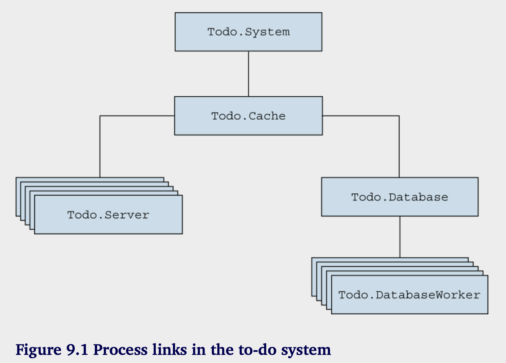
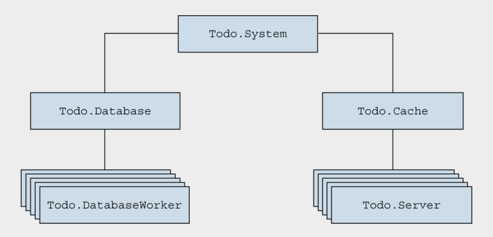
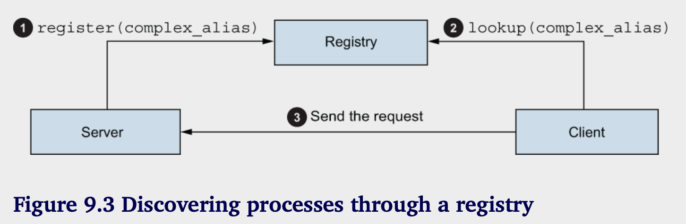
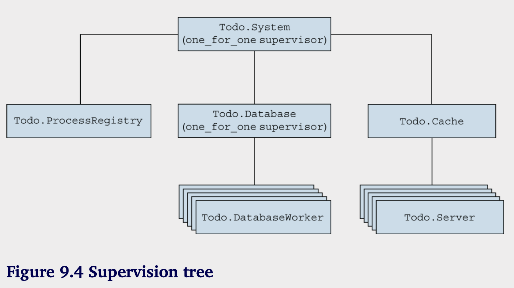
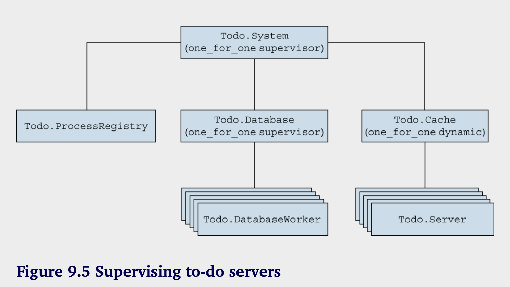

# 隔离错误影响

**本章涵盖：**

- 理解监管树
- 动态启动workers
- “让他崩溃”

在第八章中，你学习了基于监视器概念的并发系统中错误处理的基本理论。这个理念是有一个进程，它的唯一工作就是监督其他进程，并在它们崩溃时重启它们。这为你处理系统中各种意外错误提供了一种方法。无论工作进程中发生了什么错误，你可以确信监视器会检测到错误并重启工作进程。

除了提供基本的错误检测和恢复，监视器在隔离错误影响方面也发挥着重要作用。通过将单个工作进程直接置于监视器之下，你可以将错误的影响限制在一个工作进程内。这有一个重要的好处：它使你的系统对客户端更可用。无论你多么努力地尝试避免意外错误，它们总会发生。隔离这些错误的影响使系统的其他部分能够继续运行并提供服务，同时你可以从错误中恢复过来。

例如，在本书示例的待办事项系统中，数据库错误不应阻止缓存的工作。当你努力从数据库部分出现的问题中恢复时，应该继续提供现有缓存数据，从而至少提供部分服务。更进一步，一个单独的数据库工作进程中的错误不应影响其他数据库操作。最终，如果你能够将错误的影响限制在系统的小部分内，你的系统可以随时提供大部分服务。

隔离错误并最小化其负面影响是本章的主题。主要思想是让每个工作进程在监视器之下运行，这使得能够单独重启每个工作进程。你将在下一部分看到这如何运作，届时你将开始构建一个细粒度的监督树。

### 9.1 监督树

在这一部分，我们将讨论如何降低错误对整个系统的影响。基本工具包括进程、链接和监督，整体方法相对简单。您必须始终考虑如果一个过程因错误崩溃，整个系统会发生什么，并在错误的影响过大（即错误影响了太多过程）时采取纠正措施。

### 9.1.1 拆分依赖不强的部分

让我们看看错误是如何在待办事项系统中传播的。过程之间的链接如图9.1所示。



正如您在图中所见，整个结构是相互连接的。无论哪个进程崩溃，退出信号都会传递给其关联的进程。最终，待办事项缓存进程也将崩溃，这将被 Todo.System 发现，系统将重新启动缓存进程。

这是一个正确的错误处理方法，因为您重新启动系统，不会留下任何悬挂的进程。但是，这种恢复方法过于粗糙。无论错误发生在哪里，整个系统都将被重启。在数据库错误的情况下，整个待办事项缓存将被终止。类似地，一个待办事项服务器进程的错误将使所有数据库工作进程崩溃。

这种粗粒度的错误恢复是由于您在其他工作进程中启动工作进程。例如，数据库服务器是从待办事项缓存中启动的。为了减少错误的影响，您需要从主管中启动每个独立的工作进程。这种方案使主管能够单独监管和重启每个工作进程。

现在，我们来看如何做到这一点。首先，您要将数据库服务器移动，以便它直接从主管启动。这将使您能够将数据库错误与缓存中发生的错误隔离。

将数据库服务器置于监督之下是相对简单的。您必须从 Todo.Cache.init/1 中移除对 Todo.Database.start_link 的调用。然后，在调用 Supervisor.start_link/2 时，您必须添加另一个子规范。

```elixir
# Listing 9.1 Supervising database version (supervise_database/lib/todo/system.ex)

defmodule Todo.System do
  def start_link() do
    Supervisor.start_link(
      [Todo.Cache, Todo.Database],
      strategy: :one_for_one
    )
    end
end
```

还有一个小改动需要完成。就像你对 Todo.Cache 所做的那样，您需要调整 Todo.Database.start_link，使其只接受一个参数并忽略它。这将使我们能够依赖自动生成的 Todo.Database.child_spec/1，该函数是通过使用 GenServer 获得的。

```elixir
# Listing 9.2 Adapting start_link  (supervise_database/lib/todo/database .ex)

defmodule Todo.Database do
  ...

  def start_link(_) do
    ...
  end  
  ...
end    
```

这些更改确保缓存和数据库是分开的，如图9.2所示。在主管下运行数据库和缓存进程使得能够单独重启每个工作者。如果数据库工作者发生错误将导致整个数据库结构崩溃，但缓存将保持不受影响。这意味着所有从缓存中读取的客户端在数据库部分重启时都能够得到它们的结果。



让我们验证一下。请进入 `supervise_database` 文件夹，并启动 shell（iex -S mix）。然后，启动系统：

```elixir
iex(1)> Todo.System.start_link()
 
Starting database server.
Starting database worker.
Starting database worker.
Starting database worker.
Starting to-do cache.
```

现在，杀掉数据库服务器：

```elixir
iex(2)> Process.exit(Process.whereis(Todo.Database), :kill)
 
Starting database server.
Starting database worker.
Starting database worker.
Starting database worker.
```

根据输出，你可以看到只有与数据库相关的进程被重启。如果你终止待办事项缓存，情况也是如此。通过将这两个进程放在一个监控器下，可以将错误的负面影响局限于局部。缓存错误不会影响数据库部分，反之亦然。

回顾第八章关于进程隔离的讨论。因为每个部分是在不同的进程中实现的，所以数据库服务器和待办事项缓存是相互隔离的，不会相互影响。当然，这些进程通过监控器间接连接，但监控器捕获退出信号，从而防止进一步传播。这是特定于一对一（one_for_one）监控器的一个特性：它将错误的影响限制在单个工作进程上，并仅对该进程采取纠正措施（重启）。

在这个示例中，监控器启动了两个子进程。重要的是要意识到，子进程是同步启动的，按照指定的顺序进行。监控器启动一个子进程，等待它完成，然后再继续启动下一个子进程。当工作进程是GenServer时，只有在当前子进程的init/1回调函数完成后，下一个子进程才会被启动。

你可能还记得第七章中提到的 init/1 不应该运行太长时间。这正是原因。如果 Todo.Database 启动需要，例如说，5 分钟，那么在这段时间内，你将无法使用待办事项缓存。请始终确保你的 init/1 函数运行快速，并在需要更复杂的初始化时使用第七章中提到的技术（通过 handle_continue/2 回调进行后续初始化）。

### 9.1.2 丰富的进程发现

尽管你现在在基本的错误隔离方面有了一些进展，但仍然有很多需要改进的地方。在一个数据库工作线程中出现错误会导致整个数据库结构崩溃，并终止所有正在运行的数据库操作。理想情况下，你希望将数据库错误限制在单个工作线程内。这意味着每个数据库工作线程必须直接受到监督。

这种方法有一个问题。回想一下，在当前版本中，数据库服务器启动工作线程，并将它们的进程标识符（PID）保存在内部列表中。但是如果一个进程是从监督者那里启动的，你就无法访问工作线程的PID。这是监督者的一个特性。你无法长时间保存工作线程的PID，因为该进程可能会重新启动，而其后续进程将拥有不同的PID。

因此，你需要一种方法为被监督的进程赋予符号名称，并通过这个名称访问每个进程。当一个进程重新启动时，后续进程将在相同的名称下注册自己，这将允许你在多次重启后仍然能够找到正确的进程。

您可以为此目的使用注册名称。问题在于名称只能是原子，在这种情况下，您需要一些更复杂的东西，以便能够使用任意术语，例如 {:database_worker, 1}、{:database_worker, 2} 等等。您需要的是一个进程注册表，它维护一个键值映射，其中键是名称，而值是进程标识符（PID）。与标准本地注册不同，进程注册表允许名称具有任意复杂性。

每当创建一个进程时，它可以在注册表中以某个名称注册自己。如果一个进程终止并重新启动，新的进程将重新注册自己。拥有一个注册表将为您提供一个固定的点，让您可以发现进程（它们的 PID）。这个想法在图 9.3 中得到了说明。



首先，工作进程在初始化期间会注册自己。稍后，客户端进程将查询注册表以获取所需工作进程的PID。客户端可以向服务器进程发出请求。

Elixir的标准库包含Registry模块中的进程注册实现。此模块允许您将进程与一个或多个任意复杂的键关联，然后通过执行基于键的查找来找到进程（其PID）。

我们来看几个例子。进程注册表本身就是一个进程。您可以通过调用 `Registry.start_link/1` 来启动它：

```elixir
iex(1)> Registry.start_link(name: :my_registry, keys: :unique)
```

单个参数是包含注册选项的关键字列表。必须选项是 `:name` 和 `:keys`。

`:name` 选项是一个原子（atom），它指定注册进程的名称。您将使用此名称与注册表进行交互。`:keys` 选项可以是 `:unique` 或 `:duplicate`。在唯一注册表中，名称是唯一的——任何键下只能注册一个进程。当你想为进程分配一个唯一角色时，这很有用。例如，在你的系统中，只有一个进程可以与 `{:database_worker, 1}` 关联。相反，在重复注册表中，多个进程可以拥有相同的名称。重复注册表在单个发布者进程需要向动态数量的订阅者进程发送通知的场景中非常有用，这些订阅者进程可能会随时间而增减。

一旦注册表启动，你就可以在某个键下注册一个进程。让我们试试看。你将启动一个模拟的 `{:database_worker, 1}` 进程，该进程等待消息，并将其打印到控制台：

```elixir
spawn(fn ->
  Registry.register(:my_registry, {:database_worker, 1}, nil)

  receive do
  msg -> IO.puts("got: #{inspect(msg)}")
  end
end)
```

关键的部分发生在调用 `Registry.register/3` 时。在这里，您传入了注册表的名称 (`:my_registry`)、要生成的进程的期望名称 (`{:database_worker, 1}`) 和一个任意值。注册表将存储名称与提供的值以及调用进程的 PID 之间的映射。

此时，其他进程可以发现已注册的进程。注意在前面的代码片段中，您没有获取数据库工作进程的 PID。这是因为您不需要它。您可以通过调用 `Registry.lookup/2` 在注册表中查找它。

```elixir
[{db_worker_pid, _value}] =
  Registry.lookup(
    :my_registry,
    {:database_worker, 1}
    )
```

`Registry.lookup/2` 接收注册表的名称和键（进程名称），并返回一个 `{pid, value}` 元组的列表。当注册表是唯一时，这个列表可以是空的（没有进程在给定的键下注册），或者可以只有一个元素。对于重复的注册表，这个列表可以有任意数量的条目。每个元组中的 pid 元素是注册进程的 PID，而值是提供给 `Registry.register/3 `的值。

现在你已经发现了模拟数据库工作者，你可以向它发送一条消息：

```elixir   
send(db_worker_pid, :some_message)
got: :some_message
```

Registry的一个非常有用的特性是它链接到所有注册的进程。这使得注册表能够注意到这些进程的终止并从其内部结构中移除相应的条目。

您可以立即验证这一点。数据库工作者模拟是一个一次性进程。它接收了一条消息，打印出来，然后停止。试着再次发现它：

```elixir
iex(1)> Registry.lookup(:my_registry, {:database_worker, 1})    
[]
```

正如您所看到的，给定键下没有找到任何条目，因为数据库工作者已终止。

值得一提的是，Registry 是用纯 Elixir 实现的。您可以将 Registry 视为一种类似于 GenServer 的东西，它在其状态中持有名称到 PID 的映射。实际上，实现更复杂，并依赖于 ETS 表特性，您将在第十章中了解到。ETS 表使得 Registry 能够非常高效和可扩展。查找和写入操作非常快速，并且在许多情况下，它们不会相互阻塞，这意味着对同一注册表的多个操作可以并行运行。

Registry 还有更多特性和属性，我们在这里不做讨论。您可以查看官方文档以获取更多详细信息，网址是 https://hexdocs.pm/elixir/Registry.xhtml。但有一个关于 OTP 进程您需要了解的重要特性：via tuples。

### 9.1.3 via tuples

via tuple 是一种机制，可以让您使用任意第三方注册中心来注册符合 OTP 标准的进程，例如 GenServer 和监控器。请回想一下，您可以在启动 GenServer 时提供 :name 选项：

```elixir
GenServer.start_link(
    callback_module,
    some_arg,
    name: some_name
)
```

到目前为止，你只将原子作为`:name`选项传递，这导致启动的进程在本地注册。但是，`:name`选项也可以以`{:via, some_module, some_arg}`的形式提供。这样的元组也被称为`via元组`。

如果你提供一个 via 元组作为名称选项，GenServer 将会调用某个模块中的一个明确定义的函数来注册该进程。同样，你可以将 via 元组作为第一个参数传递给 GenServer.cast 和 GenServer.call，GenServer 会使用某个模块来发现 PID。从这个意义上讲，某个模块充当了一个自定义的第三方进程注册表，而 via 元组则是将这样的注册表与 GenServer 和类似的 OTP 抽象连接起来的方式。

via 元组的第三个元素 some_arg 是传递给某个模块函数的数据。这部分数据的确切形状由注册模块定义。至少，这部分数据必须包含进程应注册和查找的名称。

已`Registry`为例，第三个参数应该是一个元组`{registry_name, process_key}`，因此整个通过元组的结构为`{:via, Registry, {registry_name, process_key}}`。

让我们来看一个示例。我们将重新访问第六章中的老朋友：EchoServer。这个简单的GenServer处理调用请求，通过返回请求负载来响应。现在，你会向回声服务器添加注册功能。当你启动服务器时，你需要提供服务器ID——一个唯一标识服务器的任意术语。当你想向服务器发送请求时，你将传递这个ID，而不是PID。

以下是完整的实现：

```elixir
defmodule EchoServer do
  use GenServer

  def start_link(id) do
    GenServer.start_link(__MODULE__, nil, name: via_tuple(id)) # 通过via元组注册进程
  end

  def init(_) do
    {:ok, nil}
  end

  def call(id, request) do  
    GenServer.call(via_tuple(id), request) # 通过via元组查找进程
  end

  defp via_tuple(id) do
    {:via, Registry, {:echo_server_registry, {__MODULE__, id}}} # 通过via元组注册进程
  end

  def handle_call(request, _from, state) do
    {:reply, request, state}
  end
end
```

在这里，您整合了通过辅助函数` via_tuple/1` 形状化的元组。进程的注册名称将是 `{__MODULE__, id}`，或者在这种情况下是 `{EchoServer, id}`。

试试看。启动 iex 会话，复制并粘贴模块定义，然后启动 `:echo_server_registry`。

```elixir
iex(1)> defmodule EchoServer do ... end

iex(2)> Registry.start_link(keys: :unique, name: :echo_server_registry)
```
 
现在，您可以启动并与多个回声服务器交互，而无需跟踪它们的PID:

```elixir
iex(3)> EchoServer.start_link("server one")
iex(4)> EchoServer.start_link("server two")
iex(5)> EchoServer.call("server one", "hello")
"hello"
iex(6)> EchoServer.call("server two", "world")
"world"
```

请注意，这里的 ID 是字符串，并且还要记住，整个注册的密钥实际上是 {EchoServer, some_id}，这证明您正在使用任意复杂的术语来注册进程并发现它们。

### 9.1.4 注册数据库workers

现在你已经学习了注册表的基本知识，您可以实现数据库工作者的注册和发现。首先，您需要创建 Todo.ProcessRegistry 模块。

```elixir
defmodule Todo.ProcessRegistry do
  def start_link do
    Registry.start_link(keys: :unique, name: __MODULE__)
  end

  def via_tuple(key) do
    {:via, Registry, {__MODULE__, key}}
  end

  def child_spec(_) do
    Supervisor.child_spec(
      {Registry, [keys: :unique, name: __MODULE__]},
      id: __MODULE__,
      restart: :temporary
    )
  end
end 
```

接口函数是简单明了的。`start_link` 函数只是转发给 Registry 模块以启动一个唯一的注册表。其他模块，比如 Todo.DatabaseWorker，可以使用 via_tuple/1 函数来创建适当的 via 元组，从而在这个注册表中注册一个进程。

因为注册表是一个进程，所以应该进行监督。因此，你在模块中包含 child_spec/1。在这里，你使用 Supervisor.child_spec/2 来调整来自 Registry 模块的默认规格。这个调用本质上说明你将使用 Registry 提供的任何子规格，且 :id 和 :start 字段被修改。通过这样做，你无需了解 Registry 实现的内部细节，比如注册表进程是一个工作进程还是一个监督者。

有了这个，你可以立即将注册表放在 Todo.System 监督者下。

```elixir
# Listing 9.4 Supervising registry(pool_supervisioon/lib/todo/system.ex)

defmodule Todo.System do
def start_link() do
  Supervisor.start_link(
      [
      Todo.ProcessRegistry,
      Todo.Database,
      Todo.Cache
      ],
      strategy: :one_for_one
  )
  end
end
```

请记住，进程是按照您指定的顺序同步启动的。因此，子进程规范列表中的顺序非常重要，并不是随意选择的。子进程必须始终在其依赖项之后指定。在这种情况下，您必须先启动注册表，因为数据库工作者将依赖它。

通过使用 Todo.ProcessRegistry，您可以开始调整数据库工作者。相关的更改在下面的列表中列出了。

```elixir
# Listing 9.5 Registering workers (pool_supervision/lib/todo/database_worker.ex)
defmodule Todo.DatabaseWorker do
  use GenServer
  def start_link(db_folder, worker_id) do
    GenServer.start_link(__MODULE__, db_folder, name: via_tuple(worker_id))
  end

  def store(worker_id, key, data) do
    GenServer.cast(via_tuple(worker_id), {:store, key, data})
  end

  def get(worker_id, key) do
    GenServer.call(via_tuple(worker_id), {:get, key})
  end

  defp via_tuple(worker_id) do
   Todo.ProcessRegistry.via_tuple({__MODULE__, worker_id})
  end
end
```

这段代码引入了`worker_id`的概念，它是一个范围在1到pool_size之间的整数。`start_link`函数现在需要接收这个参数和`db_folder`。不过，请注意该函数将这两个参数作为一个`{db_folder, worker_id}`元组来接收。这样做的原因是为了符合自动生成的`child_spec/1`，它会转发到`start_link/1`。要在一个监督者下管理一个工作者，你现在可以使用`{Todo.DatabaseWorker, {db_folder, worker_id}}`子规范。

当调用`GenServer.start_link`时，您需要将via元组作为名字选项提供。元组的具体形状由内部的`via_tuple/1`函数包装，该函数接受worker ID并返回对应的via元组。这个函数只是委托给`Todo.ProcessRegistry`，将所需的名字以`{__MODULE__, worker_id}`的形式传递。因此，工作者以键`{Todo.DatabaseWorker, worker_id}`注册。这样的名字消除了与其他可能在同一注册表中注册的进程类型之间的冲突。

同样，您可以使用`via_tuple/1`助手来发现进程，当调用`GenServer.call`和`GenServer.cast`时。请注意，`store/3`和`get/2`函数现在将`worker ID`作为第一个参数传递。这意味着它们的客户端不再需要跟踪PID。

### 9.1.5 监督数据库worker

现在，你可以创建一个新的监督者来管理工人池。为什么要引入一个单独的监督者呢？理论上，把工人放在 Todo.System 下面是可以的。但请记住，在上一章节提到，如果重启发生得太频繁，监督者会在某个时刻放弃，并终止所有子进程。如果你把太多的子进程放在同一个监督者下面，你可能会更快达到最大重启强度——在这种情况下，所有进程都会被重启。换句话说，单个进程中的问题可能很容易影响到系统的大部分部分。

在这种情况下，我做了一个任意的决定，将系统的一个独立部分（数据库）放在一个单独的监督者下。这个方法可以将重启失败的影响限制在数据库操作上。如果重启一个数据库工人失败，监督者将会终止，这意味着父监督者会尝试重启整个数据库服务，而不触碰系统中的其他进程。

无论如何，这些变化的结果是，你不再需要数据库 GenServer。这个服务器的目的是启动一个工作进程池并管理工作者 ID 与 PID 的映射。随着这些新变化，工作者由监视器启动；映射已经由注册表处理。因此，数据库 GenServer 是多余的。

你可以保留 Todo.Database 模块。它现在将实现一个数据库工作进程的监视器，并保持与之前相同的接口函数。因此，你不需要更改客户端 Todo.Server 模块的代码，也可以将 Todo.Database 保持在 Todo.System 子模块的列表中。

接下来，你将把数据库转换成监视器。

```elixir
# Listing 9.6 Supervising database workers (pool_supervision/lib/todo/database.ex)
defmodule Todo.Database do
  @pool_size 3
  @db_folder "./persist/"

  def start_link() do
    File.mkdir_p!(@db_folder)

    children = Enum.map(1..@pool_size, &worker_spec/1)
    Supervisor.start_link(children, strategy: :one_for_one)
  end

  def worker_spec(worker_id) do
    default_worker_spec = {Todo.DatabaseWorker, {@db_folder, worker_id}}
    Supervisor.child_spec(default_worker_spec, id: via_tuple(worker_id))
  end
end
```

你首先创建一个包含三个子进程规范的列表，每个规范描述一个数据库工作者。然后，你将这个列表传递给 `Supervisor.start_link/2`。

每个工作者的规范是在 `worker_spec/1` 中创建的。你从数据库工作者的默认规范开始，使用 `{Todo.DatabaseWorker, {@db_folder, worker_id}}`。接着，你使用 `Supervisor.child_spec/2` 来设置工作者的唯一 ID。

如果没有这个，你会遇到多个具有相同 ID 的子进程。回想一下第八章，默认的 child_spec/1 通过使用 GenServer 生成，并在 :id 字段中提供模块名称。因此，如果你使用这个默认规范并尝试启动两个数据库工作者，它们都将获得相同的 ID，Todo.DatabaseWorker。然后，Supervisor 模块将对此提出反馈并引发错误。你还需要实现 Todo.Database.child_spec/1。你刚刚将数据库转换成了一个监控者，所以该模块不再包含 use GenServer，这意味着 child_spec/1 不会自动生成。代码在下面的列表中显示。

```elixir
# Listing 9.7 Database operations (oppl_supervision/lib/todo/database.ex)
defmodule Todo.Database do
  ...
  def child_spec(_) do
  %{
    id: __MODULE__,
    start: {__MODULE__, :start_link, []},
    type: :supervisor
  }
  end
end
```

规范包含字段:type，这个字段之前没有提到。此字段可用于指示启动进程的类型。有效值为:supervisor（如果子进程是一个监督进程）或:worker（对于其他任何类型的进程）。如果省略此字段，将使用默认值:worker。

因此，列表9.7中的child_spec/1指定Todo.Database是一个监督者，并且可以通过调用Todo.Database.start_link/0来启动。

这是一个很好的例子，说明child_spec/1如何帮助你将实现细节保留在驱动进程的模块中。你将数据库转变成了一个监督者，并且修改了它的start_link函数的参数个数（现在该函数不需要参数），但Todo.System模块中不需要进行任何更改。

接下来，你需要调整store/2和get/1函数。

```elixir
# Listing 9.8. Database operations (oppl_supervision/lib/todo/database.ex)
defmodule Todo.Database do
  ...
  def store(key, data) do
    key
    |> choose_worker()
    |> Todo.DatabaseWorker.store(key, data)
  end

  def get(key) do
    key
    |> choose_worker()
    |> Todo.DatabaseWorker.get(key)
  end

  defp choose_worker(key) do
    :erlang.phash(key, @pool_size) + 1  
  end
end
```

与之前版本唯一的区别在于 choose_worker/1 函数。之前，这个函数会调用数据库服务器。现在，它只是在 1..@pool_size 的范围内选择一个工作者 ID。这个 ID 然后被传递给 Todo.DatabaseWorker 函数，它会执行注册表查询并将请求转发给相应的数据库工作者。此时，您可以测试系统的工作方式。启动一切：

```elixir
iex(1)> Todo.System.start_link()

Starting database server.
Starting database worker.
Starting database worker.
Starting database worker.
Starting to-do cache.
```

现在，验证您是否可以正确重启单个工作者。为此，您需要获取工作者的 PID。由于您了解系统的内部结构，这可以通过在注册表中查找轻松完成。一旦您有了 PID，就可以终止该工作者：

```elixir
iex(2)> [{worker_pid, _}] =
          Registry.lookup(
            Todo.ProcessRegistry,
            {Todo.DatabaseWorker, 2}
          )
 
iex(3)> Process.exit(worker_pid, :kill)
Starting database worker.
```

工人进程如预期被重启，其余系统未受到干扰。

值得重申的是，注册表在处理重启进程方面支持系统中的正确行为。当工人进程被重启时，新进程会有一个不同的PID。但由于有注册表，客户端代码对此并不关心。你在发出数据库工人请求之前进行注册表查找，以尽可能晚地解析PID。因此，在大多数情况下，查找会成功，你将与正确的进程进行沟通。

在某些情况下，数据库工人的发现可能会返回一个无效值，比如如果数据库工人在客户端进程找到其PID后崩溃，但在请求发送之前。在这种情况下，客户端进程有一个过期的PID，因此请求将失败。如果客户端想要找到刚刚崩溃的数据库工人，也会出现类似的问题。重启和注册与客户端并发进行，因此客户端可能在注册表中找不到工人的PID。

这两种情况都会导致相同的结果：客户端进程——在本例中是待办事项服务器——会崩溃，并且错误会传播到最终用户。这是系统高度并发特性的一种结果。由于故障恢复在监视器进程中并发执行，因此系统的某些部分在短时间内可能处于不一致状态。

### 9.1.6 组织监管树

让我们停下来思考一下你到目前为止所做的事情。进程之间的关系如图9.4所示。



这是一个简单的监督树示例——一个由监督者和工作者组成的嵌套结构。这个树描述了系统如何组织成服务的层级。在这个例子中，系统由三个服务组成：进程注册表、数据库和缓存。每个服务可以进一步细分为子服务。例如，数据库由多个工作者组成，缓存由多个待办服务器组成。即使注册表也进一步细分为多个进程，但这属于注册表模块的实现细节，所以在图中没有显示。

尽管在容错和错误恢复的上下文中经常提到监督者，但定义正确的启动顺序是它们最重要的角色。监督树描述了系统是如何启动以及如何关闭的。

更细粒度的树允许你关闭系统的任意部分，而不影响其他部分。在当前版本中，停止数据库服务就像请求其父级（Todo.System）停止 Todo.Database 子级一样简单，使用 Supervisor.terminate_child/2 函数。这将关闭数据库进程及其后代。

如果工作进程是系统中的小服务，可以将监督者视为服务管理器——相当于 systemd、Windows 服务管理器等的内置等价物。它们负责直接管理的服务的生命周期。如果任何关键服务停止，它的父级将尝试重新启动它。

查看监督树，你可以推断出错误是如何在系统中处理和传播的。如果数据库工作者崩溃，数据库监督者将重启它，而不影响系统的其他部分。如果这样做没有帮助，你将超过最大重启频率，数据库监督者将终止所有数据库工作者，然后自身也会终止。

系统监督者会注意到这一点，并随后启动一个新的数据库池，希望能解决问题。重复重启有什么好处？通过重启整个工作者组，你有效地终止了所有待处理的数据库操作，并从干净的状态开始。如果这样仍然没有帮助，你就无能为力了，所以需要将错误向上传播（在这种情况下，终止所有进程）。这就是监督树中错误恢复的运作方式——你尝试在本地恢复错误，尽量影响尽可能少的进程。如果这不奏效，你就向上移动，尝试重启系统的更大部分。

**OTP 兼容的进程**

所有从监督者直接启动的进程都应该是 OTP 兼容的。要实现一个 OTP 兼容的进程，仅仅生成或链接一个进程是不够的；你还必须以特定的方式处理一些 OTP 专用消息。具体需要做哪些事情的详细信息可以在 Erlang 文档中找到，地址是 https://www.erlang.org/doc/design_principles/spec_proc.xhtml#special-processes。

幸运的是，通常不需要从头开始实现一个符合OTP标准的流程。相反，您可以使用各种更高级的抽象，比如GenServer、Supervisor和Registry。使用这些模块启动的进程将是符合OTP标准的。Elixir还提供了Task和Agent模块，可以用来运行符合OTP标准的进程。您将在下一章中学习有关任务和代理的内容。

通过spawn_link启动的普通进程不符合OTP标准，因此不应该直接从监督者启动此类进程。您可以在工作进程（如GenServer）中自由启动普通进程，但通常更好是在可能的情况下使用符合OTP标准的进程。 

**关闭进程**

监督树的一个重要好处是能够在不留下悬挂进程的情况下停止整个系统。当你终止一个监督者时，它所有的直接子进程也会被终止。如果所有其他进程直接或间接地与这些子进程相连，它们最终也会被终止。因此，你可以通过终止顶层监督者进程来停止整个系统。

通常情况下，监督子树会以受控的方式终止。监督进程会指示其子进程优雅地终止，从而给它们机会进行最后的清理。如果其中一些子进程本身也是监督者，他们也会以相同的方式终止自己的子树。优雅终止一个 GenServer 工作进程涉及调用 terminate/2 回调，但只有在工作进程捕获退出信号的情况下。因此，如果你想从 GenServer 进程中进行一些清理，请确保在 init/1 回调中设置退出捕获。

由于优雅终止涉及可能执行清理代码，因此可能会比预期耗时更长。子进程规格中的 :shutdown 选项可以让你控制监督者会等待多长时间让子进程优雅地终止。如果子进程在此时间内没有终止，它将被强制终止。你可以通过在 child_spec/1 中指定 shutdown: shutdown_strategy 来选择关闭时间，并传入一个代表毫秒时间的整数。或者，你可以传入原子值 :infinity，指示监督者无限期等待子进程终止。最后，你可以传入原子值 :brutal_kill，告诉监督者立即以强制方式终止子进程。强制终止是通过发送 :kill 退出信号给进程来实现的，类似于你对 Process.exit(pid, :kill) 的操作。:shutdown 选项的默认值对于工作进程为 5_000，对于监督进程为 :infinity。

**避免重启进程**

默认情况下，监督者会重新启动一个终止的进程，不管其退出原因是什么。即使进程以正常（:normal）原因终止，它也会被重新启动。有时，您可能想要改变这种行为。

例如，考虑一个处理HTTP请求或TCP连接的进程。如果这样的进程失败，套接字将被关闭，重启该进程是没有意义的（远程方无论如何都会断开连接）。您可能仍然希望将此类进程放在监督树下，因为这样可以终止整个监督子树，而不会留下悬挂进程。在这种情况下，您可以通过在child_spec/1中提供restart: :temporary来设置一个临时工人。临时工人在终止后不会被重新启动。

另一个选项是瞬态工人，只有在异常终止时才会被重新启动。瞬态工人可用于作为标准系统工作流一部分，可能正常终止的进程。一个典型的例子是您希望在系统启动时执行的一次性任务。您可以在监督树中启动相应的进程（通常由Task模块驱动），然后将其配置为瞬态。通过在child_spec/1中提供restart: :transient来指定一个瞬态工人。

**重启策略**

到目前为止，您只使用了 `:one_for_one` 重启策略。在这种模式下，监视者通过启动一个新进程来处理进程终止，其他子进程则保持不变。还有两种额外的重启策略：

1. `:one_for_all`——当一个子进程崩溃时，监视者会终止所有其他子进程，然后启动所有子进程。

2. `:rest_for_one`——当一个子进程崩溃时，监视者会终止所有比崩溃的子进程年轻的兄弟进程。然后，监视者会在被终止的进程的位置启动新的子进程。

这些策略在兄弟进程之间有紧密耦合时非常有用，其中某些子进程的服务离不开其兄弟进程的支持。例如，当一个进程在其自身状态中保存某个兄弟进程的PID时，说明该进程与兄弟进程的实例紧密耦合。如果兄弟进程终止，依赖的进程也应该终止。

通过选择 `:one_for_all` 或 `:rest_for_one`，您可以实现这一点。当所有方向都有紧密依赖关系时（每个兄弟进程依赖于其他兄弟进程），前者是有用的。而后者适用于年轻的兄弟进程依赖于年长的兄弟进程的情况。

例如，在待办事项系统中，如果注册进程终止，您可以使用 `:rest_for_one` 关闭数据库工作进程。如果没有注册过程，这些进程将无用，因此关闭它们是适当的。然而，在这种情况下，您不需要这样做，因为注册表会将每个注册进程与注册过程链接起来。结果，注册过程的终止会正确传播到注册进程。任何未捕获退出的进程将被自动终止；捕获退出的进程将收到通知消息。

这结束了我们对细粒度监督的初步了解。您已经进行了几项更改以最小化错误的影响，但仍有很大的改进空间。在下一部分，您将继续扩展系统，在那里您将学习如何动态启动工作进程。

## 9.2 动态启动进程

根据你在上一部分所做的更改，数据库工作者错误的影响现在仅限于单个工作者。是时候对待办服务器做同样的事情了。你将采用与数据库工作者相似的方法：在一个监督者下运行每个待办服务器，并将这些服务器注册到进程注册表中。

### 9.2.1 注册todo服务器

你将首先向待办服务器添加注册功能。这个更改很简单，如下面的清单所示。

```elixir
# Listing 9.9 Registering to-do servers (dynamic_workers/lib/todo/server.ex)

defmodule Todo.Server do
  use GenServer, restart: :temporary

  def start_link(name) do
    GenServer.start_link(__MODULE__, name, name: via_tuple(name))
  end
 
  defp via_tuple(name) do
    Todo.ProcessRegistry.via_tuple({__MODULE__, name})
  end
end
```

这是您与数据库工作者一起使用的相同技术。您通过元组传递 name 选项。该元组将指定服务器应使用 {__MODULE__, name} 键注册到进程注册表中。使用这种形式的键可以避免待办服务器键与数据库工作者键之间的潜在冲突。

函数 add_entry/2 和 entries/2 没有改变，它们仍然将 PID 作为第一个参数，因此用法保持不变。客户端进程首先通过调用 Todo.Cache.server_process/1 来获取待办服务器的 PID，然后再调用 Todo.Server 的函数。

### 9.2.2 动态监管


接下来，您需要监督待办服务器。不过，有一个变化。与数据库工作者不同，待办服务器是在需要时动态创建的。最初，没有待办服务器在运行；每当您调用 `Todo.Cache.server_process/1` 时，它们会按需创建。这实际上意味着您无法提前指定监督子进程，因为您不知道需要多少个子进程。

对于这种情况，您需要一个可以按需启动子进程的动态监督者。在 Elixir 中，这个功能通过 DynamicSupervisor 模块提供。

DynamicSupervisor 与 Supervisor 类似，但 Supervisor 用于启动预定义的子进程列表，而 DynamicSupervisor 用于按需启动子进程。当您启动一个动态监督者时，您不提供子进程规范列表，因此只启动监督者进程。然后，每当您想要时，可以使用 `DynamicSupervisor.start_child/2` 启动一个被监督的子进程。

让我们看看这个实际应用。您将把 Todo.Cache 转换为动态监督者，类似于您之前对数据库所做的。相关的代码在下面的清单中提供。

```elixir
# Listing 9.10 To-do cache as a supervisor (dynamic_workers/lib/todo/cache.ex)
defmodule Todo.Cache do
  def start_link() do
    IO.puts("Starting to-do cache")

    DynamicSupervisor.start_link(
      name: __MODULE__,
      strategy: :one_for_one
    )
  end
end
```

你可以使用 `DynamicSupervisor.start_link/1` 启动 supervisor。这将启动 supervisor 进程，但此时没有指定任何子进程。请注意，在启动 supervisor 时，你还传递了 `:name` 选项。这将使 supervisor 注册为一个本地名称。

通过使 supervisor 注册为本地名称，你可以更方便地与 supervisor 进行交互并请求它启动子进程。你可以立即使用 `start_child/1` 函数来启动给定待办事项列表的待办事项服务器。

```elixir
defmodule Todo.Cache do
  ...

  defp start_child(todo_list_name) do
    DynamicSupervisor.start_child(
      __MODULE__,
      {Todo.Server, todo_list_name}
    )
  end
  ...
end
```

在这里，您正在调用 DynamicSupervisor.start_child/2，将监视器的名称和您想要启动的子进程的子规范传递给它。{Todo.Server, todo_list_name} 的规范将导致调用 Todo.Server.start_link(todo_list_name)。待办事项服务器将作为 Todo.Cache 监视器的子进程启动。

值得注意的是，DynamicSupervisor.start_child/2 是一个跨进程的同步调用。请求被发送到监视器进程，然后启动子进程。如果多个客户端进程同时尝试在同一个监视器下启动子进程，这些请求将被序列化。

有关动态监视器的更多详细信息，请参阅官方文档：https://hexdocs.pm/elixir/DynamicSupervisor.xhtml。

最后要做的一件小事是实现 child_spec/1：

```elixir
defmodule Todo.Cache do
  ...
  
  def child_spec(_arg) do
    %{
      id: __MODULE__,
      start: {__MODULE__, :start_link, []},
      type: :supervisor
    }
    end
    ...
end
```

到这里，todo cache 已经转换成了动态监督者。

### 9.2.3 查找todo服务器

最终需要做的事情是更改 discovery Todo.Cache.server_process/1 函数。这个函数接受一个名称，并返回待办服务器的进程 ID，如果服务器没有运行，则启动它。以下列表中提供了实现。

```elixir
# Listing 9.11 Finding a to-do server (dynamic_workers/lib/todo/cache.ex)
defmodule Todo.Cache do
  ...

  def server_process(todo_list_name) do
    case start_child(todo_list_name) do
      {:ok, pid} ->
        pid
      {:error, {:already_started, pid}} ->
        pid
    end
  end

  defp start_child(todo_list_name) do
    DynamicSupervisor.start_child(
      __MODULE__,
      {Todo.Server, todo_list_name}   
    )
  end
end
```

这个函数首先调用了你在前一节中准备的本地 start_child/1 函数，它是 DynamicSupervisor.start_child/2 的一个简单封装。

这个调用可以有两种成功的结果。在最明显的情况下，函数返回 {:ok, pid}，其中 pid 是新启动的待办服务器的进程ID。

第二种结果更有趣。如果结果是 {:error, {:already_started, pid}}，那么待办进程未能注册，因为另一个进程已经用相同名称注册了—即具有该名称的待办服务器已经在运行。对于待办示例，这种结果也是一种成功。你尝试启动服务器，但它已经在运行。这没关系。你拥有服务器的 pid，并且可以与之进行交互。

结果 {:error, {:already_started, pid}} 是由于 GenServer 注册的内部工作机制返回的。当向 GenServer.start_link 提供 :name 选项时，注册是在启动的进程中进行的，在调用 init/1 之前。如果另一个进程已在相同的键下注册，则此注册可能会失败。在这种情况下，GenServer.start_link 不会继续运行服务器循环，而是返回 {:error, {:already_started, pid}}，其中 pid 指向在相同键下注册的进程。这个结果随后由 DynamicSupervisor.start_child 返回。

值得简要讨论一下 server_process/1 在并发场景中的表现。考虑两个进程同时调用这个函数的情况。执行进入 DynamicSupervisor.start_child/2，因此你可能会在同一个监督者上得到两个同时执行的 start_child 调用。请记住，子进程是在监督者进程中启动的。因此，start_child 的调用是串行化的，server_process/1 不会受到竞争条件的影响。

反过来，这里使用 start_child 的方式并不是很高效。每次你想处理待办事项列表时，你都会向监督者发出请求，因此监督者进程可能成为瓶颈。即使待办服务器已经在运行，监督者也会短暂启动一个新子进程，然后立即停止。这个过程可以很容易地得到改善，但我们暂时不去处理，因为当前实现的行为是正常的。我们将在第12章讨论这个问题，当时我们将转向分布式注册。

### 9.2.4 使用 temporary restart 策略

还有一件事要做。你将配置待办事项服务器为：临时子进程。因此，如果待办事项服务器停止运行——比如由于崩溃——它不会被重新启动。

为什么选择这种方法？服务器是按需启动的，所以当用户尝试与待办事项列表进行交互时，如果服务器进程没有运行，它将会被启动。如果待办事项服务器崩溃，它将在下一次使用时被启动，因此不需要自动重新启动它。

选择：临时策略还意味着父监督者不会因为子进程失败过多而被重启。即使一个待办事项服务器频繁崩溃——比如由于状态损坏——你也不会使整个缓存瘫痪，这应该提高整个系统的可用性。

通过向 GenServer 提供 ⁠:restart 选项，可以轻松地更改重启策略。

```elixir
# Listing 9.12 Changing to-do server restart strategy (dynamic_workers/lib/todo/server.ex)
defmodule Todo.Server do
  use GenServer, restart: :temporary

 ...
 end
 ```

`:temporary `值将包含在 `child_spec/1` 结果中的 `:restart` 键下，因此父监控器将把子进程视为临时进程。如果子进程终止，它不会被重启。

你可能会想，如果待办服务器不被重启，为什么还要进行监控。这有两个重要的好处。首先，这种结构确保了单个待办服务器的故障不会影响系统中的其他进程。此外，如第 9.1.6 节所述，这使你能够正确关闭系统或系统中的某项服务，而不会留下任何悬挂的进程。要停止所有待办服务器，你需要停止 Todo.Cache 监控器。换句话说，监控不仅仅是关于重启崩溃的进程，还关于隔离各个崩溃并实现正确的终止。

### 9.2.5 测试系统

在这一点上，待办事项服务器已被管理，您可以测试代码。请注意，您不需要对 Todo.System 监视器进行任何更改。Todo.Cache 已经列为子项，您只更改了它的内部逻辑。

让我们看看这是否有效。启动 shell 和整个系统：

```elixir
iex(1)> Todo.System.start_link()
 
Starting database server.
Starting database worker.
Starting database worker.
Starting database worker.
Starting to-do cache.
```

现在可以获取一个todo服务器：

```elixir
iex(2)> bobs_list = Todo.Cache.server_process("Bob's list")
Starting to-do server for Bob's list
#PID<0.118.0>
```

重复改请求，不会重新启动一个新的服务器。

```elixir
iex(2)> bobs_list = Todo.Cache.server_process("Bob's list")
#PID<0.118.0>
```

使用不一样的名字创建新的服务器。

```elixir
iex(3)> alices_list = Todo.Cache.server_process("Alice's list")
Starting to-do server for Alice's list 
#PID<0.121.0>
```

关闭一个todo服务器：

```elixir
iex(4)> Process.exit(bobs_list, :kill)
```

接下来的对 Todo.Cache.server_process/1 的调用将返回一个不同的 PID：

```elixir
iex(5)> bobs_list = Todo.Cache.server_process("Bob's list")
Starting to-do server for Bob's list
#PID<0.124.0>
```

当然，Alice的服务器没有受影响：

```elixir
iex(3)> alices_list = Todo.Cache.server_process("Alice's list")
#PID<0.121.0>
```

新代码的监督树如图9.5所示。该图展示了您如何监督每个过程，从而减少意外错误的影响。



这样一来，您已经完成了将待办事项系统变得容错的工作。您为系统引入了额外的监督进程，同时还成功简化了其他一些部分（移除了待办事项缓存和数据库服务器进程）。您将对这个系统进行更多更改，但现在让我们先暂停一下，看看一些重要的实际考虑。

## 9.3 Let it crash

总的来说，在开发复杂系统时，您应该使用监督者来进行错误处理和恢复。通过设计合理的监督树，您可以限制意外错误的影响，并且系统有望能够恢复。我个人可以证明，监督者在生产中帮助我处理偶尔出现的奇怪情况，保持系统的稳定运行，避免我在半夜接到不必要的电话。而且值得一提的是，OTP提供了记录功能，因此进程崩溃会被记录下来，您可以看到出现了问题。甚至可以设置一个事件处理程序，以便在每次进程崩溃时触发，从而执行自定义操作，比如发送电子邮件或报告给外部系统。

这种错误处理风格的重要后果是，工作代码不再需要防御性、偏执的try/catch结构。通常，由于使用监督者来处理错误恢复，因此不需要这些结构。Erlang的发明者之一Joe Armstrong在他的博士论文（“在软件错误存在的情况下构建可靠的分布式系统”，https://erlang.org/download/armstrong_thesis_2003.pdf）中描述了这种风格，称其为有意编程。使用这种方法，代码表达了程序员的意图，而不是被各种防御性结构所 cluttered。

这种风格也被称为“让它崩溃”。除了使代码更简洁、更专注外，“让它崩溃”也促进了干净的恢复。请记住，当一个新进程启动时，它是以一个新的状态开始的，这个状态应该是一致的。此外，旧进程的消息队列（邮箱）会被丢弃。这将导致系统中的某些请求失败。然而，新进程是全新的，这使它有更好的机会恢复到正常操作。

最初，“让它崩溃”可能会让人感到困惑，人们可能会将其误解为“让一切崩溃”的方法。您应该明确处理错误的两个重要情况是：

- 在不应崩溃的关键进程中

- 当您预期会发生可以有意义处理的错误时

让我们看看这些情况。

### 9.3.1 不应崩溃的进程

本不应该崩溃的进程非正式地称为系统的错误内核——这些进程对整个系统的运行至关重要，其状态无法简单且一致地恢复。这些进程是系统的核心，你通常不希望它们崩溃，因为没有它们，系统无法提供任何服务。

您应该尽量保持这些重要进程的代码简单。进程中发生的逻辑越少，崩溃的可能性就越小。如果您的错误内核进程的代码比较复杂，可以考虑将其拆分为两个进程：一个负责保持状态，另一个执行实际工作。第一个进程因此变得非常简单，不太可能崩溃，而工作进程可以从错误内核中移除（因为它不再维护关键状态）。

此外，您可能想在关键进程的每个 handle_* 回调中包含防御性的 try/catch 表达式，以防止进程崩溃。以下是这个概念的简单概述：

```elixir
def handle_call(message, _from, state) do
  try do
    new_state = 
      state 
      |> transformation_1()
      |> transformation_2()
      ...

    {:reply, reply, new_state}
  catch _, _ -> 
    {:reply, {:error, reason}, state}
  end
end
```

这段代码展示了不可变数据结构如何让您实现一个容错的服务器。在处理请求时，您对状态进行一系列变换。如果发生任何错误，您可以使用初始状态，有效地回滚所有更改。这保持了状态的一致性，同时确保过程持续运行。

请记住，这种技术并不能完全防止进程崩溃。例如，您可以通过调用 Process.exit(pid, :kill) 来终止一个进程，因为 :kill 退出原因是无法被拦截的，即使您正在捕获退出。因此，您应该始终为关键进程崩溃制定恢复计划。建立一个合理的监督层级，以确保在错误核心进程崩溃时终止所有依赖进程。

### 9.3.2 处理预期错误

‘让它崩溃’方法的主要目的是将意外错误的恢复留给监督者。但是，如果你可以预测一个错误，并且有方法处理它，那么就没有理由让进程崩溃。

这里有一个简单的例子：看看数据库工作者中的`:get`请求

```elixir
def handle_call({:get, key}, _from, db_folder) do
  data =
    case File.read(file_name(db_folder, key)) do
      {:ok, contents} -> :erlang.binary_to_term(contents)
      _ -> nil
    end

    {:reply, data, db_folder}
end
```

当处理 GET 请求时，你尝试从文件中读取数据，并覆盖读取失败的情况。如果读取失败，你返回 nil，视这种情况为给定键在数据库中没有条目。

但你可以做得更好。考虑仅在文件不可用时使用错误。这个错误用 {:error, :enoent} 表示，因此相应的代码看起来像这样：

```elixir
case File.read(...) do
  {:ok, contents} -> :erlang.binary_to_term(contents)
  {:error, :enoent} -> nil
end
```

请注意你在这里依赖于模式匹配。如果这两种预期情况都没有发生，模式匹配将失败，你的过程也会失败。这就是“让它崩溃”的思想。你处理预期的情况（文件要么可用，要么不存在），如果出现其他问题（例如，你没有权限），则崩溃。

与此相反，存储数据时，你使用 File.write!/2（注意感叹号），这可能会抛出异常并导致进程崩溃。如果你无法成功保存数据，那么你的数据库工作者就失败了，掩盖这个事实没有意义。最好迅速失败，这样会产生一个错误，该错误会被记录，并（希望）被注意到并修复。

当然，重启可能无济于事。在这种情况下，监控器将放弃并崩溃，系统会迅速停下来，这可能是件好事。如果你不能持久化数据，那么继续工作是没有意义的。

作为一般原则，如果你知道该如何处理错误，你应该主动处理它。否则，对于任何意外情况，让进程崩溃，并通过监控器确保适当的错误隔离和恢复。

### 9.3.3 预留状态

请记住，进程重新启动时状态并不会被保留。回想一下第5章，进程的状态是它自己的私事。当一个进程崩溃时，它所占用的内存会被回收，新进程将以新的状态开始。这有一个重要的好处，就是可以干净地开始。也许进程崩溃是由于不一致的状态，从头开始可能会修复错误。

话虽如此，在某些情况下，你可能希望进程的状态能够在崩溃后存活。这个功能系统并不自动提供；你需要自己实现。一般的方法是将状态保存在进程外（例如，在另一个进程中或数据库中），然后在后续进程启动时恢复状态。

你已经在待办事项服务器中实现了这个功能。回想一下，你有一个简单的数据库系统，将待办事项列表持久化到磁盘。当待办事项服务器启动时，它首先尝试从数据库中恢复数据。这使得新进程可以继承旧进程的状态。

一般来说，在保存状态时要小心。正如你在第四章中学到的，函数式数据抽象中的典型变化通过链式变换进行：

```elixir
new_state = 
  state 
  |> transformation_1()
  |> transformation_2()
  ...
```

作为规则，状态应在所有转换完成后进行持久化。只有这样，您才能确保状态是一致的，因此这是保存状态的好时机。例如，您在修改内部数据抽象后，在待办事项服务器中执行此操作：

```elixir
def handle_cast({:add_entry, new_entry}, {name, todo_list}) do
  new_list = Todo.List.add_entry(todo_list, new_entry)
  Todo.Database.store(name, new_list)
  {:noreply, {name, new_list}}
end
```

提示：持久状态可能对重启产生负面影响。假设一个错误是由某种无效的状态引起的（可能是由于一个bug）。如果这个状态被持久化，那么你的进程就无法成功重启，因为进程会恢复这个无效状态，然后再次崩溃（无论是在启动时还是在处理请求时）。在持久化状态时要小心。如果可以的话，最好从头开始，并终止所有其他依赖的进程。

--- 

**总结**

- 监督者允许您定位错误的影响，而不会干扰系统中不相关的部分。

- 注册表帮助您查找进程，而无需跟踪它们的 PID。这在进程重新启动时非常有用。

- 每个进程应该在某个监督树中驻留。这使得通过终止监督者来终止整个系统（或其任意子部分）成为可能。

- DynamicSupervisor用于按需启动。

- 当一个进程崩溃时，其状态会丢失。您可以通过将状态存储在进程外部来处理这个问题，但通常最好是从一个干净的状态开始。

- 一般来说，您应该通过适当的监督层次结构来处理意外错误。仅当您有有意义的方法来处理错误时，才应通过 try 语句块进行显式处理。