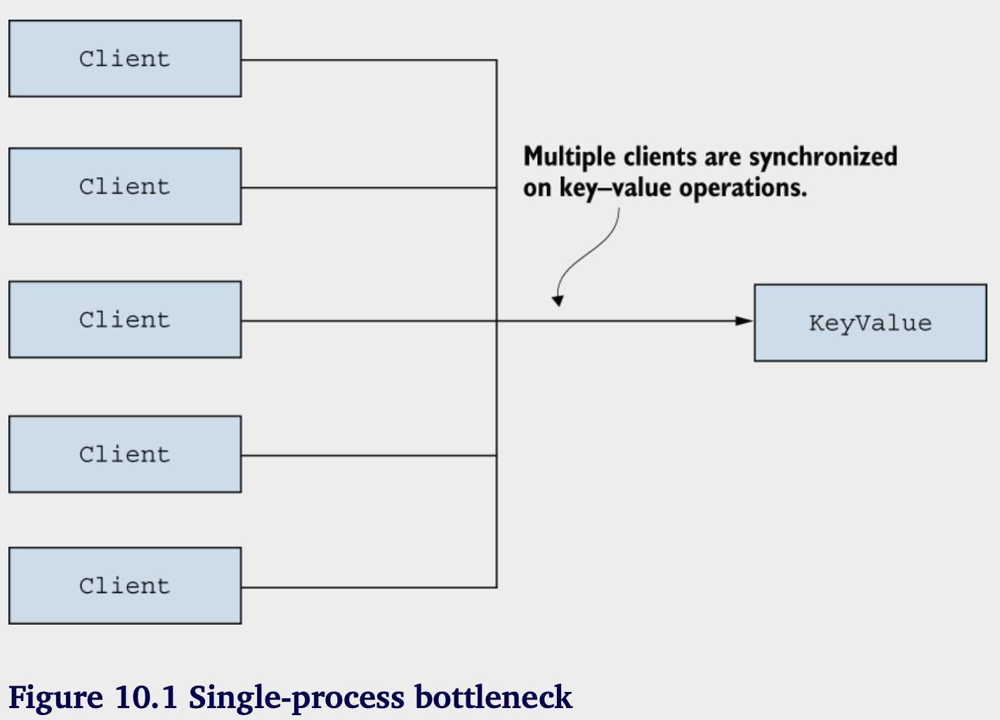
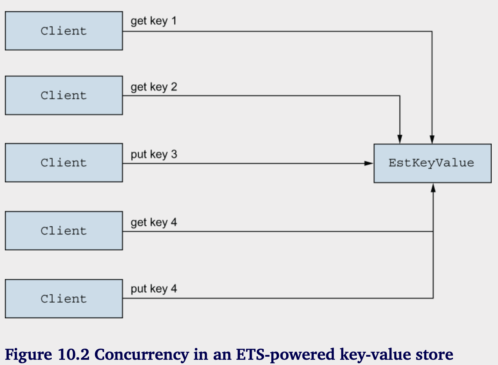

# Beyond GenServer

**本章涵盖：**

- Tasks
- Agents
- ETS tables
  
第8章和第9章介绍了工作进程和监督进程之间的区别。工作进程是提供部分服务的进程，而监督进程将工作进程组织成树形结构。这使您能够按照所需顺序启动和停止进程，并在关键进程失败时重新启动它们。

如第9.1.6节所提到的，所有由监督者直接启动的进程都应该是符合OTP标准的进程。使用普通的spawn和spawn_link启动的进程是不符合OTP标准的，因此您应避免在生产环境中运行此类进程。模块如Supervisor、GenServer和Registry允许您启动符合OTP标准的进程，这些进程可以放置在监督树中。

在本章中，您将学习两个额外的模块，这些模块也允许您运行符合OTP标准的工作进程：Task和Agent。任务在您需要运行一次性工作时非常有用，而代理可以用于管理状态并提供对状态的并发访问。最后，我们将讨论一个相关特性，称为ETS表，在某些条件下，可以作为GenServer和Agent的更高效替代方案。我们需要覆盖很多新内容，所以让我们先讨论任务。

## 10.1 Tasks

任务模块可以用来并发运行一个作业——一个接受输入、进行一些计算然后停止的过程。

从这个意义上说，基于任务的过程与服务器进程的流向是不同的。虽然 GenServer 进程作为一个长期运行的服务器，而基于任务的进程会立即开始工作，不会处理请求，并在工作完成后停止。

任务模块可以以两种不同的方式使用，具体取决于任务进程是否需要将结果发送回启动它的进程。前一种情况也称为等待任务，因为启动进程会等待任务返回结果。让我们首先讨论这个选项。

### 10.1.1 Awaited tasks

期待的任务是一个执行某些功能的过程，它将函数结果发送回启动过程，然后结束。让我们看一个基本的例子。
假设你想启动一个并发的、可能需要较长时间的任务，并获取其结果。你可以使用以下函数来模拟一个长期运行的任务：

```elixir
iex(1)> long_job =
...>   fn ->
...>     Process.sleep(2000)
...>     :some_result
...>   end
```

这个 lambda 在被调用时会暂停 2 秒钟，然后返回 `:some_result`。要并发运行这个 lambda，你可以使用 `Task.async/1`：

```elixir
iex(1)> task = Task.async(long_job)
```

`Task.async/1`函数接受一个零参数的lambda，生成一个独立的进程，并在该进程中调用lambda。lambda的返回值将作为消息发送回启动进程。


因为计算是在一个单独的进程中运行，`Task.async/1`会立即返回，即使 lambda 本身需要很长时间才能完成。这意味着启动进程不会被阻塞，并且可以与任务进程并发地执行一些额外的工作。`Task.async/1` 的返回值是一个描述正在运行的任务的结构体。这个结构体可以传递给 `Task.await/1`，以等待任务的结果。

```elixir
iex(1)> Task.await(task)
:some_result
```

该函数 Task.await/1 会等待来自任务进程的响应消息。该消息将包含 lambda 的结果。当消息到达时，Task.await/1 将返回 lambda 的结果。如果消息在 5 秒内没有到达，Task.await/1 将引发异常。您可以通过将第二个参数提供给 Task.await/2 来设置不同的超时。

当您需要运行几个相互独立的一次性计算并等待所有结果时，等待任务非常有用。为了说明这一点，我们将重用第 5.2.2 节中的示例。在该示例中，您需要执行多个独立的查询并收集所有结果。由于查询是相互独立的，您可以通过在单独的进程中运行每个查询并将结果作为消息发送到启动进程，从而提高总执行时间。然后启动进程需要等待所有结果。

回到第 5 章，您从头开始实现了这个过程，使用了 spawn、send 和 receive。在这里，您将依赖 Task.async/1 和 Task.await/1。
首先，定义一个辅助 lambda，用于模拟长时间执行的查询：

```elixir
iex(1)> long_query =
           fn query_def ->
             Process.sleep(2000)
             "#{query_def} result"
           end
```

现在可以在启动5个查询，他们分别运行在各自的task中：

```elixir   
iex(1)> queries = 1..5

iex(2)> tasks =
        Enum.map(
          queries,
          &Task.async(fn -> long_query.("query #{&1}") end)
        )
```

在这里，你创建五个查询，然后在单独的任务中启动每个查询的执行。在 ⁠tasks 变量中的结果是一个包含五个` ⁠%Task{}` 结构的列表，每个结构都描述了一个执行查询的任务。

要等待所有结果，你将 ⁠tasks 变量中的每个任务传递给 `⁠Task.await/1` 函数。

```elixir
iex(3)> Enum.map(tasks, &Task.await/1)
["query 1 result", "query 2 result", "query 3 result", "query 4 result", "query 5 result"]
```

使用管道符，你可以将代码写的更加简洁：

```elixir   
iex(1)> 1..5
        |> Enum.map(&Task.async(fn -> long_query.("query #{&1}") end))
        |> Enum.map(&Task.await/1)
```

所有结果在2秒内收集完成，这证明每个任务是在独立的进程中运行的。

这段代码根据任务的启动顺序等待任务完成。因此，结果的顺序是确定的。结果列表的第一个元素是查询1的结果，第二个元素是查询2的结果，依此类推。

需要注意的是，Task.async/1将新任务与启动进程链接在一起。因此，如果任何任务进程崩溃，启动进程也会崩溃（除非它设置了捕获退出）。启动进程的崩溃将导致同一进程启动的所有其他任务也崩溃。换句话说，使用Task.async/1启动多个任务具有全有或全无的语义。单个任务的崩溃会导致所有其他任务以及启动进程的崩溃。

如果您希望显式处理单个任务的失败，您需要捕获退出并在启动进程中处理相应的退出消息。Task模块中有一些可帮助您完成此操作的函数，最著名的是Task.async_stream/3。有关更多详细信息，请参阅官方文档：https://hexdocs.pm/elixir/Task.xhtml。同时，让我们看看当启动进程不需要等待其结果时，您如何处理任务。

### 10.1.2 Non-awaited tasks

如果您不想将结果消息发送回启动进程，可以使用`Task.start_link/1`。这个函数可以被视为一个符合OTP规范的包装器，封装了普通的`spawn_link`。该函数启动一个独立的进程并将其链接到调用者。然后，提供的lambda在启动的进程中执行。一旦lambda执行完成，该进程以原因`:normal`终止。与`Task.async/1`不同，`Task.start_link/1`不会向启动进程发送任何消息。以下是一个基本示例：

```elixir
iex(1)> Task.start_link(fn ->
          Process.sleep(1000)
          IO.puts("Hello from task")
          end) 
{:ok, #PID<0.123.0>}
Hello from task
```

让我们看一个更具体的例子。假设您想收集一些关于系统的指标，并定期报告它们。这是一个非响应式工作的例子。在这里您并不需要 GenServer，因为您不需要处理来自其他客户端进程的请求。相反，您希望有一个进程可以休眠一段时间，然后收集相关的指标并进行报告。  
让我们开始在您的待办事项系统中实现这个功能。

首先，您将实现一个顺序循环，定期收集指标并将其打印到屏幕上。

```elixir
# Listing 10.1 Reporting system mertrics (todo_metrics/lib/todo/mertrics.ex)
defmodule Todo.Metrics do
  ...
  defp loop() do
    Process.sleep(:timer.seconds(10))
    IO.inspect(collect_metrics())
    loop()
  end

  defp collect_metrics() do
  [
    memory_usage: :erlang.memory(:total),
    process_count: :erlang.system_info(:process_count),
  ]
  end
end   
```

在现实生活中，你可能想收集更多的数据并将其发送到外部服务，但这个例子保持简单。你想将这个循环作为系统的一部分运行。为此，你需要启动一个任务。

```elixir
# Listing 10.2 Metrics reporter as task (todo_metrics/lib/metrics.ex)
defmodule Todo.Metrics do
  use Task

  def start_link(_arg) do, Task.stark_link(&loop/0)

  ...
end
```

首先，您指定使用 Task，这将把 child_spec/1 函数注入到 Todo.Metrics 模块中。和 GenServer 一样，注入的规格将调用 start_link/1，因此您需要定义 start_link/1，即使您不使用该参数。start_link/1 的实现简单地调用 Task.start_link/1 来启动一个 task 进程，其中循环正在运行。

通过这两行简单的代码，Todo.Metrics 模块已准备好注入到监督树中。

```elixir
# Listing 10.3 Starting a supervised metrics task(todo_metrics/lib/system.ex)
defmodule Todo.System do
def start_link() do
  Supervisor.start_link(
    [
        Todo.Metrics,
        ...
    ],
    state: :one_for_one
  )
  end
end
```

这就是 Task.start_link/1 的主要目的——它允许你启动一个符合 OTP 的进程，你可以安全地将其作为某个监督者的子进程来运行。

试试看：

```elixir
iex(1)> Todo.System.start_link()
[memory_usage: 48110864, process_count: 74]   
[memory_usage: 48505592, process_count: 74]  
```

这是在您的系统中实现定期任务的简单方法，无需运行多个操作系统进程或使用外部调度程序，如 cron。

在更复杂的场景中，将调度与作业逻辑分离是值得的。这个想法是使用一个进程进行周期性调度，然后在一个单独的临时进程中启动每个作业实例。这种方法提高了容错能力，因为作业进程的崩溃不会干扰调度进程。你可以尝试将这种方法实现作为练习，但在生产环境中，最好依赖经过实战检验的第三方库，例如 Quantum (https://github.com/quantum-elixir/quantum-core)。

### 10.1.3 监管动态任务

在许多情况下，您可能想要动态地启动非等待任务。一个常见的例子是在处理网页请求时，需要与远程服务（例如支付网关）进行通信。

一种简单的处理方式是同步地进行这种通信，在处理请求的同时。然而，这种方式可能会导致不良的用户体验。如果网络出现间歇性问题，与远程服务的通信可能会变得缓慢，甚至完全失败。

更好的方法是从一个独立的任务进程异步地进行这种通信。您接收输入请求，启动一个与远程服务通信的任务，并立即回应请求已被接受。一旦任务完成，您可以发出结果通知，可能通过 WebSocket 或电子邮件。这提高了系统响应能力，并增强了系统对各种网络问题的抵抗力。您可以在较长时间内重试失败的通信，而无需阻塞请求处理程序，甚至可以保持用户连接。

这是一个动态启动的独立任务示例。该任务是按需启动的，它的生命周期必须与启动它的进程的生命周期解耦（处理输入请求的进程）。

在这种情况下，最好在专门的监视器下运行任务。您可以使用 DynamicSupervisor 来实现这一点，但 Elixir 还包括一个称为 `Task.Supervisor` 的任务特定包装器（https://hexdocs.pm/elixir/Task.Supervisor.xhtml）。要运行动态监督的任务，请启动任务监视器：

```elixir
iex(1)> Task.Supervisor.start_link(name: MyTaskSupervisor)
```

现在你可以使用`Task.Supervisor.start_child/2`在任务监视器中启动任务。

```elixir
iex(1)> Task.Supervisor.start_child(
          MyTaskSupervisor,
          fn ->
          IO.puts("task started")
          Process.sleep(2000)
          IO.puts("task stopping")
          end) 
{:ok, #PID<0.123.0>}
task started
task stopping
```

重要的是要理解逻辑启动过程与实际启动过程之间的区别。Shell 过程是启动任务创建的过程。然而，任务实际上是作为任务监控程序的子进程启动的。由于这种过程结构，逻辑启动程序（即 iex shell 进程）和任务的生命周期是分开的。一个进程的崩溃不会影响另一个进程。

这结束了我们对任务的简要介绍。我们没有覆盖所有的细微差别，所以我建议您更详细地研究官方模块文档，网址是 https://hexdocs.pm/elixir/Task.xhtml。接下来，我们将看看agents。

## 10.2 Agents

Agent模块提供了一种类似于GenServer的抽象。相比之下，Agent需要的额外代码较少，因此可以消除与GenServer相关的一些样板代码。另一方面，Agent并不支持GenServer的所有场景。如果一个GenServer只实现了init/1、handle_cast/2和handle_call/3，它可以被Agent替代。但是如果您需要使用handle_info/2或terminate/1，Agent将不够用，您需要使用GenServer。让我们进一步探索这个主题，从Agent的基本用法开始。

### 10.2.1 Agent的基本用法

你可以使用`Agent.start_link/1`来启动agent：

```elixir
iex(1)> {:ok, pid} = Agent.start_link(fn -> %{name: "Bob", age: 30} end)
{:ok, #PID<0.123.0>}
``` 

`Agent.start_link/1` 会启动一个新进程，并在该进程中执行lambda，与task不同，agent进程不会在lambda执行结束后停止，而是使用lambda的返回值作为他的状态。其他进程可以使用`Agent`模块中的各种函数访问和操作agent的状态。

可以使用`Agent.get/2`获取agent的状态或状态的一部分：

```elixir
iex(1)> Agent.get(pid, &Map.get(&1, :name))
"Bob"
```

`Agent.get/2`接受代理的PID和一个lambda。这个lambda在代理的进程中调用，并接收代理的状态作为参数。lambda的返回值作为消息发送回调用进程。这条消息在`Agent.get/2`中接收，然后返回结果给调用者。

要修改代理的状态，可以使用 `Agent.update/2`:

```elixir
iex(1)> Agent.update(pid, fn state -> %{state | age: 31} end)
:ok
```

这将导致代理进程的内部状态发生变化。您可以通过 Agent.get/2 验证这种变化。

```elixir
iex(1)> Agent.get(pid, &Map.get(&1, :age))
31
```

值得一提的是，`Agent.update/2` 是同步的。该函数仅在更新成功后才会返回。可以使用 `Agent.cast/2` 执行异步更新。

### 10.2.2 代理和并发

一个单独的代理，作为一个进程，可以被多个客户端进程使用。一个进程所做的更改可以在后续的代理操作中被其他进程观察到。让我们演示一下。你将启动一个作为计数器的代理：

```elixir
iex(1)> {:ok, counter} = Agent.start_link(fn -> 0 end)
{:ok, #PID<0.123.0>}
```

代理的初始状态为0。现在，从另一个进程中操控代理的状态：

```elixir
iex(2)> spawn(fn -> Agent.update(counter, &(&1 + 1)) end)
```

最后我们检查下agent的状态：

```
iex(3)> Agent.get(counter, &(&1))
1
``` 

这个例子表明状态与代理进程相关。当一个客户端进程改变代理的状态时，其他进程后续发出的操作将看到新的状态。

一个代理进程的工作方式与 GenServer 完全相同。如果多个客户端同时尝试与同一个代理进行交互，操作将会被序列化并逐一执行。事实上，Agent 模块是基于 GenServer 用纯 Elixir 实现的。为了阐明这一点，让我们简单地勾勒一个类似代理的模块的实现。  

以下是您可以实现代理类似状态初始化的方法：

```elixir
defmodule MyAgent do
  use GenServer
  def start_link(init_func)  do
    GenServer.start_link(__MODULE__, init_func)
  end
  
  def init(init_func) do
    {:ok, init_func.()}
  end
...
end
```

请回忆第5章中提到的，任何术语都可以作为消息发送。这包括匿名函数，而代理的实现利用了这一点。代理接口函数将匿名函数作为参数，并将该函数传递给服务器进程，后者调用该函数并处理其结果。相同的方法也用于提供`get`和`update`操作:

```elixir
defmodule MyAgent do
  ...

  def get(pid, func) do
    GenServer.call(pid, {:get, func})
  end

  def update(pid, func) do
    GenServer.cast(pid, {:update, func})
  end

  def handle_call({:get, func}, _from, state) do
    res = func.(state)
    {:reply, res, state}
  end

  def handle_cast({:update, func}, state) do
    {:noreply, func.(state)}
  end

  ...
end
```

Agent模块的实际实现更加复杂并且功能丰富，但基本思想与前面的示例相同。Agent模块是一个普通的GenServer，可以通过向进程发送lambda来控制。因此，对代理的并发推理与GenServer完全相同。

### 10.2.3 基于Agent的待办事项服务器

由于Agent可以用来管理并发状态，它是驱动待办事项服务器的理想候选者。将GenServer转换为Agent是一项相当简单的工作。你需要用一个使用Agent API的单一函数替换一对接口函数和相应的GenServer回调子句。作为Agent的Todo.Server的完整代码将在以下列表中提供。

```elixir
# Listing 10.4 Agent-powered todo server (todo_agent/lib/todo/server.ex)
defmodule Todo.Server do
  use Agent, restart: :temporary

  def start_link(name) do
    Agent.start_link(
        fn -> 
          IO.puts("Starting Todo Server for #{name}")
          {name, Todo.Database.get(name) || Todo.List.new()}
        end,
        name: via_tuple(name)
    )
  end

  def add_entry(todo_server, entry) do
    Agent.cast(todo_server, fn {name, todo_list} ->
      new_list = Todo.List.add_entry(todo_list, entry)
      Todo.Database.store(name, new_list)
      {name, new_list}
      end)
  end

  def entries(todo_server, date) do
    Agent.get(
      todo_server,
      fn {_name, todo_list} -> Todo.List.entries(todo_list, date) end
    )
  end

  defp via_tuple(name) do
   Todo.ProcessRegistry.via_tulple({__MODULE__, name})
   end
end
```

值得注意的是，模块的接口保持不变，因此无需修改其他模块的代码。

在这段代码中，有两个值得讨论的地方。首先是模块开头的表达式 use Agent。就像使用 GenServer 和 Task 一样，这个表达式会注入 child_spec/1 的默认实现，使您能够在子规范列表中列出该模块。

此外，add_entry/2 的实现使用了 Agent.cast/2。这个函数是 Agent.update/2 的异步版本，这意味着该函数会立即返回，而更新操作是并发执行的。这里使用 Agent.cast/2 是为了保持与之前版本相同的行为，之前版本使用的是 GenServer.cast/2

---

**始终将代理代码封装在模块中**

代理的一大问题是它完全开放了进程的状态。回想一下，使用 GenServer 时，状态是服务器私有的，只能通过明确的消息进行操作。可是，使用代理时，状态可以通过传递给代理函数的任意 lambda 进行操作，这意味着状态容易遭到意外破坏。为了防止这个问题，建议你总是将代理封装在一个专用模块中，只通过该模块的函数来操作代理进程。正是你在将 Todo.Server 转换为代理时所做的。

---

### 10.2.4 代理的限制

代理模块无法用于处理简单消息或在终止时运行某些逻辑的情况。在这种情况下，您需要使用GenServer。让我们来看一个例子。

在您当前版本的系统中，您从未清除待办事项缓存中的项目。这意味着当用户操作单个待办事项列表时，该列表将在内存中保留，直到系统终止。这显然不好，因为随着用户处理不同的待办事项列表，您将消耗越来越多的内存，直到整个系统耗尽内存并崩溃。

让我们引入一个简单的待办事项服务器过期机制。您将停止一段时间内未被使用的待办事项服务器。

一种实现方法是创建一个单一的清理进程，用于终止空闲的待办事项服务器。在这种方法中，每个待办事项服务器需要在每次使用时通知清理进程，这可能导致清理进程成为瓶颈。最终，您将面临一个需要处理来自许多其他进程的高负载消息的进程，而它可能无法跟上。

更好的方法是让每个待办事项服务器自主决定何时终止。这将简化逻辑并避免任何性能瓶颈。这是一个可以用GenServer实现但无法用Agent实现的例子。

在GenServer中可以通过几种方式检测空闲期，这里您将使用一种简单的方法。在从GenServer回调中返回的值中，您可以在返回元组的末尾添加一个额外的元素。如果这个元素是一个整数，则表示空闲时间，在此之后会将超时消息发送到GenServer进程。

例如，在init/1中，您可以返回{:ok, initial_state, 1000}，而不是返回{:ok, initial_state}。值1000表示如果在1000毫秒内没有调用、发送或简单消息到达服务器进程，将会调用handle_info/2回调，并且第一个参数将具有值：:timeout。
对于其他回调（如handle_cast/2和handle_call/3），同样适用，您可以分别返回{:noreply, new_state, timeout}和{:reply, response, new_state, timeout}。

因此，要使待办事项服务器在一段时间不活动后自行停止，您需要执行以下操作：

1. 将待办服务器的实现转换回 GenServer。
2. 在所有回调函数的所有结果元组中包含空闲超时整数。
3. 添加 handle_info/2，并在收到 :timeout 消息时停止服务器。

从最后一个由 GenServer 驱动的 Todo.Server 开始，您将在回调函数的结果中包含空闲超时整数。

```elixir
# Listing 10.5  Specifying idle timeout (todo_cache_expiry/lib/todo/server.ex)
defmodule Todo.Server do
  ...
  @expiry_idle_timeout :timer.seconds(10)

  def init(name) do
    IO.puts("Starting Todo Server for #{name}")
    {:ok, {name,nil},{:conitnue, :init}}
  end

  def handle_continue(:init, {name,nil}) do
    todo_list = Todo.Database.get(name) || Todo.List.new()
    {
     :noreply, 
     {name, todo_list}, 
     @expiry_idle_timeout
     }
    end

    def handle_cast({:add_entry, new_entry}, {name, todo_list}) do
      new_list = Todo.List.add_entry(todo_list, new_entry)
      Todo.Database.store(name, new_list)
      {:noreply, {:name, new_list}}, @expiry_idle_timeout}
    end

    def handle_call({:entries, date}, _, {name, todo_list}) do
      {
        :reply, 
        Todo.List.entries(todo_list, date), 
        {name, todo_list}, 
        @expiry_idle_timeout
      }
    end 

    ...
end
```

首先，您声明一个模块属性 @expiry_idle_timeout，它的值为 10,000（通过调用 :timer.seconds(10) 获得）。这个属性作为一个模块级常量，您将其包含在几乎每个回调函数的返回元组的最后一个元素中。

唯一的例外是 init/1 方法，它提供了一个继续元组（{:continue, ...}）。正如第七章所解释的，这用于执行可能会长时间运行的服务器初始化，而不阻塞调用者。GenServer 不支持同时返回继续信息和超时。因此，在 init/1 中，您只包括继续信息，而超时则在 handle_continue 中提供。这是完全可以的，因为 handle_continue 会在 init/1 之后立即无条件地被调用。这些更改确保当服务器进程在 10 秒内没有活动时，将调用 handle_info(:timeout, state)。

最后，您需要处理 :timeout 消息并停止服务器。

```elixir
# Listing 10.6 Stopping an idle to-do server (todo_cache_expiry/lib/todo/server.ex)
defmodule Todo.Server do
  ...
  def handle_info(:timeout, {name,todo_list}) do
    IO.puts("Stopping Todo Server for #{name}")
    {:stop, :normal, {name, todo_list}}
    end
end
```

现在，快速验证过期功能是否正常。进入 todo_cache_expiry 文件夹，启动系统，并启动一个待办事项服务器。

```elixir
$ iex -S mix
 
iex(1)> Todo.System.start_link()
iex(2)> pid = Todo.Cache.server_process("bobs_list")
```

现在，等待一会，你会看到debug信息：

```elixir
Stopping Todo Server for bobs_list
```

最后验证进程是否存活：

```elixir
iex(3)> Process.alive?(pid)
false
```

这是一个代理不够用而需要使用GenServer的情况示例。但是直到您想要实现过期机制之前，代理与GenServer同样是合适的解决方案。只要你不需要处理普通消息或在terminate/1中运行一些终止代码，你可以使用Agent。

就个人而言，我通常不使用Agent，而是直接开始使用GenServer。因为将Agent转换为GenServer需要一些工作，我宁愿立即从GenServer开始。作为额外的好处，这使得代码更加一致，因为所有的服务器进程都使用相同的抽象来实现。如果你感到困惑，不确定是使用Agent还是GenServer，我的建议是总是选择GenServer，因为它适用的场景更多，而且与Agent相比并没有复杂太多。

这就是关于代理的故事。接下来，我们将看看一个叫做ETS表的特性。

## 10.3 ETS表

ETS（Erlang Term Storage）表是一个机制，允许你在多个进程之间以更高效的方式共享一些状态。ETS表可以被视为一种优化工具。用ETS表可以做的任何事情，也可以用GenServer或Agent来完成，但ETS版的性能往往更好。然而，ETS表只能处理有限的场景，因此，往往无法替代服务器进程。

ETS表可以用在的典型情况是共享的键值结构和计数器。虽然这些场景也可以通过GenServer（或Agent）来实现，但这样的解决方案可能会导致性能和扩展性问题。

我们来看一个简单的示例，演示通过GenServer实现一个并发的键值存储所遇到的问题。首先，让我们看一下这种存储的示例用法：

```elixir
iex(1)> KeyValue.start_link()
{:ok, #PID<0.123.0>}

iex(2)> KeyValue.put(:some_key, :some_value)
:ok

iex(3)> KeyValue.get(:some_key)
:some_value
``` 

下面清单是KeyValue模块的完整实现：

```elixir
# Listing 10.7 GenServer-powered key-value store (key_value/lib/key_value.ex)
defmodule KeyValue do
  use GenServer

  def start_link do
    GenServer.start_link(__MODULE__, nil, name: __MODULE__)
  end

  def put(key, value) do
    GenServer.cast(__MODULE__, {:put, key, value})
  end

  def get(key) do
    GenServer.call(__MODULE__, {:get, key})
  end

  def init(_) do
    {:ok, %{}}
  end

  def handle_call({:get, key}, _from, state) do
    {:reply, Map.get(state, key), state}
  end

  def handle_cast({:put, key, value}, state) do
    {:noreply, Map.put(state, key, value)}
  end
end
```

这里没有什么新内容。KeyValue模块是一个简单的GenServer，用于在其状态中保存一个映射。put和get请求归结为在服务器进程中调用`Map.put/3`和`Map.get/2`。

接下来，您将对这个键值存储进行一些快速且不具决定性的性能测量。请进入`key_value`文件夹，并运行以下命令：

```shell
mix run -e "Bench.run(KeyValue)
```

混合运行命令编译项目，启动一个 BEAM 实例，然后执行通过 -e 参数提供的表达式，这意味着调用了 Bench.run/1。一旦函数执行完毕，BEAM 实例就会停止。

Bench 模块位于 key_value/lib/bench.ex 中，进行简单的负载测试。它启动 KeyValue 服务器，然后对一百万个键进行操作。对于每个键，bench 程序执行 10 次 put 操作。每次 put 操作后跟随一个 get 操作，因此，程序总共执行 20,000,000 次操作。

测试完成后，函数会打印出观测到的吞吐量：

```shell
mix run -e "Bench.run(KeyValue)"
953182 operations/sec”
```

该处理能力大约为每秒950,000个操作，看起来相当不错。但是，让我们看看当键值服务器必须同时为多个客户端进程服务时的表现。您可以通过向 Bench.run 提供 :concurrency 选项来验证这一点。

```shell
mix run -e "Bench.run(KeyValue, concurrency: 10000)"
735369 operations/sec”
```

有点出乎意料的是，当有10,000个客户端进程时，你的吞吐量变得更差。这是怎么回事呢？主要问题在于，尽管有这么多进程，但只有一个键值服务器进程，因此所有的键值操作都是同步的，如图10.1所示。



键值服务器因此成为了性能瓶颈和可扩展性杀手。系统无法高效利用所有硬件资源。即使有10,000个客户端进程在运行，所有的键值操作仍然是串行的。

此外，请记住，即使在适度并发的系统中，通常运行的进程数量也远超过CPU核心的数量。在这种情况下，您有10,000个客户端，这远远超过可用的CPU核心数量。因此，并不是所有进程都能同时运行——一些进程必须等待它们的轮到。

正如第5章所解释的，虚拟机会竭尽所能地利用CPU，但事实是，许多进程在争夺有限资源。因此，键值服务器并不会独占一个CPU核心。如果BEAM调度器在系统中运行了其他进程，该进程有时必须等待轮到自己。由于键值服务器用于执行其工作的CPU资源较少，因此计算结果所需的时间会更长。

这并不是说进程不好。一般来说，你应该努力并发运行独立的任务，以提高可扩展性和容错性。进程也应该是你维护随时间变化的状态的首选。问题并不在于系统中运行了许多进程，而是许多其他进程依赖的单个进程。在这种情况下，你可以通过 ETS 表格做得更好，我们来看看它们是什么以及你如何使用它们。

### 10.3.1 基础操作

ETS 表是特殊的内存数据结构，可以存储 Erlang 术语。这使得在多个进程之间共享一些状态成为可能，而无需引入专门的服务器进程。
与其他数据结构相比，ETS 表具有一些不寻常的特性：

- 没有特定的 ETS 数据类型。表格通过其 ID（引用类型）或全局名称（原子）来识别。

- ETS 表是可变的。对表格的写入将影响后续的读取操作。

- 多个进程可以对单个 ETS 表进行读写操作。写入和读取可能同时进行。

- 确保最低的并发安全性。多个进程可以安全地写入同一表的同一行。最后的写入将胜出。

- ETS 表位于一个独立的内存空间。进出数据都是深拷贝的。

- ETS 不会对垃圾收集器施加压力。被覆盖或删除的数据会立即释放。

- ETS 表与其拥有者进程（默认是创建表的进程）紧密相连。如果拥有者进程终止，ETS 表将被回收。

- 除了在拥有者进程终止时，ETS 表不会自动进行垃圾回收。即使您不持有对该表的引用，它仍然会占用内存。

这些特性意味着ETS表在某种程度上类似于进程。实际上，人们常说ETS表具有进程语义。你可以用进程来实现ETS表，但这样的实现效率会低得多。在BEAM中，ETS表是由C代码驱动的，这确保了更好的速度和效率。

前面列表中的第五点尤其有趣。因为数据在ETS表中是深拷贝的，所以没有经典的可变性问题。一旦你从ETS表中读取数据，你就得到了一个快照，没有人可以更改。无论其他进程是否可能修改ETS表中那些行的内容，您所读到的数据都不会受到影响。

让我们看一些例子。所有与ETS表相关的函数都包含在Erlang的:ets模块中（https://erlang.org/doc/man/ets.xhtml）。要创建一个表，可以调用:ets.new/2：

```elixir
iex(1)> :ets.new(:my_table, [])
#<Reference<0.0.0.0.0.0.0>>
```


第一个参数是表名，这在你想注册表时是重要的（我们稍后会讨论这个）。此外，你可以传递各种选项，其中一些将稍后讨论。你应该花一些时间研究关于`:ets.new/2`的官方文档，以了解哪些选项是可能的。`:ets.new/2`的结果是一个引用，这是一个唯一的不透明术语，表示正在运行的系统中的ETS表。

由于结构是一个表，你可以在其中存储多行数据。每一行是一个任意大小的元组（至少包含一个元素），而每个元组元素可以包含任何Erlang术语，包括深层嵌套的列表、元组、映射或你可以在变量中存储的其他任何内容。

可以使用`:ets.insert/2`插入数据：

```elixir
iex(2)> :ets.insert(:my_table, {:key_1, 1})
true
iex(3)> :ets.insert(:my_table, {:key_2, 2})
true
iex(4)> :ets.insert(:my_table, {:key_1, 3})
true
```

元组的第一个元素代表键——这是您可以用于快速查找表中的数据的内容。默认情况下，ETS 表是集合类型，这意味着您不能存储具有相同键的多个元组。因此，最后一次写入会覆盖第一次写入的行。

要验证这一点，您可以使用 :ets.lookup/2，它会返回给定键的行列表：

```elixir
iex(5)> :ets.lookup(:my_table, :key_1)
[{:key_1, 3}]
iex(6)> :ets.lookup(:my_table, :key_2)
[{:key_2, 2}]
```

你可能会想，既然每个不同的键只能有一行，为什么还会返回列表。原因是ETS表支持其他表类型，其中一些允许重复行。具体来说，以下表类型是可能的：

- `:set` — 这是默认类型。允许每个不同的键一行。

- `:ordered_set` — 这与`:set`相似，但行是按术语顺序排列（通过<和>运算符进行比较）。

- `:bag` — 允许多个具有相同键的行，但两行不能完全相同。

- `:duplicate_bag` — 这与`:bag`相似，但允许重复的行。

另一个重要的选项是表的访问权限。可以使用以下值：

- `:protected`——这是默认值。拥有者进程可以读取和写入表。所有其他进程只能读取表。

- `:public`——所有进程都可以读取和写入表。

- `:private`——只有拥有者进程可以访问表。

要创建不同类型的表或使用不同的访问级别，只需在传递给 `:ets.new/2` 的列表中包含所需的选项。例如，要创建一个公共的重复袋列表，可以这样调用：

```elixir
:ets.new(:some_table, [:public, :duplicate_bag])
```

最后，值得讨论的是表的名称。这个参数必须是一个原子，默认情况下没有任何用途（尽管奇怪的是，你仍然必须提供它）。你可以创建多个相同名称的表，它们仍然是不同的表。

但是如果你提供了`:named_table`选项，那么该表就可以通过它的名称进行访问。

```elixir
iex(1)> :ets.new(:my_table, [:named_table])
:my_table

iex(2)> :ets.insert(:my_table, {:key_1, 3})
true

iex(3)> :ets.lookup(:my_table, :key_2)
[]
```

在这个意义上，表名类似于本地注册的进程名称。它是一个表的符号名称，使您不必传递 ETS Referrence。

尝试创建一个重名的表将导致错误：

```elixir
iex(4)> :ets.new(:my_table, [:named_table])
** (ArgumentError) ETS table named :my_table already exists
```

### 10.3.2 基于ETS的键值库

凭借这项新知识，您将使用ETS表实现键值存储。由于一个表必须由某个进程拥有，我们仍将保持一个GenServer存在。它的唯一目的是在init/1中创建该表并保持其活跃。所有与表的交互（读取和写入）将直接由调用进程完成，而无需向服务器进程发出请求。

相关的代码包含在与初始尝试相同的项目中。首先，您需要启动并初始化表的拥有进程，如下一个列表所示。

```elixir
# Listing 10.8 Createing the ETS table (key_value/lib/ets_key_value.ex)
defmodule EtsKeyValue do
  use GenServer

  def start_link do
    GenServer.start_link(__MODULE__, nil, name: __MODULE__)
  end

  def init(_) do
    :ets.new(
      __MODULE__,
      [:named_table, :public, read_concurrency: true]
      )
    {:ok, nil}
  end

  ...
end
```

在 `start_link` 中，你启动了一个 `GenServer`。然后，在 `init/1` 回调中，新的 ETS 表被创建。该表被配置为命名，这样客户端进程可以通过其名称（模块的名称）访问它。访问权限被设置为公共，这允许客户端进程向表中写入数据。没有提供表的类型，因此它将默认为集合（set）。

请注意提供给`:ets.new`的`:write_concurrency`选项。这个选项允许你对表执行并发写入，这正是你在这种情况下所需要的。还有一个`:read_concurrency`选项，在某些情况下可以提高读取性能。这里没有设置这个选项，因为Bench模块执行了大量交错的读写操作，在这种情况下，`:read_concurrency`可能会导致性能变差。与其随机设置这些选项，不如总是先测量和观察它们的效果。

到此为止，你可以实现这些操作：

```elixir
defmodule EtsKeyValue do
  ...

  def put(key, value) do
   :ets.insert(__MODULE__, {key, value})
  end

  def get(key) do
    case :ets.lookup(__MODULE__, key) do
      [{^key, value}] -> value
      [] -> nil
      end
  end
  ...
end
```

前面的代码是对所展示的 `:ets` 函数的简单应用。要存储一个条目，您可以调用 `:ets.insert/2`。要进行查找，您可以调用 `:ets.lookup/2`。由于 ETS 表是一个集合，结果列表最多只能包含一个元素：给定键的键值对。如果给定键没有对应的行，则结果是一个空列表。

这里要注意的关键点是，获取和存储操作现在不再通过服务器进程。这意味着多个客户端可以同时与键值存储进行操作，而不会相互阻塞，如图 10.2 所示



如您所见，针对不同键的操作可以并行执行。多个针对同一键的操作将进行适当的同步，以防止可能的竞争条件。当您有许多键时，碰撞的可能性较小，因此您可以期待更好的调度器利用率，从而获得更好的可扩展性。

现在，请验证新的键值存储是否正常工作：

```elixir
iex(1)> EtsKeyValue.start_link()
{:ok, #PID<0.123.0>}

iex(2)> EtsKeyValue.put(:some_key, :some_value)
true

iex(3)> EtsKeyValue.get(:some_key)  
:some_value
```

键值存储似乎正常工作。现在，让我们看看它的性能。您将从一个顺序基准测试开始：

```elixir
mix run -e "Bench.run(EtsKeyValue)"
5700062 operations/sec
```
在我的机器上，我获得了约570万请求的预期吞吐量。回想一下纯GenServer版本大约管理了950,000个请求每秒，这几乎是吞吐量的6倍提高！

这种改善有几个原因。首先，ETS操作在客户端进程中立即处理。相比之下，跨进程请求涉及将消息放入接收者的邮件箱，然后等待接收者被调度并处理请求。如果请求是同步调用，客户端进程还必须等待响应消息到达。

此外，对ETS表的更改是破坏性的。如果某个键下的值被更改，旧值会立即释放。因此，在ETS表中管理的数据不会对垃圾收集器施加压力。相反，转换标准的不可变数据会产生垃圾。在基于GenServer的键值存储中，频繁的写入会产生很多垃圾，这意味着服务器进程在垃圾收集时偶尔会被阻塞。

在这种情况下，即使在简单的顺序场景中，你也会获得显著的改善。但是ETS在多个客户端面前表现如何呢？让我们来看看：

```shell
mix run -e "Bench.run(EtsKeyValue, concurrency: 10000, num_updates: 100)"
52009220 operations/sec
```

注意 num_updates: 100 选项。由于基于 ETS 的实现速度更快，因此您传递此选项以进行更长时间的测试。该测试将在每个键上执行 100 次 put 操作（因此也会执行 100 次 get 操作）。

使用 10,000 个客户端进程可以实现 9 倍的吞吐量。与普通的 GenServer 解决方案相比，提升达到了 70 倍（5200万对比 735,000 请求每秒）。单进程的键值服务器在系统中运行进程总数增加时开始变慢。相比之下，基于 ETS 的缓存扩展性更好。

该扩展的主要原因在于缓存操作是在客户端进程中执行的，因此不需要执行基于 GenServer 的序列化。`:ets` 模块提供的原子操作得到适当同步，可以安全地在多个进程中同时运行。处理不同键的操作可以并行运行。即使是对同一键的读取操作也可以并行进行。只有对同一键的写操作会阻塞其他操作。  
另一方面，写操作的词汇量很小。你可以使用 `:ets.insert/2` 进行键值写入，使用 `:ets.delete/2` 删除一行，使用 `:ets.update_element/3` 修改一行，使用 `:ets.update_counter/4` 原子性地更新一行中的整数。对于更复杂的场景，你可能需要通过 GenServer 来通道写入。因此，你可以将 ETS 表视为一种优化工具。在简单场景中，它们非常高效，但在功能和灵活性上不如服务器进程。

如果你不确定是否应该使用 GenServer 还是 ETS 表，最好从 GenServer 开始。这将是一个简单的解决方案，在许多情况下，性能将是足够的。如果你确认特定的服务器是瓶颈，你可以考虑是否 ETS 表会是一个合适的选择。在很多情况下，迁移到 ETS 表只需要更改实现。例如，比较 KeyValue 模块和 EtsKeyValue，你会发现它们具有相同的公共接口。这使得拥有一个可以同时与两者配合工作的通用 Bench 模块成为可能。

你可能会想知道为什么在基于 ETS 的键值存储中仍然使用 GenServer。这个进程的唯一目的就是保持表的存活。请记住，当拥有者进程终止时，ETS 表将从内存中释放。因此，你需要有一个独立的、长期运行的进程来创建和拥有该表。

### 10.3.3 其他ETS操作

到目前为止，我们只讨论了基本的插入和基于键的查找。这些可以说是您需要的最重要的操作，另外还有 `:ets.delete/2`，它可以删除与给定键关联的所有行。

基于键的操作非常快速，在构建表时应牢记这一点。您的目标应是最大化基于键的操作，从而使 ETS 相关代码尽可能快。

偶尔，您可能需要执行非基于键的查找或修改，根据值的条件检索行列表。您可以通过几种方式做到这一点。
最简单但效率最低的方法是使用 `:ets.tab2list/1` 将表转换为列表。然后，您可以迭代列表并筛选结果，例如，使用 Enum 和 Stream 模块中的函数。

另一个选项是使用 `:ets.first/1` 和 `:ets.next/2`，这使得可以迭代地遍历表。请记住，这种遍历不是独立的。如果您想确保在遍历时没有人修改表，您应该在同一个进程中序列化所有写入和遍历操作。或者，您可以调用 `:ets.safe_fixtable/2`，它在遍历时提供了一些弱保证。如果您正在迭代一个固定表，可以确保没有任何错误，并且每个元素只会被访问一次。但在固定表中进行迭代时，您可能会或可能不会获取到在迭代期间插入的行。

遍历和 `:ets.tab2list/1` 的性能不是很好。由于数据始终是从 ETS 内存空间复制到进程中，您最终会复制整个表。如果您只是需要根据非键条件获取几行，这显然是过度的，浪费资源。更好的选择是依赖于匹配模式——这种特性允许您描述想要检索的数据。

**MATCH PATTERNS**

匹配模式是一种简单的方法，用于匹配单独的行。例如，假设您在ETS表中管理一个待办事项列表：

```elixir
iex(1)> todo_list = :ets.new(:tosodo, [:bag])

iex(2)> :ets.insert( todo_list, {~D[2023-05-24], "Dentist"})
iex(3)> :ets.insert( todo_list, {~D[2023-05-24], "Shopping"})
iex(4)> :ets.insert( todo_list, {~D[2023-05-30], "Dentist"})
```


这里，您使用一个 bag ETS 表，因为它允许您存储具有相同键（日期）的多行。通常，您会想通过键查询一个表，询问：“给定日期上有哪些预约？”

```elixir
iex(5)> :ets.lookup(todo_list, ~D[2023-05-24])
[{~D[2023-05-24], "Dentist"}, {~D[2023-05-24], "Shopping"}]
```

有时候，您可能会对获取某种预约类型的所有日期感兴趣。以下是使用匹配模式来实现这一点的示例：

```elixir
iex(6)> :ets.match_object(todo_list, {:_, "Dentist"})
[{~D[2023-05-24], "Dentist"}, {~D[2023-05-30], "Dentist"}]
```

函数 `:ets.match_object/2 `接受一个匹配模式——一个描述行形状的元组。原子` :_` 表示你接受任何值，因此模式 `{:_, "Dentist"}` 本质上匹配所有第二个元素为 "Dentist" 的行。

请注意，这并不是经典的模式匹配。相反，这个元组被传递给 `:ets.match_object/2`，后者会遍历所有行并返回匹配的结果。因此，当你不关心元组的某个元素时，必须传递一个原子`（:_）`而不是普通的匹配所有的匿名变量`（_）`。还值得一提的是 `:ets.match_delete/2` 函数，它可以用来通过一个语句删除多个对象。

除了略短一点匹配模式外，匹配模式在性能上也比简单遍历有重要的优势。回想一下，数据总是从 ETS 表复制到选定的进程中。如果使用 :ets.tab2list/1 或普通遍历，您将不得不将每一行都复制到您自己的进程中。相比之下，:ets.match_object/2 在 ETS 内存空间中执行过滤，这更加高效。

超越匹配模式，我们甚至可以执行更丰富的查询，指定更复杂的过滤条件，甚至选择想要返回的单个字段。这是通过编写完整的匹配规范来实现的，该匹配规范由以下部分组成：

- 头部——描述您想选择的行的匹配模式

- 保护条件——额外的过滤条件

- 结果——返回数据的形状

这样的规范可以传递给 :ets.select/2 函数，产生相应的结果。 

匹配规范可能会迅速变得复杂，您可以通过查看 :ets.select/2 的文档（https://erlang.org/doc/man/ets.xhtml#select-2）来看到。为了简化这个任务，可以看看名为 ex2ms 的第三方库（https://github.com/ericmj/ex2ms）。

**OTHER USE CASES FOR ETS**
管理服务器范围内的共享状态可以说是 ETS 表的最常见用例。此外，ETS 表还可以用于允许进程持久化其数据。回想一下第 8 和第 9 章，进程在终止时会失去其状态。如果您想在进程重启之间保留状态，最简单的方法是使用公共 ETS 表作为提供内存状态持久化的手段。这应该能迅速有效地工作，并允许您从进程崩溃中恢复。

在考虑走这条路时要谨慎。如第 8 和第 9 章提到的，通常最好在崩溃后清理状态。另外，您还应该考虑是否可以基于其他进程的数据来恢复状态。在 ETS 表（或者其他地方）中持久化状态应该主要用于您错误内核中关键进程。

也可以将 ETS 表作为不可变数据结构（如地图）的更快替代品。由于对 ETS 表的更改是破坏性的，并且数据会立即释放，因此不会涉及垃圾收集的惩罚，所以您可以期待更可预测的延迟，且变动较少。

不过，有一个警告。请记住数据是在 ETS 表和客户端进程之间复制的。因此，如果您的行数据复杂且较大，ETS 表可能会比纯粹的不可变数据结构表现得更差。另一个重要的缺点是，ETS 表不同于普通数据，无法通过网络发送到另一个 BEAM 实例。这意味着依赖 ETS 更难以利用分布式功能（在第 12 章中描述）。

一般来说，您应该避免使用 ETS，而尽可能偏向使用不可变结构。只有在您能获得显著性能提升的情况下，才应诉诸 ETS。

**BEYOND ETS**

Erlang 附带两个与 ETS 密切相关的功能，这些功能提供了一种简单的方法来实现嵌入式数据库，该数据库在 BEAM 操作系统进程中运行。我在本书中不会详细讨论这些特性，但它们值得简要提及，以便您了解它们的存在并深入研究。

第一个功能是基于磁盘的 ETS（DETS，https://erlang.org/doc/man/dets.xhtml），它是基于磁盘的术语存储。就像 ETS 一样，DETS 依赖于表的概念，每个表由一个单一的文件管理。对应的 :dets 模块的接口与 ETS 有些相似，但功能更为有限。DETS 提供了一种简单的方法将数据持久化到磁盘。支持基本的隔离——允许并发写入，即使是在同一行进行存储。

Erlang 还提供了一个名为 Mnesia 的数据库（https://erlang.org/doc/apps/mnesia/users_guide.xhtml），它建立在 ETS 和 DETS 之上，具有许多有趣的特性：

- Mnesia 是一个嵌入式数据库——它与您的 Elixir/Erlang 代码运行在同一个 BEAM 实例中。

- 数据由 Erlang 术语组成。

- 表可以在内存中（由 ETS 支持）或基于磁盘（由 DETS 支持）。

- 提供一些典型的数据库特性，如复杂事务、脏操作和通过二级索引的快速搜索。

- 支持分片和复制。

这些功能使 Mnesia 成为存储数据的一个引人注目的选项。您可以从启动的 Elixir 或 Erlang 代码初始化数据库，然后就可以使用了。这样做的一个巨大好处是允许您在一个操作系统进程中运行整个系统。

另一方面，Mnesia 是一个相对晦涩的数据库，除了 Elixir 和 Erlang 社区之外，并不常用。这意味着与流行的 DBMS 解决方案相比，社区和工具支持较少。此外，要使 Mnesia 在更大规模上工作需要一些技巧。例如，一个问题是基于磁盘的表不能超过 2 GB（这是底层 DETS 存储的限制），这意味着您必须对较大的表进行分片。

### 10.3.4 Exercise: Process registry

略


---

**总结**

- 任务可以用来运行符合OTP标准的并发作业流程。

- 代理可以用来简化管理某些状态但不需要处理任何普通消息的流程的实现。

- ETS表可以在某些情况下提高性能，例如共享的键值内存结构。