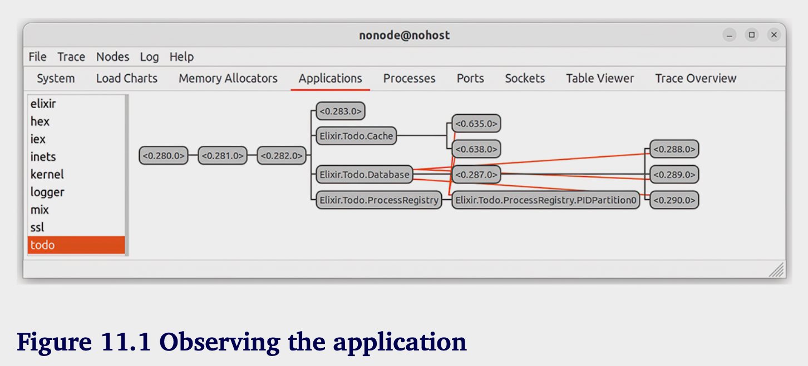
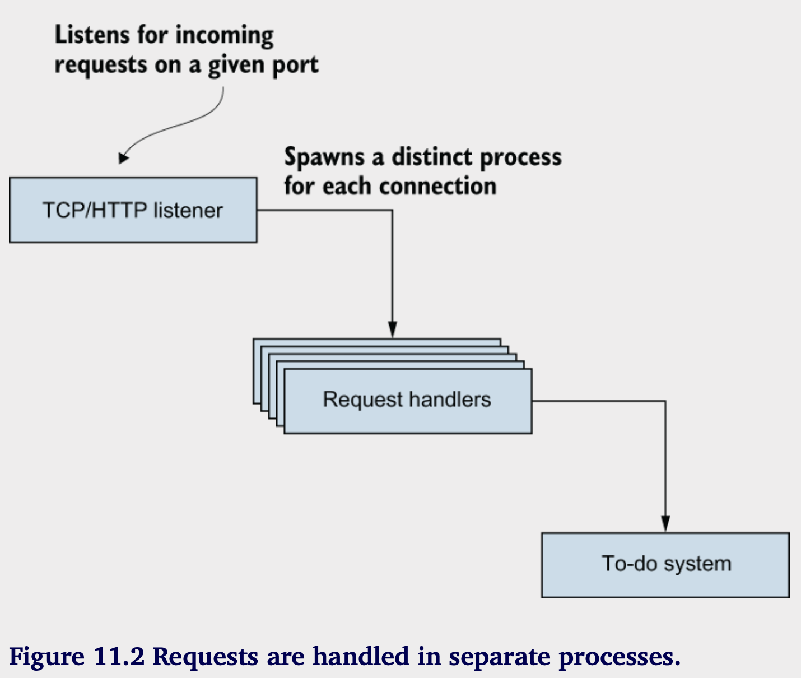
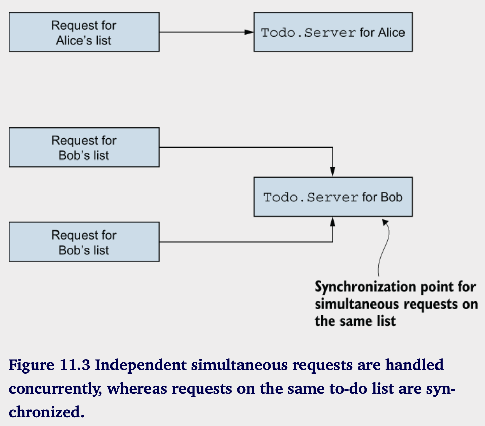
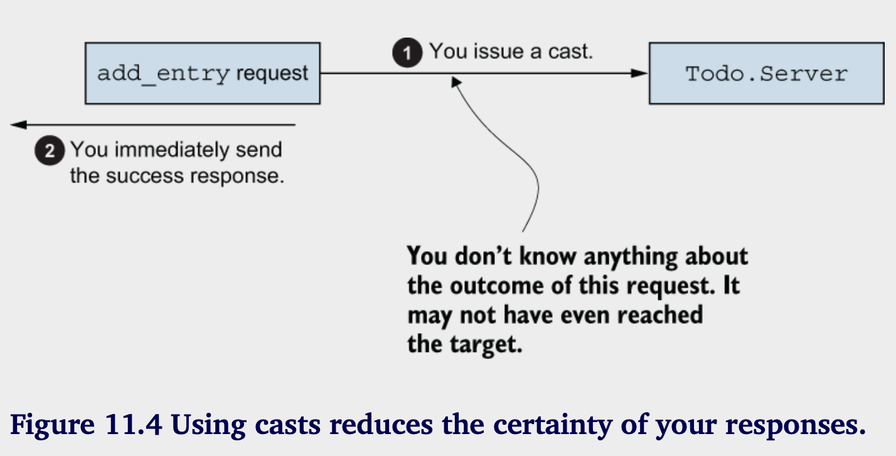
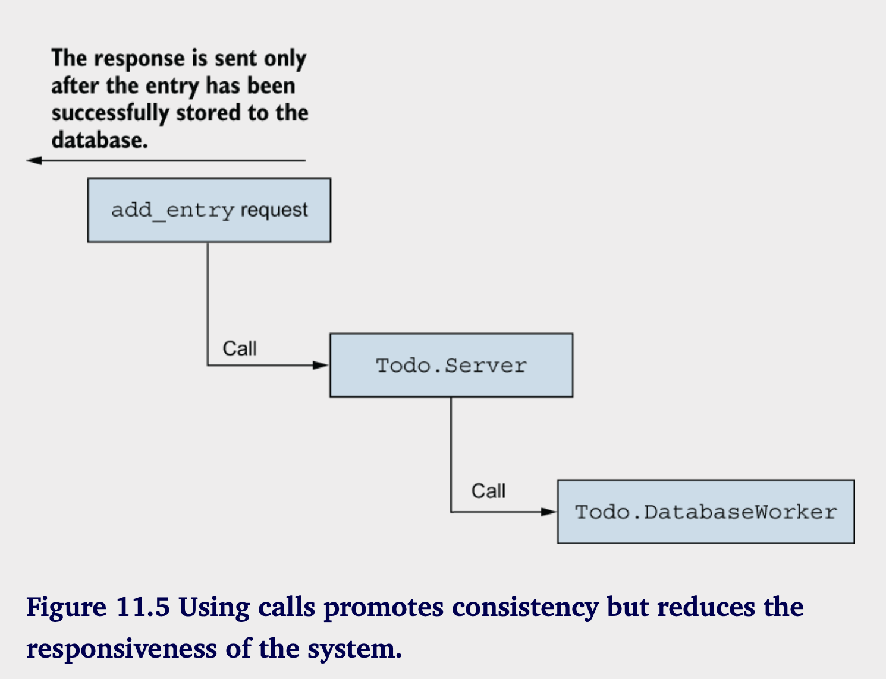
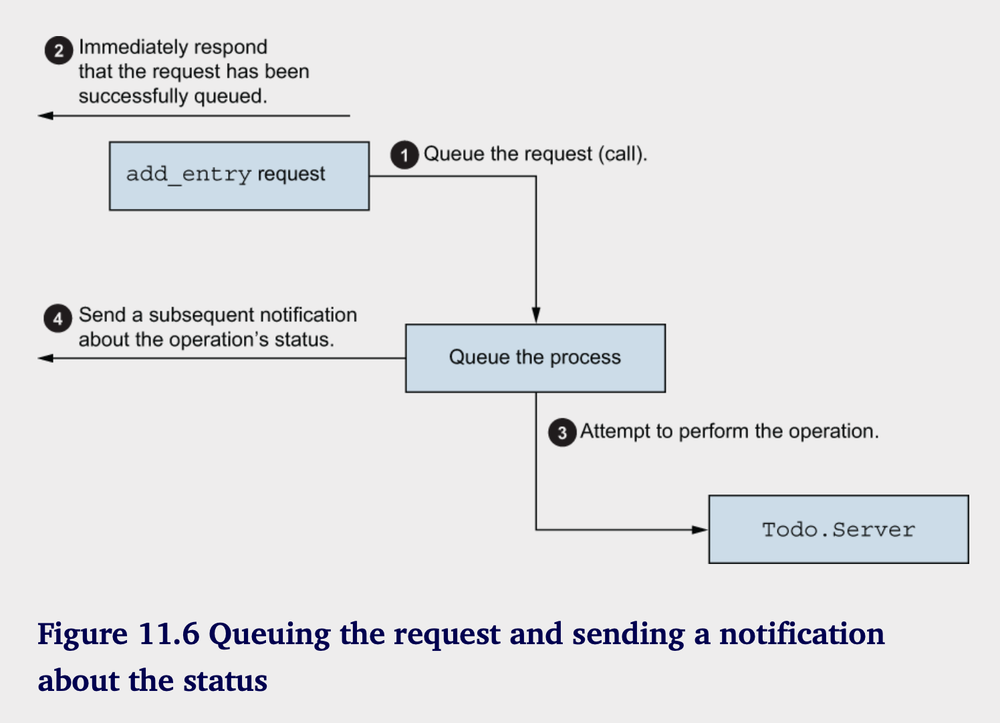

# Working with components

**本章涵盖：**

- 创建OTP应用
- 使用依赖
- 创建web服务器
- 配置应用

该是我们关注于生产可发布系统并进行部署的时候了。为了实现这个目标，您需要学习关于OTP应用程序的知识，它可以让您将系统组织为可重用的组件。应用程序是构建Elixir或Erlang生产系统和库的标准方式。依靠它们带来了多种好处，例如：依赖管理；简化系统启动；以及构建独立的、可部署的发布版本的能力。

在本章中，您将学习如何创建应用程序并处理依赖关系。在此过程中，您将把您的待办事务系统转变为一个完整的OTP应用程序，并使用一些来自Erlang和Elixir生态系统的第三方库，为现有系统暴露一个HTTP接口。前方还有很多工作，所以让我们开始学习OTP应用程序吧。


## 11.1 OTP应用

一个OTP应用程序是由多个模块组成的组件，并且可以依赖于其他应用程序。这使得通过单个函数调用启动整个系统成为可能。正如你将看到的，将代码转换为应用程序相对简单。你当前版本的待办事项系统已经是一个OTP应用程序，但有一些小细节可以改进。你将很快看到这一点；首先，让我们看看OTP应用程序的组成部分。

### 11.1.1 使用mix创建应用

一个应用程序是一个特定于OTP的构造。定义应用程序的资源称为应用程序资源文件——一个用Erlang术语编写的纯文本文件，描述了该应用程序。（别担心；你不需要直接编写这个。你将依赖mix工具为你完成这项工作）。该文件包含几个信息，例如：

- 应用程序的名称和版本，以及描述

- 应用程序模块的列表

- 应用程序依赖项的列表（这些依赖项本身也必须是应用程序）

- 一个可选的应用回调模块

依赖于 mix 工具可以简化和自动化生成应用程序资源文件的一些工作。例如，应用程序资源文件必须包含所有应用程序模块的列表。当你使用 mix 时，这个列表会根据源代码中定义的模块自动生成。

当然，某些信息，比如应用程序名称、版本和描述，必须由你提供。然后，mix 工具可以使用这些数据和你的源代码来在编译项目时生成相应的资源文件。

让我们来看一下实际操作。去一个临时文件夹，运行 `mix new hello_world --sup`。这个命令会创建一个包含最小 Mix 项目骨架的 hello_world 文件夹。参数 `--sup` 使 mix 工具生成应用程序回调模块，并从中启动空的（没有子进程的）监督者。

你现在可以切换到 hello_world 文件夹，并使用熟悉的 `iex -S mix` 来启动系统。在表面上，似乎没有什么特别的事情发生。但是 mix 会自动启动你的应用程序，你可以通过调用 `Application.started_applications/0` 来验证这一点。

```shell
iex(1)> Application.started_applications()
[
  {:iex, ~c"iex", ~c"1.15.0"},
  {:hello_world, ~c"hello_world", ~c"0.1.0"},    
  {:logger, ~c"logger", ~c"1.15.0"},
  {:mix, ~c"mix", ~c"1.15.0"},
  {:elixir, ~c"elixir", ~c"1.15.0"},
  {:compiler, ~c"ERTS  CXC 138 10", ~c"8.3"},
  {:stdlib, ~c"ERTS  CXC 138 10", ~c"5.0"},
  {:kernel, ~c"ERTS  CXC 138 10", ~c"9.0"}
]
```

如您所见，hello_world 应用程序正在运行，同时还有一些其他应用程序，如 Elixir 的 mix、iex 和 elixir，以及 Erlang 的 stdlib 和 kernel。
您很快就会看到这些的好处，但首先，让我们看看应用程序是如何被描述的。您指定应用程序的主要位置是在 mix.exs 文件中。以下是生成文件的完整内容（注释已删除）：

```elixir
defmodule HelloWorld do
  use Mix.Project

  def project do
   [
    app: :hello_world,
    version: "0.1.0",
    elixir: "~> 1.15",
    start_permanent: Mix.env() == :prod,
    deps: deps()
   ]
  end

  def application do
    [
     extra_applications: [:logger]
     mod: {HelloWorld.Application, []}
    ]
  end

  defp deps do
    []
  end   
end
```

第一个有趣的事情发生在 `project/0` 函数中，在那里你描述了 Mix 项目。 `app: :hello_world` 为你的应用程序命名。应用程序名称仅允许使用原子，并且你可以在运行时使用这个原子来启动和停止应用程序。

应用程序在 `application/0` 函数中被描述。这里，你指定一些选项，最终这些选项会写入应用程序资源文件。在这个例子中，描述包括你依赖的其他 Erlang 和 Elixir 应用程序的列表，以及将用于启动应用程序的模块。默认情况下，Elixir 的 `:logger` 应用程序被列出（https://hexdocs.pm/logger/Logger.xhtml）。

最后，`deps` 函数返回第三方依赖项的列表—即你希望在项目中使用的其他库。默认情况下，这个列表是空的。你稍后将在本章中看到如何使用依赖项。

### 11.1.2 应用行为

应用程序描述的关键部分是 `mod: {HelloWorld.Application, []}`，在 mix.exs 中由 `application/0` 提供。这个部分指定了将用于启动应用程序的模块。当应用程序启动时，将调用函数 `HelloWorld.Application.start/2`。

显然，您需要实现 `HelloWorld.Application` 模块。这一步由 mix 工具为您完成，让我们看看它的样子：

```elixir
defmodule HelloWorld.Application do
  use Application

  def start(_type, _args) do
    children = []
    opts = [strategy: :one_for_one, name: HelloWorld.Supervisor]
    Supervisor.start_link(children, opts)
  end
end
```

应用程序是一个 OTP 行为，由 Application 模块支持（https://hexdocs.pm/elixir/Application.xhtml），它是 Erlang 的 :application 模块（https://www.erlang.org/doc/man/application.xhtml） 的一个包装器。要使用 Application，您必须实现自己的回调模块并定义一些回调函数。

至少，您的回调模块必须包含 start/2 函数。传递的参数是应用程序启动类型（您通常会忽略）和一个任意参数（在 mix.exs 中的 mod 键下指定的一个术语）。有关详细信息，请参阅官方文档（https://hexdocs.pm/elixir/Application.xhtml#c:start/2）。

start/2 回调的任务是启动您系统的顶级进程，这通常应该是一个监督者。该函数以 {:ok, pid} 或 {:error, reason} 的形式返回其结果，如果发生错误。

### 11.1.3 启动程序

要在运行的 BEAM 实例中启动应用程序，可以调用 Application.start/1。这个函数首先查找应用程序资源文件（由 mix 生成）并解释其内容。然后，它会验证您所依赖的所有应用程序是否已启动。最后，通过调用回调模块的 start/2 函数来启动应用程序。此外，还可以使用 Application.ensure_all_started/2 函数，它会递归启动所有尚未启动的依赖项。

通常情况下，您不需要调用这些函数，因为 mix 会自动启动项目实现的应用程序。调用 iex -S mix 会自动启动应用程序及其依赖项。

请注意，您无法启动单个应用程序的多个实例。尝试启动已经运行的应用程序将返回错误：

```shell    
iex -S mix

iex(1)> Application.ensure_all_started(:hello_world)
{:error, {:already_started, :hello_world}}
```
可以使用`Application.stop/1`停止应用：

```shell
iex(1)> Application.stop(:hello_world)
[info] Application :hello_world exited: :stopped
```

停止应用程序会终止其顶层进程。如果该进程是一个监督者，它将在停止自身之前停止自己的子进程。这就是为什么在监督树中组织进程如此重要，如第9章所述。这样可以确保应用程序以受控的方式停止，不留下悬空的进程。

Application.stop/1 仅停止指定的应用程序，保持依赖项（其他应用程序）运行。为了以受控的方式停止整个系统，您可以调用 System.stop/0。此函数将关闭所有的 OTP 应用程序，然后关闭 BEAM 实例。Application.stop/1 和 System.stop/0 都以礼貌的方式工作。监督树中的每个进程都可以在其 terminate/2 回调中执行一些最终清理，如第9.1.6节所述。

### 11.1.4 Library应用

您不需要在 `mix.exs` 中的 `application/0` 函数中提供 `mod: ... `选项:

```elixir
defmodule HelloWorld.Application do
  ...

  def application do
    []
  end 
  ...
end
```

在这种情况下，没有应用程序回调模块，这意味着没有顶层进程可供启动。这仍然是一个合适的OTP应用程序。你甚至可以启动和停止它。

这样的应用程序有什么目的呢？这种技术用于库应用程序——不需要创建自己的监督树的组件。顾名思义，这些通常是库，如JSON或CSV解析器。Erlang的STD库应用程序（https://erlang.org/doc/apps/stdlib/index.xhtml）是一个纯库应用程序，因为它暴露了各种实用模块，但不需要管理自己的监督树。

库应用程序很有用，因为你可以将它们列为运行时依赖项。这在你开始组装可部署的发布版本时起着重要作用，正如你将在第13章看到的那样。

### 11.1.5 实现应用回调

具备了这些知识后，您可以将待办事项系统转变为一个完整的应用程序。如前所述，它已经是一个OTP应用程序，尽管它是一个库，没有实现应用程序行为的回调模块。实际上，一个Mix项目与一个OTP应用程序之间通常是1:1的关系。一个Mix项目恰好实现一个OTP应用程序。一个例外是所谓的“伞形项目”，它可以包含多个OTP应用程序。

鉴于待办事项系统在一个监督树下运行自己的进程集，实现应用程序回调模块是合乎逻辑的。完成这一步后，系统可以在您运行 iex -S mix 时自动启动。

您需要做的第一件事是编辑 mix.exs 文件。回想一下，您在第七章中使用 mix 工具创建了初始项目。因此，您已经有这个文件，只需添加一些信息即可。以下列表提供了 mix.exs 的完整代码。

```elixir
# Listing 11.1 Specifying applicaiton parameters (todo_app/mix.exs)
defmodule Todo.MixProject do
  use Mix.Project

  def project do
   [
    app: :todo,
    version: "0.1.0",
    elixir: "~> 1.15",
    start_permanent: Mix.env() == :prod,
    deps: deps()
   ]
  end

  def application do
    [
      mod: {Todo.Application, []},
      extra_applications: [:logger]
    ]
  end

  defp deps do
    []
  end

end
```

对 mix.exs 唯一的更改是在 application/0 函数中，指定了回调模块。接下来，您需要实现回调模块。代码如下:

```elixir
# Listing 11.2 Implementing the application module (todo_app/lib/todo/application.ex)
defmodule Todo.Application do
  use Application

  def start(_type, _args) do
    Todo.System.start_link()
  end
end
```

正如之前提到的，启动应用程序就像启动顶级监控器一样简单。考虑到您已经将系统结构安排在 Todo.System 监控器下，这就是将系统转变为完整 OTP 应用程序所需的一切。让我们看看实际情况:

```shell
$ iex -S mix

Starting database server
Starting database server
Starting database server
Starting todo cache
```

通过实现OTP应用程序回调，您可以使系统自动启动。值得注意的是，在运行测试时您也能获得相同的好处。当您调用mix test时，系统中的所有基本进程都会启动。在第7章中，当您添加了一些测试时，您必须手动启动缓存进程：

```elixir
defmodule Todo.CacheTest do
  use ExUnit.Case

  test "server_process" do
    {:ok, cache} = Todo.Cache.start()
    bob_pid = Todo.Cache.server_process(cache, "bob")

    assert bob_pid != Todo.Cache.server_process("alice")
    assert bob_pid == Todo.Cache.server_process("bob")
    end
    ...
end
```

代码经过了多次变换，但在每个版本中都存在前一个模式的某种形式。在 Todo.CacheTest 内，您需要手动启动支持进程，如缓存。现在系统已转变为一个正式的 OTP 应用程序，这不再是必要的，您可以在以下列表中看到这一点。

### 11.1.6 应用目录结构

让我们简要讨论一下你编译后的应用程序的文件夹结构。由于使用了构建工具，你通常不需要担心这个，但有时理解编译系统的文件夹结构是有用的。

**MIX ENVIRONMENTS**

在您查看应用程序结构之前，您应该先了解一些关于 Mix 环境的基本知识。Mix 环境是一个编译时选项，可以用来影响编译后代码的形状。Mix 项目使用三种环境：开发 (dev)、测试 (test) 和生产 (prod)。这三种环境会在编译的代码中产生细微的变化。

例如，在为开发环境编译的版本（dev 环境）中，您可能希望运行一些额外的调试日志，而在为生产环境编译的版本（prod 环境）中，您则不希望包含这样的日志。在为测试环境编译的版本（test 环境）中，您希望进一步减少日志的数量，并使用不同的数据库，以防测试污染您的开发数据库。

如果您愿意，可以引入自己的 Mix 环境，但这通常是很少需要的。如果您有这三个环境，应该足以覆盖所有可能的场景。对于大多数 mix 任务，默认环境是 dev，表明您正在处理开发。然而，这一规则的一个例外是测试任务。当您调用 mix test 时，Mix 环境会自动设置为 test。

您可以通过设置 MIX_ENV 操作系统环境变量来指定 Mix 环境。根据约定，在构建生产版本时，您应该使用 prod 环境。要为 prod 编译代码，您可以调用 `MIX_ENV=prod mix compile`。要编译并启动 prod 版本，您可以调用 `MIX_ENV=prod iex -S mix`。

prod 环境常常让人感到困惑。许多团队将 prod 与生产机器混为一谈。实际上，prod 版本确实在生产机器上运行，但它也会在其他机器上运行，例如在预发布环境上。最重要的是，应该能够简单地在本地开发机器上启动一个为 prod 编译的版本。您不会频繁需要这样做，但偶尔分析系统的行为，使其尽可能接近已部署的生产版本是很有用的。这正是 prod 编译版本的用途。因此，建议您支持在本地运行 prod 编译版本。从项目开始时就致力于这个目标，因为在代码库显著增长后再这样做通常会更加困难。

**THE COMPILED CODE STRUCTURE**

一旦编译了你的项目，编译后的二进制文件将位于 _build/project_env 文件夹中，其中 project_env 是编译时所用的 Mix 环境。

由于 dev 是默认环境，如果你运行 mix compile 或 iex -S mix，二进制文件将保存在 _build/dev 文件夹中。OTP 本身推荐以下文件夹约定：

```markdown
lib/
  App1/
    ebin/
    priv/
  App2/
    ebin/
    priv/
  ...
```

这里，App1 和 App2 代表应用程序名称（例如 todo）。ebin 文件夹包含编译后的二进制文件（.beam 文件和应用资源文件），而 priv 文件夹包含特定于应用程序的私有文件（图像、编译的 C 二进制文件等）。这不是一个强制性结构，但这是大多数 Elixir 和 Erlang 项目中使用的惯例。一些工具可能依赖于这个结构，因此最好遵循这个惯例。

幸运的是，您不需要自己维护这个结构，因为 mix 会自动处理。编译后 Mix 项目的最终文件夹结构如下：

```markdown
YourProjectFolder/
  _build/
    dev/
      App1/
        ebin/
        priv/
      App2/
        ebin/
        priv/
      ...
```

除了您的应用程序外，lib 文件夹还包含应用程序的依赖项，标准的 Elixir 和 Erlang 应用程序除外，这些标准应用程序位于 Elixir 和 Erlang 安装的文件夹中，并可以通过加载路径访问。

正如前面提到的，应用程序资源文件位于 lib/YourApp/ebin，并命名为 YourApp.app。对于待办事项系统，该文件位于 _build/dev/lib/todo/ebin/（相对于项目根文件夹）。当您尝试启动应用程序时，通用应用程序行为会在加载路径中查找资源文件（这些路径与搜索编译后的二进制文件的路径相同）。

这就结束了我们对应用程序基础的讨论。既然您对一些理论有了了解，接下来我们来看看如何处理依赖项。

---

**可部署系统**

应用程序在构建可部署系统中扮演着重要角色。你将在第13章中了解到这一点，我们将讨论OTP发布。简而言之，基本的想法是组装一个最小的自包含系统，该系统仅包含所需的应用程序和Erlang运行时。为了实现这一点，你必须将代码转变为OTP应用程序，因为只有这样你才能指定对其他应用程序的依赖关系。这最终用于将所有所需的应用程序打包成一个可部署的发布版本。  
因此，Elixir和Erlang中任何可重用的东西都应该位于一个应用程序中。这对于Elixir和Erlang都是适用的：例如elixir应用程序，它将Elixir标准库与iex和mix打包在一起，而iex和mix是作为单独的应用程序实现的。Erlang也是如此，它被分为许多应用程序（https://www.erlang.org/doc/applications.xhtml），如kernel和stdlib。

---

## 11.2 依赖项

依赖第三方库是一个重要的特性。随着你开始开发更复杂的项目，你可能会想使用各种库，比如网页框架、JSON解析器和数据库驱动等。这些库可以简化各种附带问题，防止你陷入过多的细节中，让你可以集中精力解决系统的核心挑战。

例如，在当前的待办事项系统实现中，你维护了一小组数据库工作进程，这使得你能够对数据库操作进行可控的并行处理。你在第七章时完全从头实现了这个池。实际上，管理进程池是Elixir和Erlang中的一个常见模式，因此有一些第三方库提供了解决这个挑战的方案。在本章中，你将用一个经过验证和战斗测试的进程池库来替换你朴素的进程池实现。

### 11.2.1 添加依赖

在本节中，您将向 Poolboy 库（https://github.com/devinus/poolboy）添加一个依赖项。该库提供了一个成熟的进程池实现。对外部库的依赖必须在 mix.exs 文件中指定，如下一个列表所示。

```elixir
# Listing 11.4 Adding an external dependency (todo_poolboy/mix.exs)
defmodule Todo.MixProject do
  ...

  defp deps do
   [
    {:poolboy, "~> 1.5"}
   ]
   end
end
```

外部依赖被指定为一个元组。第一个元素总是一个原子，应该对应于依赖项的应用名称。元组中的第二个元素“~> 1.5”是版本要求。在这里，你表示你想要1.5版本或任何更高的1.x版本。有关版本语法的更多信息，请查看官方文档 https://hexdocs.pm/elixir/Version.xhtml#module-requirements。
在这个阶段，你已经指定了你的项目依赖于一个外部库，所以你需要获取你的依赖。可以通过在命令行中运行 `mix deps.get` 来完成。依赖是通过 Elixir 的外部包管理工具 Hex（https://hex.pm）获取的。其他可能的依赖来源包括 GitHub 仓库、Git 仓库或本地文件夹。有关更多信息，请查看官方文档：https://hexdocs.pm/mix/Mix.Tasks.Deps.xhtml。

运行 `mix deps.get` 会递归地获取所有依赖，并在 `mix.lock` 文件中存储每个依赖的确切版本引用，除非 `mix.lock` 文件已经存在于磁盘上——在这种情况下，会参考该文件来获取正确的依赖版本。这确保了在不同机器上可重复的构建，因此请确保将 `mix.lock` 包含在你项目所在的源代码管理中。

现在你已经获取了所有依赖，可以通过运行 `mix compile` 来构建整个系统，这将编译所有依赖和项目。值得一提的是，Poolboy 是一个 Erlang 库，但 `mix` 仍然知道如何编译它。

### 11.2.2 适配pool

在这些准备就绪后，您可以开始适应池的实现。使用 Poolboy 需要启动一个叫做池管理器的进程，它管理一个工作者池。在启动池管理器时，您需要传递所需的池大小（工作进程的数量）和为每个工作者提供动力的模块。在启动过程中，池管理器将其子进程作为工作进程启动。

其他进程可以请求池管理器提供一个工作者的进程ID（PID）。这个操作称为检查出（checkout）。一旦一个进程获取到工作者的 PID，它就可以向该工作者发出请求。当客户端进程不再需要该工作进程时，它会通知池管理器。这个操作称为检查入（checkin）。

这个工作流程比你自己的简单池子要复杂一些。检查和归还操作允许池管理器跟踪哪些工作进程正在被使用。如果有一些工作者可用，客户端可以立即获取一个工作者。否则，如果所有工作者都被借出，客户端就需要等待。第一位归还工作者到池子的客户端会立即借出那个工作者。  
Poolboy 还依赖监视器和链接来检测客户端的终止。如果客户端借出一个工作者后崩溃，池管理进程会检测到这一点并将工作者返回到池中。同样，如果工作者进程崩溃，则会启动一个新的工作者。  
掌握了这些知识后，您将适应池。首先，您需要在监控树中的某处启动池管理器。您可以通过调用 :poolboy.start_link 来实现，但还有一种略微优雅的方法。您可以调用 :poolboy.child_spec/3，它描述了如何启动 Poolboy。因此，要将数据库切换到 Poolboy 驱动的池，您只需更改 Todo.Database.child_spec/1 的实现。


```elixir
# Listing 11.5 Starting a Poolboy-powered pool (todo_poolboy/lib/todo/database.ex)
defmodule Todo.Database do
  @db_folder "./persist/"
  def child_spec(_) do
    File.mkdir_p!(@db_folder)

    :poolboy.child_spec(
      __MODULE__,
      [
        name: {:local, __MODULE__},
        worker_module: Todo.DatabaseWorker,
        size: 3
      ],
      [@db_folder]
    )
  end

  ...
end
```

传递给`:poolboy.child_spec/3`的第一个参数是子进程的ID。这个信息对父监督者是必要的。在这里，你使用模块名称(Todo.Database)作为ID。

第二个参数是池选项。`:name`选项表示池管理进程应该被本地注册，这样你就可以在不知道它的PID的情况下与之交互。`:worker_module`选项指定将为每个工作进程提供支持的模块，而`:size`指定池的大小。

传递给`:poolboy.child_spec/3`的最后一个参数是一个参数列表，这些参数在每个工作进程启动时被传递给start_link。这些参数表示你希望有三个工作进程，每个工作进程由Todo.DatabaseWorker模块提供支持。池管理器将通过调用Todo.DatabaseWorker.start_link(@db_folder)来启动每个工作进程。

值得注意的是，随着这个改变，你不再需要Todo.Database.start_link，因为新的规范表明数据库应该通过调用`:poolboy.start_link`来启动。

接下来，你需要调整Todo.Database的store和get函数。之前，这些函数选择一个工作进程ID，然后将这个ID转发到Todo.DatabaseWorker模块中的相应函数。现在，这些函数需要从池中借出一个工作进程，向工作进程发出请求，然后将工作进程归还到池中。所有这些都可以通过`:poolboy.transaction/2`函数轻松完成。

```elixir
# Listing 11.6 Adapted operation functions (todo_poolboy/lib/todo/database.ex)
defmodule Todo.Database do
  ...
  def store(key, data) do
    :poolboy.transaction(
      __MODULE__,
      fn worker_pid ->
        Todo.DatabaseWorker.store(worker_pid, key, data)
      end
    )
  end

  def get(key) do
    :poolboy.transaction(
      __MODULE__,
      fn worker_pid ->
        Todo.DatabaseWorker.get(worker_pid, key)
      end
    )
  end

  ... 
end
```

在这里，您调用 :poolboy.transaction/2 方法，传入池管理器的注册名称。这将发出一个检查请求以获取一个工作线程。一旦工作线程可用，提供的 lambda 就会被调用。当 lambda 执行完毕时，:poolboy.transaction/2 将把工作线程返回到池中。

在提供的 lambda 中，您获取到已检查工作线程的 PID，并发出 Todo.DatabaseWorker 请求。这意味着您需要稍微改变 Todo.DatabaseWorker 的实现。之前，此模块中的函数接受一个工作线程 ID，然后进行注册查找以找到工作线程进程。在这个版本中，PID 的发现由池来完成，因此您不再需要注册工作线程或进行任何查找来发现进程。

```elixir
# Listing 11.7 Adapted worker interface
defmodule Todo.DatabaseWorker do
  use GenServer

  def start_link(db_folder) do
    GenServer.start_link(__MODULE__, db_folder)
  end

  def store(pid, key, data) do
    GenServer.cast(pid, {:store, key, data })
  end

  def get(pid, key) do
    GenServer.call(pid, {:get, key})
  end
end
```

这就是改变池实现所需要的全部。客户端模块中的代码，Todo.System 和 Todo.Server，以及测试代码，保持完全不变。这要归功于你将实现细节隐藏在接口函数之后。

### 11.2.3 系统可视化

当您拥有一个完整的OTP应用程序时，可以借助一个名为observer的工具来对其进行可视化，该工具是标准Erlang/OTP发行版的一部分。

让我们看看这个怎么运作。首先，启动系统，然后创建两个待办事项服务器：

```elixir
iex -S mix

iex(1) > Todo.Cache.server_process("Alice")
iex(1) > Todo.Cache.server_process("Bob")
```

现在可以启动observer工具：

```elixir
iex(3) > :observer.start()
```

应该会出现一个GUI窗口，显示系统的一些基本信息。点击应用程序选项卡，您可以查看您的应用程序的监控树，如图11.1所示:



这两个顶级进程，进程 ID <0.280.0> 和 <0.281.0> 是 OTP 用于管理应用程序的进程。第三个进程，进程 ID <0.282.0> 是顶层的 Todo.System 监控者。接下来，你可以看到四个子进程：进程 ID <0.283.0>、Todo.Cache、Todo.Database 和 Todo.ProcessRegistry。

如果可用，观察器会使用进程的注册名称。否则，将使用进程的 PID 来显示该进程。在这个例子中，进程 ID <0.283.0> 是由 Todo.Metrics 模块提供支持的度量报送器。

在缓存之下，你可以看到两个子进程，它们是你刚刚从 shell 启动的待办事项服务器。你可以通过双击进程框并在新窗口中点击状态按钮轻松验证这一点。在最后一行，你会看到进程状态，其中将包含待办事项列表的名称。

观察工具对于可视化运行系统的行为非常有用。例如，在进程标签中，你可以看到系统中所有正在运行进程的列表，并轻松搞清楚哪些进程非常繁忙或消耗大量内存。这个标签常用于寻找系统中的瓶颈。你甚至可以使用观察器来可视化正在生产环境中运行的系统。这将在第十三章中解释。

## 11.3 搭建web服务器

时间终于到了，可以在你的待办事项系统中引入 HTTP 接口了。你将实现一个基础的服务器，只处理条目和添加条目的请求。

我们的重点不会太放在网络服务器的细节和精细处理上。相反，目的是展示你如何与 OTP 应用程序协作，并向你展示在一个简单的现实世界系统模拟中，所有内容是如何连接的。

### 11.3.1 选择依赖

你当然可以从头开始实现整个服务器，但那会太费劲。相反，你可以借助现有的几个库来简化工作。请注意，这一部分并不打算提供这些库的详细描述；它们只是简单的手段，目的是创建一个基本的工作 HTTP 服务器。我们鼓励你自己深入研究这些库。

在 Elixir 和 Erlang 中有几种可用的 web 服务器框架和库。如果你计划进行任何严肃的生产开发，绝对应该看看 Phoenix 框架（https://phoenixframework.org/）。Phoenix 是多功能且高度模块化的，适合驱动各种类型的 web 服务器。乍一看，Phoenix 可能会让人感到有些望而生畏，因此我们会在这里简单一些，使用两个较低级的库。

第一个是一个名为 Cowboy 的 Erlang 库（https://github.com/extend/cowboy）。这是一个相对轻量且高效的 HTTP 服务器库，在 Erlang 和 Elixir 生态系统中非常受欢迎。

但你不会直接使用 Cowboy。相反，你将通过 Plug 库（https://github.com/elixir-lang/plug）与其接口，该库提供了一个统一的 API，隐藏了实际 HTTP 服务器实现的细节。

你可以通过一个依赖将这两个库添加到你的项目中。

```elixir
# Listing 11.8 External dependencies for the web server(todo_web/mix.exs)
defmodule Todo.Mixfile do
  ...

  defp deps do
    [
      {:poolboy, "~> 1.5"},
      {:plug_cowboy, "~> 2.6"}
    ]
  end
end
```

我们添加了一个新的依赖项，名为 plug_cowboy。这个库为 Plug 和 Cowboy 提供了集成代码。在内部，这个库依赖于 Plug 和 Cowboy 库，因此它们是我们项目的间接依赖。我们不需要明确列出它们，mix 工具可以自动解析这些依赖。

### 11.3.2 启动服务器

配置好依赖后，您现在可以运行 `mix deps.get` 并开始实现 HTTP 接口。如前所述，您与 Cowboy 一起工作时的主要接口是 Plug。Plug 是一个相对复杂的库，我在这里不会提供深入的讲解。我们的重点是让基本版本运行起来，并理解所有组件如何协同工作。

要启动一个由 Plug 和 Cowboy 驱动的服务器，您可以调用 `Plug.Cowboy.child_spec/1`。这个函数返回一个子规格，描述如何启动负责系统 HTTP 服务器部分的进程。和往常一样，最好将其包装在一个专门的模块中。

```elixir
# Listing 11.9 HTTP server specification(todo_web/lib/web.ex)
defmodule Todo.Web do
  ...

  def child_spec(_args) do
    Plug.Cowboy.child_spec(
      scheme: :http,
      options: [port: 5454],
      plug: __MODULE__,
    )
  end
end
```

传递给 `Plug.Cowboy.child_spec/1` 的参数提供了服务器选项。在这里，您指定要在端口5454上提供HTTP流量。最后一个选项 `:plug` 表示将调用该模块中的某个函数来处理请求。

当您在一个监督者中包含 `Todo.Web` 时，将启动几个新进程。至少会有一个进程监听特定端口并接受请求。然后，每个不同的TCP连接将由一个单独的进程处理，您的回调（您必须实现）将在与请求相关的进程中被调用。但您不需要担心这些细节。由于 `child_spec/1`，Plug库将这些内部实现保持在自身之中。

请注意，应用程序是单例——您在运行的BEAM实例中只能启动一个独立应用程序的实例。但这并不意味着您的系统中只能运行一个HTTP服务器。Plug和Cowboy应用程序可以被视为HTTP服务器的工厂。当您启动这些应用程序时，实际上还没有启动任何HTTP服务器。您使用 `child_spec/1` 在您的监督树中注入一个HTTP服务器。当然，您可以在您的系统中运行多个HTTP服务器。例如，您可以添加另一个HTTP服务器用于管理目的。

有了 `child_spec/1`，您可以将HTTP服务器注入到监督树中。这在 `Todo.System` 监督者中完成。

```elixir
# Listing 11.10 Starting the HTTP server (todo_web/lib/system.ex)
defmodule Todo.System do
  def start_link() do
    Supervisor.start_link(
      [
        Todo.Metrics,
        Todo.ProcessRegistry
        Todo.Database,
        Todo.Cache,
        Todo.Web
      ],
      strategy: :one_for_one
    )
  end
end 
```

感谢包装和适当的命名，Todo.System模块清晰地描述了系统的组成：度量、进程注册、数据库、缓存和Web服务器。

### 11.3.3 处理请求

现在，你可以开始处理一些请求了。让我们为 add_entry 引入支持。这将是一个 POST 请求。为了保持实现简单，你将通过 URL 转移所有参数。示例请求如下所示：

```http
http://localhost:5454/add_entry?list=bob&date=2023-12-19&title=Dentist
```

首先为这个请求设置一个路由。接下来会提供框架。

```elixir
# Listing 11.11 Setting up a router for add_entry (todo_web/lib/web.ex)
defmodule Todo.Web do
  use Plug.Router

  plug :match
  plug :dispatch
  
  ...

  post "/add_entry" do
    ...
  end

  ...
end
```

这里有一些奇怪的结构，它们是使用 Plug 时的一部分。我会提供一个简单的解释，但你不需要理解这一切，因为这并不是本练习的目的。

调用 `use Plug.Router` 会向你的模块添加一些函数。这类似于你通过调用 `use GenServer` 来使用 Elixir 行为助手的大致方式。在大多数情况下，导入的函数将由 Plug 内部使用。

像 `plug :match` 和 `plug :dispatch` 这样的表达式值得特别提及。这些调用将在编译时执行一些额外的工作，使你能够匹配不同的 HTTP 请求。这些表达式是 Elixir 宏调用的示例，它们将在编译时解析。结果，你的模块将获得一些额外的函数（这些同样只由 Plug 使用）。

最后，你调用一个 `post` 宏来定义处理请求的代码。`post` 宏的工作原理类似于你在第七章看到的 `test` 宏。在后台，这个宏会生成一个由你通过调用 `plug` 宏和 `use Plug.Router` 获取的其他生成的样板代码所使用的函数。生成的函数大致如下所示：

```elixir
defp do_match(conn, "POST", ["add_entry"], _) do
  ...
end
```

生成的 `do_match` 函数的代码将包含传递给 `plug` 宏的代码。生成的 `do_match` 函数将由您模块中其他生成的代码调用，感谢使用 `Plug.Router` 和 `plug :match` 表达式。

如果你多次调用 post 宏，你将会有多个用于 do_match 函数的条件，每个条件对应你处理的单个路由。最终结果将类似于以下内容：

```elixir
defp do_match(conn, "POST", ["add_entry"], _) do: ...
defp do_match(conn, "POST", ["delete_entry"], _) do: ...
...
defp do_match(conn, _, _, _) do: ...
```

你可以使用一个叫做 decompile 的工具自己检查这个 (https://github.com/michalmuskala/decompile)。根据 README 的说明安装工具，切换到待办项目的根文件夹，编译项目，然后运行 `mix decompile Todo.Web --to expanded`。这将生成文件 Elixir.Todo.Web.ex，其中包含在所有宏扩展后生成的 Elixir 代码。

简而言之，当发送到你服务器的 HTTP POST 请求路径为 /add_entry 时，你提供的处理代码会被调用。

现在让我们来看一下请求处理程序的实现。

```elixir
# Listing 11.12 Implementing the add_entry request (todo_web/lib/todo/web.ex)
defmodule Todo.Web do
  ...
  post "/add_entry" do
    conn = Plug.Conn.fetch_query_params(conn)
    list_name = Map.fetch!(conn.params, "list")
    title = Map.fetch!(conn.params, "title")
    date = Date.from_iso8601!(Map.fetch!(conn.params, "date"))

    list_name 
    |> Todo.Cache.server_process()
    |> Todo.Server.add_entry(%{tile: title, date: date})

    conn
    |> Plug.Conn.put_resp_content_type("text/plain")
    |> Plug.Conn.send_resp(200, "OK")
  end
    ...

```

请注意，在请求处理程序中，您使用了 conn 变量，但该变量并不存在于任何地方。这个变量是由 post 宏提供的，后者生成该变量并将其绑定到正确的值。

顾名思义，conn 变量保存您的连接。它是一个 Plug.Conn 结构体的实例，包含一个 TCP 套接字以及有关您正在处理的请求状态的信息。在您的处理程序代码中，您必须返回修改后的连接，该连接将包含响应信息，例如状态和主体。

请求处理程序的实现由三个部分组成。您首先解码输入参数。然后，您调用执行系统中某些操作的代码——在这种情况下，添加新条目。最后，您响应客户端。

要解码输入参数，您需要调用 Plug.Conn.fetch_query_params/1。此函数返回一个新版本的连接结构，其中的 params 字段包含请求参数（以映射的形式）。这本质上是一种缓存技术。Plug 在连接结构中缓存 fetch_query_params 的结果，因此对 fetch_query_params 的重复调用不会导致过度解析。

一旦您准备好参数，就可以添加条目。最后，您设置响应的内容类型、状态和主体。

同样的方法用于处理条目请求。

```elixir
# Listing 11.13 Implementing the entries request(todo_web/lib/todo/web.ex)
defmodule Todo.Web do
  ...
  get "/entries" do
    conn = Plug.Conn.fetch_query_params(conn)
    list_name = Map.fetch!(conn.params, "list")
    date = Date.from_iso8601!(Map.fetch!(conn.params, "date"))

    entries = 
      list_name
      |> Todo.Cache.server_process()
      |> Todo.Server.entries(date)

    formatted_entries =
      entries
      |> Enum.map(& &1.title)
      |> Enum.join("\n")

    conn
    |> Plug.Conn.put_resp_content_type("text/plain")
    |> Plug.Conn.send_resp(200, formatted_entries)
  end
end
```

这段代码与add_entry的实现方式相同。由于entries是一个GET请求，因此你使用get宏而不是post。

在这个实现中，你解码参数，然后获取所需的条目。然后你生成发送给客户端的文本表示，并返回响应。

注意，所呈现的代码组织将HTTP服务器视为系统核心的一个接口。请注意，在这两个请求中，你将输入转换为特定于领域的类型，然后调用与HTTP无关的代码，例如Todo.Server.add_entry，以执行操作。这部分代码在前几章中实现，不知道也不关心它是在HTTP请求的上下文中运行的。这种关注点分离使得代码更易于处理、测试和扩展。

此时，你可以使用`iex -S mix`启动系统并发出请求。例如，使用命令行curl工具，你可以得到以下结果：

```shell
$ curl -d "http://localhost:5454/add_entry?list=bob&date=2023-12-19&title=Dentist"
OK

$ curl -d "http://localhost:5454/entries?list=bob&date=2023-12-19"
2023-12-19 Dentist
```

这证明了你的系统正在工作，但我们来看看一切是如何结合在一起的。

### 11.3.4 推理系统

首先，让我们看看HTTP服务器是如何工作的。简化的概念在图11.2中进行了说明。



最重要的是要注意每个连接在一个独立的进程中管理。实际上，这意味着不同的请求在不同的进程中处理。这并没有什么特别的魔法——这就是底层 Cowboy 网络服务器的实现方式。它使用一个进程来监听端口，然后为每个传入的请求生成一个单独的进程。

这种架构由于 BEAM 处理进程的方式而具有各种好处。由于进程是并发的，CPU 资源被最大限度地利用，系统具有可扩展性。因为进程是轻量级的，所以可以轻松管理许多同时连接。此外，由于 BEAM 调度程序是抢占式的，您可以确信偶尔长时间运行的 CPU 密集型请求不会使整个系统瘫痪。最后，由于进程隔离，单个请求的崩溃不会影响系统的其余部分。

进程还使得推理系统变得简单。例如，您可以确信独立的请求不会互相阻塞，而在同一个待办事项列表上的多个请求是同步的，如图 11.3 所示。

  

这是由于待办事项缓存的工作方式。每当你想要操作Bob的列表时，首先会请求待办事项缓存返回负责该操作的进程的PID。所有对Bob列表的请求都通过同一个进程，因此是逐个处理的。

**PERFORMANCE**

经过如此多的开发，衡量系统性能是值得的。我使用一个叫做 wrk 的工具（https://github.com/wg/wrk）快速测试了系统。在我的机器上进行的简短30秒负载测试显示，吞吐量约为每秒40,000个请求，平均延迟为1毫秒，99百分位延迟为7毫秒。在测试运行期间，所有CPU核心都处于完全忙碌状态，这证明系统没有瓶颈。系统具有高度的并发性，能够充分利用所有可用核心。

观察到的结果相当不错，尤其是考虑到我们在实现中做出了一些简单的决定。以下是实现中可能存在的一些问题：

- 每次修改列表时，您都会存储整个列表。

- 基于日期的待办事项列表查询遍历整个列表。

- 每次待办事项服务器查询都经过一个动态的待办事项缓存监督器。

这里确实有一些改进的空间，但让人感到欣慰的是，系统在未经过任何细致调整的情况下表现良好。

**CALLS vs. CASTS**

让我们讨论一下调用和转换可能对你的系统产生的影响。为了帮助你回忆，转换是“发出后不再关注”的请求。调用者向服务器发送一条消息，然后立即继续做其他事情。相比之下，调用是一个阻塞请求，调用者会等待服务器的响应。

请记住，除了需要返回响应的操作外，你选择使用cast进行所有操作。这是一个相对任意的决定，主要是出于教学目的。实际上，cast有一个缺点：你不知道请求发生了什么。这反过来意味着你可能会给最终用户提供错误的响应，如图11.4所示。



由于您使用了类型转换来添加待办事项条目到您的系统中，因此您无法得知请求的处理结果。当您告诉最终用户您已成功时，这实际上是一个猜测，而不是真实的陈述。显然，解决此问题的简单方法是使用调用，这是一种同步操作，意味着客户端必须等到响应到达，如图11.5所示。



这种方法更一致：只有在确定条目已被存储时，才返回成功。但缺点是，整个系统现在依赖于数据库工作者的吞吐量，正如你可能记得的那样，你只运行了三个工作者，并且你使用的是一个相对低效的数据库。

可以通过引入一个中间过程来解决这个问题。这个想法是提供一个立即的响应，说明请求已被排队。然后，你尽力处理请求，并发送关于请求状态的后续通知（见图11.6）。



这个方案更加复杂和涉及，因此不适用于简单的情况，在那些情况下，仅使用普通调用就足够了。但在负载非常高、端到端操作可能需要更长时间的情况下，引入一个中间过程可能是有益的。这个过程可以提高系统的响应能力，同时保持一致性。此外，这个过程还可以作为一个积极的代理来应对拥堵和负载增加。如果系统超载并且队列开始堆积，您可以拒绝将更多请求放入队列处理，直到您重新获得一些喘息空间。

一如既往，没有单一的方法适用于所有情况。使用调用可以是一个合理的初步尝试，因为它促进了一致性。后来，您可以根据具体情况轻松切换到转换或引入一个中间过程。

如果您需要执行更复杂的负载管理，可以引入一个中间过程。您可以考虑使用 GenStage 库（https://github.com/elixir-lang/gen_stage），而不是自己实现解决方案，该库允许您构建各种生产者和消费者的管道。

在这一步，你已经完成了基本 HTTP 服务器的实现。接下来，我们将讨论应用程序配置。

## 11.4 应用程序配置

OTP 应用程序可以使用称为应用程序环境的特性进行配置—这是一种键值对存储在内存中，键是原子，值是 Elixir 术语。您可以通过配置脚本文件提供应用程序环境值—这些 Elixir 脚本位于 config 文件夹中。

mix 工具确保在启动应用程序之前，配置被加载到应用程序环境中。最后，您可以使用 Application 模块中的函数来检索环境值。

### 11.4.1 应用程序环境

让我们来看一个简单的例子。待办事项HTTP服务器当前监听一个硬编码的端口：5454。在这个例子中，您将通过操作系统环境变量使HTTP端口可配置。

设置应用程序环境的最典型方法是使用config/runtime.exs文件。这是一个在运行时评估的脚本，它在应用程序启动之前执行。在这里，您可以设置应用程序及其依赖项的环境配置。

为了使HTTP端口可配置，您可以从操作系统环境变量中读取配置，并将其存储到应用程序环境中。

```elixir
# Listing 11.14 Configuring the HTTP port (todo_env/config/runtime.exs)
import Config

http_port = System.get_env("TODO_HTTP_PORT", "5454")
config :todo, http_port: String.to_integer(http_port)
```

在这里，你使用 System.get_env/2 来读取操作系统环境变量 TODO_HTTP_PORT，如果变量未设置，则使用默认值 5454。然后，你使用导入的 Config.config/2 函数来配置 :todo 应用程序的 :http_port 设置。

当你启动系统后，这个设置在应用环境中可用，你可以检索它——例如，使用 Application.fetch_env!/2 函数：

```elixir
iex(1)> Application.fetch_env!(:todo, :http_port)
5454
```
启动应用之前设置环境变量：

```elixir
$ TODO_HTTP_PORT=1337 iex -S mix
 
iex(1)> Application.fetch_env!(:todo, :http_port)
1337
```

现在，您可以调整 Todo.Web 的代码，以便从应用程序环境中读取端口。

```elixir
defmodule Todo.Web do
  ...

  def child_spec(_arg) do
    Plug.Cowboy.child_spec(
      scheme: :http,
      options: [port: Application.fetch_env!(:todo, :http_port)],
      plug: __MODULE__,
    )
  end
end
```

在这种情况下，您可以使用 `Application.fetch_env!/2`，如果 HTTP 端口未配置，将会抛出错误。为了在未设置任何值时提供默认值，您可以使用 `Application.get_env/3`（https://hexdocs.pm/elixir/Application.xhtml#get_env/3）。

### 11.4.2 变更配置


在某些情况下，您可能希望在不同的 Mix 环境中使用不同的设置。例如，您当前在开发和测试中始终使用相同的 HTTP 端口。因此，如果待办事项系统在开发模式下启动，您就无法运行测试。解决这个问题的方法是在测试 Mix 环境中使用不同的 HTTP 端口。

请注意，环境一词具有多种含义。应用环境是一个键值存储，保存您 OTP 应用程序的各种设置。Mix 环境确定编译目标，例如开发、测试或生产。最后，操作系统环境由当前 shell 会话中的操作系统级变量组成。

要在不同的 Mix 环境中更改设置，您需要对 config/runtime.exs 进行一些修改。

```elixir
# Listing 11.16 Mix environment-specific setting (todo_env/config/runtime.exs)
import Config

http_port = 
  if config_env() != :test,
    do: System.get_env("TODO_HTTP_PORT","5454"),
    else: System.get_env("TODO_HTTP_PORT_TEST","5454")
  
config :todo, http_port: String.to_integer(http_port)
```

在这里，您依赖导入的 Config.config_env/0 来确定用于构建项目的 Mix 环境。然后，在测试环境中，您将使用不同的操作系统环境变量和不同的默认 HTTP 端口。应用程序的环境名称始终相同（:http_port），因此其余代码无需更改。

让我们快速验证一下这是否有效。在默认的开发环境中启动应用程序：

```elixir
iex -S mix

iex(1)> Application.fetch_env!(:todo, :http_port)
5454
```

现在，在test环境测试：

```elixir
MIX_ENV=test iex -S mix

iex(1)> Application.fetch_env!(:todo, :http_port)
5455
```

在这个阶段，即使系统在另一个操作系统进程中启动，您仍然可以运行测试。

还有一个额外的不便之处。数据库文件夹目前始终相同，无论是哪个Mix环境。结果，运行测试会污染您当前的开发数据。

为避免这种情况，您可以使数据库文件夹可配置，使用不同的操作系统环境变量和测试环境中的不同默认值，就像您对HTTP端口所做的那样。为了简洁起见，这里没有提供代码，但建议您自己尝试或者检查todo_env文件夹中的实现。

### 11.4.3 配置脚本的注意事项


值得一提的是，Elixir 还支持构建时配置脚本。如果您创建 config/config.exs 文件，该脚本将在项目编译之前被评估。因此，从外部源（如操作系统环境）读取的任何设置都将在构建机器上完成。

如果您在与运行系统不同的机器上构建系统（这是一种良好的实践），系统可能最终会配置错误。由于这种微妙的混淆，以及它的特殊语义（在编译时进行评估），建议尽量少使用 config.exs。在大多数情况下，runtime.exs 应该能满足您的所有需求。

如果您正在开发一个库，请尽量避免通过应用程序环境获取参数。如果一个库通过应用程序环境接受参数，那么它的用户就被迫通过配置脚本提供值。一种更灵活的方法是设计您库的 API，使其接受所有参数作为函数参数。采用这种方法，库的用户可以完全自由地决定如何提供参数。他们可以硬编码参数，通过应用程序环境配置参数，或在运行时从外部源获取参数。有关更多详细信息，请参考官方文档中的“库指南”页面 (https://hexdocs.pm/elixir/library-guidelines.xhtml#avoid-application-configuration)。

**总结**

- OTP 应用程序是一个可重用的组件。该应用程序可以运行整个监督树，或者仅提供实用模块（如在库应用程序中）。

- 非库应用程序是一个回调模块，必须启动监督树。

- 应用程序允许您指定对其他应用程序的运行时依赖关系。这与编译时依赖关系不同，后者允许您从项目中获取外部代码并进行编译。

- 应用程序环境允许您提供应用程序设置。这在您想向系统操作员公开某些配置时非常有用。