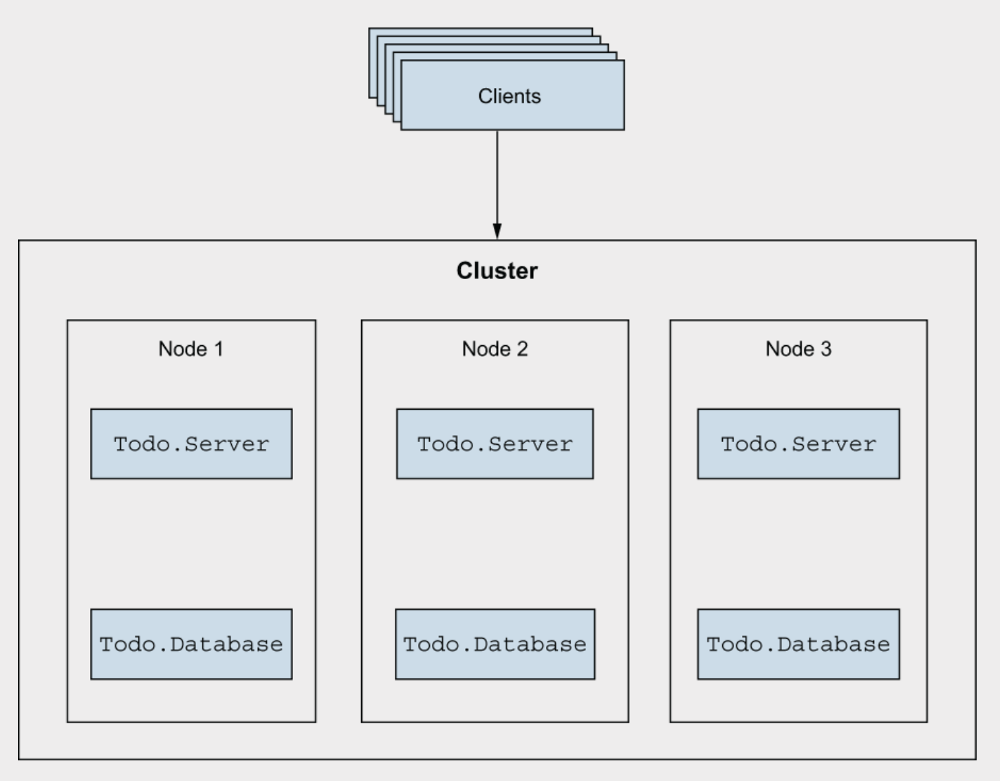
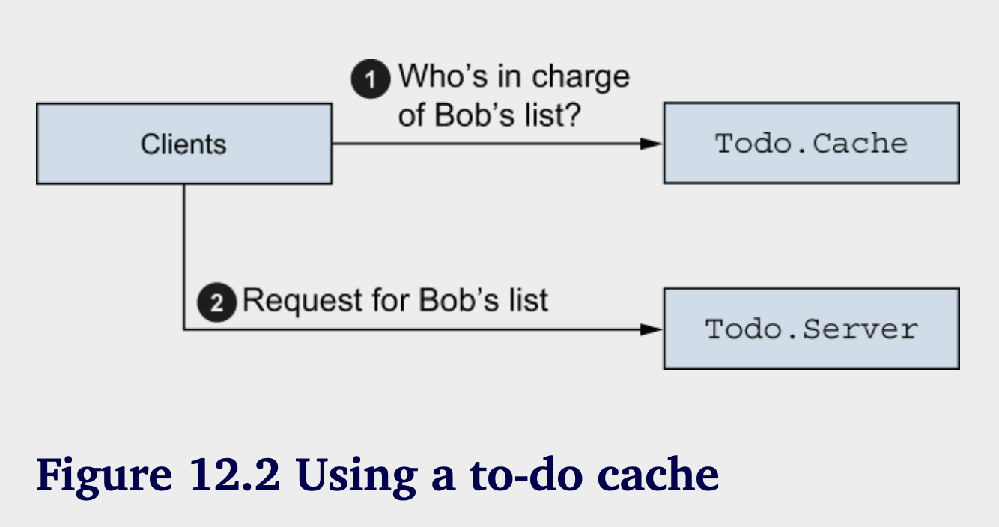
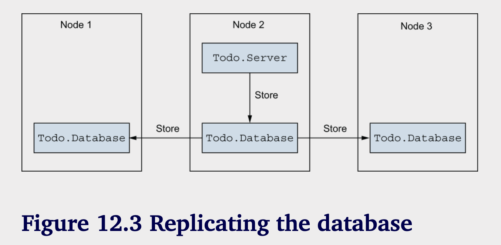
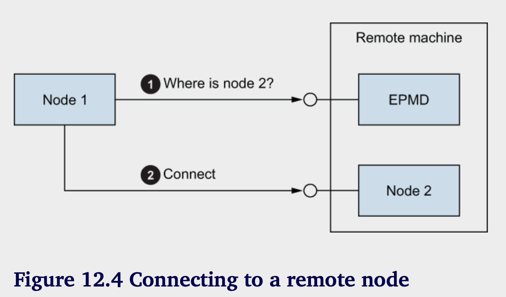

# 创建分布式系统

**本章涵盖：**
- 使用分布式原语
- 构建一个容错集群 
- 网络考虑事项

现在你已经有了一个待办事项的HTTP服务器，是时候让它更加可靠了。要拥有一个真正可靠的系统，你需要在多台机器上运行它。单台机器代表了单点故障，因为一台机器的崩溃会导致整个系统崩溃。相反，拥有多个机器的集群即使在某些机器停止工作时，系统仍然可以继续提供服务。

此外，通过将多台机器进行集群，你有机会实现水平扩展。当系统的需求增加时，你可以向集群中添加更多机器，以适应额外的负载。这个想法在图12.1中得到了说明。



这里，有多个节点共享负载。如果一个节点崩溃，剩余的负载将被分摊到幸存的节点上，你仍然可以继续提供服务。如果负载增加，你可以向集群添加更多节点以承担额外的负载。客户端访问一个定义良好的端点，并对内部集群的细节一无所知。

分布式系统显然提供了显著的好处，而 Elixir 和 Erlang 为你提供了一些简单而强大的分布式原语。基于分布式 Erlang 系统的核心工具是进程和消息。你可以向另一个进程发送消息，无论它是在同一个 BEAM 实例中运行，还是在远程机器上的另一个实例中运行。

不要将此与传统的远程过程调用 (RPC) 方法混淆，在传统方法中，远程调用被包装成看起来像本地调用。Erlang 及其扩展 Elixir 采取相反的路线，它们的分布式特性在一开始就显现出来。想想看，典型的并发系统运行着大量进程，已经可以被视为是分布式的。

与远程服务类似，进程过着它们自己的生活，彼此之间完全隔离。向另一个本地进程发出请求可以视为一次远程调用，而消息传递与远程网络通信有很多共同之处。在基本版本中，你发送一条消息，并不知道其结果。你甚至无法确定消息是否会到达目标。如果你想要更强的保证，可以设计协议以使目标向你发送响应（例如，通过使用同步调用）。此外，你必须考虑传递消息的成本（内容被复制），而这个特性有时会影响多个进程之间通信协议的设计。

这些特性是 Erlang 并发模型和分布式系统的共性，你需要考虑这些因素。好消息是，一个经过良好设计的并发系统在很多方面已经准备好在多台机器上分布式运行。

这种转变绝非没有代价。分布式系统引入了一系列额外的非平凡挑战，需要加以解决。但由于已有许多简单的分布式构建模块可供使用——其中许多你已经熟悉——你可以专注于分布式系统的核心挑战。正如你在这一章中将看到的，要将你的待办系统转变为一个基本的容错集群并不需要太多。为此，你需要熟悉基本的分布式原语。

## 12.1 分布式原语

分布式 BEAM 系统是通过在集群中连接多个节点构建的。节点是与名称关联的 BEAM 实例。您可以在同一主机上或不同主机上启动多个节点，并将这些节点连接起来。一旦节点连接，就可以依靠熟悉的消息传递机制在不同节点上的不同进程之间进行通信。

### 12.1.1 启动集群

为了设置一个集群，您需要启动几个节点。启动一个节点可以像在启动 shell 时使用 --sname 参数一样简单。

```shell
iex --sname node1@localhost
iex(node1@localhost)1>
```

使用 --sname 会将您的 BEAM 实例转换为名为 node1@localhost 的节点。在 @ 字符之前的部分是一个前缀，它在单台机器上唯一标识一个节点。第二部分（localhost）标识主机机器。如果省略主机部分，将自动使用主机机器的名称。

-–sname 参数设置了一个短名称，允许仅通过名称识别主机。也可以提供一个长名称，在这种情况下，主机通过完全合格的域名或 IP 地址进行识别。本文将在本章最后一节中详细讨论。启动节点后，您可以通过调用 Kernel.node/0 函数获取它的名称。

```iex
iex(node1@localhost)1> node()
:node1@localhost
```

正如你从输出中看到的，节点名称在内部被表示为一个原子。使用节点通常在你想将其连接到另一个节点时是有意义的。让我们试试这个。保持 node1 运行，并启动另一个操作系统 shell 会话。现在，启动 node2 并将其连接到 node1：

```iex
iex --sname node2@localhost
iex(node2@localhost)1> Node.connect(:node1@localhost)
true
```

Node.connect/1 的参数是一个表示目标节点名称的原子。当调用 Node.connect/1 时，BEAM 会尝试与目标 BEAM 实例建立 TCP 连接。一旦连接建立，节点就被视为已连接，所有通过这个连接进行的通信都会进行。

你可以通过调用 Node.list/0 来验证节点是否已连接，它会返回一个与当前节点连接的所有节点的列表（当前节点不会被列出）。在 node1 和 node2 上尝试这个操作可以得到预期的结果。

```iex
iex(node2@localhost)3> Node.list
[:node1@localhost]

iex(node1@localhost)2> Node.list
[:node2@localhost]
```

可以连接多个节点。实际上，默认情况下，BEAM尝试建立一个完全连接的集群。如果你启动第三个节点 node3，并将其连接到 node2，那么与 node2 连接的所有其他节点也会建立连接。

```iex
iex(node3@localhost)1> Node.connect(:node1@localhost)
true

iex(node3@localhost)2> Node.list
[:node1@localhost, :node2@localhost]
```

这在你想要建立一个多个节点的完全连接集群的场景中非常有用。向这样的集群添加新节点相当于与集群中的单个节点建立连接。然后，新节点将自动连接到集群中的所有节点。要获取集群中所有节点的列表，包括当前节点，可以使用 Node.list/1：

```iex
iex(node3@localhost)3> Node.list([:this, :visible])
[:node1@localhost, :node2@localhost, :node3@localhost]
```

`:this` 选项表示你希望当前节点出现在列表中。`:visible` 选项表示你还想获取所有可见节点的列表。可以将节点以隐藏的方式启动，正如我将在本章最后一节中解释的那样。

---

**Detecting disconnected nodes**

节点断开连接值得特别提及。在连接建立后，每个节点定期向所有已连接的对等节点发送心跳消息，以检查它们是否仍然在线。连续未对四个心跳消息作出响应的所有节点将被视为断开连接，并从已连接节点列表中移除。

没有自动重新连接这些节点的尝试，但可以使用 Node.monitor/1 函数（https://hexdocs.pm/elixir/Node.xhtml#monitor/2）注册并接收节点断开连接的通知。此外，您还可以借助 :net_kernel.monitor_nodes（https://www.erlang.org/doc/man/net_kernel.xhtml#monitor_nodes-1）监控所有节点的连接和断开连接。我稍后会在讨论网络分区时演示这如何工作。

---

### 12.1.2 节点间通信

一旦你启动并连接了一些节点，就可以让它们合作。一种简单的尝试方法是使用 Node.spawn/2，该函数接收一个节点名称（原子）和一个匿名函数。然后，该函数在目标节点上生成一个新进程，并在该进程中运行匿名函数。

例如，从 node1，你可以在 node2 上生成一个进程。

```elixir
# Listing 12.1 Spawn a process on another node
iex(node1@localhost)1> spawn(
    :node2@localhost, 
    fn -> IO.puts("Hello from #{node()}") end
    )
hello from node2@localhost
```

这个输出证明 你们函数在另外一个节点上执行

---

**Group leader process**

在列表12.1中发生了一些意想不到的事情。尽管lambda是在node2上执行的，输出却在node1的shell中打印。

这是怎么可能的呢？原因在于Erlang如何处理标准输入/输出操作。

所有标准I/O调用（例如IO.puts/1）都被转发到组领导者——一个负责实际输入或输出的进程。被创建的进程会继承从创建它的进程那里获取的组领导者，即使你是在另一个节点上创建进程。因此，尽管你的进程可能在node2上运行，但其组领导者仍然在node1上。因此，要打印的字符串是在node2上创建的（字符串内容证明了这一点），但输出却在node1上打印。

---

另一个重要的基本特性是能够向进程发送消息，无论它们的位置如何。这个属性也被称为位置透明性。发送操作在任何目标进程运行的节点上始终以相同的方式工作。让我们看看一个简单的例子。

从节点1开始，您将在节点2上启动一个计算，然后将结果发送回节点1。

```elixir
iex(node1@localhost)1> caller = self()

iex(node1@localhost)2> spawn(
    :node2@localhost, 
    fn -> send(caller, {:result, 1 + 2}) end    
)

iex(node1@localhost)3> flush()
{:result, 3}
```


这个例子清楚地类似于进程的标准用法。你在一个远程节点上生成一个进程，然后从生成的进程中将消息发送回调用者。注意调用者变量的用法。尽管 lambda 在另一个节点上运行，闭包机制仍然有效。

最后，你使用 iex shell 的 flush 辅助工具，它会从当前进程的邮件箱中获取所有消息并将其打印到控制台。这证明了消息已经在调用者节点上接收到了。

发送消息没有限制。在一个 BEAM 实例中有效的内容也会在不同实例中有效（有一个小注意事项，在边栏中描述了 Lambdas）。当目标进程位于另一个节点时，消息会使用 :erlang.term_to_binary/1 编码，并在目标节点使用 :erlang.binary_to_term/1 解码。

---

**避免生成匿名函数或将其发送到不同节点**

您可以从您的 shell 中生成 lambdas，这是一个特殊的情况，因为 shell 定义的 lambdas 嵌入了它们自己的代码，并且在每次调用时都是动态解释的。相比之下，在模块函数中定义的 lambdas 只有在两个节点都运行完全相同的编译代码时，才能被远程生成（或通过消息发送到远程节点）。如果您开始运行一个多节点集群，然后需要更新代码，这些要求很难满足。您无法同时升级集群中的所有节点，因此在某个时刻，节点上的代码将会不同。因此，通常最好避免将 lambdas 传递给远程节点。

相反，您应该使用 Node.spawn/4 函数，它接受一个模块、函数和参数（MFA）列表，以识别要在目标节点上调用的函数。只要目标节点上存在该模块并导出了相应的函数，这样使用是安全的。

---

在多节点环境中，“本地注册”这个术语终于变得有意义。当您在本地注册一个进程时，注册的范围仅限于当前节点。这意味着您可以在不同节点上使用相同的注册名称（但每个节点上只能使用一次）。例如，为节点1和节点2注册 shell 进程：

```elixir
iex(node1@localhost)1> Process.register(self(), :shell)
true
iex(node2@localhost)2> Process.register(self(), :shell)
true
```

调用 send(:shell, some_message) 将根据您调用 send 的节点，将消息发送到 node1 或 node2。通过使用 {some_alias, some_node}，您可以引用另一个节点上已注册的本地进程。

例如，要将消息从 node1 发送到 node2 的 shell，您可以这样做：

```elixir
iex(node1@localhost)1> send(
    {:shell, node2@localhost},
     "Hello from node1"
     )    
```

然后，在 node2 上，您可以验证消息是否已被接收：

```elixir
iex(node2@localhost)1> flush()
"Hello from node1"
``` 

在发出 GenServer 请求（异步和同步调用）时，您还可以使用 {some_alias, some_node} 形式。最后，有两个特殊函数，GenServer.abcast/3 和 GenServer.multi_call/4，允许您向指定节点上的所有本地注册进程发出请求。

### 12.1.3 进程发现

进程发现是集群中一个非常重要的操作，但这个操作在无集群模式下也会使用。实际上，不管是否是分布式系统，进程通信的典型模式总是相同的：

1. 客户端进程必须获取服务器的PID。

2. 客户端向服务器发送消息。

在第一步中，您发现了一个进程。您在第9章中使用了Registry模块进行了一种形式的发现。即使在单节点系统中，您也必须以某种方式找到目标进程的PID。这在分布式环境中不会改变，但您必须使用另一种发现方式，因为Registry模块并不意识到集群，并且仅在本地节点的范围内工作。

**GLOBAL REGISTRATION**

在集群范围内发现的最简单方法是使用:global模块（https://www.erlang.org/doc/man/global.xhtml），它提供了一个全局名称注册功能。例如，如果您将待办事项系统作为一个多节点集群运行，那么您可能希望为每个待办事项列表只运行一个进程（当然，除非您是为了冗余）。全局名称注册可以帮助您实现这一点。

例如，您可以注册node1 shell进程，使其作为负责处理Bob的待办事项列表的进程。

```elixir
iex(node1@localhost)1> :gloal.register_name({:todo_list, "bob"}, self())
:yes
```

结果（:yes）表示全局注册成功。当前进程的全局（集群范围的）别名是 {:todo_list, "bob"}。此时，集群中所有节点上的所有进程都可以找到注册在此别名下的进程。尝试在同一别名下全局注册 node2 shell 进程将失败:

```elixir
iex(node2@localhost)2> :global.register_name({:todo_list, "bob"}, self())
:no
```

---

**全局注册如何工作**

全局注册并没有特殊的魔法。它是用纯Erlang实现的，您也可以在Elixir中重新实现它。这只不过是一个复杂的多节点版本的进程注册表。

当您尝试注册一个全局别名时，会设置一个集群范围的锁，以防止其他节点上的竞争注册。然后，会检查该别名是否已经注册。如果没有，则所有节点都会被告知新的注册情况。最后，锁被释放。显然，这涉及到大量的通讯，并且节点之间会传递几条小消息。

---

可以是用`:global.whereis_name/1`查找进程：

```elixir
iex(node2@localhost)2> :global.whereis_name({:todo_list, "bob"})    
#PID<7954.90.0>
```

请注意，查找是本地的。当进行注册时，所有节点都会被联系，并将注册信息缓存到它们的本地ETS表中。之后在任何节点上的每次查找都在该节点上进行，没有任何额外的通信。这意味着查找可以快速执行，而注册则需要节点之间的通信。

请看一下这个PID的形状：#PID<7954.90.0>。PID字符串表示中的第一个数字不是0，这表示您正在处理来自其他节点的进程。

---

**识别远程进程**

现在应该很明显，PID 表示一个本地和远程过程。在几乎所有情况下，你无需担心进程的物理位置。但你应该知道关于 PID 一些网络特定的细节。

到目前为止，你看到的所有 PID 形式都很相似：<0.X.0>，其中 X 是一个正整数。在内部，每个进程都有一个节点范围内唯一的标识符。这个标识符可以在字符串表示的最后两个数字中看到。如果在单个节点上创建足够多的进程，第三个数字也会大于零。

第一个数字表示节点编号——即进程运行所在节点的内部标识符。当这个数字为零时，表示该进程来自本地节点。相反，当输出包含形式为 <X.Y.Z> 的 PID 而 X 不为零时，你可以确定这是一个远程进程。要以编程方式确定进程运行所在的节点，你可以使用 Kernel.node/1 (https://hexdocs.pm/elixir/Kernel.xhtml#node/1)。

---

全球注册允许您将所有需要操作同一资源（在这个例子中是待办事项列表）的请求转发到集群中的单个同步点（一个进程）。这与您在单节点设置中使用的模式完全相同，现在应用于节点集群。当您开始将待办事项系统分布式化时，稍后您将看到这个模式的实际应用。

全球注册也可以与 GenServer 一起使用，如下列代码片段所示：

```elixir
GenServer.start_link(
  __MODULE__,
  args,
  name: {:global, some_global_alias}
)

GenServer.call({:global, some_global_alias}, :some_message)
```

最后，如果注册的进程崩溃或拥有者节点断开连接，别名会在所有其他机器上自动注销。

**Groups of processes**

另一个常见的发现模式是在你想要将多个进程注册为同一个别名时。这听起来可能有些奇怪，但在你想要对集群中的进程进行分类并向同一类中的所有进程广播消息的情况下，这是很有用的。

例如，在冗余集群中，你希望保留相同数据的多个副本。拥有多个副本可以让你在节点崩溃的情况下仍然存活。如果一个节点终止，集群中的其他地方应该存在一个副本。

对于这个问题，您可以使用 :pg（进程组）模块（https://www.erlang.org/doc/man/pg.xhtml）。这个模块允许您创建任意命名的集群范围内的组，并将多个进程添加到这些组中。这个添加会传播到所有节点，稍后您可以查询该组并获取所有属于它的进程的列表。

让我们试一下。您需要设置节点1和节点2的两个shell进程来处理Bob的待办事项列表。为此，您需要将这两个进程添加到这个组中。

启动第一个节点，并通过调用 :pg.start_link/0 来确保 :pg 正在运行：

```elixir
iex(node1@localhost)1> :pg.start_link() 
```

启动第二个节点，并连接到第一个节点：

```elixir
iex(node2@localhost)2> Node.connect(:node1@localhost)

iex(node2@localhost)2> :pg.start_link()
```

您可以使用函数 :pg.join/2 将两个 shell 进程添加到一个组中。

```elixir
iex(node2@localhost)2> :pg.join({:todo_list, "bob"}, self())

iex(node1@localhost)1> :pg.join({:todo_list, "bob"}, self())
```

第一个参数是一个任意术语，唯一标识该组。第二个参数是将要添加到该组的进程的PID。

此时，两个进程都在进程组中，并且两个节点都可以看到这一点：

```elixir
iex(node1@localhost)1> :pg.get_members({:todo_list, "bob"})
[#PID<8531.90.0>, #PID<0.90.0>]

iex(node2@localhost)2> :pg.get_members({:todo_list, "bob"})
[#PID<0.90.0>, #PID<7954.90.0>]
```

您如何使用这个技术？当您想要更新Bob的待办事项列表时，可以查询相应的进程组，并获取负责Bob列表的所有进程的列表。然后，您可以向所有进程发出请求（例如，可以使用GenServer.multi_call/4）。这样可以确保集群中的所有副本都得到更新。

但是，当您需要发出查询（例如，检索待办事项条目）时，可以在该组的单个进程上执行此操作（无需在所有副本上执行多个查询，除非您希望增加信心）。因此，您可以从进程组中选择一个单独的PID。

就像:global模块一样，:pg是用纯Erlang实现的，也是进程注册表的一个复杂版本。组的创建和加入在集群中传播，但查找是在本地缓存的ETS表上进行的。进程崩溃和节点断开会自动检测，且不存在的进程会从组中移除。


### 12.1.4 Links and monitors

链接和监视器即使在不同节点上运行的进程也能正常工作。如果发生以下任何事件，进程将收到退出信号或 :DOWN 通知消息（对于监视器的情况）：

- 被链接或监视的进程崩溃
  
- BEAM 实例或链接或监视进程正在运行的整个机器崩溃
  
- 网络连接中断

让我们快速证明这一点。你将启动两个节点，将它们连接起来，并从 node1 的 shell 到 node2 的 shell 设置一个监视器：

```elixir
iex --sname node1@localhost
iex --sname node2@localhost

iex(node1@localhost)1> Node.connect(:node2@localhost)   

iex(node2@localhost)2> :global.register_name({:todo_list, "bob"}, self())

iex(node1@localhost)1> Process.monitor(
    :global.whereis_name({:todo_list, "bob"})   
)
```

现在可以关闭node2并且晴空node1中的消息：

```elixir
iex(node1@localhost)2> flush()
{:DOWN, #Reference<0.0.0.99>, :process, #PID<7954.90.0>, :noconnection}
```

如你所见，你收到了一个通知，监控的进程不再运行。这使你能够检测分布式系统中的错误并进行恢复。事实上，错误检测机制的工作方式与并发系统相同，这并不令人惊讶，因为并发也是一种分布式原语。

### 12.1.5 其他分布式服务


作为Erlang标准库的一部分，提供了其他有趣的服务。我将在这里简要提到它们，但一旦你开始编写分布式系统，你应该花时间研究这些服务。

我已经提到，许多基本原语可以在Node模块中找到（https://hexdocs.pm/elixir/Node.xhtml）。除此之外，你还可以在：net_kernel（https://www.erlang.org/doc/man/net_kernel.xhtml）和：net_adm（https://www.erlang.org/doc/man/net_adm.xhtml）模块中找到一些有用的服务。


有时，你需要在其他节点上发出函数调用。正如你所看到的，这可以通过 Node.spawn 来实现，但这是一种低级的方法，通常不适合。Node.spawn 的问题在于它是一种“一发即忘”的操作，因此你无法了解其结果。

更常见的情况是，你希望获取远程函数调用的结果，或者在多个节点上调用一个函数并收集所有结果。在这种情况下，你可以参考 :rpc Erlang 模块（https://erlang.org/doc/man/rpc.xhtml），它提供了各种有用的助手函数。

例如，要在另一个节点上调用一个函数并获取其结果，你可以使用 :rpc.call/4，它接受一个节点和一个 MFA（模块-函数-算子）标识符，用于识别要远程调用的函数。以下是一个示例，它在 node2 上执行 Kernel.abs(-1) 的远程调用：

```elixir
iex(node2@localhost)2> :rpc.call(:node1@localhost, Kernel, :abs, [-1])
1
```

:rpc 模块中包含的其他有用助手允许你在集群中的多个节点上发出远程函数调用。稍后当你为数据库添加复制功能时，你会看到这项工作的实际效果。

---

**消息传递是核心的分布式原语**

许多服务，比如 :rpc，都是用纯 Erlang 实现的。与 :global 和 :pg 一样，:rpc 依赖于透明的消息传递，以及向远程节点上注册的本地进程发送消息的能力。例如，:rpc 依赖于存在一个本地注册的 :rex 进程（当 Erlang 的 :kernel 应用启动时，该进程会被启动）。在其他节点上进行 RPC 调用相当于向目标节点的 :rex 进程发送一个包含 MFA 的消息，从这些服务器调用 apply/3，然后将响应发送回来。

如果您想深入了解 Erlang 系统中的分布式编程，我建议您花些时间研究 rpc.erl、pg.erl 和 global.erl 的代码，以了解各种分布式惯用法和模式。

---

我还想提到集群范围的锁。这些锁是在:global模块中实现的，它们允许你获取一个任意命名的锁。一旦你拥有了特定的锁，集群中的其他进程在你释放之前无法获取该锁。  

让我们来看一下实际操作。启动node1和node2并将它们连接起来。然后，在node1上，尝试使用:global.set_lock/1来获取锁：

```elixir
iex(node1@localhost)1> :global.set_lock({:some_resource, self()})
true
```

您提供的元组包含资源 ID 和请求者 ID。资源 ID 是一个任意术语，而请求者 ID 则标识唯一的请求者。在集群中，两个不同的请求者不能获取相同的锁。通常，您会希望使用进程 ID 作为请求者 ID，这意味着在任何时候，最多只有一个进程可以获取该锁。

获取锁涉及与集群中的其他节点进行通信。一旦 :set_lock 返回，您就知道您已获得锁，并且集群中的其他任何人都无法获取它。尝试在节点2上获取锁：

```elixir
iex(node2@localhost)2> :global.set_lock({:some_resource, self()})
```

节点2上的shell进程将无限期等待（可以通过一个额外参数进行配置），直到锁变得可用。一旦你在节点1上释放锁，节点2就会获得该锁。

```elixir
iex(node1@localhost)1> :global.del_lock({:some_resource, self()})

iex(node2@localhost)2> 
```

在获得-释放模式中，还有一个简单的辅助工具，形式为 :global.trans/2（https://erlang.org/doc/man/global.xhtml#trans-2），它会先获取锁，运行提供的 Lambda，然后最终释放锁。  
通常情况下，你应该避免使用锁，因为它会引起与传统同步方法相同的问题。过度依赖锁会增加死锁、活锁或饥饿的可能性。一般来说，你应该通过进程来进行同步，因为这样更容易理解系统。  

但如果谨慎使用，锁有时可以提高性能。请记住，消息传递是有相关成本的；这在分布式系统中特别如此，因为消息必须被序列化并通过网络传输。如果消息非常大，这可能会引入显著的延迟，影响系统性能。  

在这种情况下，锁可以帮助你，因为它们允许你在不同节点上同步多个进程，而无需向另一个进程发送大的消息。这是这个想法的一个框架。假设你需要确保在整个集群中以串行化的方式处理大量数据（在任意时刻，整个集群中至多只有一个进程可以运行）。通常，这通过将数据传递给一个作为同步点的进程来实现。  

但是，传递大量数据可能会引入性能损失，因为数据必须被复制并通过网络传输。为避免这种情况，你可以使用锁来同步不同的进程，然后在调用者上下文中处理数据。

```elixir
def process(large_data) do
  :global.trans(
    {:some_resource, self()}, 
    fn ->
      do_something_with(large_data)
    end
  )
end
```

调用 :global.trans/2 确保了集群范围内的隔离。在任何时刻，集群中最多只能有一个进程在 :some_resource 上运行 do_something_with/1。由于 do_something_with/1 在调用者进程中运行，您可以避免向另一个同步进程发送大量消息。调用 :global.trans/2 引入了节点间的额外通信，但用于获取锁的消息要比将 large_data 的内容传递给另一个节点上的进程小得多，因此可以节省带宽。

这结束了我们对分布式基础知识的讨论。我没有提到一些重要方面，这些方面会在您开始使用网络作为消息传递的通信通道时出现。我们将在本章的最后一节中重新探讨这个主题。现在，让我们专注于使待办事项系统更加分布式。

## 12.2 创建一个容错的集群

带着一些分布式原语的工具，你可以开始构建一个待办事项网页服务器集群。目标是使系统在各种故障面前更加可靠，包括整个节点的崩溃。这里提出的解决方案将是简化版的。要构建一个真正的分布式系统需要关注更多的细节，这个主题完全可以写成一本书。

好消息是，构建一个基本的基于BEAM的分布式系统并不复杂。在这一节中，你将感受到分布式原语如何与现有的BEAM并发模型良好结合。

在这里，你的大部分工作将基于GenServer抽象。这并不奇怪，因为消息传递是BEAM中的主要分布工具。在继续之前，确保你记得GenServer是如何工作的；如果需要，请重新阅读第六章的解释。

### 12.2.1 集群设计


这个集群的目标表面上看似简单：

- 该集群将由多个节点组成，这些节点都由相同的代码驱动，并提供相同的服务（一个用于管理多个待办事项列表的网络界面）。

- 变更应在集群中传播。在某个节点上对单个待办事项列表所做的修改应该在所有其他节点上可见。从外部来看，客户端不应该关心他们访问的是哪个节点。

- 单个节点的崩溃不应影响集群的运行。服务应该持续提供，崩溃节点的数据不应丢失。

这些目标描述了一个容错系统。你始终提供服务，单个崩溃不会导致干扰。因此，系统变得更加弹性且高度可用。

---

**网络分区**

请注意，您不会解决分布式系统中最困难的挑战：网络分区。分区是指两个节点之间的通信通道中断，导致“节点断开连接”。在这种情况下，可能会出现“分脑”情况：集群被分成两个（或更多）互不连接的小集群——这些小集群都正常工作并提供服务。这个情况可能会导致问题，因为您有多个孤立的系统，每个系统都接受用户的输入。最终，您可能会遇到无法调和的冲突数据。在本节的大部分内容中，我们将忽略这个问题，但在结束之前，我们会讨论一些后果。

---

让我们开始将系统分布式化的工作。首先，我们来看看待办事项缓存。

## 12.2.2 分布式todo缓存

从某种意义上说，待办缓存是系统的核心部分。这是维护数据一致性的主要元素，所以我们回顾一下它是如何工作的。主要思想在图12.2中有所说明。



当你想要修改待办事项列表时，你会请求待办缓存提供相应的待办服务器进程。这个待办服务器 然后作为单一待办列表的同步点。所有对鲍勃的列表的请求都通过这个进程，这确保了一致性并防止竞争条件。

当你对系统进行集群化时，你将力求保持这个属性。不同之处在于，你的缓存必须以某种方式在集群中的所有节点上工作。无论你在集群的哪个地方问“谁负责鲍勃的列表？”答案总是指向集群中的同一个进程（当然，直到那个进程崩溃）。这是你需要改变的唯一一件事，以使你的待办缓存分布式。正如你将看到的，变化相对简单明了。

**DISCOVERING TODO SERVER**

完成集群范围发现的方式有多种。最简单的方法（虽然不一定是最有效的）依赖于 :global 模块的服务，这些服务允许你在全局别名下注册一个进程——一个用于标识集群中进程的任意术语。你需要做的步骤如下：

1. 适配 Todo.Server 模块，使用全局注册。

2. 适配 Todo.Cache，使其能与新的注册方式配合工作。

让我们开始实现这个。首先，您需要修改 Todo.Server 模块，使其依赖于全局注册。到目前为止，您一直在使用 Registry，它仅适用于单节点注册。对于分布式进程注册和发现，您可以使用 :global 模块。

---

**进程注册**

你可能对这些不同的注册功能感到困惑，因此让我们回顾一下主要区别：

- 基本注册功能是本地注册，允许你使用简单的原子作为节点上单个进程的别名。

- 注册表通过让你使用丰富的别名来扩展这一功能——任何术语都可以用作别名。

- :global 允许你注册集群范围内的别名。

- :pg 用于在集群范围的别名（进程组）后注册多个进程，这通常适合于分布式发布-订阅场景。

---

将 Registry 替换为 :global 只需要对 Todo.Server 模块进行一次更改。相关代码的当前版本是在第九章中引入的，代码如下：

```elixir
defmodule Todo.Server do
   def start_link(name) do
     GenServer.start_link(Todo.Server, name, name: via_tuple(name))
   end

    defp via_tuple(name) do
      Todo.ProcessRouter.via_tuple({__MODULE__, name})
    end

end
```

为了使用`:global`模块进行注册，你需要从`via_tuple/1`返回`{:global, registered_name}`。顺便说一下，你也可以重命名这个函数。

```elixir
# Listing 12.2 Global registration of todo servers (todo_distributed/lib/todo/server.exs)
defmodule Todo.Server do
  ...

  def start_link(name) do
    GenServer.start_link(Todo.Server, name, name: global_name(name ))
  end

  defp global_nane(name) do
    {:global, {__MODULE__, name}}
  end
  ...
end
```

通过这个简单的改变，你已经切换到了分布式注册和发现。无需更改其他任何内容；系统会正常工作。

但是，当前实现存在一个潜在的性能问题。当你在全局别名下注册一个进程时，":global"模块会在整个集群中进行同步聊天。这意味着全局注册的开销远高于本地注册，这在第9章中引入的缓存当前实现中尤为棘手。让我们回顾一下相关部分：

```elixir
defmodule Todo.Cache do
  ...

  def server_process(todo_list_name) do
    case start_child(todo_list_name) do
      {:ok, pid} -> pid
      {:error, {:already_started, pid}} -> pid
    end
  end

  defp start_child(todo_list_name) do
    DynamicSupervisor.start_child(
      __MODULE__,
      {Todo.Server, todo_list_name}
    )
  end

  ...
end
```

很久以前，在第9.2.3节，你选择了这种简单的方法。每当进行子进程查找时，你就启动一个新进程并尝试注册它。如果注册失败，DynamicSupervisor.start_child/2将返回{:error, {:already_started, pid}}。这是一种简单的解决方案，效果很好。但现在，随着系统的分布式发展，这种无条件的注册尝试可能会成为一个严重的瓶颈。每次你想处理待办事项列表时，即使“服务器进程已经在运行”，你也会尝试进行全局注册，这会导致获取集群范围的锁并与系统中的所有其他节点进行交互。

这种情况可以通过先执行显式查找来改进。你将检查待办服务器是否已注册，并仅在查找返回空时才尝试启动服务器。为此，你需要首先扩展Todo.Server模块，添加whereis/1函数，该函数接受一个名称并返回注册进程的PID，如果没有进程在给定名称下注册，则返回nil。

```elixir
# Listing 12.3 Discovering todo servers (todo_distributed/lib/todo/server.ex)
defmodule Todo.Server do
  ...

  def whereis(name) do
    case :global.whereis_name({__MODULE__, name}) do
      :undefined -> nil
      pid -> pid
    end
  end

  ...   
end
```

值得重申的是：global.whereis_name/1 不会导致任何跨节点的聊天。此函数仅对本地 ETS 表进行单次查找。因此，您可以期待 Todo.Server.whereis/1 函数具有相当好的稳定性能。

现在，您可以调整 Todo.Cache 中的代码。

```elixir
# Listing 12.4 Optimized process discovery (todo_distributed/lib/todo/cache.ex)
defmodule Todo.Cache do
  ...

  def server_process(todo_list_name) do
    existing_prcesss(todo_list_name) || new_process(todo_list_name)
  end

  defp existing_prcesss(todo_list_name) do
    Todo.Server.whereis(todo_list_name)
  end

  defp new_process(todo_list_name) do
    case DynamicsSupervisor.start_child(
    __MODULE__,
    {Todo.Server, todo_list_name}
    ) do
      {:ok, pid} -> pid
      {:error, {:already_started, pid}} -> pid
      end

    end
end
```

依靠一点封装和 || 运算符，server_process/1 函数突出了查找待办服务器的方法。你要么返回现有进程的 PID，要么尝试启动一个新进程。

正如 9.2.3 节所解释的，new_process/1 中的代码正确地处理了两个不同客户端进程同时尝试启动同一个待办列表服务器的情况。该代码在分布式环境中也能正常工作，并能够处理两个不同节点上的两个客户端之间的竞争条件。

在进行这些更改后，Todo.ProcessRegistry 模块不再使用，因此可以将其从项目中移除。待办系统模块中的子规格列表也可以移除进程注册表条目。

**ALTERNATIVE DISCOVERY**

请记住，全局注册是冗长且串行的（一次只能有一个进程执行全局注册）。这意味着前面的方法在待办事项列表的数量或集群中的节点数量方面不太可扩展。如果网络很慢，解决方案的表现也会很糟。

还有其他方法。这里的主要挑战是可靠地发现负责待办事项列表的进程，同时减少网络通信。这可以通过引入一条规则来实现，该规则始终将相同的待办事项列表名称映射到网络中的同一节点。以下是这个想法的简单轮廓：

```elixir
def node_for_list(todo_list_name) do
  all_sorted_nodes = Enum.sort(Node.list([:this, :visible]))

  node_index = :erlang.phash2(
    todo_list_name,
    length(all_sorted_nodes)
  )

  Enum.at(all_sorted_nodes, node_index)
end
```

您获取所有节点的列表并对其进行排序，以确保它始终处于相同的顺序。然后，您对输入名称进行哈希处理，确保结果落在0到length(all_sorted_nodes)的范围内。最后，您返回给定位置的节点。这样，只要集群保持稳定（节点列表不变），同一个待办事项列表将始终映射到同一个节点。

现在，您可以通过单跳发现目标节点。假设之前的版本的 Todo.Cache（不是您刚刚实现的版本），检索目标进程可以简单到如下：

```elixir
:rpc.call(
  node_for_list(todo_list_name),
  Todo.Cache,
  :server_process,
  [todo_list_name]
)
```

您转发到目标节点并在那里检索所需的进程。您无需使用全局注册，Todo.Cache可以像本章之前一样继续工作。前一次调用的结果是一个PID，您可以使用它进行调用。好处在于，您可以通过更少的交流来发现PID。

这种方法的主要缺点是，当集群配置发生变化时，无法正常工作。如果你添加了一个新的节点或一个节点断开连接，映射规则会发生变化。处理这种情况是复杂的。你需要检测集群中的变化（这是可能的，稍后会解释）并根据新的映射规则将所有数据迁移到不同的节点。在数据迁移的过程中，你可能希望保持服务运行，这会增加另一层复杂性。如果使用某种形式的一致性哈希，可以大大减少需要迁移的数据量——这是一种更聪明的将键映射到节点的方式，更能抵御集群变化。

很明显，实现可以迅速变得更加复杂，这就是为什么你开始时选择了简单的全局注册方法。尽管它的可扩展性不是很好，但这是一个有效的简单解决方案。但是，如果你需要更好的性能和可扩展性，就需要采用更复杂的方法。与其重新发明轮子，不如考虑查看第三方解决方案，例如 Syn (https://github.com/ostinelli/syn) 或 Swarm (https://github.com/bitwalker/swarm)。

### 12.2.3 实现副本数据库

根据您刚刚所做的更改，您将会看到以下行为：
  
1. 当针对 Bob 的列表的第一个请求到达时，会在处理该请求的节点上创建一个待办事项列表。

2. 所有后续对 Bob 的待办事项列表的请求将被转发到步骤1中创建的进程。

3. 如果步骤1中创建的节点（或进程）崩溃，针对 Bob 的列表的新请求将导致新的待办服务器被注册。

首先看起来一切正常，这个系统看起来分布合理。你现在不会进行测试，因为有一个重要的问题我们还没有解决：数据库无法在崩溃后恢复。假设你在节点A上对Bob的列表进行了几次更新。如果这个节点崩溃，另一个节点，例如节点B，将接管Bob的列表的工作。但是之前存储的数据不会在那个节点上，你将丢失你所有的更改。

显然，数据库需要进行复制，以便数据能够在节点崩溃的情况下存活。保存数据最简单的方式（尽管不是最有效的）是将其在整个集群中复制。这个想法在图12.3中进行了说明。



这个过程非常简单。当你将数据存储到数据库时，你需要将更改传播到集群中的所有节点。如果依赖于 :rpc 模块的服务，相应的实现可以很简单。我提到过 :rpc 模块，它可以让你在集群中的所有节点上发出函数调用。你需要依赖这个功能，并对数据库模块进行一些更改：

1. 将现有的 Database.store 函数重命名为 Database.store_local。代码保持不变。
2. 提供 Database.store 的新实现。该新实现将在集群中的所有节点上调用 Database.store_local。

另一个你需要做的更改（此处未展示代码）是将 Todo.DatabaseWorker.store/2 转换为一个调用。这个请求本应该一开始就实现为一个调用。在第7章中，我有些随意地选择了一个 cast，主要是出于教学目的。实际上，如果你要求另一个进程存储数据，你应该请求一个确认消息，以便你知道数据是否已存储或者是否出现了问题。当你正在使用一个不太可靠的通信媒介（如网络）时，这一点变得愈发重要，因为在这种情况下可能会出现各种问题。当你期望请求在节点之间传递时，通常应该将其实现为一个调用。

不需要其他更改。特别是，Todo.Database.get/1 保持不变。当你想要读取数据时，可以从本地节点读取，乐观地假设所有节点有相同的数据副本。这些更改是简单明了的，如以下列表所示。

```elixir
# Listing 12.5 Storing data on all nodes (todo_distributed/lib/todo/database.ex)
defmodule Todo.Database do
  ...

  def store(key, data) do
   {_results, bad_nodes} =
    :rpc.multicall(
       __MODULE__,
       :store_local,
       [key, data],
       :timer.seconds(5)
   )

   Enum.each(bad_nodes, &IO.puts("Store failed on node #{&1}"))

   :ok
  end
  ...
end
```

在这里，你依靠 `:rpc.multicall/4` 在集群中的所有节点上进行函数调用。`multicall` 接受 MFA 和超时时间。然后，在集群中的所有节点上调用目标函数，所有结果都会被收集，你将得到一个形式为 {results, bad_nodes} 的元组：一个结果列表和一个在给定时间内没有响应的节点列表。

---

**Always provide timeouts**

多重调用中提供的超时时间是很重要的。如果没有设定超时，多重调用及其对应的存储操作将会永远被阻塞。

在进行分布式调用时，你通常应该指定一个超时时间。请注意，这与跨进程调用并没有什么不同——在调用另一个进程时，你通常也希望有一个超时时间，而 GenServer 通过提供默认的 5 秒超时来认识到这一点。同样，跨节点操作与跨进程操作并没有太大区别，在许多情况下，在开发单节点系统时，你需要考虑类似的一系列问题。

---

最终，您可以打印所有请求超时的节点。请注意，在实践中，这并不足够。您还应该验证每个收到的响应是否返回了 :ok。此外，在部分成功的情况下，您还应该采取一些有意义的措施。否则，您将面临一个不一致的集群，不同的节点包含不同的数据。为了简洁起见，我在这里没有进行这些处理，但在实际项目中，这个问题需要考虑并加以解决。

我在数据库工作者中做了另一个小的改变，这里没有呈现。到目前为止，您一直使用 persist 文件夹来存储您的数据。现在已经更改为适应节点名称。如果您的节点名为 node1@localhost，您将把数据存储在 persist/node1 文件夹中。这主要是为了简化测试，并允许您从同一根文件夹中本地启动多个节点。

无论如何，这个简单的改变使您能够在集群中复制数据。到此，我们对于聚簇待办事项系统的基本理解已经完成，您可以尝试一下。

### 12.2.4 测试系统

最后，是时候测试系统了。您需要启动几个节点，连接它们，并查看集群的工作情况。但是请记住，在第11章中，您让web服务器监听端口5454。两个节点不能监听同一个端口，因此您需要更改这个设置。幸运的是，在第11.4节中，您通过应用程序环境使web端口可配置，因此可以通过命令行更改默认端口。

请启动两个实例，node1和node2，分别监听端口5454和5555：

```shell
$ TODO_SERVER_EXPIRY=600 iex --sname node1@localhost -S mix   
 
$ TODO_SERVER_EXPIRY=600 TODO_HTTP_PORT=5555 \
    iex --sname node2@localhost -S mix                         

```

这里，我们通过操作系统环境变量更改系统配置。待办事项服务器的自动过期超时时间增加到600秒，以便不干扰我们的本地实验。第二个节点也配置为使用非默认端口。

接下来，您需要连接两个节点：

```iex
iex(node1@localhost)1> Node.connect({:node2@localhost})
```
现在，集群已经建立，您可以使用您的服务器。在第一个节点上添加 Bob 的条目。

```shell
$ curl -d "" \
    "http://localhost:5454/add_entry?list=bob&date=2023-12-19&title=Dentist"
OK

```

然后，确认该条目在另一个节点上可见。

```shell
$ curl "http://localhost:5555/entries?list=bob&date=2023-12-19"

2023-12-19 Dentist
```

这证明了您的数据在整个集群中传播。此外，查看单个 iex shell，您会在 node1 shell 中看到“为 Bob 启动待办服务器”的消息，但在 node2 中却没有。这清楚地证明了，即使您尝试在另一个节点上访问 Bob 的列表，您仍然会被转发到 node1 上的相应进程。

因此，您可以安全地在 node2 上修改 Bob 的列表，而不会影响数据。

```shell
$ curl -d "" \
    "http://localhost:5555/add_entry?list=bob&date=2023-12-19&title=Movies"
 
$ curl "http://localhost:5454/entries?list=bob&date=2023-12-19"

2023-12-19 Dentist
2023-12-19 Movies
```

最后，崩溃一个节点不会影响系统。停止运行 Bob 的待办服务器的 node1，并尝试查询 node2：

```shell
$ curl "http://localhost:5555/entries?list=bob&date=2023-12-19"
2023-12-19 Dentist
2023-12-19 Movies
```

当然，集群仍在提供服务，数据得到了保留。新的待办事项服务器已经在节点2上创建，并从备份数据库中恢复了状态。到目前为止，您的基本集群已经完成。还有一些未解决的问题，我在这里不详细讨论，但需要提到：

- 您应该设置负载均衡器，以作为所有客户端的单一访问点。

- 您需要一个方案来将新节点引入正在运行的集群。当引入新节点时，它应该首先与已连接的节点中的一个同步数据库；然后，它可以开始处理请求。

- 数据库复制是脆弱的。您需要某种两阶段提交策略。

- 您需要处理网络分区。

这些挑战并不容易解决，但它们是分布式系统固有的问题，您必须应对这些挑战，而不论底层技术如何。重要的是要理解，Erlang并不是解决分布式问题的“魔法杖”。在分布式系统中，许多事情可能出现问题，您需要决定如何从各种故障中恢复。没有一种通用的解决方案；您的工作是以适合手头问题的方式组合基本的分布式原语。

当然，将工作分配给经过验证的第三方组件通常是有帮助的。例如，通过使用内置的Mnesia数据库，您可以实现更好的写入保障，并能够轻松地将新节点迁移到集群中。但即便如此，了解第三方库在分布式环境中的工作原理仍然很重要。在这个例子中，Mnesia并不会明确处理网络分区和脑裂场景，而是将这一情况留给开发者自行解决。其他某些组件可能会表现出不同的缺点，所以您需要理解它们在分布式环境中的工作原理。

Erlang 分布式原语可以让你走得更远。即使您没有事先为分布式系统做好准备，只需进行少量更改就可以使您的系统分布式。

### 12.2.5 检测分区

到目前为止，这项工作还算简单，但我们方便地忽视了网络分区的问题。这是构建分布式系统时最大的挑战之一。全面讨论这个话题很容易变成一本大书，所以我将简单解释一下检测分区的基本机制。

当你决定使用分布式系统时，分区是你不得不处理的问题，或多或少。网络分区在分布式系统中不应该被忽视，因此，即使你选择使用第三方产品（例如外部数据库）来处理集群和复制，你也应该了解该产品在发生分区时的行为。最好提前了解将面临的挑战，以便能够做出有意识和明智的决策。

网络分区，或称为网络裂缝，是指两个节点无法再相互通信的情况。可能有各种潜在原因，并且不可能区分它们：

- 网络连接已丢失。

- 网络连接非常慢。

- 远程节点已崩溃。

- 远程节点过载，忙到无法及时响应。

从一个节点的角度来看，这些情况看起来都是一样的。远程节点没有响应，你不知道为什么。因此，几乎不可能保证网络分裂永远不会发生。即使在超快速和可靠的网络上，出现一个错误或过载也可能导致某个主机忙到无法及时响应另一个主机。另一个节点别无选择，只能将这种情况解释为网络分裂，并得出连接丢失的结论。这意味着在实现分布式系统时，你需要考虑网络分区，并制定应对这种情况的策略。

在发生分区时，你可能会得到多个相互断开的独立集群。问题在于，尽管这些集群无法相互通信，但一个集群的客户端可能能够访问所有节点。这种情况也称为“脑裂”。如果不同的集群继续独立为用户提供服务，可能会导致不希望出现的行为。在一个集群上发出的请求在另一个集群上将不可见，用户可能会面临更新丢失或虚假条目的出现。最终，一旦你重新连接这些集群，可能会出现冲突的数据。

为了处理分区，您需要能够检测到它们。请记住，分区总是表现为与远程节点的连接丧失，并且可以检测到这种情况。如前所述，节点会通过 tick 消息定期 ping 其对等节点，如果某个对等节点未能回应这些消息，则将被视为断开连接。每个进程可以通过 :net_kernel.monitor_nodes/1 订阅关于连接节点状态变化的通知（https://erlang.org/doc/man/net_kernel.xhtml#monitor_nodes-1）。

您提供的参数是一个布尔值，指示您是添加一个新的订阅（true），还是安装一个单一的订阅者来覆盖该节点上的所有先前订阅（false）。无论哪种方式，调用 monitor_nodes 的进程将在远程节点连接或断开连接时收到通知。

让我们试一下。首先，启动 node1 并订阅通知：

```elixir
$ iex --sname node1@localhost
iex(node1@localhost)1> :net_kernel.monitor_nodes(true)
```

这使得调用进程（在这种情况下是 shell）能够接收通知

现在额外启动2个节点并连接到node1:

```elixir
$ iex --sname node2@localhost
iex(node2@localhost)1> Node.connect(:node1@localhost)

$ iex --sname node3@localhost
iex(node3@localhost)1> Node.connect(:node1@localhost)
```

在 node1 shell 中，你可以看到相应的消息：

```elixir
iex(node1@localhost)2> flush()
{:nodeup, :node2@localhost}
{:nodeup, :node3@localhost}
```

断开连接时也会发生同样的事情。您可以停止节点2和节点3，并查看节点1中的消息：

```elixir
iex(node1@localhost)3> flush()
{:nodedown, :node2@localhost}
{:nodedown, :node3@localhost}
```

Alternatively, you can also use Node.monitor/2 if you want to monitor a particular node (https://hexdocs.pm/elixir/Node.xhtml#monitor/2).

最后，正如我之前提到的，你可以设置监视器或与远程进程的链接。这与本地进程的工作方式相同。如果远程进程崩溃（或者节点断开连接），你会收到一条消息（使用监视器时）或一个退出信号（使用链接时）。

### 12.2.6 高可用的系统

在第一章中，我描述了一些高可用系统的特性。也许这并不明显，但在待办事项系统中，你们逐渐达到了这一目标，现已具备了一些良好的特性：

- 响应性——由于你们的系统具有高度的并发性，可以更有效地利用硬件并同时处理多个请求。由于BEAM进程的工作方式，你不会经历意外的暂停，比如系统范围的垃圾收集（因为进程是单独且并发地进行垃圾收集的）。偶尔的长任务不会阻塞整个系统，因为进程会频繁地进行抢占。最终，你应该拥有一个可预测的运行系统，具有相对稳定的延迟，当系统过载时会优雅降级。

- 可扩展性——你的系统既是并发的又是分布式的，因此可以通过使用更强大的机器或向系统添加更多节点来应对日益增加的流行度和负载。系统可以自动利用新硬件的优势。

- 故障容忍——由于进程隔离，您可以限制个别错误的影响。由于进程之间的联系，您可以在系统中传播这些错误并加以处理。监控程序可以帮助系统自我修复并从错误中恢复。同时，主要代码将遵循正常路径，专注于需要完成的工作，摆脱错误检测的构造。最后，由于分布式架构，您可以在系统中承受整个机器的崩溃。

在这一点上，应该清楚高可用性的主要工具是BEAM并发模型。依赖进程提供了许多良好的特性，使得构建一个高可用系统成为可能。 

当然，这个系统是极其简化的：你没有为数据库等方面提供适当的实现，并且没有处理网络分裂的问题，这使得这些说法显得过于自信。尽管如此，当你开始实现一个必须持续为大量用户服务的高可用系统时，这些特性是你需要达到的，而进程是可以带你到达这个目标的主要工具。  

在这一点上，你已经完成了系统的分布式设计。在离开之前，还有一些重要的与网络相关的问题需要讨论。

## 12.3 网络注意事项

到目前为止，您一直在本地运行节点。这对于进行本地实验和开发时测试是可以的。但在生产环境中，通常需要在不同的机器上运行不同的节点。运行跨主机集群时，您需要考虑一些额外的细节。让我们从节点名称开始。

### 12.3.1 节点名称

你目前使用的名称是由一个任意的名称前缀（在这种情况下是 node1 和 node2）和主机名（在这些示例中是 localhost）组成的短名称。你也可以提供一个全名节点名，也称为长名称，它由名称前缀和全名主机名组成。可以使用 --name 命令行选项提供长名称。

```elixir
$ iex --name node1@127.0.0.1
iex(node1@127.0.0.1)1> 
```

也可以使用符号名称:

```elixir
$ iex --name :node1@some_host.some_domain
iex(node1@some_host.some_domain)1> 
```

节点名称在建立连接时起着重要作用。回想一下，名称采用 arbitrary_prefix@host（短名称）或 arbitrary_prefix@host.domain（长名称）的形式。这个名称显然标识了机器上的一个 BEAM 实例。名称的第二部分（host 或 host.domain）必须能够解析为运行该实例的机器的 IP 地址。当你从 node1 尝试连接 node2@some_host.some_domain 时，node1 所在的主机必须能够将 some_host.some_domain 解析为主机机器的 IP 地址。

值得注意的是，一个节点只能连接到具有相同类型名称的节点。换句话说，长名称节点和短名称节点之间无法建立连接。

### 12.3.2 Cookies

要连接两个节点，它们必须达成一致的 magical cookie——一种在节点连接时验证的密码短语。当你第一次启动 BEAM 实例时，会为你生成一个随机 cookie，并保存在你的 home 文件夹中的 .erlang.cookie 文件中。默认情况下，所有在该机器上启动的节点都将使用这个 cookie。

要查看您的 cookie，可以使用 Node.get_cookie/0：

```elixir
iex(node1@localhost)1> Node.get_cookie()
:JHSKSHDYEJHDKEDKDIEN
```

注意，cookie 在内部被表示为一个原子。运行在另一台机器上的节点将具有不同的 cookie，因此默认情况下，连接在不同机器上的两个节点是不可行的；你需要以某种方式使所有节点使用相同的 cookie。这可以简单地通过在你想连接的所有节点上调用 Node.set_cookie/1 来实现。

```elixir
iex(node1@localhost)1> Node.set_cookie(:some_cookie)

iex(node1@localhost)2> Node.get_cookie()    
:some_cookie
```

另一个方法是在启动系统时提供 --cookie 选项。

```elixir
iex --sname node1@localhost --cookie  another_cookie

iex(node1@localhost)1> Node.get_cookie()
:another_cookie
```

Cookies提供了最低限度的安全性，并且有助于防止所有节点可以直接互相通信的完全连接集群。例如，假设您想将节点A连接到B，并将B连接到C，但不想连接A和C。这可以通过为所有节点分配不同的cookie来实现，然后在A和C上使用Node.set_cookie/2函数，该函数允许您明确设置在连接不同节点时需要使用的不同cookie。

### 12.3.3 隐藏节点

现在应该很清楚，大多数节点操作围绕集群进行。通常情况下，您会将所有连接的节点视为集群的一部分。但在某些情况下，这并不是您所需要的。例如，许多工具允许您连接到远程运行的节点并与之交互。一个简单的例子是启动一个本地节点，该节点充当另一个节点的远程 shell。另一个例子是一个仪器工具——一个连接到另一个节点的节点，收集各种指标并在图形用户界面中展示结果。

这些节点是助手，不应成为集群的一部分，通常您也不希望它们被视为集群的一部分。为此，您可以建立一个隐藏连接。当您使用 --hidden 参数启动 BEAM 实例时，该节点不会出现在其他节点的连接列表中（反之亦然）。

请注意，隐藏节点仍然在节点的连接列表中维护，尽管会有一个不同的隐藏标签。您可以通过调用 Node.list([:hidden]) 显式检索隐藏节点。调用 Node.list([:connected]) 会返回所有连接的节点，包括隐藏节点和可见节点，而调用 Node.list([:visible]) 仅会返回可见节点。当您想要执行集群范围的操作时，通常应该使用 :visible 选项。

由 :global、:rpc 和 :pg 提供的服务会忽略隐藏节点。在一个节点上注册全局别名不会影响任何隐藏的对等节点，反之亦然。

### 12.3.4 防火墙

节点通过 TCP 连接进行通信，因此显然需要一些端口对其他机器开放。当一个节点想要连接到另一台机器上的节点时，它需要与两个不同的组件进行通信，如图 12.4 所示。




第一个组件，即 Erlang Port Mapper Daemon (EPMD)，是一种操作系统进程，当您在主机上启动第一个 Erlang 节点时，会自动启动。这个组件充当主机上的节点名称解析器。EPMD 知道该机器上所有当前运行的 BEAM 节点的名称。当一个节点想要连接到该机器上的另一个节点时，它首先查询 EPMD 以确定目标节点正在监听哪个端口，然后与目标节点建立联系。EPMD 监听 4369 端口，远程机器必须能够访问此端口。

此外，每个节点还在一个随机端口上监听，这个端口也必须能够被访问，因为它用于建立两个节点之间的连接。显然，节点的监听端口是随机的，这对定义防火墙规则并不特别有帮助。

幸运的是，您可以为节点提供一个固定的端口范围，以供其监听。可以通过在命令行中设置内核应用的 inet_dist_listen_min 和 inet_dist_listen_max 环境变量来做到这一点：

```shell
$ iex \
    --erl '-kernel inet_dist_listen_min 10000' \
    --erl '-kernel inet_dist_listen_max 10100' \
    --sname node1@localhost”
```

节点将会监听给定范围内第一个可用的端口。如果你确信不会发生端口冲突，可以对两个参数使用相同的值，从而有效指定一个单一的端口使用。

你可以通过命令 :net_adm.names/0 手动检查主机上所有节点的端口。

```iex
iex(node1@localhost)1> :net_adm.names()
{:ok, [{~c"node1", 10000}]}
```

或者，您也可以从操作系统命令行调用 epmd -names。总而言之，如果您在防火墙后面，需要打开 4369 端口（EPMD）和您的节点将监听的端口范围。

---

**安全**

除了魔法 cookie，未提供特定的安全模型。当您连接到远程节点时，您可以在该节点上执行任何操作，包括运行系统命令。如果远程节点具有根权限，您将完全访问整个远程主机。Erlang 的分布式模型旨在在可信环境中运行，这是您应该注意的。特别是，这意味着在生产环境中，您的 BEAM 实例应该以最小权限运行。此外，您不应该将 BEAM 实例暴露在互联网上。如果您需要连接来自不同网络的节点，您应该考虑将通信协议改为 SSL。有关如何执行此操作的一些指示可以在 Erlang 文档中找到，网址是 https://erlang.org/doc/apps/ssl/ssl_distribution.xhtml。

---

**总结**

- 分布式系统可以提高容错能力，消除单点故障的风险。

- 集群允许你扩展并将总负载分散到多台机器上。

- 基于 BEAM 的集群由节点组成，这些节点被称为 BEAM 实例，可以连接并进行通信。

- 两个节点通过一个 TCP 连接进行通信。如果这个连接断开，节点就被视为断开连接。

- 主要的分发原语是一个进程。发送消息的方式是相同的，无论进程的位置如何。一个远程注册的进程可以通过 {alias, node_name} 进行访问。

- 在这些原语之上，有许多有用的高级服务可供使用，如 :global、:rpc 和 GenServer 模块。

- 在节点之间通信时，使用调用而不是广播。

- 始终考虑并准备网络分割的场景。